# 2025-06 Sequential OOS 当月实验分析

- 状态: **当月单元已全部写入**
- OOS: `sequential_oos_weekly_retrain`
- TopK=30，cost_bps=3.0，primary=`lstm`
- 缺测一律 `-`，不补 0、不编造。

## 固定颜色

| 模型 | 颜色 |
| --- | --- |
| lstm | #4C78A8 |
| tcn | #F58518 |
| standard_transformer | #E45756 |
| patchtst | #D37295 |
| minute_only | #72B7B2 |
| concat | #54A24B |
| cross_attention | #EECA3B |
| gated_residual | #B279A2 |

预测骨干日收益曲线用 `pred_<模型>_ew`，颜色与上表相同。

## 实验进度

| unit | model | status |
| --- | --- | --- |
| A 预测 | lstm | 已写入 |
| A 预测 | tcn | 已写入 |
| A 预测 | standard_transformer | 已写入 |
| A 预测 | patchtst | 已写入 |
| A 预测 | minute_only | 已写入 |
| A 预测 | concat | 已写入 |
| A 预测 | cross_attention | 已写入 |
| A 预测 | gated_residual | 已写入 |
| B 组合/top30 | equal_weight | 已写入 |
| B 组合/top30 | mvo | 已写入 |
| B 组合/top30 | max_sharpe | 已写入 |
| B 组合/top30 | risk_parity | 已写入 |
| B 组合/top30 | black_litterman | 已写入 |
| B 组合/top30 | kelly | 已写入 |
| C 生成/top30 | mlp | 已写入 |
| C 生成/top30 | gaussian | 已写入 |
| C 生成/top30 | diffusion | 已写入 |
| C 生成/top30 | standard_fm | 已写入 |
| C 生成/top30 | ssfm | 已写入 |
| D RL/top30 | ssfm_ppo | 已写入 |
| D RL/top30 | ssfm_grpo | 已写入 |
| E G/top30 | G=8 | 已写入 |
| E G/top30 | G=16 | 已写入 |
| E G/top30 | G=32 | 已写入 |
| E G/top30 | G=64 | 已写入 |
| E G/top30 | G=128 | 已写入 |

## 实验设定

- Walk-forward：Train=T-13..T-2，Val=T-1，Test=当月。
- Sequential OOS：周五收盘重训 primary + SS-FM + PPO/GRPO，下周一生效，不回写本周决策。
- 实验 E：SS-FM 候选数 G∈{8,16,32,64,128}。按周五生效窗口加载当时的 primary / SS-FM，当日采样后按 pred_utility 选 1 条；只跑 top30，不跑 500 只 all 池。
- 标签 y = log(Close_D / Open_D)。高严重泄漏 FAIL 的月份不进 final_summary。
- 本批次不跑 All 股池，进度表与绩效表均不含 `*_all`。
- 重点对比：SS-FM vs Flow Matching vs Diffusion；PPO vs GRPO（均挂在纯 SS-FM 上）。

## Validation（回归 / 排序）

### 各模型 BEST（按该模型 Val MSE 最低的 epoch）

| model | MSE | MAE | IC | RankIC | topk_f1 | topk_precision | topk_recall | dir_acc | dir_f1 | dir_precision | dir_recall | top30_hit_rate | n |
| --- | --- | --- | --- | --- | --- | --- | --- | --- | --- | --- | --- | --- | --- |
| lstm | 0.000322 | 0.012783 | -0.021223 | -0.040225 | 0.100000 | 0.100000 | 0.100000 | 0.463559 | 0.588963 | 0.447080 | 1 | 0.457895 | 19 |
| tcn | 0.000319 | 0.012530 | -0.033833 | -0.056162 | 0.110526 | 0.110526 | 0.110526 | 0.536443 | 0.008658 | 0.500000 | 0.000229 | 0.422807 | 19 |
| standard_transformer | 0.000325 | 0.012687 | -0.025265 | -0.041659 | 0.092982 | 0.092982 | 0.092982 | 0.531575 | 0.040758 | 0.507514 | 0.017683 | 0.463158 | 19 |
| patchtst | 0.000318 | 0.012560 | -0.007934 | -0.019854 | 0.059649 | 0.059649 | 0.059649 | 0.517451 | 0.211734 | 0.422967 | 0.160735 | 0.400000 | 19 |
| minute_only | 0.000319 | 0.012605 | -0.032892 | -0.051244 | 0.103509 | 0.103509 | 0.103509 | 0.511633 | 0.456649 | 0.458886 | 0.613132 | 0.449123 | 19 |
| concat | 0.000321 | 0.012564 | -0.032441 | -0.024370 | 0.077193 | 0.077193 | 0.077193 | 0.535129 | 0.025119 | 0.441729 | 0.013035 | 0.422807 | 19 |
| cross_attention | 0.000332 | 0.012859 | -0.039602 | -0.063128 | 0.105263 | 0.105263 | 0.105263 | 0.535455 | 0.025320 | 0.341667 | 0.004118 | 0.436842 | 19 |
| gated_residual | 0.000328 | 0.013013 | -0.010087 | -0.020312 | 0.075439 | 0.075439 | 0.075439 | 0.463559 | 0.588963 | 0.447080 | 1 | 0.452632 | 19 |

列含义: `MSE`/`MAE` 是 ŷ 对 y 的误差；`IC` 是 Pearson；`RankIC` 是 Spearman；`topk_f1` 是预测 Top30 ∩ 真实收益 Top30 / 30；`dir_acc` 是涨跌符号一致率；`top30_hit_rate` 是入选 30 只里 y>0 的比例。

### 各 epoch

| model | epoch | MSE | MAE | IC | RankIC | topk_f1 | topk_precision | topk_recall | dir_acc | dir_f1 | dir_precision | dir_recall | top30_hit_rate | n |
| --- | --- | --- | --- | --- | --- | --- | --- | --- | --- | --- | --- | --- | --- | --- |
| lstm | 1 | 0.000325 | 0.012690 | -0.037279 | -0.061120 | 0.096491 | 0.096491 | 0.096491 | 0.536441 | - | - | 0.000000 | 0.421053 | 19 |
| lstm | 2 | 0.000322 | 0.012783 | -0.021223 | -0.040225 | 0.100000 | 0.100000 | 0.100000 | 0.463559 | 0.588963 | 0.447080 | 1 | 0.457895 | 19 |
| lstm | 3 | 0.000330 | 0.013054 | -0.044187 | -0.059667 | 0.089474 | 0.089474 | 0.089474 | 0.463559 | 0.588963 | 0.447080 | 1 | 0.419298 | 19 |
| tcn | 1 | 0.000351 | 0.013397 | -0.029388 | -0.047842 | 0.101754 | 0.101754 | 0.101754 | 0.536441 | - | - | 0.000000 | 0.440351 | 19 |
| tcn | 2 | 0.000332 | 0.012877 | -0.030147 | -0.049965 | 0.122807 | 0.122807 | 0.122807 | 0.536441 | - | - | 0.000000 | 0.443860 | 19 |
| tcn | 3 | 0.000319 | 0.012530 | -0.033833 | -0.056162 | 0.110526 | 0.110526 | 0.110526 | 0.536443 | 0.008658 | 0.500000 | 0.000229 | 0.422807 | 19 |
| standard_transformer | 1 | 0.000325 | 0.012687 | -0.025265 | -0.041659 | 0.092982 | 0.092982 | 0.092982 | 0.531575 | 0.040758 | 0.507514 | 0.017683 | 0.463158 | 19 |
| standard_transformer | 2 | 0.000338 | 0.013337 | -0.027464 | -0.052934 | 0.092982 | 0.092982 | 0.092982 | 0.463559 | 0.588963 | 0.447080 | 1 | 0.456140 | 19 |
| standard_transformer | 3 | 0.000342 | 0.013465 | -0.042399 | -0.066650 | 0.094737 | 0.094737 | 0.094737 | 0.463559 | 0.588963 | 0.447080 | 1 | 0.450877 | 19 |
| patchtst | 1 | 0.000318 | 0.012560 | -0.007934 | -0.019854 | 0.059649 | 0.059649 | 0.059649 | 0.517451 | 0.211734 | 0.422967 | 0.160735 | 0.400000 | 19 |
| patchtst | 2 | 0.000337 | 0.013315 | -0.007641 | -0.019491 | 0.075439 | 0.075439 | 0.075439 | 0.463559 | 0.588963 | 0.447080 | 1 | 0.385965 | 19 |
| patchtst | 3 | 0.000336 | 0.013295 | -0.005892 | -0.016299 | 0.082456 | 0.082456 | 0.082456 | 0.463559 | 0.588963 | 0.447080 | 1 | 0.394737 | 19 |
| minute_only | 1 | 0.000322 | 0.012644 | -0.011018 | -0.024678 | 0.085965 | 0.085965 | 0.085965 | 0.502133 | 0.327411 | 0.453511 | 0.328424 | 0.457895 | 19 |
| minute_only | 2 | 0.000332 | 0.012873 | -0.018801 | -0.032052 | 0.091228 | 0.091228 | 0.091228 | 0.536114 | 0.008397 | 0.450000 | 0.001335 | 0.454386 | 19 |
| minute_only | 3 | 0.000319 | 0.012605 | -0.032892 | -0.051244 | 0.103509 | 0.103509 | 0.103509 | 0.511633 | 0.456649 | 0.458886 | 0.613132 | 0.449123 | 19 |
| concat | 1 | 0.000321 | 0.012564 | -0.032441 | -0.024370 | 0.077193 | 0.077193 | 0.077193 | 0.535129 | 0.025119 | 0.441729 | 0.013035 | 0.422807 | 19 |
| concat | 2 | 0.000330 | 0.012778 | -0.029932 | -0.022415 | 0.085965 | 0.085965 | 0.085965 | 0.536441 | - | - | 0.000000 | 0.436842 | 19 |
| concat | 3 | 0.000333 | 0.012859 | -0.033260 | -0.031894 | 0.087719 | 0.087719 | 0.087719 | 0.536441 | - | - | 0.000000 | 0.429825 | 19 |
| cross_attention | 1 | 0.000343 | 0.013182 | -0.044893 | -0.061312 | 0.096491 | 0.096491 | 0.096491 | 0.530831 | 0.041208 | 0.368942 | 0.021359 | 0.424561 | 19 |
| cross_attention | 2 | 0.000345 | 0.013227 | -0.044836 | -0.064685 | 0.101754 | 0.101754 | 0.101754 | 0.535456 | 0.022192 | 0.391414 | 0.004827 | 0.431579 | 19 |
| cross_attention | 3 | 0.000332 | 0.012859 | -0.039602 | -0.063128 | 0.105263 | 0.105263 | 0.105263 | 0.535455 | 0.025320 | 0.341667 | 0.004118 | 0.436842 | 19 |
| gated_residual | 1 | 0.000342 | 0.013396 | -0.043190 | -0.060610 | 0.085965 | 0.085965 | 0.085965 | 0.463559 | 0.588963 | 0.447080 | 1 | 0.429825 | 19 |
| gated_residual | 2 | 0.000338 | 0.013311 | -0.027480 | -0.026462 | 0.066667 | 0.066667 | 0.066667 | 0.463559 | 0.588963 | 0.447080 | 1 | 0.456140 | 19 |
| gated_residual | 3 | 0.000328 | 0.013013 | -0.010087 | -0.020312 | 0.075439 | 0.075439 | 0.075439 | 0.463559 | 0.588963 | 0.447080 | 1 | 0.452632 | 19 |

## Test 预测指标（日均）

| model | MSE | MAE | IC | RankIC | topk_f1 | topk_precision | topk_recall | dir_acc | dir_f1 | dir_precision | dir_recall | top30_hit_rate | top30_excess | n |
| --- | --- | --- | --- | --- | --- | --- | --- | --- | --- | --- | --- | --- | --- | --- |
| lstm | 0.000329 | 0.012507 | 0.022057 | 0.012797 | - | - | - | - | - | - | - | 0.545000 | 0.000360 | 20 |
| tcn | 0.000347 | 0.012794 | 0.041785 | 0.013268 | - | - | - | - | - | - | - | 0.556667 | 0.002840 | 20 |
| standard_transformer | 0.000354 | 0.012963 | 0.017986 | 0.005443 | - | - | - | - | - | - | - | 0.533333 | 0.000866 | 20 |
| patchtst | 0.000337 | 0.012575 | 0.004718 | -0.007922 | - | - | - | - | - | - | - | 0.460000 | -0.000948 | 20 |
| minute_only | 0.000331 | 0.012489 | 0.033411 | 0.022163 | - | - | - | - | - | - | - | 0.546667 | 0.000667 | 20 |
| concat | 0.000348 | 0.012805 | 0.003389 | -0.000988 | - | - | - | - | - | - | - | 0.523333 | 0.000674 | 20 |
| cross_attention | 0.000369 | 0.013370 | 0.039289 | 0.020039 | - | - | - | - | - | - | - | 0.536667 | 0.001682 | 20 |
| gated_residual | 0.000358 | 0.013368 | 0.011940 | 0.001382 | - | - | - | - | - | - | - | 0.510000 | -0.000223 | 20 |

## 组合绩效

| model | total_net_return | ann_return | sharpe | max_drawdown | mean_turnover | mean_cost | n_days |
| --- | --- | --- | --- | --- | --- | --- | --- |
| pred_lstm_ew_top30 | 0.0560 | 0.9867 | 3.9746 | 0.0428 | 0.0250 | 0.0000 | 20 |
| pred_tcn_ew_top30 | 0.1097 | 2.7120 | 9.8983 | 0.0188 | 0.0250 | 0.0000 | 20 |
| pred_standard_transformer_ew_top30 | 0.0667 | 1.2569 | 5.6936 | 0.0234 | 0.0250 | 0.0000 | 20 |
| pred_patchtst_ew_top30 | 0.0287 | 0.4288 | 3.0768 | 0.0197 | 0.0250 | 0.0000 | 20 |
| pred_minute_only_ew_top30 | 0.0625 | 1.1464 | 4.9210 | 0.0351 | 0.0250 | 0.0000 | 20 |
| pred_concat_ew_top30 | 0.0627 | 1.1504 | 4.4085 | 0.0236 | 0.0250 | 0.0000 | 20 |
| pred_cross_attention_ew_top30 | 0.0843 | 1.7721 | 7.3474 | 0.0195 | 0.0250 | 0.0000 | 20 |
| pred_gated_residual_ew_top30 | 0.0438 | 0.7154 | 3.8623 | 0.0368 | 0.0250 | 0.0000 | 20 |
| pred_lstm_ew | 0.0560 | 0.9867 | 3.9746 | 0.0428 | 0.0250 | 0.0000 | 20 |
| pred_tcn_ew | 0.1097 | 2.7120 | 9.8983 | 0.0188 | 0.0250 | 0.0000 | 20 |
| pred_standard_transformer_ew | 0.0667 | 1.2569 | 5.6936 | 0.0234 | 0.0250 | 0.0000 | 20 |
| pred_patchtst_ew | 0.0287 | 0.4288 | 3.0768 | 0.0197 | 0.0250 | 0.0000 | 20 |
| pred_minute_only_ew | 0.0625 | 1.1464 | 4.9210 | 0.0351 | 0.0250 | 0.0000 | 20 |
| pred_concat_ew | 0.0627 | 1.1504 | 4.4085 | 0.0236 | 0.0250 | 0.0000 | 20 |
| pred_cross_attention_ew | 0.0843 | 1.7721 | 7.3474 | 0.0195 | 0.0250 | 0.0000 | 20 |
| pred_gated_residual_ew | 0.0438 | 0.7154 | 3.8623 | 0.0368 | 0.0250 | 0.0000 | 20 |
| baseline_equal_weight_top30 | 0.0438 | 0.7154 | 3.8623 | 0.0368 | 0.0250 | 0.0000 | 20 |
| baseline_mvo_top30 | -0.0801 | -0.6507 | -4.1816 | 0.1245 | 0.9750 | 0.0003 | 20 |
| baseline_max_sharpe_top30 | -0.0268 | -0.2903 | -2.2466 | 0.0631 | 0.9280 | 0.0003 | 20 |
| baseline_risk_parity_top30 | 0.0403 | 0.6445 | 3.5516 | 0.0383 | 0.0479 | 0.0000 | 20 |
| baseline_black_litterman_top30 | -0.0805 | -0.6527 | -4.2035 | 0.1234 | 0.9750 | 0.0003 | 20 |
| baseline_kelly_top30 | -0.0801 | -0.6507 | -4.1816 | 0.1245 | 0.9750 | 0.0003 | 20 |
| baseline_equal_weight | 0.0438 | 0.7154 | 3.8623 | 0.0368 | 0.0250 | 0.0000 | 20 |
| baseline_mvo | -0.0801 | -0.6507 | -4.1816 | 0.1245 | 0.9750 | 0.0003 | 20 |
| baseline_max_sharpe | -0.0268 | -0.2903 | -2.2466 | 0.0631 | 0.9280 | 0.0003 | 20 |
| baseline_risk_parity | 0.0403 | 0.6445 | 3.5516 | 0.0383 | 0.0479 | 0.0000 | 20 |
| baseline_black_litterman | -0.0805 | -0.6527 | -4.2035 | 0.1234 | 0.9750 | 0.0003 | 20 |
| baseline_kelly | -0.0801 | -0.6507 | -4.1816 | 0.1245 | 0.9750 | 0.0003 | 20 |
| gen_mlp_top30 | 0.0034 | 0.0440 | 0.2838 | 0.0499 | 0.4761 | 0.0001 | 20 |
| gen_gaussian_top30 | -0.0136 | -0.1584 | -0.9684 | 0.0746 | 0.6633 | 0.0002 | 20 |
| gen_diffusion_top30 | -0.0129 | -0.1511 | -0.8707 | 0.0754 | 0.6882 | 0.0002 | 20 |
| gen_standard_fm_top30 | 0.0317 | 0.4822 | 2.9478 | 0.0217 | 0.4613 | 0.0001 | 20 |
| gen_ssfm_top30 | 0.0001 | 0.0014 | 0.0092 | 0.0637 | 0.7948 | 0.0002 | 20 |
| gen_mlp | 0.0034 | 0.0440 | 0.2838 | 0.0499 | 0.4761 | 0.0001 | 20 |
| gen_gaussian | -0.0136 | -0.1584 | -0.9684 | 0.0746 | 0.6633 | 0.0002 | 20 |
| gen_diffusion | -0.0129 | -0.1511 | -0.8707 | 0.0754 | 0.6882 | 0.0002 | 20 |
| gen_standard_fm | 0.0317 | 0.4822 | 2.9478 | 0.0217 | 0.4613 | 0.0001 | 20 |
| gen_ssfm | 0.0001 | 0.0014 | 0.0092 | 0.0637 | 0.7948 | 0.0002 | 20 |
| rl_ssfm_ppo_top30 | 0.0468 | 0.7799 | 4.0817 | 0.0375 | 0.2848 | 0.0001 | 20 |
| rl_ssfm_grpo_top30 | 0.0442 | 0.7252 | 4.0882 | 0.0368 | 0.2805 | 0.0001 | 20 |
| rl_ssfm_ppo | 0.0468 | 0.7799 | 4.0817 | 0.0375 | 0.2848 | 0.0001 | 20 |
| rl_ssfm_grpo | 0.0442 | 0.7252 | 4.0882 | 0.0368 | 0.2805 | 0.0001 | 20 |
| ssfm_G8_top30 | 0.0008 | 0.0100 | 0.0438 | 0.0463 | 0.7065 | 0.0002 | 20 |
| ssfm_G16_top30 | 0.0121 | 0.1641 | 1.0220 | 0.0477 | 0.8237 | 0.0002 | 20 |
| ssfm_G32_top30 | -0.0313 | -0.3297 | -2.4168 | 0.0528 | 0.7409 | 0.0002 | 20 |
| ssfm_G64_top30 | -0.0078 | -0.0943 | -0.6777 | 0.0405 | 0.7636 | 0.0002 | 20 |
| ssfm_G128_top30 | 0.0305 | 0.4598 | 1.6951 | 0.0423 | 0.7839 | 0.0002 | 20 |
| ssfm_G8 | 0.0008 | 0.0100 | 0.0438 | 0.0463 | 0.7065 | 0.0002 | 20 |
| ssfm_G16 | 0.0121 | 0.1641 | 1.0220 | 0.0477 | 0.8237 | 0.0002 | 20 |
| ssfm_G32 | -0.0313 | -0.3297 | -2.4168 | 0.0528 | 0.7409 | 0.0002 | 20 |
| ssfm_G64 | -0.0078 | -0.0943 | -0.6777 | 0.0405 | 0.7636 | 0.0002 | 20 |
| ssfm_G128 | 0.0305 | 0.4598 | 1.6951 | 0.0423 | 0.7839 | 0.0002 | 20 |

## 日均换手

| model | mean_turnover |
| --- | --- |
| pred_lstm_ew_top30 | 0.0250 |
| pred_tcn_ew_top30 | 0.0250 |
| pred_standard_transformer_ew_top30 | 0.0250 |
| pred_patchtst_ew_top30 | 0.0250 |
| pred_minute_only_ew_top30 | 0.0250 |
| pred_concat_ew_top30 | 0.0250 |
| pred_cross_attention_ew_top30 | 0.0250 |
| pred_gated_residual_ew_top30 | 0.0250 |
| pred_lstm_ew | 0.0250 |
| pred_tcn_ew | 0.0250 |
| pred_standard_transformer_ew | 0.0250 |
| pred_patchtst_ew | 0.0250 |
| pred_minute_only_ew | 0.0250 |
| pred_concat_ew | 0.0250 |
| pred_cross_attention_ew | 0.0250 |
| pred_gated_residual_ew | 0.0250 |
| baseline_equal_weight_top30 | 0.0250 |
| baseline_mvo_top30 | 0.9750 |
| baseline_max_sharpe_top30 | 0.9280 |
| baseline_risk_parity_top30 | 0.0479 |
| baseline_black_litterman_top30 | 0.9750 |
| baseline_kelly_top30 | 0.9750 |
| baseline_equal_weight | 0.0250 |
| baseline_mvo | 0.9750 |
| baseline_max_sharpe | 0.9280 |
| baseline_risk_parity | 0.0479 |
| baseline_black_litterman | 0.9750 |
| baseline_kelly | 0.9750 |
| gen_mlp_top30 | 0.4761 |
| gen_gaussian_top30 | 0.6633 |
| gen_diffusion_top30 | 0.6882 |
| gen_standard_fm_top30 | 0.4613 |
| gen_ssfm_top30 | 0.7948 |
| gen_mlp | 0.4761 |
| gen_gaussian | 0.6633 |
| gen_diffusion | 0.6882 |
| gen_standard_fm | 0.4613 |
| gen_ssfm | 0.7948 |
| rl_ssfm_ppo_top30 | 0.2848 |
| rl_ssfm_grpo_top30 | 0.2805 |
| rl_ssfm_ppo | 0.2848 |
| rl_ssfm_grpo | 0.2805 |
| ssfm_G8_top30 | 0.7065 |
| ssfm_G16_top30 | 0.8237 |
| ssfm_G32_top30 | 0.7409 |
| ssfm_G64_top30 | 0.7636 |
| ssfm_G128_top30 | 0.7839 |
| ssfm_G8 | 0.7065 |
| ssfm_G16 | 0.8237 |
| ssfm_G32 | 0.7409 |
| ssfm_G64 | 0.7636 |
| ssfm_G128 | 0.7839 |

## 图

曲线来自当月已写入的回测 / Val / Test；某条序列还没有数字时，该图只保留坐标轴和固定颜色。Markdown 预览有时会卡住训练中途的占位图，以 `figures/*.png` 为准。

### 预测骨干累计收益

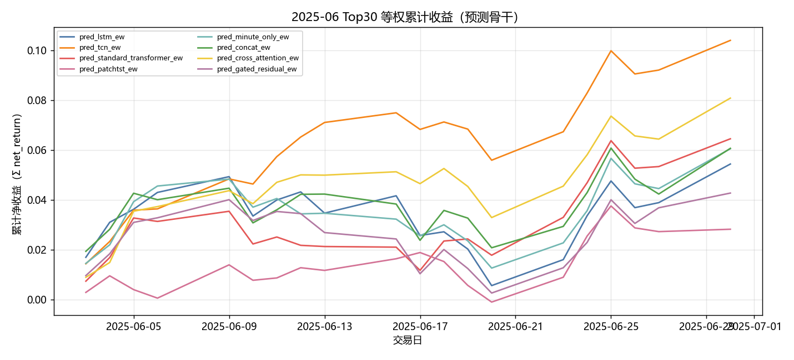

固定颜色: `pred_lstm_ew` `#4C78A8`；`pred_tcn_ew` `#F58518`；`pred_standard_transformer_ew` `#E45756`；`pred_patchtst_ew` `#D37295`；`pred_minute_only_ew` `#72B7B2`；`pred_concat_ew` `#54A24B`；`pred_cross_attention_ew` `#EECA3B`；`pred_gated_residual_ew` `#B279A2`。

### 组合基线累计收益

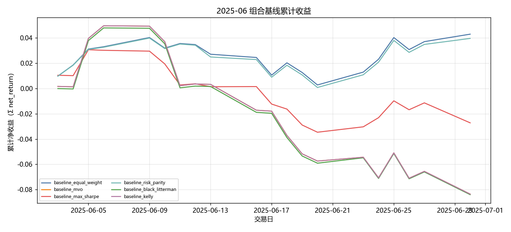

固定颜色: `baseline_equal_weight` `#4C78A8`；`baseline_mvo` `#F58518`；`baseline_max_sharpe` `#E45756`；`baseline_risk_parity` `#72B7B2`；`baseline_black_litterman` `#54A24B`；`baseline_kelly` `#B279A2`。

### 生成模型累计收益

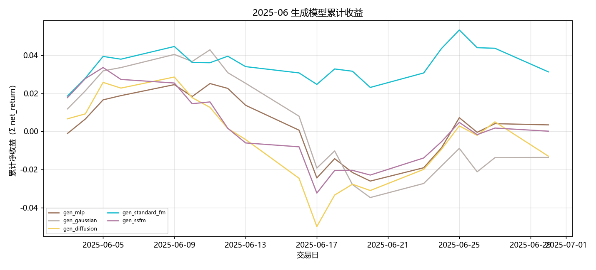

固定颜色: `gen_mlp` `#9D755D`；`gen_gaussian` `#BAB0AC`；`gen_diffusion` `#F2CF5B`；`gen_standard_fm` `#17BECF`；`gen_ssfm` `#B279A2`。

### RL 累计收益

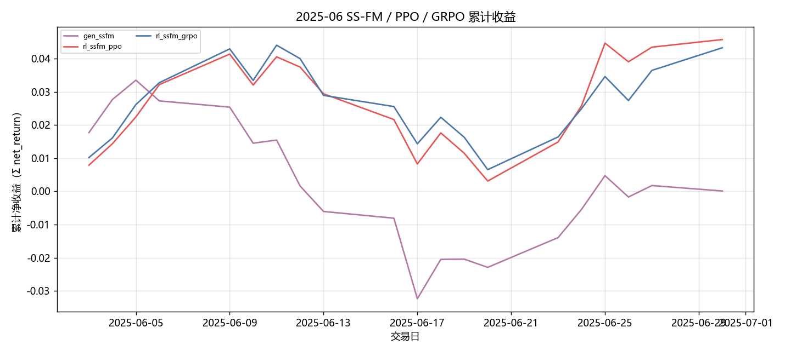

固定颜色: `gen_ssfm` `#B279A2`；`rl_ssfm_ppo` `#E45756`；`rl_ssfm_grpo` `#4C78A8`。

### G 曲线累计收益

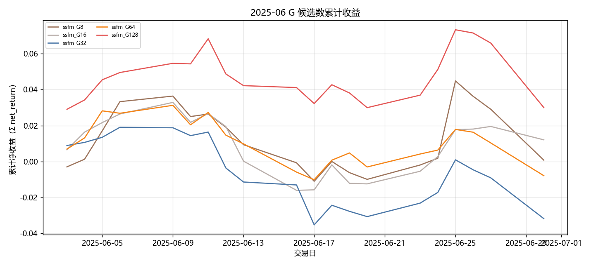

固定颜色: `ssfm_G8` `#9D755D`；`ssfm_G16` `#BAB0AC`；`ssfm_G32` `#4C78A8`；`ssfm_G64` `#F58518`；`ssfm_G128` `#E45756`。

### 日均换手

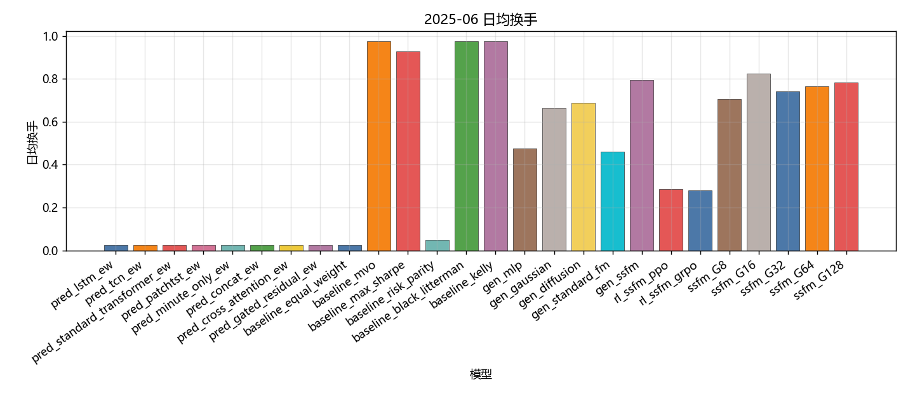

固定颜色: `pred_lstm_ew` `#4C78A8`；`pred_tcn_ew` `#F58518`；`pred_standard_transformer_ew` `#E45756`；`pred_patchtst_ew` `#D37295`；`pred_minute_only_ew` `#72B7B2`；`pred_concat_ew` `#54A24B`；`pred_cross_attention_ew` `#EECA3B`；`pred_gated_residual_ew` `#B279A2`；`baseline_equal_weight` `#4C78A8`；`baseline_mvo` `#F58518`；`baseline_max_sharpe` `#E45756`；`baseline_risk_parity` `#72B7B2`；`baseline_black_litterman` `#54A24B`；`baseline_kelly` `#B279A2`；`gen_mlp` `#9D755D`；`gen_gaussian` `#BAB0AC`；`gen_diffusion` `#F2CF5B`；`gen_standard_fm` `#17BECF`；`gen_ssfm` `#B279A2`；`rl_ssfm_ppo` `#E45756`；`rl_ssfm_grpo` `#4C78A8`；`ssfm_G8` `#9D755D`；`ssfm_G16` `#BAB0AC`；`ssfm_G32` `#4C78A8`；`ssfm_G64` `#F58518`；`ssfm_G128` `#E45756`。

### Val IC

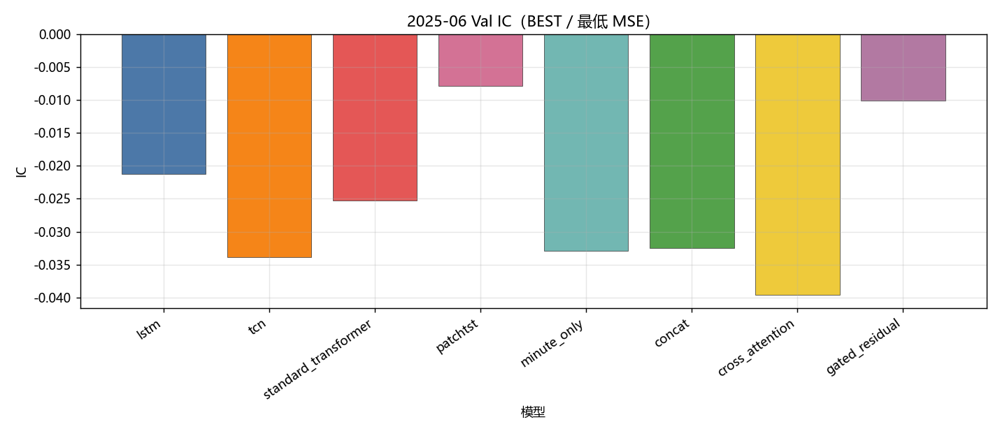

固定颜色: `lstm` `#4C78A8`；`tcn` `#F58518`；`standard_transformer` `#E45756`；`patchtst` `#D37295`；`minute_only` `#72B7B2`；`concat` `#54A24B`；`cross_attention` `#EECA3B`；`gated_residual` `#B279A2`。

### Val RankIC

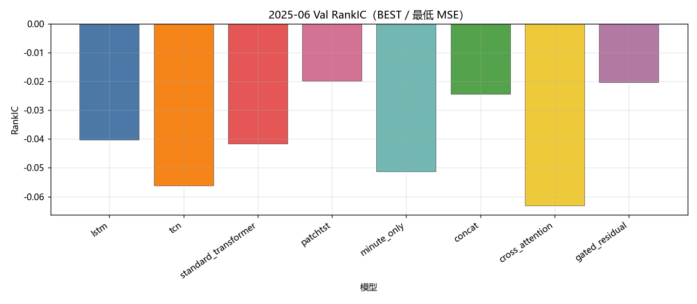

固定颜色: `lstm` `#4C78A8`；`tcn` `#F58518`；`standard_transformer` `#E45756`；`patchtst` `#D37295`；`minute_only` `#72B7B2`；`concat` `#54A24B`；`cross_attention` `#EECA3B`；`gated_residual` `#B279A2`。

### Val F1@Top30

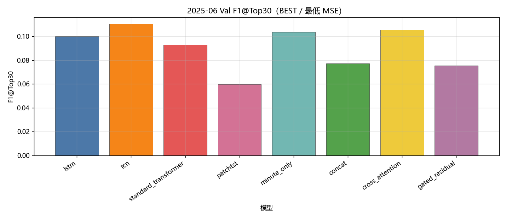

固定颜色: `lstm` `#4C78A8`；`tcn` `#F58518`；`standard_transformer` `#E45756`；`patchtst` `#D37295`；`minute_only` `#72B7B2`；`concat` `#54A24B`；`cross_attention` `#EECA3B`；`gated_residual` `#B279A2`。

### Val MSE

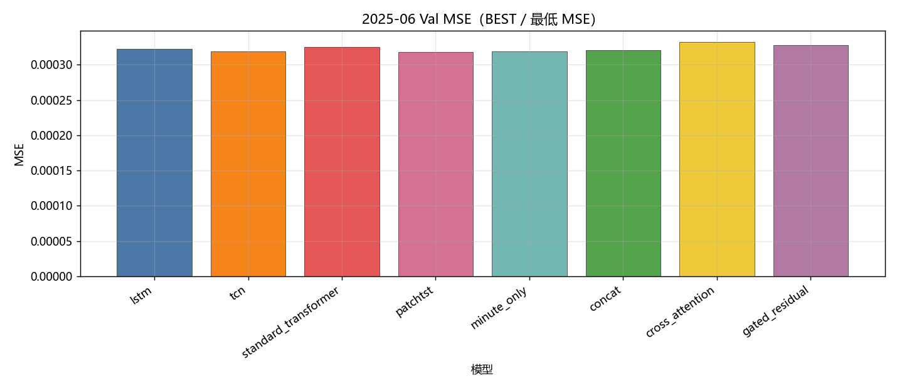

固定颜色: `lstm` `#4C78A8`；`tcn` `#F58518`；`standard_transformer` `#E45756`；`patchtst` `#D37295`；`minute_only` `#72B7B2`；`concat` `#54A24B`；`cross_attention` `#EECA3B`；`gated_residual` `#B279A2`。

### Val IC 各 epoch

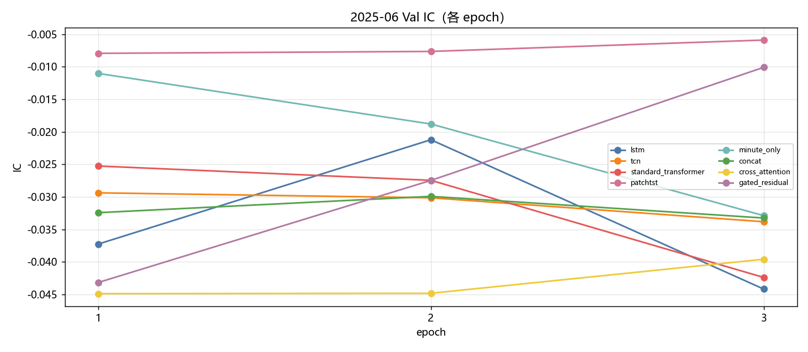

固定颜色: `lstm` `#4C78A8`；`tcn` `#F58518`；`standard_transformer` `#E45756`；`patchtst` `#D37295`；`minute_only` `#72B7B2`；`concat` `#54A24B`；`cross_attention` `#EECA3B`；`gated_residual` `#B279A2`。

### Val RankIC 各 epoch

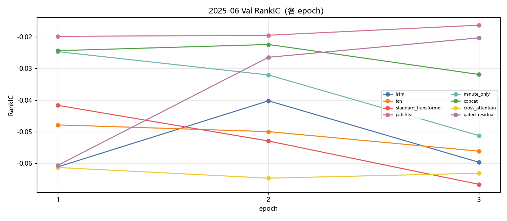

固定颜色: `lstm` `#4C78A8`；`tcn` `#F58518`；`standard_transformer` `#E45756`；`patchtst` `#D37295`；`minute_only` `#72B7B2`；`concat` `#54A24B`；`cross_attention` `#EECA3B`；`gated_residual` `#B279A2`。

### Val F1@Top30 各 epoch

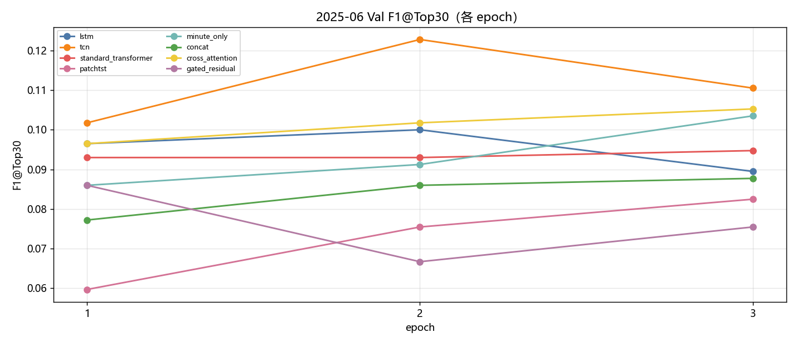

固定颜色: `lstm` `#4C78A8`；`tcn` `#F58518`；`standard_transformer` `#E45756`；`patchtst` `#D37295`；`minute_only` `#72B7B2`；`concat` `#54A24B`；`cross_attention` `#EECA3B`；`gated_residual` `#B279A2`。

### Val MSE 各 epoch

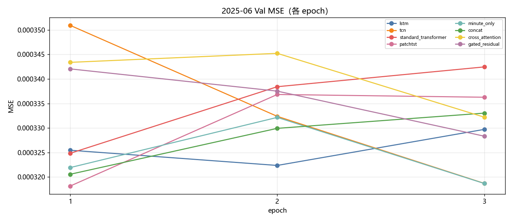

固定颜色: `lstm` `#4C78A8`；`tcn` `#F58518`；`standard_transformer` `#E45756`；`patchtst` `#D37295`；`minute_only` `#72B7B2`；`concat` `#54A24B`；`cross_attention` `#EECA3B`；`gated_residual` `#B279A2`。

### Test IC

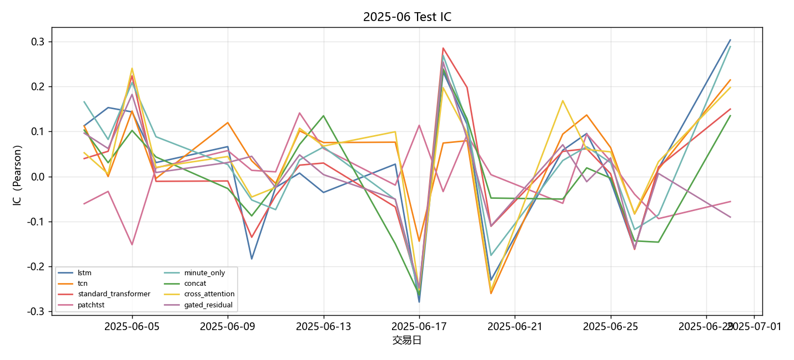

固定颜色: `lstm` `#4C78A8`；`tcn` `#F58518`；`standard_transformer` `#E45756`；`patchtst` `#D37295`；`minute_only` `#72B7B2`；`concat` `#54A24B`；`cross_attention` `#EECA3B`；`gated_residual` `#B279A2`。

### Test RankIC

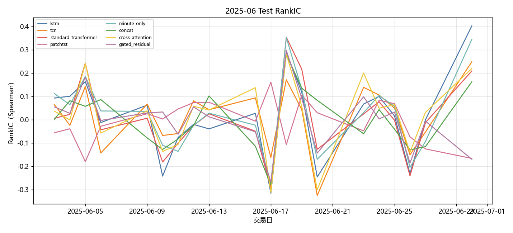

固定颜色: `lstm` `#4C78A8`；`tcn` `#F58518`；`standard_transformer` `#E45756`；`patchtst` `#D37295`；`minute_only` `#72B7B2`；`concat` `#54A24B`；`cross_attention` `#EECA3B`；`gated_residual` `#B279A2`。

### Test F1@Top30

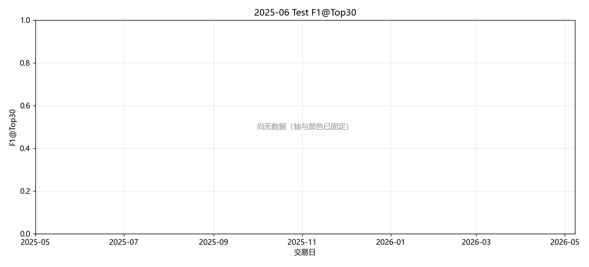

固定颜色: `lstm` `#4C78A8`；`tcn` `#F58518`；`standard_transformer` `#E45756`；`patchtst` `#D37295`；`minute_only` `#72B7B2`；`concat` `#54A24B`；`cross_attention` `#EECA3B`；`gated_residual` `#B279A2`。

### Test Hit@Top30

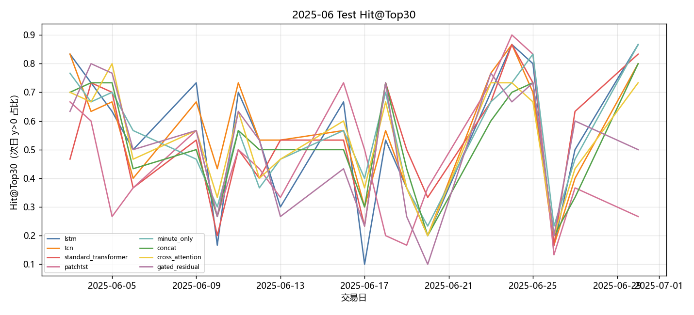

固定颜色: `lstm` `#4C78A8`；`tcn` `#F58518`；`standard_transformer` `#E45756`；`patchtst` `#D37295`；`minute_only` `#72B7B2`；`concat` `#54A24B`；`cross_attention` `#EECA3B`；`gated_residual` `#B279A2`。

## 图对应数据表

- 累计收益 ← `tables/backtest_daily.csv` 的 `net_return` 累加。
- 绩效 / 换手 ← `tables/performance_summary.csv`。
- Val ← `tables/val_best.csv`、`tables/val_epochs.csv`。
- Test 预测 ← `tables/prediction_metrics_mean.csv`。

## 分析

以下只讨论**已经写入数字**的行；单元格为 `-` 的表示该实验尚未跑完，不编造。
来源: month 2025-06。OOS=`sequential_oos_weekly_retrain`，费用=3.0bps，TopK=30。

已有数据的对象: `lstm`, `tcn`, `standard_transformer`, `patchtst`, `minute_only`, `concat`, `cross_attention`, `gated_residual`, `equal_weight`, `mvo`, `max_sharpe`, `risk_parity`, `black_litterman`, `kelly`, `mlp`, `gaussian`, `diffusion`, `standard_fm`, `ssfm`, `ssfm_ppo`, `ssfm_grpo`, `G=8`, `G=16`, `G=32`, `G=64`, `G=128`。
- Val IC 目前最高: `patchtst` = -0.0079。
- Val F1@Top30 目前最高: `tcn` = 0.1105（随机约 0.06）。
- Val MSE 目前最低（入选口径）: `patchtst` = 0.000318。
- Test 日均 IC 目前最高: `tcn` = 0.0418。
- 已回测净值目前最高: `pred_tcn_ew` 累计净收益 0.1097，Sharpe 9.8983。
- 实验 E（G 候选数，top30）累计净收益最高: `ssfm_G128` = 0.0305（G=8 0.0008；G=16 0.0121；G=32 -0.0313；G=64 -0.0078；G=128 0.0305）。

## 重点对比：生成方法与强化学习

生成式方法都把同一套 Alpha Prediction 分数映射成 Top30 组合权重，费用 3bps。**Gaussian + MLP** 是随机策略基线（MLP 输出高斯参数后采样）；**MLP** 是确定性映射；**Diffusion** 逐步去噪；**Flow Matching（`standard_fm`）** 是普通连续流匹配；**SS-FM** 在单纯形上做条件流匹配。下面只讨论已经写入的 Test 回测数字。

| 方法 | series | total_net_return | ann_return | sharpe | max_drawdown | mean_turnover | n_days |
| --- | --- | --- | --- | --- | --- | --- | --- |
| Gaussian + MLP | gen_gaussian | -0.0136 | -0.1584 | -0.9684 | 0.0746 | 0.6633 | 20 |
| MLP | gen_mlp | 0.0034 | 0.0440 | 0.2838 | 0.0499 | 0.4761 | 20 |
| SS-FM | gen_ssfm | 0.0001 | 0.0014 | 0.0092 | 0.0637 | 0.7948 | 20 |
| Flow Matching | gen_standard_fm | 0.0317 | 0.4822 | 2.9478 | 0.0217 | 0.4613 | 20 |
| Diffusion | gen_diffusion | -0.0129 | -0.1511 | -0.8707 | 0.0754 | 0.6882 | 20 |

累计净收益排序：`Flow Matching`(0.0317) > `MLP`(0.0034) > `SS-FM`(0.0001) > `Diffusion`(-0.0129) > `Gaussian + MLP`(-0.0136)。
Sharpe 排序：`Flow Matching`(2.9478) > `MLP`(0.2838) > `SS-FM`(0.0092) > `Diffusion`(-0.8707) > `Gaussian + MLP`(-0.9684)。
最大回撤（越小越好）：`Flow Matching`(0.0217) > `MLP`(0.0499) > `SS-FM`(0.0637) > `Gaussian + MLP`(0.0746) > `Diffusion`(0.0754)。
日均换手（越低交易成本压力越小）：`Flow Matching`(0.4613) > `MLP`(0.4761) > `Gaussian + MLP`(0.6633) > `Diffusion`(0.6882) > `SS-FM`(0.7948)。
- `Gaussian + MLP / gen_gaussian`：累计净收益 -0.0136，年化 -0.1584，Sharpe -0.9684，最大回撤 0.0746，日均换手 0.6633，n=20。
- `MLP / gen_mlp`：累计净收益 0.0034，年化 0.0440，Sharpe 0.2838，最大回撤 0.0499，日均换手 0.4761，n=20。
- `SS-FM / gen_ssfm`：累计净收益 0.0001，年化 0.0014，Sharpe 0.0092，最大回撤 0.0637，日均换手 0.7948，n=20。
- `Flow Matching / gen_standard_fm`：累计净收益 0.0317，年化 0.4822，Sharpe 2.9478，最大回撤 0.0217，日均换手 0.4613，n=20。
- `Diffusion / gen_diffusion`：累计净收益 -0.0129，年化 -0.1511，Sharpe -0.8707，最大回撤 0.0754，日均换手 0.6882，n=20。

本月生成方法里收益最好的是 **Flow Matching**（0.0317），最差的是 **Gaussian + MLP**（-0.0136）。
普通 Flow Matching 没有 SS-FM 的截面分数条件，生成权重更“自由”。当月若它反而更好，通常意味着 primary 排序噪声大，去掉条件化减少了错误锚定。
换手最高的是 SS-FM（0.7948）。生成式每天重采样权重，换手天然高于预测骨干 Top30 等权；比较三种生成方法时，应把换手和费用一起看，不能只看毛收益。

### PPO vs GRPO（纯 SS-FM）

两组强化学习都挂在 **同一套 SS-FM** 上：先冻结/蒸馏 SS-FM 生成器，再用策略梯度改采样。**PPO** 用 clipped surrogate 优化轨迹回报；**GRPO** 对同一状态采一组候选，用组内相对优势，不显式用 critic。对照是不加 RL 的 `gen_ssfm`。

| 方法 | series | total_net_return | ann_return | sharpe | max_drawdown | mean_turnover | n_days |
| --- | --- | --- | --- | --- | --- | --- | --- |
| SS-FM（无 RL） | gen_ssfm | 0.0001 | 0.0014 | 0.0092 | 0.0637 | 0.7948 | 20 |
| PPO + SS-FM | rl_ssfm_ppo | 0.0468 | 0.7799 | 4.0817 | 0.0375 | 0.2848 | 20 |
| GRPO + SS-FM | rl_ssfm_grpo | 0.0442 | 0.7252 | 4.0882 | 0.0368 | 0.2805 | 20 |

- `SS-FM 无 RL`：累计净收益 0.0001，年化 0.0014，Sharpe 0.0092，最大回撤 0.0637，日均换手 0.7948，n=20。
- `PPO + SS-FM`：累计净收益 0.0468，年化 0.7799，Sharpe 4.0817，最大回撤 0.0375，日均换手 0.2848，n=20。
- `GRPO + SS-FM`：累计净收益 0.0442，年化 0.7252，Sharpe 4.0882，最大回撤 0.0368，日均换手 0.2805，n=20。

本月 PPO 与 GRPO 净收益接近（0.0468 vs 0.0442），差异小于一个月样本的抽样误差，不宜下“谁稳定更好”的结论。
PPO 相对纯 SS-FM 净收益提升 0.0467。RL 若同时把换手压下去（0.7948 → 0.2848），说明它主要是在惩罚无意义的每日重采样，而不是另学一套完全不同的选股。
GRPO 相对纯 SS-FM 净收益提升 0.0441。
换手：纯 SS-FM 0.7948，PPO 0.2848，GRPO 0.2805。RL 若换手明显低于生成采样，成本项会解释一部分超额；Top30 等权预测骨干的换手几乎只反映首日建仓，**不能**和生成/RL 的日均换手直接比。

### 收益表现、稳定性与风险成本

预测骨干 Test 日均 IC 最高 `tcn`=0.0418，最低 `concat`=0.0034。IC 一个月大约 20 个交易日，符号翻转很常见，不能单独用 IC 给方法排座次；组合净值、Sharpe、回撤要一起看。
核心序列里净值最好 `pred_minute_only_ew`=0.0625（Sharpe 4.9210，MDD 0.0351），最差 `gen_diffusion`=-0.0129。单月样本短，方法之间差几个百分点也可能是市场路径而不是模型能力；要和下个月对照是否同向。
稳定性：看 Val IC 与 Test IC 是否同向、生成/RL 是否跟预测骨干一起赚或一起亏。若预测 IC 为正但生成亏损，问题更可能在权重采样与换手，而不是分数本身；若预测 IC 已接近 0，生成和 RL 都很难稳定赚钱，这是市场环境而不是某一生成器独有的失败。

## 实验 E：G 候选数

只跑 top30。每个交易日加载当时周五生效的 primary / SS-FM，采 G 条权重后按 pred_utility 选 1 条。与默认 `gen_ssfm`（固定 default_g）不是同一条抽样路径。

| G | 累计净收益 | Sharpe | 最大回撤 | 日均换手 | 天数 |
| --- | --- | --- | --- | --- | --- |
| G=8 | 0.0008 | 0.0438 | 0.0463 | 0.7065 | 20 |
| G=16 | 0.0121 | 1.0220 | 0.0477 | 0.8237 | 20 |
| G=32 | -0.0313 | -2.4168 | 0.0528 | 0.7409 | 20 |
| G=64 | -0.0078 | -0.6777 | 0.0405 | 0.7636 | 20 |
| G=128 | 0.0305 | 1.6951 | 0.0423 | 0.7839 | 20 |

本月网格里累计净收益最好的是 `ssfm_G128`。更大的 G 没有单调变好。
