# 2025-07 Sequential OOS 当月实验分析

- 状态: **当月单元已全部写入**
- OOS: `sequential_oos_weekly_retrain`
- TopK=30，cost_bps=3.0，primary=`lstm`
- 缺测一律 `-`，不补 0、不编造。

## 固定颜色

| 模型 | 颜色 |
| --- | --- |
| lstm | #4C78A8 |
| tcn | #F58518 |
| standard_transformer | #E45756 |
| patchtst | #D37295 |
| minute_only | #72B7B2 |
| concat | #54A24B |
| cross_attention | #EECA3B |
| gated_residual | #B279A2 |

预测骨干日收益曲线用 `pred_<模型>_ew`，颜色与上表相同。

## 实验进度

| unit | model | status |
| --- | --- | --- |
| A 预测 | lstm | 已写入 |
| A 预测 | tcn | 已写入 |
| A 预测 | standard_transformer | 已写入 |
| A 预测 | patchtst | 已写入 |
| A 预测 | minute_only | 已写入 |
| A 预测 | concat | 已写入 |
| A 预测 | cross_attention | 已写入 |
| A 预测 | gated_residual | 已写入 |
| B 组合/top30 | equal_weight | 已写入 |
| B 组合/top30 | mvo | 已写入 |
| B 组合/top30 | max_sharpe | 已写入 |
| B 组合/top30 | risk_parity | 已写入 |
| B 组合/top30 | black_litterman | 已写入 |
| B 组合/top30 | kelly | 已写入 |
| C 生成/top30 | mlp | 已写入 |
| C 生成/top30 | gaussian | 已写入 |
| C 生成/top30 | diffusion | 已写入 |
| C 生成/top30 | standard_fm | 已写入 |
| C 生成/top30 | ssfm | 已写入 |
| D RL/top30 | ssfm_ppo | 已写入 |
| D RL/top30 | ssfm_grpo | 已写入 |
| E G/top30 | G=8 | 已写入 |
| E G/top30 | G=16 | 已写入 |
| E G/top30 | G=32 | 已写入 |
| E G/top30 | G=64 | 已写入 |
| E G/top30 | G=128 | 已写入 |

## 实验设定

- Walk-forward：Train=T-13..T-2，Val=T-1，Test=当月。
- Sequential OOS：周五收盘重训 primary + SS-FM + PPO/GRPO，下周一生效，不回写本周决策。
- 实验 E：SS-FM 候选数 G∈{8,16,32,64,128}。按周五生效窗口加载当时的 primary / SS-FM，当日采样后按 pred_utility 选 1 条；只跑 top30，不跑 500 只 all 池。
- 标签 y = log(Close_D / Open_D)。高严重泄漏 FAIL 的月份不进 final_summary。
- 本批次不跑 All 股池，进度表与绩效表均不含 `*_all`。
- 重点对比：SS-FM vs Flow Matching vs Diffusion；PPO vs GRPO（均挂在纯 SS-FM 上）。
- 不跑文档末尾的 Auction 消融与特征标准化消融。

## Validation（回归 / 排序）

### 各模型 BEST（按该模型 Val MSE 最低的 epoch）

| model | MSE | MAE | IC | RankIC | topk_f1 | topk_precision | topk_recall | dir_acc | dir_f1 | dir_precision | dir_recall | top30_hit_rate | n |
| --- | --- | --- | --- | --- | --- | --- | --- | --- | --- | --- | --- | --- | --- |
| lstm | 0.000349 | 0.012814 | -0.009113 | -0.003528 | 0.061667 | 0.061667 | 0.061667 | 0.464358 | - | - | 0.000000 | 0.526667 | 20 |
| tcn | 0.000337 | 0.012570 | 0.028710 | 0.011902 | 0.113333 | 0.113333 | 0.113333 | 0.492455 | 0.240642 | 0.500822 | 0.199757 | 0.543333 | 20 |
| standard_transformer | 0.000336 | 0.012551 | -0.023474 | -0.013495 | 0.030000 | 0.030000 | 0.030000 | 0.508933 | 0.437883 | 0.494981 | 0.464301 | 0.438333 | 20 |
| patchtst | 0.000334 | 0.012522 | 0.006765 | -0.006701 | 0.078333 | 0.078333 | 0.078333 | 0.507175 | 0.499069 | 0.508031 | 0.546813 | 0.466667 | 20 |
| minute_only | 0.000326 | 0.012590 | -0.022088 | -0.015819 | 0.036667 | 0.036667 | 0.036667 | 0.541939 | 0.646166 | 0.514128 | 0.952400 | 0.475000 | 20 |
| concat | 0.000329 | 0.012529 | 0.001174 | 0.004320 | 0.106667 | 0.106667 | 0.106667 | 0.535642 | 0.655821 | 0.515784 | 1 | 0.541667 | 20 |
| cross_attention | 0.000338 | 0.012612 | -0.025928 | -0.016036 | 0.031667 | 0.031667 | 0.031667 | 0.505083 | 0.451376 | 0.495880 | 0.466982 | 0.453333 | 20 |
| gated_residual | 0.000339 | 0.012644 | 0.008973 | 0.017196 | 0.036667 | 0.036667 | 0.036667 | 0.485249 | 0.260277 | 0.524695 | 0.316259 | 0.498333 | 20 |

列含义: `MSE`/`MAE` 是 ŷ 对 y 的误差；`IC` 是 Pearson；`RankIC` 是 Spearman；`topk_f1` 是预测 Top30 ∩ 真实收益 Top30 / 30；`dir_acc` 是涨跌符号一致率；`top30_hit_rate` 是入选 30 只里 y>0 的比例。

### 各 epoch

| model | epoch | MSE | MAE | IC | RankIC | topk_f1 | topk_precision | topk_recall | dir_acc | dir_f1 | dir_precision | dir_recall | top30_hit_rate | n |
| --- | --- | --- | --- | --- | --- | --- | --- | --- | --- | --- | --- | --- | --- | --- |
| lstm | 1 | 0.000349 | 0.012814 | -0.009113 | -0.003528 | 0.061667 | 0.061667 | 0.061667 | 0.464358 | - | - | 0.000000 | 0.526667 | 20 |
| lstm | 2 | 0.000364 | 0.013180 | -0.007238 | -0.009251 | 0.081667 | 0.081667 | 0.081667 | 0.464358 | - | - | 0.000000 | 0.558333 | 20 |
| lstm | 3 | 0.000369 | 0.013285 | -0.001281 | -0.001946 | 0.095000 | 0.095000 | 0.095000 | 0.464358 | - | - | 0.000000 | 0.568333 | 20 |
| tcn | 1 | 0.000345 | 0.012749 | 0.006641 | 0.001969 | 0.063333 | 0.063333 | 0.063333 | 0.463415 | 0.093477 | 0.489594 | 0.042739 | 0.481667 | 20 |
| tcn | 2 | 0.000345 | 0.012742 | 0.025926 | 0.011979 | 0.095000 | 0.095000 | 0.095000 | 0.464986 | 0.011614 | 0.433333 | 0.001176 | 0.523333 | 20 |
| tcn | 3 | 0.000337 | 0.012570 | 0.028710 | 0.011902 | 0.113333 | 0.113333 | 0.113333 | 0.492455 | 0.240642 | 0.500822 | 0.199757 | 0.543333 | 20 |
| standard_transformer | 1 | 0.000336 | 0.012551 | -0.023474 | -0.013495 | 0.030000 | 0.030000 | 0.030000 | 0.508933 | 0.437883 | 0.494981 | 0.464301 | 0.438333 | 20 |
| standard_transformer | 2 | 0.000338 | 0.012598 | 0.016461 | 0.012253 | 0.071667 | 0.071667 | 0.071667 | 0.494697 | 0.202525 | 0.371866 | 0.117556 | 0.505000 | 20 |
| standard_transformer | 3 | 0.000342 | 0.012693 | 0.032230 | 0.024014 | 0.083333 | 0.083333 | 0.083333 | 0.499334 | 0.355746 | 0.403284 | 0.110102 | 0.523333 | 20 |
| patchtst | 1 | 0.000334 | 0.012522 | 0.006765 | -0.006701 | 0.078333 | 0.078333 | 0.078333 | 0.507175 | 0.499069 | 0.508031 | 0.546813 | 0.466667 | 20 |
| patchtst | 2 | 0.000350 | 0.012851 | -0.005726 | -0.023066 | 0.090000 | 0.090000 | 0.090000 | 0.465179 | 0.017362 | 0.494444 | 0.005293 | 0.476667 | 20 |
| patchtst | 3 | 0.000355 | 0.012954 | -0.007501 | -0.023877 | 0.095000 | 0.095000 | 0.095000 | 0.464248 | 0.007046 | 0.428571 | 0.000530 | 0.491667 | 20 |
| minute_only | 1 | 0.000326 | 0.012590 | -0.022088 | -0.015819 | 0.036667 | 0.036667 | 0.036667 | 0.541939 | 0.646166 | 0.514128 | 0.952400 | 0.475000 | 20 |
| minute_only | 2 | 0.000333 | 0.012498 | -0.009994 | -0.009359 | 0.048333 | 0.048333 | 0.048333 | 0.524239 | 0.479685 | 0.502487 | 0.531852 | 0.488333 | 20 |
| minute_only | 3 | 0.000329 | 0.012455 | 0.010175 | 0.005258 | 0.056667 | 0.056667 | 0.056667 | 0.523604 | 0.562682 | 0.508609 | 0.727358 | 0.496667 | 20 |
| concat | 1 | 0.000330 | 0.012664 | -0.034513 | -0.024579 | 0.030000 | 0.030000 | 0.030000 | 0.535642 | 0.655821 | 0.515784 | 1 | 0.471667 | 20 |
| concat | 2 | 0.000329 | 0.012529 | 0.001174 | 0.004320 | 0.106667 | 0.106667 | 0.106667 | 0.535642 | 0.655821 | 0.515784 | 1 | 0.541667 | 20 |
| concat | 3 | 0.000336 | 0.012550 | -0.006082 | -0.003710 | 0.106667 | 0.106667 | 0.106667 | 0.465479 | 0.070358 | 0.461089 | 0.033013 | 0.531667 | 20 |
| cross_attention | 1 | 0.000338 | 0.012612 | -0.025928 | -0.016036 | 0.031667 | 0.031667 | 0.031667 | 0.505083 | 0.451376 | 0.495880 | 0.466982 | 0.453333 | 20 |
| cross_attention | 2 | 0.000346 | 0.012707 | -0.021685 | -0.013003 | 0.036667 | 0.036667 | 0.036667 | 0.476709 | 0.203144 | 0.468612 | 0.139944 | 0.433333 | 20 |
| cross_attention | 3 | 0.000344 | 0.012675 | -0.016926 | -0.009758 | 0.036667 | 0.036667 | 0.036667 | 0.476900 | 0.159080 | 0.496922 | 0.105060 | 0.440000 | 20 |
| gated_residual | 1 | 0.000339 | 0.012644 | 0.008973 | 0.017196 | 0.036667 | 0.036667 | 0.036667 | 0.485249 | 0.260277 | 0.524695 | 0.316259 | 0.498333 | 20 |
| gated_residual | 2 | 0.000363 | 0.013121 | -0.013082 | -0.002698 | 0.026667 | 0.026667 | 0.026667 | 0.465299 | 0.016645 | 0.387500 | 0.002538 | 0.443333 | 20 |
| gated_residual | 3 | 0.000342 | 0.012648 | -0.016741 | -0.004418 | 0.031667 | 0.031667 | 0.031667 | 0.480518 | 0.133610 | 0.491542 | 0.070508 | 0.486667 | 20 |

## Test 预测指标（日均）

| model | MSE | MAE | IC | RankIC | topk_f1 | topk_precision | topk_recall | dir_acc | dir_f1 | dir_precision | dir_recall | top30_hit_rate | top30_excess | n |
| --- | --- | --- | --- | --- | --- | --- | --- | --- | --- | --- | --- | --- | --- | --- |
| lstm | 0.000404 | 0.013514 | 0.009989 | 0.010852 | - | - | - | - | - | - | - | 0.553623 | -0.000016 | 23 |
| tcn | 0.000393 | 0.013342 | 0.017716 | -0.001702 | - | - | - | - | - | - | - | 0.508696 | 0.001496 | 23 |
| standard_transformer | 0.000392 | 0.013308 | -0.018007 | 0.002251 | - | - | - | - | - | - | - | 0.462319 | -0.000881 | 23 |
| patchtst | 0.000390 | 0.013317 | -0.025258 | -0.042373 | - | - | - | - | - | - | - | 0.455072 | -0.000617 | 23 |
| minute_only | 0.000394 | 0.013717 | 0.007656 | 0.019829 | - | - | - | - | - | - | - | 0.495652 | -0.000408 | 23 |
| concat | 0.000384 | 0.013316 | 0.007246 | 0.006105 | - | - | - | - | - | - | - | 0.504348 | 0.000507 | 23 |
| cross_attention | 0.000393 | 0.013333 | -0.000422 | 0.021794 | - | - | - | - | - | - | - | 0.492754 | -0.000874 | 23 |
| gated_residual | 0.000392 | 0.013709 | 0.010970 | 0.001593 | - | - | - | - | - | - | - | 0.517391 | -0.000415 | 23 |

## 组合绩效

| model | total_net_return | ann_return | sharpe | max_drawdown | mean_turnover | mean_cost | n_days |
| --- | --- | --- | --- | --- | --- | --- | --- |
| pred_lstm_ew_top30 | 0.0525 | 0.7521 | 5.5774 | 0.0164 | 0.0217 | 0.0000 | 23 |
| pred_tcn_ew_top30 | 0.0898 | 1.5651 | 6.0112 | 0.0142 | 0.0217 | 0.0000 | 23 |
| pred_standard_transformer_ew_top30 | 0.0318 | 0.4091 | 2.4245 | 0.0403 | 0.0217 | 0.0000 | 23 |
| pred_patchtst_ew_top30 | 0.0381 | 0.5059 | 2.8551 | 0.0348 | 0.0217 | 0.0000 | 23 |
| pred_minute_only_ew_top30 | 0.0431 | 0.5872 | 3.5566 | 0.0347 | 0.0217 | 0.0000 | 23 |
| pred_concat_ew_top30 | 0.0653 | 0.9991 | 5.0588 | 0.0246 | 0.0217 | 0.0000 | 23 |
| pred_cross_attention_ew_top30 | 0.0319 | 0.4114 | 2.2977 | 0.0300 | 0.0217 | 0.0000 | 23 |
| pred_gated_residual_ew_top30 | 0.0429 | 0.5846 | 3.2888 | 0.0282 | 0.0217 | 0.0000 | 23 |
| pred_lstm_ew | 0.0525 | 0.7521 | 5.5774 | 0.0164 | 0.0217 | 0.0000 | 23 |
| pred_tcn_ew | 0.0898 | 1.5651 | 6.0112 | 0.0142 | 0.0217 | 0.0000 | 23 |
| pred_standard_transformer_ew | 0.0318 | 0.4091 | 2.4245 | 0.0403 | 0.0217 | 0.0000 | 23 |
| pred_patchtst_ew | 0.0381 | 0.5059 | 2.8551 | 0.0348 | 0.0217 | 0.0000 | 23 |
| pred_minute_only_ew | 0.0431 | 0.5872 | 3.5566 | 0.0347 | 0.0217 | 0.0000 | 23 |
| pred_concat_ew | 0.0653 | 0.9991 | 5.0588 | 0.0246 | 0.0217 | 0.0000 | 23 |
| pred_cross_attention_ew | 0.0319 | 0.4114 | 2.2977 | 0.0300 | 0.0217 | 0.0000 | 23 |
| pred_gated_residual_ew | 0.0429 | 0.5846 | 3.2888 | 0.0282 | 0.0217 | 0.0000 | 23 |
| baseline_equal_weight_top30 | 0.0429 | 0.5846 | 3.2888 | 0.0282 | 0.0217 | 0.0000 | 23 |
| baseline_mvo_top30 | 0.0037 | 0.0414 | 0.1628 | 0.0401 | 0.9783 | 0.0003 | 23 |
| baseline_max_sharpe_top30 | -0.0104 | -0.1080 | -0.4862 | 0.0401 | 0.9783 | 0.0003 | 23 |
| baseline_risk_parity_top30 | 0.0427 | 0.5803 | 3.3311 | 0.0280 | 0.0553 | 0.0000 | 23 |
| baseline_black_litterman_top30 | 0.0153 | 0.1812 | 0.6867 | 0.0397 | 0.9783 | 0.0003 | 23 |
| baseline_kelly_top30 | 0.0037 | 0.0414 | 0.1628 | 0.0401 | 0.9783 | 0.0003 | 23 |
| baseline_equal_weight | 0.0429 | 0.5846 | 3.2888 | 0.0282 | 0.0217 | 0.0000 | 23 |
| baseline_mvo | 0.0037 | 0.0414 | 0.1628 | 0.0401 | 0.9783 | 0.0003 | 23 |
| baseline_max_sharpe | -0.0104 | -0.1080 | -0.4862 | 0.0401 | 0.9783 | 0.0003 | 23 |
| baseline_risk_parity | 0.0427 | 0.5803 | 3.3311 | 0.0280 | 0.0553 | 0.0000 | 23 |
| baseline_black_litterman | 0.0153 | 0.1812 | 0.6867 | 0.0397 | 0.9783 | 0.0003 | 23 |
| baseline_kelly | 0.0037 | 0.0414 | 0.1628 | 0.0401 | 0.9783 | 0.0003 | 23 |
| gen_mlp_top30 | 0.0610 | 0.9131 | 3.9253 | 0.0398 | 0.4794 | 0.0001 | 23 |
| gen_gaussian_top30 | 0.0637 | 0.9679 | 3.9307 | 0.0378 | 0.5915 | 0.0002 | 23 |
| gen_diffusion_top30 | 0.1863 | - | 7.1826 | 0.0238 | 0.8082 | 0.0002 | 23 |
| gen_standard_fm_top30 | 0.0547 | 0.7927 | 4.0075 | 0.0249 | 0.5022 | 0.0002 | 23 |
| gen_ssfm_top30 | 0.0896 | 1.5595 | 5.7286 | 0.0237 | 0.6898 | 0.0002 | 23 |
| gen_mlp | 0.0610 | 0.9131 | 3.9253 | 0.0398 | 0.4794 | 0.0001 | 23 |
| gen_gaussian | 0.0637 | 0.9679 | 3.9307 | 0.0378 | 0.5915 | 0.0002 | 23 |
| gen_diffusion | 0.1863 | - | 7.1826 | 0.0238 | 0.8082 | 0.0002 | 23 |
| gen_standard_fm | 0.0547 | 0.7927 | 4.0075 | 0.0249 | 0.5022 | 0.0002 | 23 |
| gen_ssfm | 0.0896 | 1.5595 | 5.7286 | 0.0237 | 0.6898 | 0.0002 | 23 |
| rl_ssfm_ppo_top30 | 0.0685 | 1.0662 | 4.3710 | 0.0323 | 0.2655 | 0.0001 | 23 |
| rl_ssfm_grpo_top30 | 0.0563 | 0.8220 | 4.0242 | 0.0247 | 0.2595 | 0.0001 | 23 |
| rl_ssfm_ppo | 0.0685 | 1.0662 | 4.3710 | 0.0323 | 0.2655 | 0.0001 | 23 |
| rl_ssfm_grpo | 0.0563 | 0.8220 | 4.0242 | 0.0247 | 0.2595 | 0.0001 | 23 |
| ssfm_G8_top30 | 0.0411 | 0.5551 | 3.1163 | 0.0217 | 0.7398 | 0.0002 | 23 |
| ssfm_G16_top30 | 0.0322 | 0.4157 | 1.5685 | 0.0451 | 0.7245 | 0.0002 | 23 |
| ssfm_G32_top30 | 0.0724 | 1.1515 | 3.6866 | 0.0265 | 0.8005 | 0.0002 | 23 |
| ssfm_G64_top30 | 0.0930 | 1.6486 | 6.4943 | 0.0119 | 0.7524 | 0.0002 | 23 |
| ssfm_G128_top30 | 0.0238 | 0.2945 | 1.1120 | 0.0407 | 0.7472 | 0.0002 | 23 |
| ssfm_G8 | 0.0411 | 0.5551 | 3.1163 | 0.0217 | 0.7398 | 0.0002 | 23 |
| ssfm_G16 | 0.0322 | 0.4157 | 1.5685 | 0.0451 | 0.7245 | 0.0002 | 23 |
| ssfm_G32 | 0.0724 | 1.1515 | 3.6866 | 0.0265 | 0.8005 | 0.0002 | 23 |
| ssfm_G64 | 0.0930 | 1.6486 | 6.4943 | 0.0119 | 0.7524 | 0.0002 | 23 |
| ssfm_G128 | 0.0238 | 0.2945 | 1.1120 | 0.0407 | 0.7472 | 0.0002 | 23 |

## 日均换手

| model | mean_turnover |
| --- | --- |
| pred_lstm_ew_top30 | 0.0217 |
| pred_tcn_ew_top30 | 0.0217 |
| pred_standard_transformer_ew_top30 | 0.0217 |
| pred_patchtst_ew_top30 | 0.0217 |
| pred_minute_only_ew_top30 | 0.0217 |
| pred_concat_ew_top30 | 0.0217 |
| pred_cross_attention_ew_top30 | 0.0217 |
| pred_gated_residual_ew_top30 | 0.0217 |
| pred_lstm_ew | 0.0217 |
| pred_tcn_ew | 0.0217 |
| pred_standard_transformer_ew | 0.0217 |
| pred_patchtst_ew | 0.0217 |
| pred_minute_only_ew | 0.0217 |
| pred_concat_ew | 0.0217 |
| pred_cross_attention_ew | 0.0217 |
| pred_gated_residual_ew | 0.0217 |
| baseline_equal_weight_top30 | 0.0217 |
| baseline_mvo_top30 | 0.9783 |
| baseline_max_sharpe_top30 | 0.9783 |
| baseline_risk_parity_top30 | 0.0553 |
| baseline_black_litterman_top30 | 0.9783 |
| baseline_kelly_top30 | 0.9783 |
| baseline_equal_weight | 0.0217 |
| baseline_mvo | 0.9783 |
| baseline_max_sharpe | 0.9783 |
| baseline_risk_parity | 0.0553 |
| baseline_black_litterman | 0.9783 |
| baseline_kelly | 0.9783 |
| gen_mlp_top30 | 0.4794 |
| gen_gaussian_top30 | 0.5915 |
| gen_diffusion_top30 | 0.8082 |
| gen_standard_fm_top30 | 0.5022 |
| gen_ssfm_top30 | 0.6898 |
| gen_mlp | 0.4794 |
| gen_gaussian | 0.5915 |
| gen_diffusion | 0.8082 |
| gen_standard_fm | 0.5022 |
| gen_ssfm | 0.6898 |
| rl_ssfm_ppo_top30 | 0.2655 |
| rl_ssfm_grpo_top30 | 0.2595 |
| rl_ssfm_ppo | 0.2655 |
| rl_ssfm_grpo | 0.2595 |
| ssfm_G8_top30 | 0.7398 |
| ssfm_G16_top30 | 0.7245 |
| ssfm_G32_top30 | 0.8005 |
| ssfm_G64_top30 | 0.7524 |
| ssfm_G128_top30 | 0.7472 |
| ssfm_G8 | 0.7398 |
| ssfm_G16 | 0.7245 |
| ssfm_G32 | 0.8005 |
| ssfm_G64 | 0.7524 |
| ssfm_G128 | 0.7472 |

## 图

曲线来自当月已写入的回测 / Val / Test；某条序列还没有数字时，该图只保留坐标轴和固定颜色。Markdown 预览有时会卡住训练中途的占位图，以 `figures/*.png` 为准。

### 预测骨干累计收益

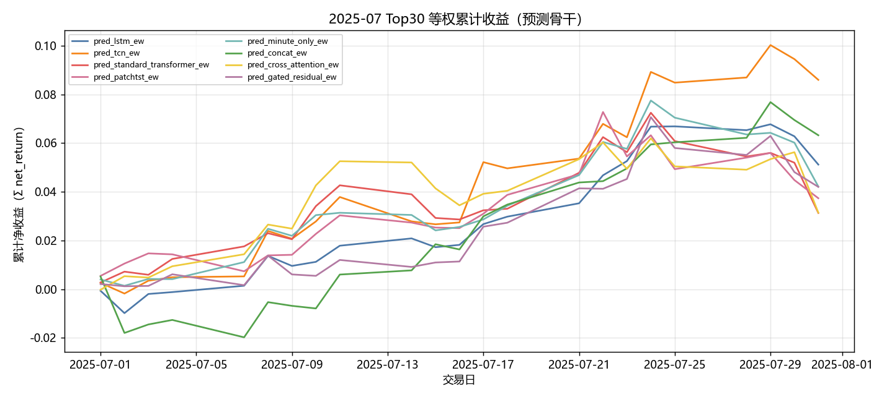

固定颜色: `pred_lstm_ew` `#4C78A8`；`pred_tcn_ew` `#F58518`；`pred_standard_transformer_ew` `#E45756`；`pred_patchtst_ew` `#D37295`；`pred_minute_only_ew` `#72B7B2`；`pred_concat_ew` `#54A24B`；`pred_cross_attention_ew` `#EECA3B`；`pred_gated_residual_ew` `#B279A2`。

### 组合基线累计收益

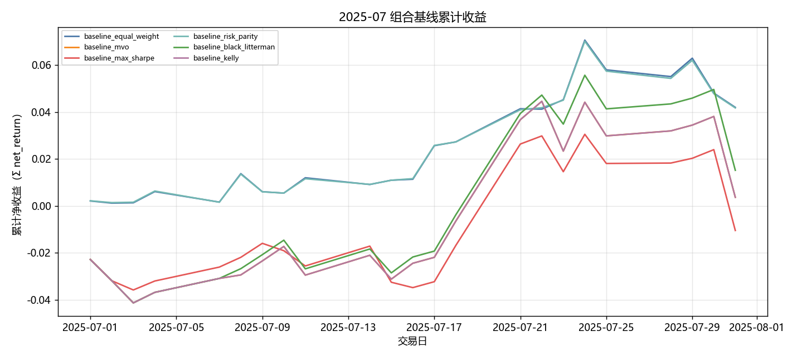

固定颜色: `baseline_equal_weight` `#4C78A8`；`baseline_mvo` `#F58518`；`baseline_max_sharpe` `#E45756`；`baseline_risk_parity` `#72B7B2`；`baseline_black_litterman` `#54A24B`；`baseline_kelly` `#B279A2`。

### 生成模型累计收益

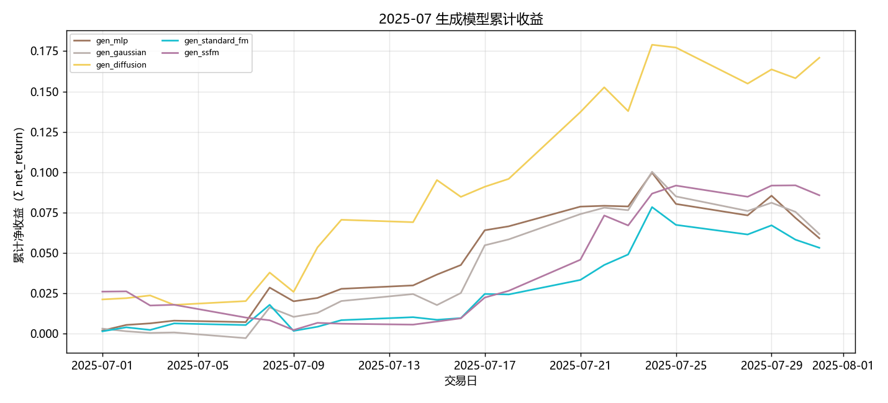

固定颜色: `gen_mlp` `#9D755D`；`gen_gaussian` `#BAB0AC`；`gen_diffusion` `#F2CF5B`；`gen_standard_fm` `#17BECF`；`gen_ssfm` `#B279A2`。

### RL 累计收益

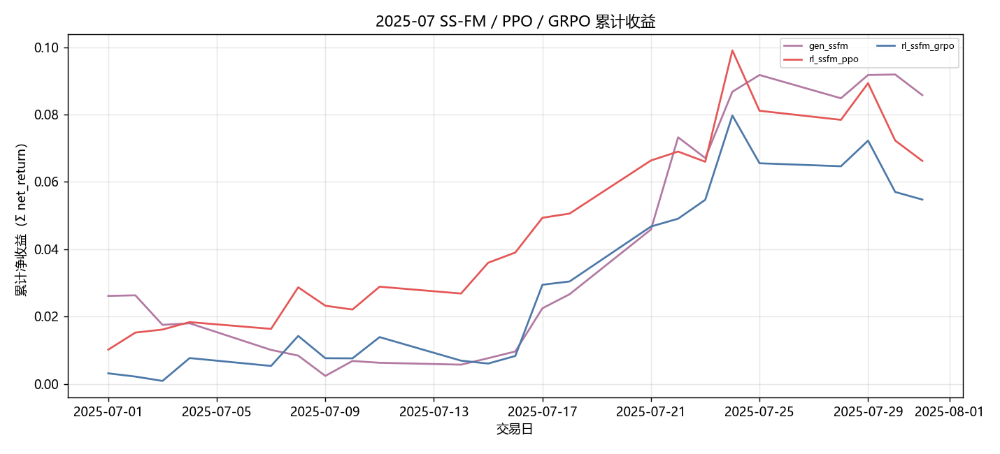

固定颜色: `gen_ssfm` `#B279A2`；`rl_ssfm_ppo` `#E45756`；`rl_ssfm_grpo` `#4C78A8`。

### G 曲线累计收益

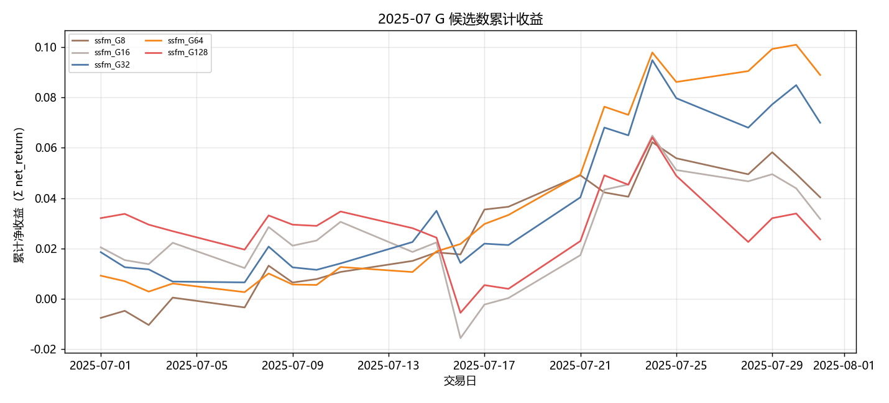

固定颜色: `ssfm_G8` `#9D755D`；`ssfm_G16` `#BAB0AC`；`ssfm_G32` `#4C78A8`；`ssfm_G64` `#F58518`；`ssfm_G128` `#E45756`。

### 日均换手

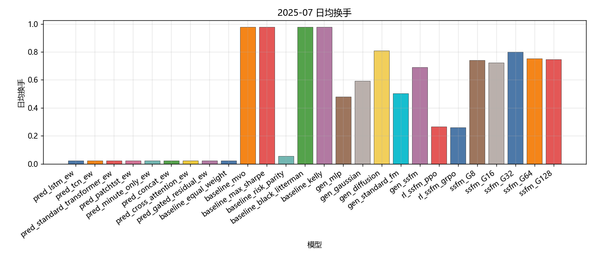

固定颜色: `pred_lstm_ew` `#4C78A8`；`pred_tcn_ew` `#F58518`；`pred_standard_transformer_ew` `#E45756`；`pred_patchtst_ew` `#D37295`；`pred_minute_only_ew` `#72B7B2`；`pred_concat_ew` `#54A24B`；`pred_cross_attention_ew` `#EECA3B`；`pred_gated_residual_ew` `#B279A2`；`baseline_equal_weight` `#4C78A8`；`baseline_mvo` `#F58518`；`baseline_max_sharpe` `#E45756`；`baseline_risk_parity` `#72B7B2`；`baseline_black_litterman` `#54A24B`；`baseline_kelly` `#B279A2`；`gen_mlp` `#9D755D`；`gen_gaussian` `#BAB0AC`；`gen_diffusion` `#F2CF5B`；`gen_standard_fm` `#17BECF`；`gen_ssfm` `#B279A2`；`rl_ssfm_ppo` `#E45756`；`rl_ssfm_grpo` `#4C78A8`；`ssfm_G8` `#9D755D`；`ssfm_G16` `#BAB0AC`；`ssfm_G32` `#4C78A8`；`ssfm_G64` `#F58518`；`ssfm_G128` `#E45756`。

### Val IC

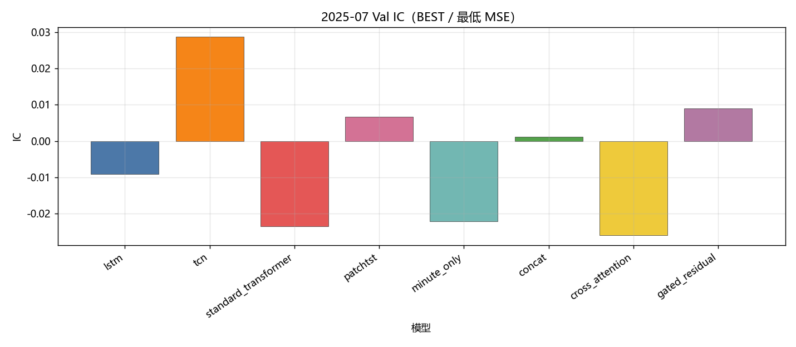

固定颜色: `lstm` `#4C78A8`；`tcn` `#F58518`；`standard_transformer` `#E45756`；`patchtst` `#D37295`；`minute_only` `#72B7B2`；`concat` `#54A24B`；`cross_attention` `#EECA3B`；`gated_residual` `#B279A2`。

### Val RankIC

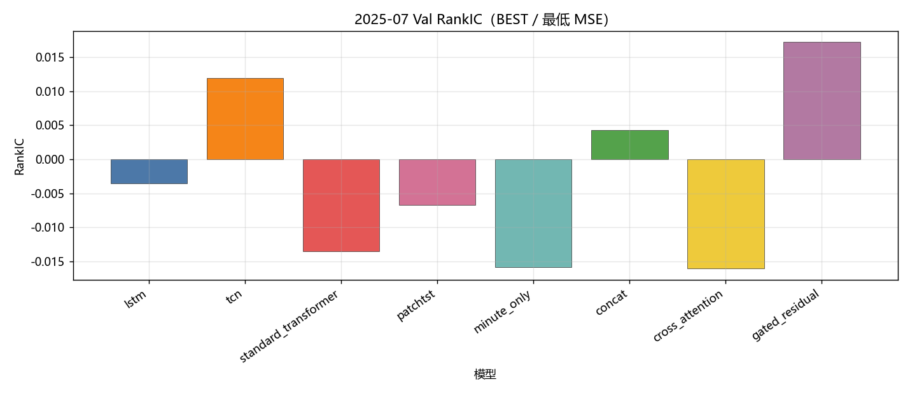

固定颜色: `lstm` `#4C78A8`；`tcn` `#F58518`；`standard_transformer` `#E45756`；`patchtst` `#D37295`；`minute_only` `#72B7B2`；`concat` `#54A24B`；`cross_attention` `#EECA3B`；`gated_residual` `#B279A2`。

### Val F1@Top30

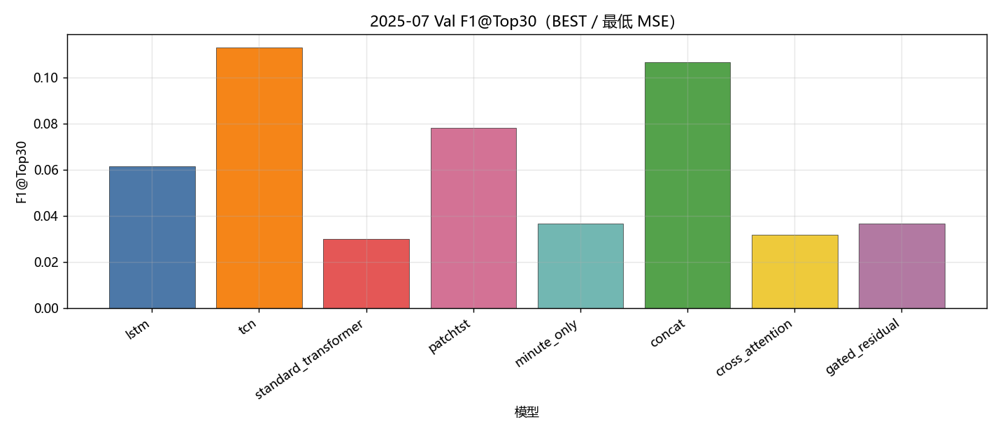

固定颜色: `lstm` `#4C78A8`；`tcn` `#F58518`；`standard_transformer` `#E45756`；`patchtst` `#D37295`；`minute_only` `#72B7B2`；`concat` `#54A24B`；`cross_attention` `#EECA3B`；`gated_residual` `#B279A2`。

### Val MSE

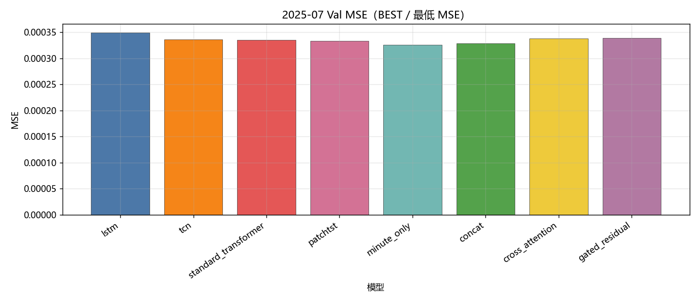

固定颜色: `lstm` `#4C78A8`；`tcn` `#F58518`；`standard_transformer` `#E45756`；`patchtst` `#D37295`；`minute_only` `#72B7B2`；`concat` `#54A24B`；`cross_attention` `#EECA3B`；`gated_residual` `#B279A2`。

### Val IC 各 epoch

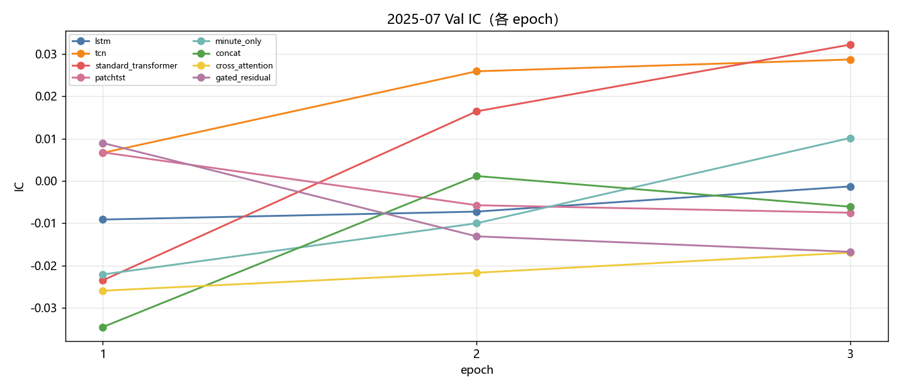

固定颜色: `lstm` `#4C78A8`；`tcn` `#F58518`；`standard_transformer` `#E45756`；`patchtst` `#D37295`；`minute_only` `#72B7B2`；`concat` `#54A24B`；`cross_attention` `#EECA3B`；`gated_residual` `#B279A2`。

### Val RankIC 各 epoch

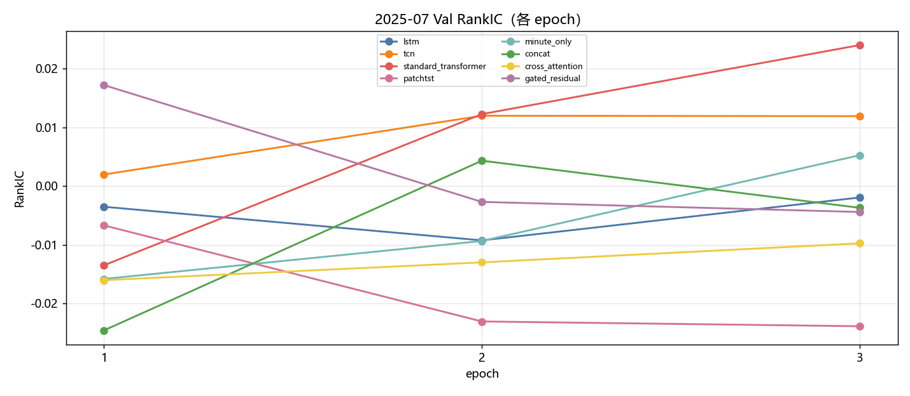

固定颜色: `lstm` `#4C78A8`；`tcn` `#F58518`；`standard_transformer` `#E45756`；`patchtst` `#D37295`；`minute_only` `#72B7B2`；`concat` `#54A24B`；`cross_attention` `#EECA3B`；`gated_residual` `#B279A2`。

### Val F1@Top30 各 epoch

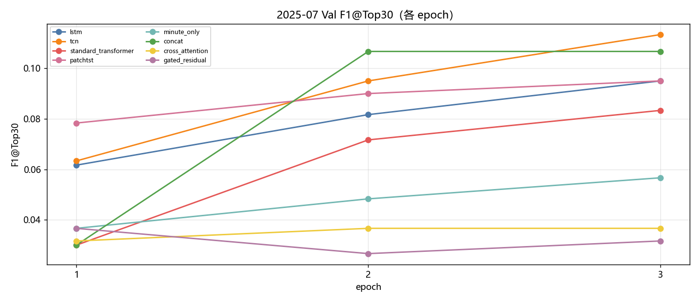

固定颜色: `lstm` `#4C78A8`；`tcn` `#F58518`；`standard_transformer` `#E45756`；`patchtst` `#D37295`；`minute_only` `#72B7B2`；`concat` `#54A24B`；`cross_attention` `#EECA3B`；`gated_residual` `#B279A2`。

### Val MSE 各 epoch

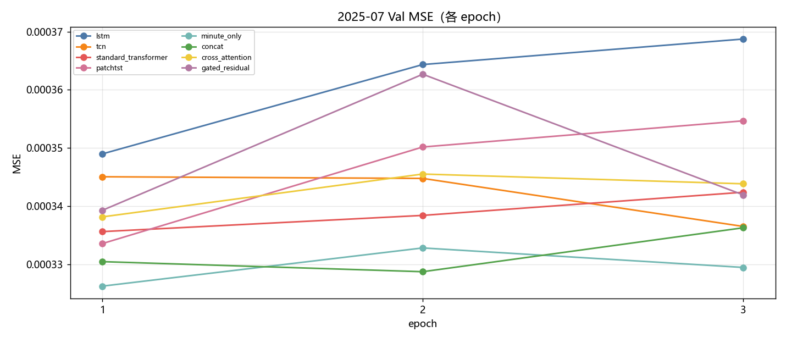

固定颜色: `lstm` `#4C78A8`；`tcn` `#F58518`；`standard_transformer` `#E45756`；`patchtst` `#D37295`；`minute_only` `#72B7B2`；`concat` `#54A24B`；`cross_attention` `#EECA3B`；`gated_residual` `#B279A2`。

### Test IC

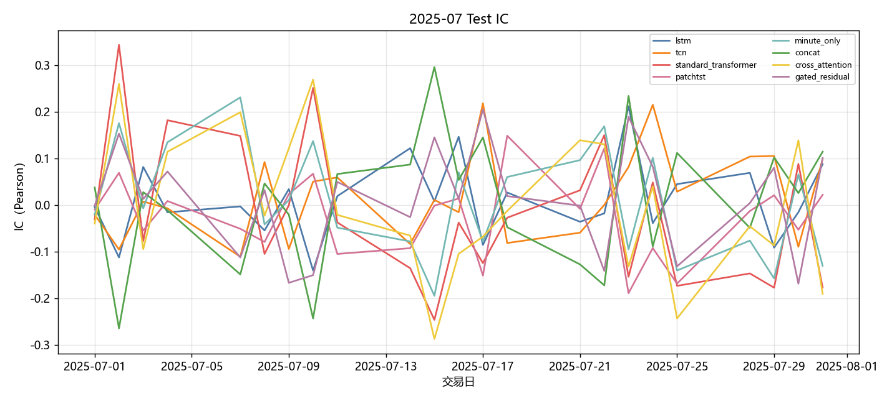

固定颜色: `lstm` `#4C78A8`；`tcn` `#F58518`；`standard_transformer` `#E45756`；`patchtst` `#D37295`；`minute_only` `#72B7B2`；`concat` `#54A24B`；`cross_attention` `#EECA3B`；`gated_residual` `#B279A2`。

### Test RankIC

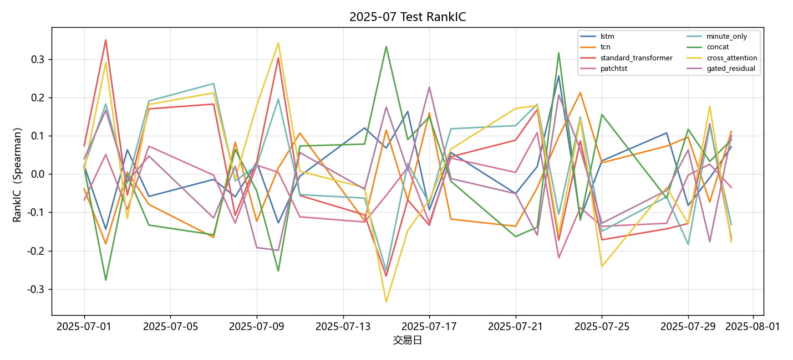

固定颜色: `lstm` `#4C78A8`；`tcn` `#F58518`；`standard_transformer` `#E45756`；`patchtst` `#D37295`；`minute_only` `#72B7B2`；`concat` `#54A24B`；`cross_attention` `#EECA3B`；`gated_residual` `#B279A2`。

### Test F1@Top30

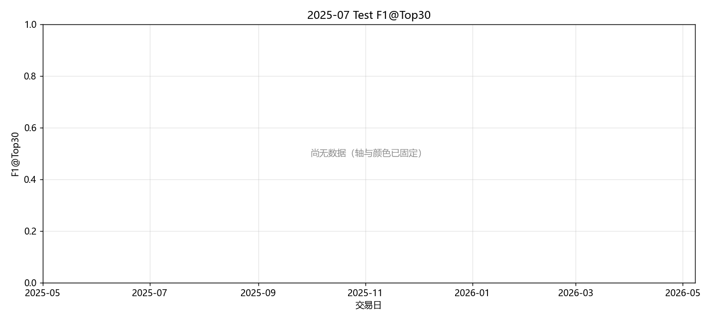

固定颜色: `lstm` `#4C78A8`；`tcn` `#F58518`；`standard_transformer` `#E45756`；`patchtst` `#D37295`；`minute_only` `#72B7B2`；`concat` `#54A24B`；`cross_attention` `#EECA3B`；`gated_residual` `#B279A2`。

### Test Hit@Top30

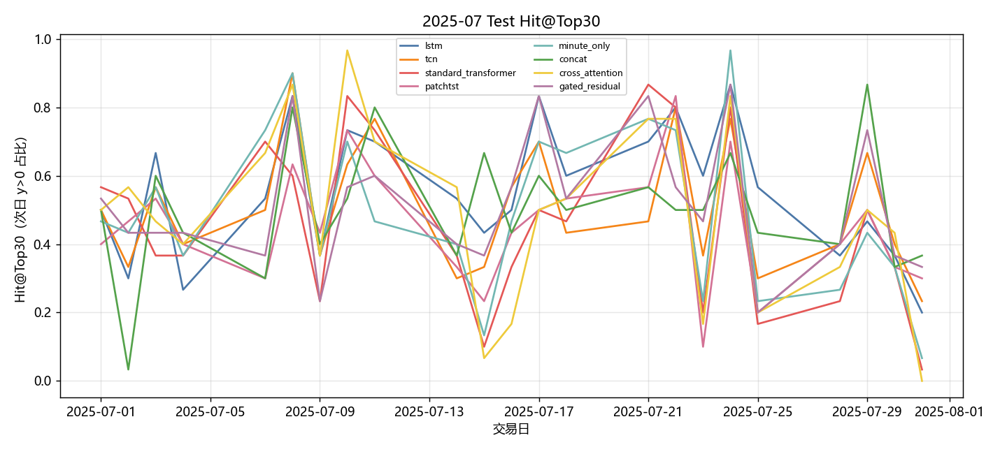

固定颜色: `lstm` `#4C78A8`；`tcn` `#F58518`；`standard_transformer` `#E45756`；`patchtst` `#D37295`；`minute_only` `#72B7B2`；`concat` `#54A24B`；`cross_attention` `#EECA3B`；`gated_residual` `#B279A2`。

## 图对应数据表

- 累计收益 ← `tables/backtest_daily.csv` 的 `net_return` 累加。
- 绩效 / 换手 ← `tables/performance_summary.csv`。
- Val ← `tables/val_best.csv`、`tables/val_epochs.csv`。
- Test 预测 ← `tables/prediction_metrics_mean.csv`。

## 分析

以下只讨论**已经写入数字**的行；单元格为 `-` 的表示该实验尚未跑完，不编造。
来源: month 2025-07。OOS=`sequential_oos_weekly_retrain`，费用=3.0bps，TopK=30。

已有数据的对象: `lstm`, `tcn`, `standard_transformer`, `patchtst`, `minute_only`, `concat`, `cross_attention`, `gated_residual`, `equal_weight`, `mvo`, `max_sharpe`, `risk_parity`, `black_litterman`, `kelly`, `mlp`, `gaussian`, `diffusion`, `standard_fm`, `ssfm`, `ssfm_ppo`, `ssfm_grpo`, `G=8`, `G=16`, `G=32`, `G=64`, `G=128`。
- Val IC 目前最高: `tcn` = 0.0287。
- Val F1@Top30 目前最高: `tcn` = 0.1133（随机约 0.06）。
- Val MSE 目前最低（入选口径）: `minute_only` = 0.000326。
- Test 日均 IC 目前最高: `tcn` = 0.0177。
- 已回测净值目前最高: `gen_diffusion` 累计净收益 0.1863，Sharpe 7.1826。
- 实验 E（G 候选数，top30）累计净收益最高: `ssfm_G64` = 0.0930（G=8 0.0411；G=16 0.0322；G=32 0.0724；G=64 0.0930；G=128 0.0238）。

## 重点对比：生成方法与强化学习

生成式方法都把同一套 Alpha Prediction 分数映射成 Top30 组合权重，费用 3bps。**Gaussian + MLP** 是随机策略基线（MLP 输出高斯参数后采样）；**MLP** 是确定性映射；**Diffusion** 逐步去噪；**Flow Matching（`standard_fm`）** 是普通连续流匹配；**SS-FM** 在单纯形上做条件流匹配。下面只讨论已经写入的 Test 回测数字。

| 方法 | series | total_net_return | ann_return | sharpe | max_drawdown | mean_turnover | n_days |
| --- | --- | --- | --- | --- | --- | --- | --- |
| Gaussian + MLP | gen_gaussian | 0.0637 | 0.9679 | 3.9307 | 0.0378 | 0.5915 | 23 |
| MLP | gen_mlp | 0.0610 | 0.9131 | 3.9253 | 0.0398 | 0.4794 | 23 |
| SS-FM | gen_ssfm | 0.0896 | 1.5595 | 5.7286 | 0.0237 | 0.6898 | 23 |
| Flow Matching | gen_standard_fm | 0.0547 | 0.7927 | 4.0075 | 0.0249 | 0.5022 | 23 |
| Diffusion | gen_diffusion | 0.1863 | - | 7.1826 | 0.0238 | 0.8082 | 23 |

累计净收益排序：`Diffusion`(0.1863) > `SS-FM`(0.0896) > `Gaussian + MLP`(0.0637) > `MLP`(0.0610) > `Flow Matching`(0.0547)。
Sharpe 排序：`Diffusion`(7.1826) > `SS-FM`(5.7286) > `Flow Matching`(4.0075) > `Gaussian + MLP`(3.9307) > `MLP`(3.9253)。
最大回撤（越小越好）：`SS-FM`(0.0237) > `Diffusion`(0.0238) > `Flow Matching`(0.0249) > `Gaussian + MLP`(0.0378) > `MLP`(0.0398)。
日均换手（越低交易成本压力越小）：`MLP`(0.4794) > `Flow Matching`(0.5022) > `Gaussian + MLP`(0.5915) > `SS-FM`(0.6898) > `Diffusion`(0.8082)。
- `Gaussian + MLP / gen_gaussian`：累计净收益 0.0637，年化 0.9679，Sharpe 3.9307，最大回撤 0.0378，日均换手 0.5915，n=23。
- `MLP / gen_mlp`：累计净收益 0.0610，年化 0.9131，Sharpe 3.9253，最大回撤 0.0398，日均换手 0.4794，n=23。
- `SS-FM / gen_ssfm`：累计净收益 0.0896，年化 1.5595，Sharpe 5.7286，最大回撤 0.0237，日均换手 0.6898，n=23。
- `Flow Matching / gen_standard_fm`：累计净收益 0.0547，年化 0.7927，Sharpe 4.0075，最大回撤 0.0249，日均换手 0.5022，n=23。
- `Diffusion / gen_diffusion`：累计净收益 0.1863，年化 -，Sharpe 7.1826，最大回撤 0.0238，日均换手 0.8082，n=23。

本月生成方法里收益最好的是 **Diffusion**（0.1863），最差的是 **Flow Matching**（0.0547）。
Diffusion 靠多步去噪在权重单纯形上探索，截面噪声大时往往比单步回归/流匹配更能避开过度集中的错误多头；若同时 Sharpe 更高、回撤更小，说明优势不只是赌对方向，而是路径更稳。
普通 FM 最差，和 SS-FM 的差距主要来自缺少分数条件：无条件流匹配更容易给出与次日收益无关的权重，换手若同时不低，成本会进一步拖累净值。
换手最高的是 Diffusion（0.8082）。生成式每天重采样权重，换手天然高于预测骨干 Top30 等权；比较三种生成方法时，应把换手和费用一起看，不能只看毛收益。

### PPO vs GRPO（纯 SS-FM）

两组强化学习都挂在 **同一套 SS-FM** 上：先冻结/蒸馏 SS-FM 生成器，再用策略梯度改采样。**PPO** 用 clipped surrogate 优化轨迹回报；**GRPO** 对同一状态采一组候选，用组内相对优势，不显式用 critic。对照是不加 RL 的 `gen_ssfm`。

| 方法 | series | total_net_return | ann_return | sharpe | max_drawdown | mean_turnover | n_days |
| --- | --- | --- | --- | --- | --- | --- | --- |
| SS-FM（无 RL） | gen_ssfm | 0.0896 | 1.5595 | 5.7286 | 0.0237 | 0.6898 | 23 |
| PPO + SS-FM | rl_ssfm_ppo | 0.0685 | 1.0662 | 4.3710 | 0.0323 | 0.2655 | 23 |
| GRPO + SS-FM | rl_ssfm_grpo | 0.0563 | 0.8220 | 4.0242 | 0.0247 | 0.2595 | 23 |

- `SS-FM 无 RL`：累计净收益 0.0896，年化 1.5595，Sharpe 5.7286，最大回撤 0.0237，日均换手 0.6898，n=23。
- `PPO + SS-FM`：累计净收益 0.0685，年化 1.0662，Sharpe 4.3710，最大回撤 0.0323，日均换手 0.2655，n=23。
- `GRPO + SS-FM`：累计净收益 0.0563，年化 0.8220，Sharpe 4.0242，最大回撤 0.0247，日均换手 0.2595，n=23。

本月 **PPO 明显优于 GRPO**（净收益 0.0685 vs 0.0563，Sharpe 4.3710 vs 4.0242）。PPO 直接优化绝对回报，在月频、高噪声的 CSI500 Top30 上更容易学到“少动、抓住少数有效信号”的策略；GRPO 依赖组内相对排序，组内候选若都差或方差被截面噪声淹没，相对优势接近随机，策略更新会抖。
PPO 相对纯 SS-FM 净收益下降 0.0211。可能是策略梯度在短月样本上过拟合 Val 噪声，或 clip 后仍然改动了本已有效的 SS-FM 先验。
GRPO 相对纯 SS-FM 净收益下降 0.0333。组相对优势在截面噪声大时容易把“没那么差”的候选当成正优势，更新方向不稳定。
换手：纯 SS-FM 0.6898，PPO 0.2655，GRPO 0.2595。RL 若换手明显低于生成采样，成本项会解释一部分超额；Top30 等权预测骨干的换手几乎只反映首日建仓，**不能**和生成/RL 的日均换手直接比。

### 收益表现、稳定性与风险成本

预测骨干 Test 日均 IC 最高 `tcn`=0.0177，最低 `patchtst`=-0.0253。IC 一个月大约 20 个交易日，符号翻转很常见，不能单独用 IC 给方法排座次；组合净值、Sharpe、回撤要一起看。
核心序列里净值最好 `gen_diffusion`=0.1863（Sharpe 7.1826，MDD 0.0238），最差 `pred_gated_residual_ew`=0.0429。单月样本短，方法之间差几个百分点也可能是市场路径而不是模型能力；要和下个月对照是否同向。
稳定性：看 Val IC 与 Test IC 是否同向、生成/RL 是否跟预测骨干一起赚或一起亏。若预测 IC 为正但生成亏损，问题更可能在权重采样与换手，而不是分数本身；若预测 IC 已接近 0，生成和 RL 都很难稳定赚钱，这是市场环境而不是某一生成器独有的失败。

## 实验 E：G 候选数

只跑 top30。每个交易日加载当时周五生效的 primary / SS-FM，采 G 条权重后按 pred_utility 选 1 条。与默认 `gen_ssfm`（固定 default_g）不是同一条抽样路径。

| G | 累计净收益 | Sharpe | 最大回撤 | 日均换手 | 天数 |
| --- | --- | --- | --- | --- | --- |
| G=8 | 0.0411 | 3.1163 | 0.0217 | 0.7398 | 23 |
| G=16 | 0.0322 | 1.5685 | 0.0451 | 0.7245 | 23 |
| G=32 | 0.0724 | 3.6866 | 0.0265 | 0.8005 | 23 |
| G=64 | 0.0930 | 6.4943 | 0.0119 | 0.7524 | 23 |
| G=128 | 0.0238 | 1.1120 | 0.0407 | 0.7472 | 23 |

本月网格里累计净收益最好的是 `ssfm_G64`。更大的 G 没有单调变好。

## LSTM / Minute-only WeakAuction（StdNorm + LN + 0.1）

与 2025-05 弱融合协议相同：当天 9:25 的 `A_T` 只在 Train 做 z-score，hidden 两侧 LayerNorm，Auction hidden 固定乘 0.1 再 concat。无周五重训。只跑 LSTM 与 Minute-only 两条，不跑其它 Auction 消融，也不做特征标准化消融。

| model | label | auction_norm | auction_weight | MSE | IC | RankIC | total_net_return | sharpe | max_drawdown | mean_turnover | n |
| --- | --- | --- | --- | --- | --- | --- | --- | --- | --- | --- | --- |
| lstm | LSTM | — | — | 0.000404 | 0.009989 | 0.010852 | 0.052517 | 5.577365 | 0.016411 | 0.021739 | 23 |
| lstm_auc_weak | LSTM + Auction (StdNorm + LN + 0.1) | ✓ Train-only | 0.1 | 0.000389 | -0.001030 | 0.017233 | 0.037750 | 3.293400 | 0.023751 | 0.021739 | 23 |
| minute_only | Minute Transformer | — | — | 0.000394 | 0.007656 | 0.019829 | 0.043068 | 3.556612 | 0.034707 | 0.021739 | 23 |
| tr_auc_weak | Minute Transformer + Auction (MLP + StdNorm + LN + 0.1) | ✓ Train-only | 0.1 | 0.000395 | 0.027846 | 0.017744 | 0.075381 | 6.471650 | 0.013455 | 0.021739 | 23 |
| concat | Auction concat（主实验，等权 concat） | encoder LN on raw A_T | 1.0 | 0.000384 | 0.007246 | 0.006105 | 0.065265 | 5.058846 | 0.024640 | 0.021739 | 23 |

- LSTM WeakAuction 相对 LSTM：ΔIC=-0.0110，ΔReturn=-0.0148。
- 竞价弱融合仍伤害 LSTM 排序。A_T 更接近隔夜/开盘信息，而标签是 log(C/O) 的日内收益，方向并不对齐；0.1 缩放减轻了污染，但没有把竞价变成有效增量。
- Minute-only WeakAuction 相对 minute_only：ΔIC=+0.0202，ΔReturn=+0.0323。
- Minute Transformer 弱融合对本月 Test IC 为正，但仍需看收益与回撤是否同步改善。
