# 2025-08 Sequential OOS 当月实验分析

- 状态: **当月单元已全部写入**
- OOS: `sequential_oos_weekly_retrain`
- TopK=30，cost_bps=3.0，primary=`gated_residual`
- 缺测一律 `-`，不补 0、不编造。

## 固定颜色

| 模型 | 颜色 |
| --- | --- |
| lstm | #4C78A8 |
| tcn | #F58518 |
| standard_transformer | #E45756 |
| patchtst | #D37295 |
| minute_only | #72B7B2 |
| concat | #54A24B |
| cross_attention | #EECA3B |
| gated_residual | #B279A2 |

预测骨干日收益曲线用 `pred_<模型>_ew`，颜色与上表相同。

## 实验进度

| unit | model | status |
| --- | --- | --- |
| A 预测 | lstm | 已写入 |
| A 预测 | tcn | 已写入 |
| A 预测 | standard_transformer | 已写入 |
| A 预测 | patchtst | 已写入 |
| A 预测 | minute_only | 已写入 |
| A 预测 | concat | 已写入 |
| A 预测 | cross_attention | 已写入 |
| A 预测 | gated_residual | 已写入 |
| B 组合/top30 | equal_weight | 已写入 |
| B 组合/top30 | mvo | 已写入 |
| B 组合/top30 | max_sharpe | 已写入 |
| B 组合/top30 | risk_parity | 已写入 |
| B 组合/top30 | black_litterman | 已写入 |
| B 组合/top30 | kelly | 已写入 |
| C 生成/top30 | mlp | 已写入 |
| C 生成/top30 | gaussian | 已写入 |
| C 生成/top30 | diffusion | 已写入 |
| C 生成/top30 | standard_fm | 已写入 |
| C 生成/top30 | ssfm | 已写入 |
| D RL/top30 | ssfm_ppo | 已写入 |
| D RL/top30 | ssfm_grpo | 已写入 |
| E G/top30 | G=8 | 已写入 |
| E G/top30 | G=16 | 已写入 |
| E G/top30 | G=32 | 已写入 |
| E G/top30 | G=64 | 已写入 |
| E G/top30 | G=128 | 已写入 |

## 实验设定

- Walk-forward：Train=T-13..T-2，Val=T-1，Test=当月。
- Sequential OOS：周五收盘重训 primary + SS-FM + PPO/GRPO，下周一生效，不回写本周决策。
- 实验 E：SS-FM 候选数 G∈{8,16,32,64,128}。按周五生效窗口加载当时的 primary / SS-FM，当日采样后按 pred_utility 选 1 条；只跑 top30，不跑 500 只 all 池。
- 标签 y = log(Close_D / Open_D)。高严重泄漏 FAIL 的月份不进 final_summary。
- 本批次不跑 All 股池，进度表与绩效表均不含 `*_all`。
- 重点对比：SS-FM vs Flow Matching vs Diffusion；PPO vs GRPO（均挂在纯 SS-FM 上）。
- 不跑文档末尾的 Auction 消融与特征标准化消融。Auction 额外只跑 LSTM / Minute-only WeakAuction（StdNorm + LN + 0.1）。

## Validation（回归 / 排序）

### 各模型 BEST（按该模型 Val MSE 最低的 epoch）

| model | MSE | MAE | IC | RankIC | topk_f1 | topk_precision | topk_recall | dir_acc | dir_f1 | dir_precision | dir_recall | top30_hit_rate | n |
| --- | --- | --- | --- | --- | --- | --- | --- | --- | --- | --- | --- | --- | --- |
| lstm | 0.000385 | 0.013262 | -0.000628 | 0.018668 | 0.049275 | 0.049275 | 0.049275 | 0.523988 | 0.653952 | 0.504558 | 1 | 0.539130 | 23 |
| tcn | 0.000392 | 0.013815 | 0.017718 | -0.010049 | 0.104348 | 0.104348 | 0.104348 | 0.523988 | 0.653952 | 0.504558 | 1 | 0.505797 | 23 |
| standard_transformer | 0.000386 | 0.013331 | 0.003549 | -0.015844 | 0.082609 | 0.082609 | 0.082609 | 0.523985 | 0.653892 | 0.504531 | 0.999769 | 0.492754 | 23 |
| patchtst | 0.000385 | 0.013297 | -0.023815 | -0.044600 | 0.100000 | 0.100000 | 0.100000 | 0.523988 | 0.653952 | 0.504558 | 1 | 0.453623 | 23 |
| minute_only | 0.000395 | 0.013972 | 0.021666 | -0.001623 | 0.108696 | 0.108696 | 0.108696 | 0.523707 | 0.653629 | 0.504508 | 0.998676 | 0.539130 | 23 |
| concat | 0.000462 | 0.016433 | 0.004477 | 0.015370 | 0.094203 | 0.094203 | 0.094203 | 0.523988 | 0.653952 | 0.504558 | 1 | 0.521739 | 23 |
| cross_attention | 0.000405 | 0.014378 | 0.009175 | -0.007371 | 0.094203 | 0.094203 | 0.094203 | 0.523988 | 0.653952 | 0.504558 | 1 | 0.494203 | 23 |
| gated_residual | 0.000385 | 0.013253 | 0.018531 | -0.004212 | 0.098551 | 0.098551 | 0.098551 | 0.524440 | 0.645864 | 0.506518 | 0.957463 | 0.517391 | 23 |

列含义: `MSE`/`MAE` 是 ŷ 对 y 的误差；`IC` 是 Pearson；`RankIC` 是 Spearman；`topk_f1` 是预测 Top30 ∩ 真实收益 Top30 / 30；`dir_acc` 是涨跌符号一致率；`top30_hit_rate` 是入选 30 只里 y>0 的比例。

### 各 epoch

| model | epoch | MSE | MAE | IC | RankIC | topk_f1 | topk_precision | topk_recall | dir_acc | dir_f1 | dir_precision | dir_recall | top30_hit_rate | n |
| --- | --- | --- | --- | --- | --- | --- | --- | --- | --- | --- | --- | --- | --- | --- |
| lstm | 1 | 0.000393 | 0.013299 | -0.006170 | 0.016006 | 0.037681 | 0.037681 | 0.037681 | 0.479646 | 0.125165 | 0.510315 | 0.055798 | 0.537681 | 23 |
| lstm | 2 | 0.000390 | 0.013268 | 0.004151 | 0.017870 | 0.040580 | 0.040580 | 0.040580 | 0.479417 | 0.216786 | 0.568224 | 0.155660 | 0.543478 | 23 |
| lstm | 3 | 0.000385 | 0.013262 | -0.000628 | 0.018668 | 0.049275 | 0.049275 | 0.049275 | 0.523988 | 0.653952 | 0.504558 | 1 | 0.539130 | 23 |
| tcn | 1 | 0.000483 | 0.016978 | 0.015604 | -0.003530 | 0.084058 | 0.084058 | 0.084058 | 0.523988 | 0.653952 | 0.504558 | 1 | 0.504348 | 23 |
| tcn | 2 | 0.000426 | 0.015205 | 0.016308 | -0.004169 | 0.100000 | 0.100000 | 0.100000 | 0.523988 | 0.653952 | 0.504558 | 1 | 0.498551 | 23 |
| tcn | 3 | 0.000392 | 0.013815 | 0.017718 | -0.010049 | 0.104348 | 0.104348 | 0.104348 | 0.523988 | 0.653952 | 0.504558 | 1 | 0.505797 | 23 |
| standard_transformer | 1 | 0.000450 | 0.016019 | 0.004876 | 0.004261 | 0.052174 | 0.052174 | 0.052174 | 0.523988 | 0.653952 | 0.504558 | 1 | 0.504348 | 23 |
| standard_transformer | 2 | 0.000386 | 0.013307 | 0.007686 | -0.007957 | 0.071014 | 0.071014 | 0.071014 | 0.523201 | 0.650224 | 0.504708 | 0.982801 | 0.523188 | 23 |
| standard_transformer | 3 | 0.000386 | 0.013331 | 0.003549 | -0.015844 | 0.082609 | 0.082609 | 0.082609 | 0.523985 | 0.653892 | 0.504531 | 0.999769 | 0.492754 | 23 |
| patchtst | 1 | 0.000390 | 0.013724 | -0.020380 | -0.033856 | 0.084058 | 0.084058 | 0.084058 | 0.523988 | 0.653952 | 0.504558 | 1 | 0.468116 | 23 |
| patchtst | 2 | 0.000387 | 0.013271 | -0.023255 | -0.042628 | 0.094203 | 0.094203 | 0.094203 | 0.520645 | 0.649149 | 0.503331 | 0.983630 | 0.452174 | 23 |
| patchtst | 3 | 0.000385 | 0.013297 | -0.023815 | -0.044600 | 0.100000 | 0.100000 | 0.100000 | 0.523988 | 0.653952 | 0.504558 | 1 | 0.453623 | 23 |
| minute_only | 1 | 0.000549 | 0.018814 | 0.024845 | 0.020934 | 0.069565 | 0.069565 | 0.069565 | 0.523988 | 0.653952 | 0.504558 | 1 | 0.536232 | 23 |
| minute_only | 2 | 0.000469 | 0.016562 | 0.018659 | 0.001697 | 0.086957 | 0.086957 | 0.086957 | 0.523988 | 0.653993 | 0.504608 | 1 | 0.524638 | 23 |
| minute_only | 3 | 0.000395 | 0.013972 | 0.021666 | -0.001623 | 0.108696 | 0.108696 | 0.108696 | 0.523707 | 0.653629 | 0.504508 | 0.998676 | 0.539130 | 23 |
| concat | 1 | 0.000523 | 0.018190 | -0.003955 | 0.010528 | 0.063768 | 0.063768 | 0.063768 | 0.523988 | 0.653952 | 0.504558 | 1 | 0.527536 | 23 |
| concat | 2 | 0.000524 | 0.018224 | 0.003504 | 0.007139 | 0.095652 | 0.095652 | 0.095652 | 0.523988 | 0.653952 | 0.504558 | 1 | 0.521739 | 23 |
| concat | 3 | 0.000462 | 0.016433 | 0.004477 | 0.015370 | 0.094203 | 0.094203 | 0.094203 | 0.523988 | 0.653952 | 0.504558 | 1 | 0.521739 | 23 |
| cross_attention | 1 | 0.000500 | 0.017484 | -0.002229 | -0.002149 | 0.052174 | 0.052174 | 0.052174 | 0.523988 | 0.653952 | 0.504558 | 1 | 0.473913 | 23 |
| cross_attention | 2 | 0.000426 | 0.015175 | 0.008499 | -0.008339 | 0.092754 | 0.092754 | 0.092754 | 0.523988 | 0.653952 | 0.504558 | 1 | 0.494203 | 23 |
| cross_attention | 3 | 0.000405 | 0.014378 | 0.009175 | -0.007371 | 0.094203 | 0.094203 | 0.094203 | 0.523988 | 0.653952 | 0.504558 | 1 | 0.494203 | 23 |
| gated_residual | 1 | 0.000387 | 0.013295 | 0.025044 | -0.002764 | 0.081159 | 0.081159 | 0.081159 | 0.510302 | 0.600049 | 0.510204 | 0.807792 | 0.508696 | 23 |
| gated_residual | 2 | 0.000385 | 0.013253 | 0.018531 | -0.004212 | 0.098551 | 0.098551 | 0.098551 | 0.524440 | 0.645864 | 0.506518 | 0.957463 | 0.517391 | 23 |
| gated_residual | 3 | 0.000386 | 0.013241 | 0.016569 | 0.005879 | 0.086957 | 0.086957 | 0.086957 | 0.525785 | 0.638859 | 0.508420 | 0.923976 | 0.533333 | 23 |

## Test 预测指标（日均）

| model | MSE | MAE | IC | RankIC | topk_f1 | topk_precision | topk_recall | dir_acc | dir_f1 | dir_precision | dir_recall | top30_hit_rate | top30_excess | n |
| --- | --- | --- | --- | --- | --- | --- | --- | --- | --- | --- | --- | --- | --- | --- |
| lstm | 0.000531 | 0.015461 | -0.025322 | 0.001746 | - | - | - | - | - | - | - | 0.549206 | -0.000705 | 21 |
| tcn | 0.000519 | 0.015524 | 0.080620 | 0.050472 | - | - | - | - | - | - | - | 0.590476 | 0.005177 | 21 |
| standard_transformer | 0.000526 | 0.015439 | 0.051173 | 0.025240 | - | - | - | - | - | - | - | 0.563492 | 0.001662 | 21 |
| patchtst | 0.000529 | 0.015466 | -0.026502 | -0.055591 | - | - | - | - | - | - | - | 0.501587 | -0.001604 | 21 |
| minute_only | 0.000518 | 0.015587 | 0.070258 | 0.046605 | - | - | - | - | - | - | - | 0.580952 | 0.002832 | 21 |
| concat | 0.000564 | 0.017487 | 0.010983 | 0.014765 | - | - | - | - | - | - | - | 0.577778 | 0.002763 | 21 |
| cross_attention | 0.000522 | 0.015828 | 0.064000 | 0.036344 | - | - | - | - | - | - | - | 0.519048 | 0.001175 | 21 |
| gated_residual | 0.000545 | 0.016271 | 0.092221 | 0.061670 | - | - | - | - | - | - | - | 0.590476 | 0.004588 | 21 |

## 组合绩效

| model | total_net_return | ann_return | sharpe | max_drawdown | mean_turnover | mean_cost | n_days |
| --- | --- | --- | --- | --- | --- | --- | --- |
| pred_lstm_ew_top30 | 0.0810 | 1.5459 | 7.9457 | 0.0158 | 0.0238 | 0.0000 | 21 |
| pred_tcn_ew_top30 | 0.2231 | - | 10.4910 | 0.0252 | 0.0238 | 0.0000 | 21 |
| pred_standard_transformer_ew_top30 | 0.1361 | 3.6237 | 7.5147 | 0.0151 | 0.0238 | 0.0000 | 21 |
| pred_patchtst_ew_top30 | 0.0608 | 1.0300 | 3.6658 | 0.0291 | 0.0238 | 0.0000 | 21 |
| pred_minute_only_ew_top30 | 0.1644 | - | 7.7231 | 0.0194 | 0.0238 | 0.0000 | 21 |
| pred_concat_ew_top30 | 0.1627 | - | 9.3074 | 0.0152 | 0.0238 | 0.0000 | 21 |
| pred_cross_attention_ew_top30 | 0.1245 | 3.0895 | 6.7557 | 0.0142 | 0.0238 | 0.0000 | 21 |
| pred_gated_residual_ew_top30 | 0.2081 | - | 9.3898 | 0.0144 | 0.0238 | 0.0000 | 21 |
| pred_lstm_ew | 0.0810 | 1.5459 | 7.9457 | 0.0158 | 0.0238 | 0.0000 | 21 |
| pred_tcn_ew | 0.2231 | - | 10.4910 | 0.0252 | 0.0238 | 0.0000 | 21 |
| pred_standard_transformer_ew | 0.1361 | 3.6237 | 7.5147 | 0.0151 | 0.0238 | 0.0000 | 21 |
| pred_patchtst_ew | 0.0608 | 1.0300 | 3.6658 | 0.0291 | 0.0238 | 0.0000 | 21 |
| pred_minute_only_ew | 0.1644 | - | 7.7231 | 0.0194 | 0.0238 | 0.0000 | 21 |
| pred_concat_ew | 0.1627 | - | 9.3074 | 0.0152 | 0.0238 | 0.0000 | 21 |
| pred_cross_attention_ew | 0.1245 | 3.0895 | 6.7557 | 0.0142 | 0.0238 | 0.0000 | 21 |
| pred_gated_residual_ew | 0.2081 | - | 9.3898 | 0.0144 | 0.0238 | 0.0000 | 21 |
| baseline_equal_weight_top30 | 0.2081 | - | 9.3898 | 0.0144 | 0.0238 | 0.0000 | 21 |
| baseline_mvo_top30 | -0.0208 | -0.2226 | -0.5504 | 0.0778 | 0.8333 | 0.0002 | 21 |
| baseline_max_sharpe_top30 | 0.0995 | 2.1207 | 2.4219 | 0.0622 | 0.8746 | 0.0003 | 21 |
| baseline_risk_parity_top30 | 0.2064 | - | 9.3975 | 0.0142 | 0.0444 | 0.0000 | 21 |
| baseline_black_litterman_top30 | -0.0508 | -0.4648 | -1.4197 | 0.0813 | 0.9179 | 0.0003 | 21 |
| baseline_kelly_top30 | -0.0208 | -0.2226 | -0.5504 | 0.0778 | 0.8333 | 0.0002 | 21 |
| baseline_equal_weight | 0.2081 | - | 9.3898 | 0.0144 | 0.0238 | 0.0000 | 21 |
| baseline_mvo | -0.0208 | -0.2226 | -0.5504 | 0.0778 | 0.8333 | 0.0002 | 21 |
| baseline_max_sharpe | 0.0995 | 2.1207 | 2.4219 | 0.0622 | 0.8746 | 0.0003 | 21 |
| baseline_risk_parity | 0.2064 | - | 9.3975 | 0.0142 | 0.0444 | 0.0000 | 21 |
| baseline_black_litterman | -0.0508 | -0.4648 | -1.4197 | 0.0813 | 0.9179 | 0.0003 | 21 |
| baseline_kelly | -0.0208 | -0.2226 | -0.5504 | 0.0778 | 0.8333 | 0.0002 | 21 |
| gen_mlp_top30 | 0.1752 | - | 6.7570 | 0.0261 | 0.3310 | 0.0001 | 21 |
| gen_gaussian_top30 | 0.2488 | - | 9.6711 | 0.0283 | 0.5787 | 0.0002 | 21 |
| gen_diffusion_top30 | 0.3037 | - | 10.8659 | 0.0212 | 0.7540 | 0.0002 | 21 |
| gen_standard_fm_top30 | 0.2628 | - | 10.6821 | 0.0140 | 0.4767 | 0.0001 | 21 |
| gen_ssfm_top30 | 0.1806 | - | 4.2606 | 0.0534 | 0.6698 | 0.0002 | 21 |
| gen_mlp | 0.1752 | - | 6.7570 | 0.0261 | 0.3310 | 0.0001 | 21 |
| gen_gaussian | 0.2488 | - | 9.6711 | 0.0283 | 0.5787 | 0.0002 | 21 |
| gen_diffusion | 0.3037 | - | 10.8659 | 0.0212 | 0.7540 | 0.0002 | 21 |
| gen_standard_fm | 0.2628 | - | 10.6821 | 0.0140 | 0.4767 | 0.0001 | 21 |
| gen_ssfm | 0.1806 | - | 4.2606 | 0.0534 | 0.6698 | 0.0002 | 21 |
| rl_ssfm_ppo_top30 | 0.2611 | - | 11.0891 | 0.0097 | 0.2914 | 0.0001 | 21 |
| rl_ssfm_grpo_top30 | 0.2314 | - | 10.8861 | 0.0170 | 0.2792 | 0.0001 | 21 |
| rl_ssfm_ppo | 0.2611 | - | 11.0891 | 0.0097 | 0.2914 | 0.0001 | 21 |
| rl_ssfm_grpo | 0.2314 | - | 10.8861 | 0.0170 | 0.2792 | 0.0001 | 21 |
| ssfm_G8_top30 | 0.1536 | 4.5566 | 4.1834 | 0.0507 | 0.7411 | 0.0002 | 21 |
| ssfm_G16_top30 | 0.2000 | - | 4.9697 | 0.0509 | 0.7878 | 0.0002 | 21 |
| ssfm_G32_top30 | 0.1660 | - | 4.5163 | 0.0396 | 0.7144 | 0.0002 | 21 |
| ssfm_G64_top30 | 0.1579 | 4.8066 | 4.2550 | 0.0621 | 0.7133 | 0.0002 | 21 |
| ssfm_G128_top30 | 0.1839 | - | 4.8677 | 0.0447 | 0.5498 | 0.0002 | 21 |
| ssfm_G8 | 0.1536 | 4.5566 | 4.1834 | 0.0507 | 0.7411 | 0.0002 | 21 |
| ssfm_G16 | 0.2000 | - | 4.9697 | 0.0509 | 0.7878 | 0.0002 | 21 |
| ssfm_G32 | 0.1660 | - | 4.5163 | 0.0396 | 0.7144 | 0.0002 | 21 |
| ssfm_G64 | 0.1579 | 4.8066 | 4.2550 | 0.0621 | 0.7133 | 0.0002 | 21 |
| ssfm_G128 | 0.1839 | - | 4.8677 | 0.0447 | 0.5498 | 0.0002 | 21 |

## 日均换手

| model | mean_turnover |
| --- | --- |
| pred_lstm_ew_top30 | 0.0238 |
| pred_tcn_ew_top30 | 0.0238 |
| pred_standard_transformer_ew_top30 | 0.0238 |
| pred_patchtst_ew_top30 | 0.0238 |
| pred_minute_only_ew_top30 | 0.0238 |
| pred_concat_ew_top30 | 0.0238 |
| pred_cross_attention_ew_top30 | 0.0238 |
| pred_gated_residual_ew_top30 | 0.0238 |
| pred_lstm_ew | 0.0238 |
| pred_tcn_ew | 0.0238 |
| pred_standard_transformer_ew | 0.0238 |
| pred_patchtst_ew | 0.0238 |
| pred_minute_only_ew | 0.0238 |
| pred_concat_ew | 0.0238 |
| pred_cross_attention_ew | 0.0238 |
| pred_gated_residual_ew | 0.0238 |
| baseline_equal_weight_top30 | 0.0238 |
| baseline_mvo_top30 | 0.8333 |
| baseline_max_sharpe_top30 | 0.8746 |
| baseline_risk_parity_top30 | 0.0444 |
| baseline_black_litterman_top30 | 0.9179 |
| baseline_kelly_top30 | 0.8333 |
| baseline_equal_weight | 0.0238 |
| baseline_mvo | 0.8333 |
| baseline_max_sharpe | 0.8746 |
| baseline_risk_parity | 0.0444 |
| baseline_black_litterman | 0.9179 |
| baseline_kelly | 0.8333 |
| gen_mlp_top30 | 0.3310 |
| gen_gaussian_top30 | 0.5787 |
| gen_diffusion_top30 | 0.7540 |
| gen_standard_fm_top30 | 0.4767 |
| gen_ssfm_top30 | 0.6698 |
| gen_mlp | 0.3310 |
| gen_gaussian | 0.5787 |
| gen_diffusion | 0.7540 |
| gen_standard_fm | 0.4767 |
| gen_ssfm | 0.6698 |
| rl_ssfm_ppo_top30 | 0.2914 |
| rl_ssfm_grpo_top30 | 0.2792 |
| rl_ssfm_ppo | 0.2914 |
| rl_ssfm_grpo | 0.2792 |
| ssfm_G8_top30 | 0.7411 |
| ssfm_G16_top30 | 0.7878 |
| ssfm_G32_top30 | 0.7144 |
| ssfm_G64_top30 | 0.7133 |
| ssfm_G128_top30 | 0.5498 |
| ssfm_G8 | 0.7411 |
| ssfm_G16 | 0.7878 |
| ssfm_G32 | 0.7144 |
| ssfm_G64 | 0.7133 |
| ssfm_G128 | 0.5498 |

## 图（颜色已固定，无数据时只画轴）

### 预测骨干累计收益

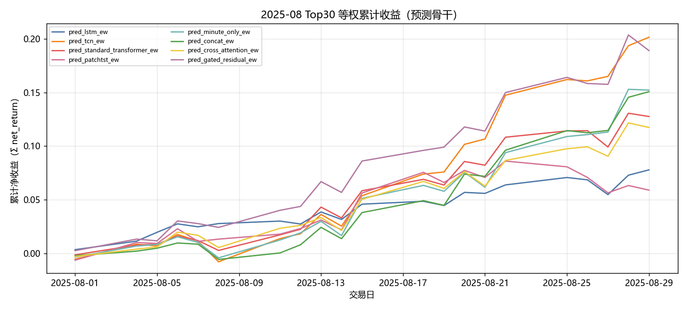

固定颜色: `pred_lstm_ew` `#4C78A8`；`pred_tcn_ew` `#F58518`；`pred_standard_transformer_ew` `#E45756`；`pred_patchtst_ew` `#D37295`；`pred_minute_only_ew` `#72B7B2`；`pred_concat_ew` `#54A24B`；`pred_cross_attention_ew` `#EECA3B`；`pred_gated_residual_ew` `#B279A2`。

### 组合基线累计收益

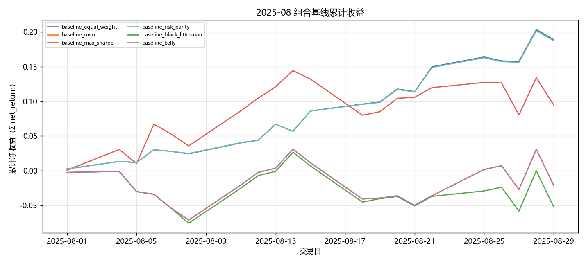

固定颜色: `baseline_equal_weight` `#4C78A8`；`baseline_mvo` `#F58518`；`baseline_max_sharpe` `#E45756`；`baseline_risk_parity` `#72B7B2`；`baseline_black_litterman` `#54A24B`；`baseline_kelly` `#B279A2`。

### 生成模型累计收益

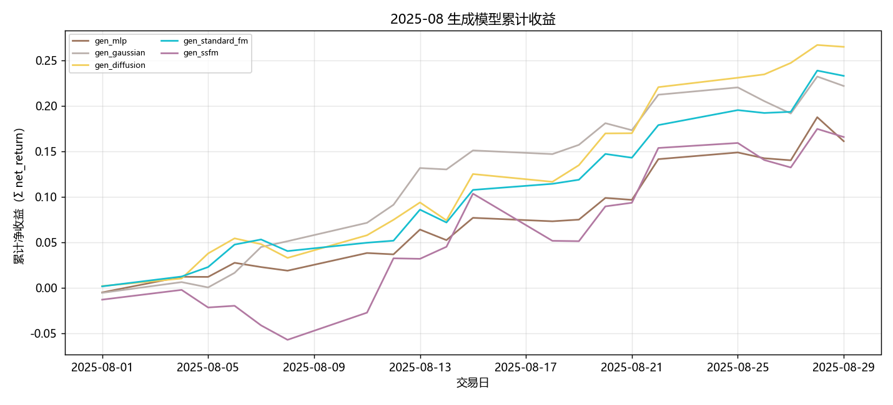

固定颜色: `gen_mlp` `#9D755D`；`gen_gaussian` `#BAB0AC`；`gen_diffusion` `#F2CF5B`；`gen_standard_fm` `#17BECF`；`gen_ssfm` `#B279A2`。

### RL 累计收益

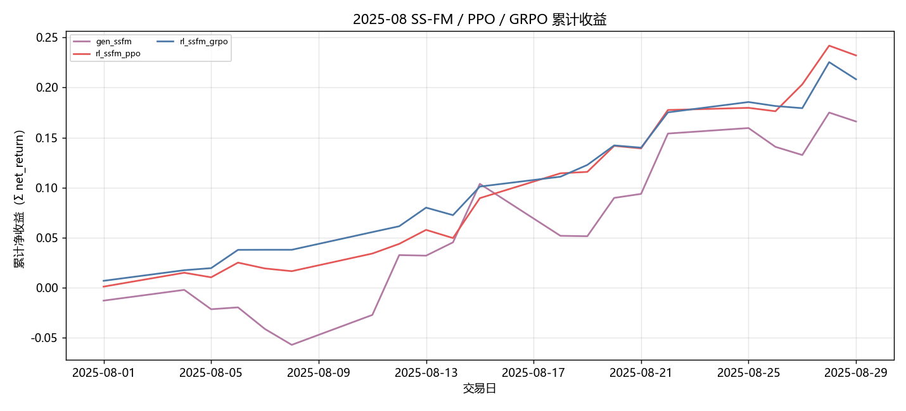

固定颜色: `gen_ssfm` `#B279A2`；`rl_ssfm_ppo` `#E45756`；`rl_ssfm_grpo` `#4C78A8`。

### G 曲线累计收益

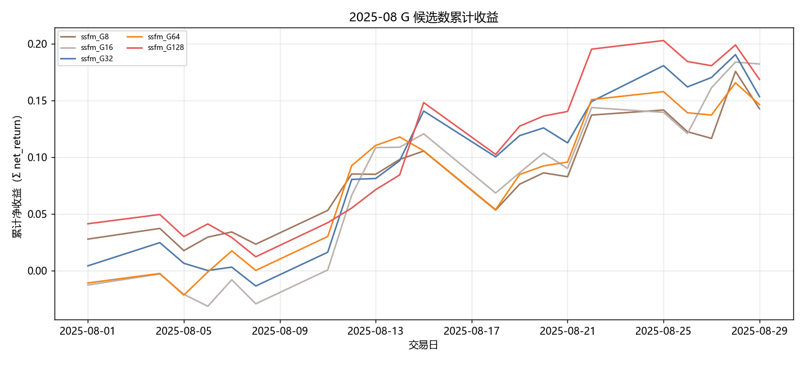

固定颜色: `ssfm_G8` `#9D755D`；`ssfm_G16` `#BAB0AC`；`ssfm_G32` `#4C78A8`；`ssfm_G64` `#F58518`；`ssfm_G128` `#E45756`。

### 日均换手

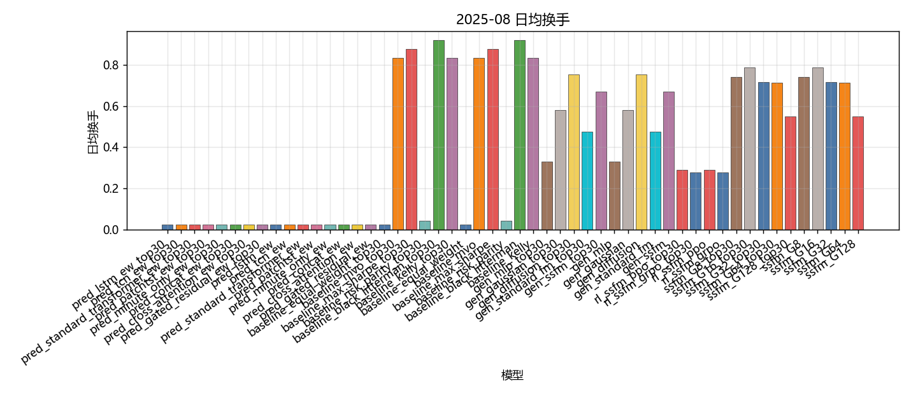

固定颜色: `pred_lstm_ew_top30` `#4C78A8`；`pred_tcn_ew_top30` `#F58518`；`pred_standard_transformer_ew_top30` `#E45756`；`pred_patchtst_ew_top30` `#D37295`；`pred_minute_only_ew_top30` `#72B7B2`；`pred_concat_ew_top30` `#54A24B`；`pred_cross_attention_ew_top30` `#EECA3B`；`pred_gated_residual_ew_top30` `#B279A2`；`pred_lstm_ew` `#4C78A8`；`pred_tcn_ew` `#F58518`；`pred_standard_transformer_ew` `#E45756`；`pred_patchtst_ew` `#D37295`；`pred_minute_only_ew` `#72B7B2`；`pred_concat_ew` `#54A24B`；`pred_cross_attention_ew` `#EECA3B`；`pred_gated_residual_ew` `#B279A2`；`baseline_equal_weight_top30` `#4C78A8`；`baseline_mvo_top30` `#F58518`；`baseline_max_sharpe_top30` `#E45756`；`baseline_risk_parity_top30` `#72B7B2`；`baseline_black_litterman_top30` `#54A24B`；`baseline_kelly_top30` `#B279A2`；`baseline_equal_weight` `#4C78A8`；`baseline_mvo` `#F58518`；`baseline_max_sharpe` `#E45756`；`baseline_risk_parity` `#72B7B2`；`baseline_black_litterman` `#54A24B`；`baseline_kelly` `#B279A2`；`gen_mlp_top30` `#9D755D`；`gen_gaussian_top30` `#BAB0AC`；`gen_diffusion_top30` `#F2CF5B`；`gen_standard_fm_top30` `#17BECF`；`gen_ssfm_top30` `#B279A2`；`gen_mlp` `#9D755D`；`gen_gaussian` `#BAB0AC`；`gen_diffusion` `#F2CF5B`；`gen_standard_fm` `#17BECF`；`gen_ssfm` `#B279A2`；`rl_ssfm_ppo_top30` `#E45756`；`rl_ssfm_grpo_top30` `#4C78A8`；`rl_ssfm_ppo` `#E45756`；`rl_ssfm_grpo` `#4C78A8`；`ssfm_G8_top30` `#9D755D`；`ssfm_G16_top30` `#BAB0AC`；`ssfm_G32_top30` `#4C78A8`；`ssfm_G64_top30` `#F58518`；`ssfm_G128_top30` `#E45756`；`ssfm_G8` `#9D755D`；`ssfm_G16` `#BAB0AC`；`ssfm_G32` `#4C78A8`；`ssfm_G64` `#F58518`；`ssfm_G128` `#E45756`。

### Val IC

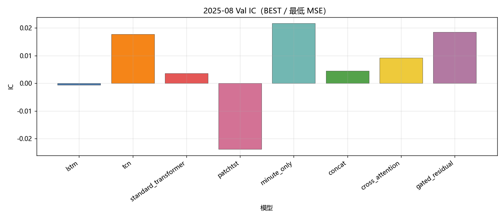

固定颜色: `lstm` `#4C78A8`；`tcn` `#F58518`；`standard_transformer` `#E45756`；`patchtst` `#D37295`；`minute_only` `#72B7B2`；`concat` `#54A24B`；`cross_attention` `#EECA3B`；`gated_residual` `#B279A2`。

### Val RankIC

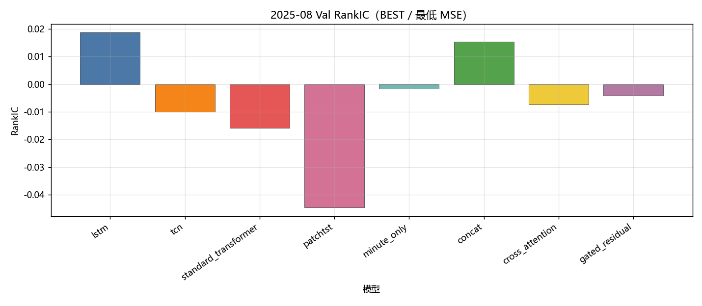

固定颜色: `lstm` `#4C78A8`；`tcn` `#F58518`；`standard_transformer` `#E45756`；`patchtst` `#D37295`；`minute_only` `#72B7B2`；`concat` `#54A24B`；`cross_attention` `#EECA3B`；`gated_residual` `#B279A2`。

### Val F1@Top30

固定颜色: `lstm` `#4C78A8`；`tcn` `#F58518`；`standard_transformer` `#E45756`；`patchtst` `#D37295`；`minute_only` `#72B7B2`；`concat` `#54A24B`；`cross_attention` `#EECA3B`；`gated_residual` `#B279A2`。

### Val MSE

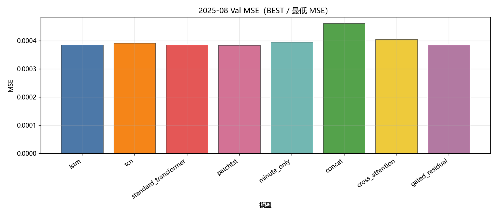

固定颜色: `lstm` `#4C78A8`；`tcn` `#F58518`；`standard_transformer` `#E45756`；`patchtst` `#D37295`；`minute_only` `#72B7B2`；`concat` `#54A24B`；`cross_attention` `#EECA3B`；`gated_residual` `#B279A2`。

### Val IC 各 epoch

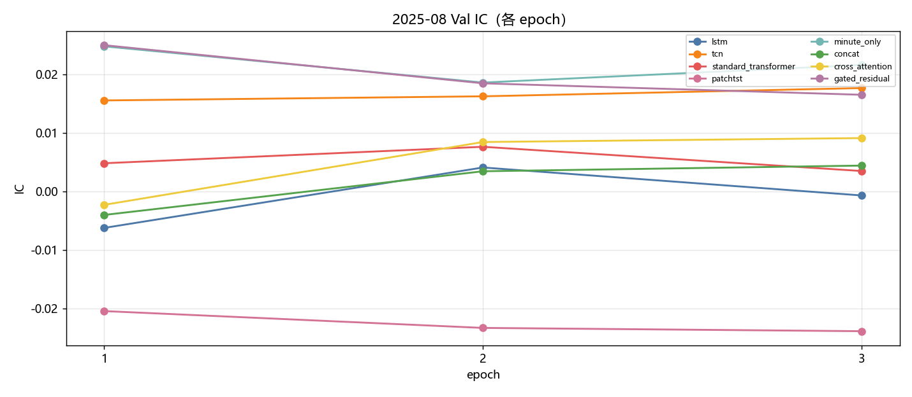

固定颜色: `lstm` `#4C78A8`；`tcn` `#F58518`；`standard_transformer` `#E45756`；`patchtst` `#D37295`；`minute_only` `#72B7B2`；`concat` `#54A24B`；`cross_attention` `#EECA3B`；`gated_residual` `#B279A2`。

### Val RankIC 各 epoch

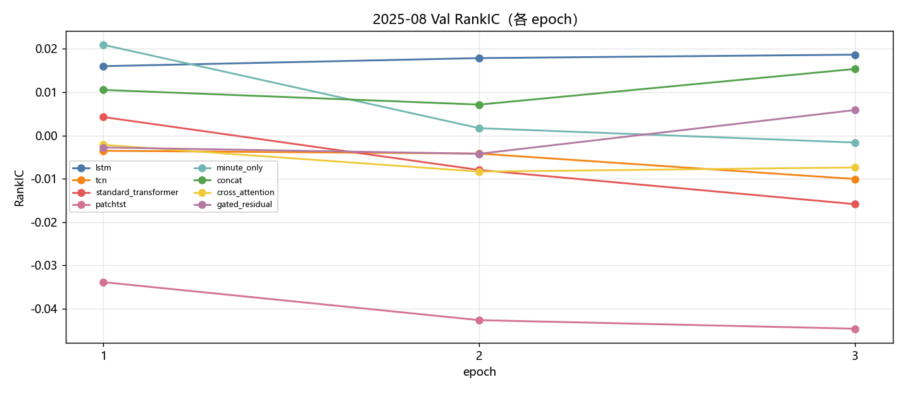

固定颜色: `lstm` `#4C78A8`；`tcn` `#F58518`；`standard_transformer` `#E45756`；`patchtst` `#D37295`；`minute_only` `#72B7B2`；`concat` `#54A24B`；`cross_attention` `#EECA3B`；`gated_residual` `#B279A2`。

### Val F1@Top30 各 epoch

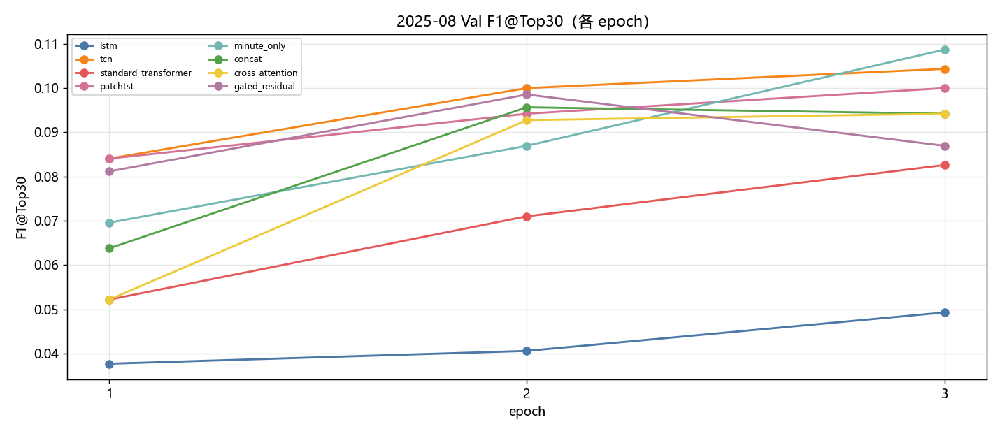

固定颜色: `lstm` `#4C78A8`；`tcn` `#F58518`；`standard_transformer` `#E45756`；`patchtst` `#D37295`；`minute_only` `#72B7B2`；`concat` `#54A24B`；`cross_attention` `#EECA3B`；`gated_residual` `#B279A2`。

### Val MSE 各 epoch

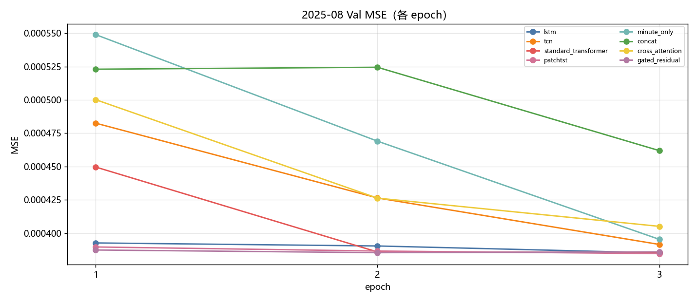

固定颜色: `lstm` `#4C78A8`；`tcn` `#F58518`；`standard_transformer` `#E45756`；`patchtst` `#D37295`；`minute_only` `#72B7B2`；`concat` `#54A24B`；`cross_attention` `#EECA3B`；`gated_residual` `#B279A2`。

### Test IC

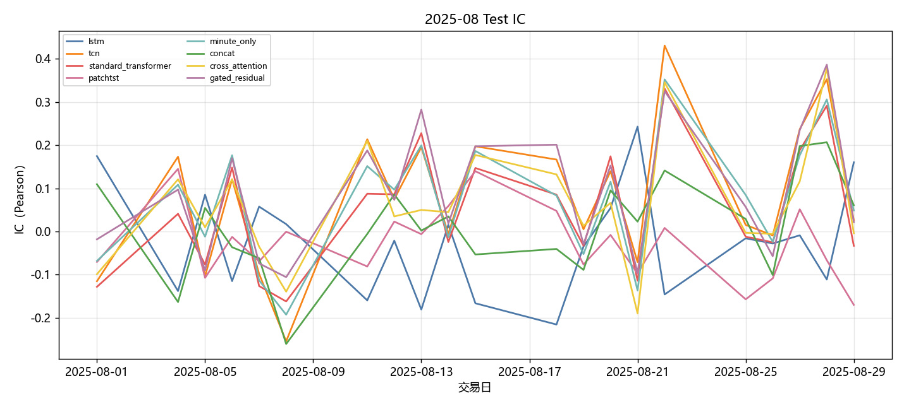

固定颜色: `lstm` `#4C78A8`；`tcn` `#F58518`；`standard_transformer` `#E45756`；`patchtst` `#D37295`；`minute_only` `#72B7B2`；`concat` `#54A24B`；`cross_attention` `#EECA3B`；`gated_residual` `#B279A2`。

### Test RankIC

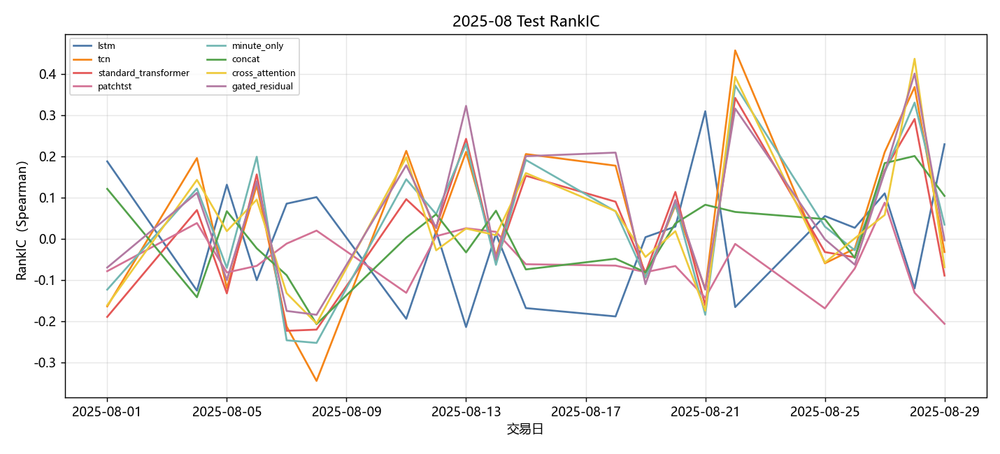

固定颜色: `lstm` `#4C78A8`；`tcn` `#F58518`；`standard_transformer` `#E45756`；`patchtst` `#D37295`；`minute_only` `#72B7B2`；`concat` `#54A24B`；`cross_attention` `#EECA3B`；`gated_residual` `#B279A2`。

### Test F1@Top30

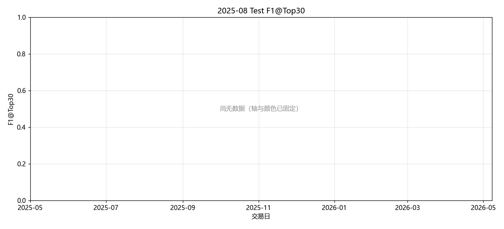

固定颜色: `lstm` `#4C78A8`；`tcn` `#F58518`；`standard_transformer` `#E45756`；`patchtst` `#D37295`；`minute_only` `#72B7B2`；`concat` `#54A24B`；`cross_attention` `#EECA3B`；`gated_residual` `#B279A2`。

### Test Hit@Top30

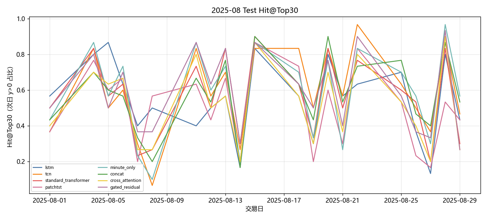

固定颜色: `lstm` `#4C78A8`；`tcn` `#F58518`；`standard_transformer` `#E45756`；`patchtst` `#D37295`；`minute_only` `#72B7B2`；`concat` `#54A24B`；`cross_attention` `#EECA3B`；`gated_residual` `#B279A2`。

## 图对应数据表

- 累计收益 ← `tables/backtest_daily.csv` 的 `net_return` 累加。
- 绩效 / 换手 ← `tables/performance_summary.csv`。
- Val ← `tables/val_best.csv`、`tables/val_epochs.csv`。
- Test 预测 ← `tables/prediction_metrics_mean.csv`。

## 分析

以下只讨论**已经写入数字**的行；单元格为 `-` 的表示该实验尚未跑完，不编造。
来源: month 2025-08。OOS=`sequential_oos_weekly_retrain`，费用=3.0bps，TopK=30。

已有数据的对象: `lstm`, `tcn`, `standard_transformer`, `patchtst`, `minute_only`, `concat`, `cross_attention`, `gated_residual`, `equal_weight`, `mvo`, `max_sharpe`, `risk_parity`, `black_litterman`, `kelly`, `mlp`, `gaussian`, `diffusion`, `standard_fm`, `ssfm`, `ssfm_ppo`, `ssfm_grpo`, `G=8`, `G=16`, `G=32`, `G=64`, `G=128`。
- Val IC 目前最高: `minute_only` = 0.0217。
- Val F1@Top30 目前最高: `minute_only` = 0.1087（随机约 0.06）。
- Val MSE 目前最低（入选口径）: `patchtst` = 0.000385。
- Test 日均 IC 目前最高: `gated_residual` = 0.0922。
- 已回测净值目前最高: `gen_diffusion` 累计净收益 0.3037，Sharpe 10.8659。
- 实验 E（G 候选数，top30）累计净收益最高: `ssfm_G16` = 0.2000（G=8 0.1536；G=16 0.2000；G=32 0.1660；G=64 0.1579；G=128 0.1839）。

## 重点对比：生成方法与强化学习

三种生成式方法都把 primary（`gated_residual`）分数映射成 Top30 组合权重，费用 3bps。差异在生成路径：**Diffusion** 逐步去噪；**Flow Matching（`standard_fm`）** 是普通连续流匹配；**SS-FM** 在流匹配上加入截面分数条件，使采样权重更贴近预测排序。下面只讨论已经写入的 Test 回测数字。

| 方法 | series | total_net_return | ann_return | sharpe | max_drawdown | mean_turnover | n_days |
| --- | --- | --- | --- | --- | --- | --- | --- |
| SS-FM | gen_ssfm | 0.1806 | - | 4.2606 | 0.0534 | 0.6698 | 21 |
| Flow Matching | gen_standard_fm | 0.2628 | - | 10.6821 | 0.0140 | 0.4767 | 21 |
| Diffusion | gen_diffusion | 0.3037 | - | 10.8659 | 0.0212 | 0.7540 | 21 |

累计净收益排序：`Diffusion`(0.3037) > `Flow Matching`(0.2628) > `SS-FM`(0.1806)。
Sharpe 排序：`Diffusion`(10.8659) > `Flow Matching`(10.6821) > `SS-FM`(4.2606)。
最大回撤（越小越好）：`Flow Matching`(0.0140) > `Diffusion`(0.0212) > `SS-FM`(0.0534)。
日均换手（越低交易成本压力越小）：`Flow Matching`(0.4767) > `SS-FM`(0.6698) > `Diffusion`(0.7540)。
- `SS-FM / gen_ssfm`：累计净收益 0.1806，年化 -，Sharpe 4.2606，最大回撤 0.0534，日均换手 0.6698，n=21。
- `Flow Matching / gen_standard_fm`：累计净收益 0.2628，年化 -，Sharpe 10.6821，最大回撤 0.0140，日均换手 0.4767，n=21。
- `Diffusion / gen_diffusion`：累计净收益 0.3037，年化 -，Sharpe 10.8659，最大回撤 0.0212，日均换手 0.7540，n=21。

本月生成方法里收益最好的是 **Diffusion**（0.3037），最差的是 **SS-FM**（0.1806）。
Diffusion 靠多步去噪在权重单纯形上探索，截面噪声大时往往比单步回归/流匹配更能避开过度集中的错误多头；若同时 Sharpe 更高、回撤更小，说明优势不只是赌对方向，而是路径更稳。
纯 SS-FM 最差时，常见原因是条件化过强、换手偏高，或 G 条候选里按 pred_utility 选出的那条并不对应真实收益。
换手最高的是 Diffusion（0.7540）。生成式每天重采样权重，换手天然高于预测骨干 Top30 等权；比较三种生成方法时，应把换手和费用一起看，不能只看毛收益。

### PPO vs GRPO（纯 SS-FM）

两组强化学习都挂在 **同一套 SS-FM** 上：先冻结/蒸馏 SS-FM 生成器，再用策略梯度改采样。**PPO** 用 clipped surrogate 优化轨迹回报；**GRPO** 对同一状态采一组候选，用组内相对优势，不显式用 critic。对照是不加 RL 的 `gen_ssfm`。

| 方法 | series | total_net_return | ann_return | sharpe | max_drawdown | mean_turnover | n_days |
| --- | --- | --- | --- | --- | --- | --- | --- |
| SS-FM（无 RL） | gen_ssfm | 0.1806 | - | 4.2606 | 0.0534 | 0.6698 | 21 |
| PPO + SS-FM | rl_ssfm_ppo | 0.2611 | - | 11.0891 | 0.0097 | 0.2914 | 21 |
| GRPO + SS-FM | rl_ssfm_grpo | 0.2314 | - | 10.8861 | 0.0170 | 0.2792 | 21 |

- `SS-FM 无 RL`：累计净收益 0.1806，年化 -，Sharpe 4.2606，最大回撤 0.0534，日均换手 0.6698，n=21。
- `PPO + SS-FM`：累计净收益 0.2611，年化 -，Sharpe 11.0891，最大回撤 0.0097，日均换手 0.2914，n=21。
- `GRPO + SS-FM`：累计净收益 0.2314，年化 -，Sharpe 10.8861，最大回撤 0.0170，日均换手 0.2792，n=21。

本月 **PPO 明显优于 GRPO**（净收益 0.2611 vs 0.2314，Sharpe 11.0891 vs 10.8861）。PPO 直接优化绝对回报，在月频、高噪声的 CSI500 Top30 上更容易学到“少动、抓住少数有效信号”的策略；GRPO 依赖组内相对排序，组内候选若都差或方差被截面噪声淹没，相对优势接近随机，策略更新会抖。
PPO 相对纯 SS-FM 净收益提升 0.0805。RL 若同时把换手压下去（0.6698 → 0.2914），说明它主要是在惩罚无意义的每日重采样，而不是另学一套完全不同的选股。
GRPO 相对纯 SS-FM 净收益提升 0.0508。
换手：纯 SS-FM 0.6698，PPO 0.2914，GRPO 0.2792。RL 若换手明显低于生成采样，成本项会解释一部分超额；Top30 等权预测骨干的换手几乎只反映首日建仓，**不能**和生成/RL 的日均换手直接比。

### 收益表现、稳定性与风险成本

预测骨干 Test 日均 IC 最高 `gated_residual`=0.0922，最低 `patchtst`=-0.0265。IC 一个月大约 20 个交易日，符号翻转很常见，不能单独用 IC 给方法排座次；组合净值、Sharpe、回撤要一起看。
核心序列里净值最好 `gen_diffusion`=0.3037（Sharpe 10.8659，MDD 0.0212），最差 `pred_lstm_ew`=0.0810。单月样本短，方法之间差几个百分点也可能是市场路径而不是模型能力；要和下个月对照是否同向。
稳定性：看 Val IC 与 Test IC 是否同向、生成/RL 是否跟预测骨干一起赚或一起亏。若预测 IC 为正但生成亏损，问题更可能在权重采样与换手，而不是分数本身；若预测 IC 已接近 0，生成和 RL 都很难稳定赚钱，这是市场环境而不是某一生成器独有的失败。

## 实验 E：G 候选数

只跑 top30。每个交易日加载当时周五生效的 primary / SS-FM，采 G 条权重后按 pred_utility 选 1 条。与默认 `gen_ssfm`（固定 default_g）不是同一条抽样路径。

| G | 累计净收益 | Sharpe | 最大回撤 | 日均换手 | 天数 |
| --- | --- | --- | --- | --- | --- |
| G=8 | 0.1536 | 4.1834 | 0.0507 | 0.7411 | 21 |
| G=16 | 0.2000 | 4.9697 | 0.0509 | 0.7878 | 21 |
| G=32 | 0.1660 | 4.5163 | 0.0396 | 0.7144 | 21 |
| G=64 | 0.1579 | 4.2550 | 0.0621 | 0.7133 | 21 |
| G=128 | 0.1839 | 4.8677 | 0.0447 | 0.5498 | 21 |

本月网格里累计净收益最好的是 `ssfm_G16`。更大的 G 没有单调变好。
