# 2025-09 Sequential OOS 当月实验分析

- 状态: **当月单元已全部写入**
- OOS: `sequential_oos_weekly_retrain`
- TopK=30，cost_bps=3.0，primary=`gated_residual`
- 缺测一律 `-`，不补 0、不编造。

## 固定颜色

| 模型 | 颜色 |
| --- | --- |
| lstm | #4C78A8 |
| tcn | #F58518 |
| standard_transformer | #E45756 |
| patchtst | #D37295 |
| minute_only | #72B7B2 |
| concat | #54A24B |
| cross_attention | #EECA3B |
| gated_residual | #B279A2 |

预测骨干日收益曲线用 `pred_<模型>_ew`，颜色与上表相同。

## 实验进度

| unit | model | status |
| --- | --- | --- |
| A 预测 | lstm | 已写入 |
| A 预测 | tcn | 已写入 |
| A 预测 | standard_transformer | 已写入 |
| A 预测 | patchtst | 已写入 |
| A 预测 | minute_only | 已写入 |
| A 预测 | concat | 已写入 |
| A 预测 | cross_attention | 已写入 |
| A 预测 | gated_residual | 已写入 |
| B 组合/top30 | equal_weight | 已写入 |
| B 组合/top30 | mvo | 已写入 |
| B 组合/top30 | max_sharpe | 已写入 |
| B 组合/top30 | risk_parity | 已写入 |
| B 组合/top30 | black_litterman | 已写入 |
| B 组合/top30 | kelly | 已写入 |
| C 生成/top30 | mlp | 已写入 |
| C 生成/top30 | gaussian | 已写入 |
| C 生成/top30 | diffusion | 已写入 |
| C 生成/top30 | standard_fm | 已写入 |
| C 生成/top30 | ssfm | 已写入 |
| D RL/top30 | ssfm_ppo | 已写入 |
| D RL/top30 | ssfm_grpo | 已写入 |
| E G/top30 | G=8 | 已写入 |
| E G/top30 | G=16 | 已写入 |
| E G/top30 | G=32 | 已写入 |
| E G/top30 | G=64 | 已写入 |
| E G/top30 | G=128 | 已写入 |

## 实验设定

- Walk-forward：Train=T-13..T-2，Val=T-1，Test=当月。
- Sequential OOS：周五收盘重训 primary + SS-FM + PPO/GRPO，下周一生效，不回写本周决策。
- 实验 E：SS-FM 候选数 G∈{8,16,32,64,128}。按周五生效窗口加载当时的 primary / SS-FM，当日采样后按 pred_utility 选 1 条；只跑 top30，不跑 500 只 all 池。
- 标签 y = log(Close_D / Open_D)。高严重泄漏 FAIL 的月份不进 final_summary。
- 本批次不跑 All 股池，进度表与绩效表均不含 `*_all`。
- 重点对比：SS-FM vs Flow Matching vs Diffusion；PPO vs GRPO（均挂在纯 SS-FM 上）。
- 不跑文档末尾的 Auction 消融与特征标准化消融。Auction 额外只跑 LSTM / Minute-only WeakAuction（StdNorm + LN + 0.1）。

## Validation（回归 / 排序）

### 各模型 BEST（按该模型 Val MSE 最低的 epoch）

| model | MSE | MAE | IC | RankIC | topk_f1 | topk_precision | topk_recall | dir_acc | dir_f1 | dir_precision | dir_recall | top30_hit_rate | n |
| --- | --- | --- | --- | --- | --- | --- | --- | --- | --- | --- | --- | --- | --- |
| lstm | 0.000523 | 0.015393 | 0.051322 | 0.039750 | 0.101587 | 0.101587 | 0.101587 | 0.570683 | 0.687086 | 0.553016 | 1 | 0.585714 | 21 |
| tcn | 0.000519 | 0.015435 | 0.069479 | 0.037668 | 0.150794 | 0.150794 | 0.150794 | 0.570683 | 0.687086 | 0.553016 | 1 | 0.561905 | 21 |
| standard_transformer | 0.000518 | 0.015385 | 0.065107 | 0.039399 | 0.117460 | 0.117460 | 0.117460 | 0.570683 | 0.687086 | 0.553016 | 1 | 0.546032 | 21 |
| patchtst | 0.000523 | 0.015467 | -0.025818 | -0.050132 | 0.085714 | 0.085714 | 0.085714 | 0.570683 | 0.687086 | 0.553016 | 1 | 0.511111 | 21 |
| minute_only | 0.000516 | 0.015473 | 0.083283 | 0.066072 | 0.133333 | 0.133333 | 0.133333 | 0.570783 | 0.687049 | 0.553071 | 0.999649 | 0.553968 | 21 |
| concat | 0.000533 | 0.015480 | 0.076220 | 0.054373 | 0.123810 | 0.123810 | 0.123810 | 0.570683 | 0.687086 | 0.553016 | 1 | 0.600000 | 21 |
| cross_attention | 0.000519 | 0.015374 | 0.073118 | 0.039364 | 0.144444 | 0.144444 | 0.144444 | 0.566581 | 0.682426 | 0.553175 | 0.982127 | 0.550794 | 21 |
| gated_residual | 0.000519 | 0.015415 | 0.071622 | 0.048336 | 0.130159 | 0.130159 | 0.130159 | 0.570683 | 0.687086 | 0.553016 | 1 | 0.544444 | 21 |

列含义: `MSE`/`MAE` 是 ŷ 对 y 的误差；`IC` 是 Pearson；`RankIC` 是 Spearman；`topk_f1` 是预测 Top30 ∩ 真实收益 Top30 / 30；`dir_acc` 是涨跌符号一致率；`top30_hit_rate` 是入选 30 只里 y>0 的比例。

### 各 epoch

| model | epoch | MSE | MAE | IC | RankIC | topk_f1 | topk_precision | topk_recall | dir_acc | dir_f1 | dir_precision | dir_recall | top30_hit_rate | n |
| --- | --- | --- | --- | --- | --- | --- | --- | --- | --- | --- | --- | --- | --- | --- |
| lstm | 1 | 0.000532 | 0.015462 | 0.049336 | 0.047222 | 0.053968 | 0.053968 | 0.053968 | 0.565546 | 0.673666 | 0.555334 | 0.943538 | 0.550794 | 21 |
| lstm | 2 | 0.000527 | 0.015410 | 0.052444 | 0.043581 | 0.082540 | 0.082540 | 0.082540 | 0.570683 | 0.687086 | 0.553016 | 1 | 0.595238 | 21 |
| lstm | 3 | 0.000523 | 0.015393 | 0.051322 | 0.039750 | 0.101587 | 0.101587 | 0.101587 | 0.570683 | 0.687086 | 0.553016 | 1 | 0.585714 | 21 |
| tcn | 1 | 0.000563 | 0.016052 | 0.054762 | 0.035449 | 0.119048 | 0.119048 | 0.119048 | 0.431402 | 0.139985 | 0.521513 | 0.078012 | 0.566667 | 21 |
| tcn | 2 | 0.000520 | 0.015420 | 0.058264 | 0.035955 | 0.123810 | 0.123810 | 0.123810 | 0.570783 | 0.687089 | 0.553111 | 0.999579 | 0.569841 | 21 |
| tcn | 3 | 0.000519 | 0.015435 | 0.069479 | 0.037668 | 0.150794 | 0.150794 | 0.150794 | 0.570683 | 0.687086 | 0.553016 | 1 | 0.561905 | 21 |
| standard_transformer | 1 | 0.000532 | 0.015560 | 0.065800 | 0.049789 | 0.098413 | 0.098413 | 0.098413 | 0.528713 | 0.546659 | 0.559072 | 0.620095 | 0.565079 | 21 |
| standard_transformer | 2 | 0.000518 | 0.015366 | 0.057856 | 0.034973 | 0.117460 | 0.117460 | 0.117460 | 0.570583 | 0.686992 | 0.552960 | 0.999774 | 0.565079 | 21 |
| standard_transformer | 3 | 0.000518 | 0.015385 | 0.065107 | 0.039399 | 0.117460 | 0.117460 | 0.117460 | 0.570683 | 0.687086 | 0.553016 | 1 | 0.546032 | 21 |
| patchtst | 1 | 0.000525 | 0.015506 | -0.028388 | -0.046012 | 0.079365 | 0.079365 | 0.079365 | 0.570390 | 0.686875 | 0.552924 | 0.999541 | 0.520635 | 21 |
| patchtst | 2 | 0.000525 | 0.015455 | -0.025305 | -0.049084 | 0.080952 | 0.080952 | 0.080952 | 0.570683 | 0.687086 | 0.553016 | 1 | 0.500000 | 21 |
| patchtst | 3 | 0.000523 | 0.015467 | -0.025818 | -0.050132 | 0.085714 | 0.085714 | 0.085714 | 0.570683 | 0.687086 | 0.553016 | 1 | 0.511111 | 21 |
| minute_only | 1 | 0.000584 | 0.016619 | 0.073041 | 0.060897 | 0.117460 | 0.117460 | 0.117460 | 0.456792 | 0.164805 | 0.541237 | 0.109276 | 0.566667 | 21 |
| minute_only | 2 | 0.000516 | 0.015473 | 0.083283 | 0.066072 | 0.133333 | 0.133333 | 0.133333 | 0.570783 | 0.687049 | 0.553071 | 0.999649 | 0.553968 | 21 |
| minute_only | 3 | 0.000518 | 0.015381 | 0.078439 | 0.057763 | 0.125397 | 0.125397 | 0.125397 | 0.570683 | 0.687086 | 0.553016 | 1 | 0.558730 | 21 |
| concat | 1 | 0.000585 | 0.016446 | 0.057222 | 0.042542 | 0.111111 | 0.111111 | 0.111111 | 0.429317 | - | - | 0.000000 | 0.601587 | 21 |
| concat | 2 | 0.000608 | 0.016935 | 0.070234 | 0.050679 | 0.122222 | 0.122222 | 0.122222 | 0.429317 | - | - | 0.000000 | 0.609524 | 21 |
| concat | 3 | 0.000533 | 0.015480 | 0.076220 | 0.054373 | 0.123810 | 0.123810 | 0.123810 | 0.570683 | 0.687086 | 0.553016 | 1 | 0.600000 | 21 |
| cross_attention | 1 | 0.000626 | 0.017590 | 0.069369 | 0.041713 | 0.139683 | 0.139683 | 0.139683 | 0.439411 | 0.095934 | 0.526362 | 0.043943 | 0.560317 | 21 |
| cross_attention | 2 | 0.000523 | 0.015405 | 0.071654 | 0.041065 | 0.144444 | 0.144444 | 0.144444 | 0.551689 | 0.641206 | 0.552569 | 0.859525 | 0.547619 | 21 |
| cross_attention | 3 | 0.000519 | 0.015374 | 0.073118 | 0.039364 | 0.144444 | 0.144444 | 0.144444 | 0.566581 | 0.682426 | 0.553175 | 0.982127 | 0.550794 | 21 |
| gated_residual | 1 | 0.000520 | 0.015355 | 0.063306 | 0.047186 | 0.095238 | 0.095238 | 0.095238 | 0.569831 | 0.677245 | 0.552145 | 0.958625 | 0.574603 | 21 |
| gated_residual | 2 | 0.000520 | 0.015391 | 0.060719 | 0.035576 | 0.138095 | 0.138095 | 0.138095 | 0.570683 | 0.687086 | 0.553016 | 1 | 0.549206 | 21 |
| gated_residual | 3 | 0.000519 | 0.015415 | 0.071622 | 0.048336 | 0.130159 | 0.130159 | 0.130159 | 0.570683 | 0.687086 | 0.553016 | 1 | 0.544444 | 21 |

## Test 预测指标（日均）

| model | MSE | MAE | IC | RankIC | topk_f1 | topk_precision | topk_recall | dir_acc | dir_f1 | dir_precision | dir_recall | top30_hit_rate | top30_excess | n |
| --- | --- | --- | --- | --- | --- | --- | --- | --- | --- | --- | --- | --- | --- | --- |
| lstm | 0.000745 | 0.019098 | 0.017145 | 0.021371 | - | - | - | - | - | - | - | 0.509091 | 0.001264 | 22 |
| tcn | 0.000747 | 0.019235 | 0.056441 | 0.042380 | - | - | - | - | - | - | - | 0.507576 | 0.003407 | 22 |
| standard_transformer | 0.000750 | 0.019315 | 0.028999 | 0.003197 | - | - | - | - | - | - | - | 0.478788 | 0.001126 | 22 |
| patchtst | 0.000746 | 0.019200 | -0.006091 | -0.018427 | - | - | - | - | - | - | - | 0.427273 | -0.000280 | 22 |
| minute_only | 0.000758 | 0.019527 | 0.020168 | 0.006316 | - | - | - | - | - | - | - | 0.528788 | 0.001603 | 22 |
| concat | 0.000743 | 0.018892 | 0.035097 | 0.022514 | - | - | - | - | - | - | - | 0.522727 | 0.001751 | 22 |
| cross_attention | 0.000745 | 0.019174 | 0.048629 | 0.032664 | - | - | - | - | - | - | - | 0.533333 | 0.002868 | 22 |
| gated_residual | 0.000822 | 0.020316 | 0.038390 | 0.012748 | - | - | - | - | - | - | - | 0.501515 | 0.002119 | 22 |

## 组合绩效

| model | total_net_return | ann_return | sharpe | max_drawdown | mean_turnover | mean_cost | n_days |
| --- | --- | --- | --- | --- | --- | --- | --- |
| pred_lstm_ew_top30 | 0.0571 | 0.8883 | 2.4898 | 0.0630 | 0.0227 | 0.0000 | 22 |
| pred_tcn_ew_top30 | 0.1081 | 2.2412 | 3.4078 | 0.0816 | 0.0227 | 0.0000 | 22 |
| pred_standard_transformer_ew_top30 | 0.0539 | 0.8242 | 1.9215 | 0.0736 | 0.0227 | 0.0000 | 22 |
| pred_patchtst_ew_top30 | 0.0218 | 0.2798 | 0.9139 | 0.0633 | 0.0227 | 0.0000 | 22 |
| pred_minute_only_ew_top30 | 0.0650 | 1.0571 | 2.2418 | 0.0682 | 0.0227 | 0.0000 | 22 |
| pred_concat_ew_top30 | 0.0685 | 1.1352 | 2.2659 | 0.0879 | 0.0227 | 0.0000 | 22 |
| pred_cross_attention_ew_top30 | 0.0950 | 1.8291 | 2.9208 | 0.0872 | 0.0227 | 0.0000 | 22 |
| pred_gated_residual_ew_top30 | 0.0772 | 1.3427 | 2.6698 | 0.0748 | 0.0227 | 0.0000 | 22 |
| pred_lstm_ew | 0.0571 | 0.8883 | 2.4898 | 0.0630 | 0.0227 | 0.0000 | 22 |
| pred_tcn_ew | 0.1081 | 2.2412 | 3.4078 | 0.0816 | 0.0227 | 0.0000 | 22 |
| pred_standard_transformer_ew | 0.0539 | 0.8242 | 1.9215 | 0.0736 | 0.0227 | 0.0000 | 22 |
| pred_patchtst_ew | 0.0218 | 0.2798 | 0.9139 | 0.0633 | 0.0227 | 0.0000 | 22 |
| pred_minute_only_ew | 0.0650 | 1.0571 | 2.2418 | 0.0682 | 0.0227 | 0.0000 | 22 |
| pred_concat_ew | 0.0685 | 1.1352 | 2.2659 | 0.0879 | 0.0227 | 0.0000 | 22 |
| pred_cross_attention_ew | 0.0950 | 1.8291 | 2.9208 | 0.0872 | 0.0227 | 0.0000 | 22 |
| pred_gated_residual_ew | 0.0772 | 1.3427 | 2.6698 | 0.0748 | 0.0227 | 0.0000 | 22 |
| baseline_equal_weight_top30 | 0.0772 | 1.3427 | 2.6698 | 0.0748 | 0.0227 | 0.0000 | 22 |
| baseline_mvo_top30 | 0.1643 | 4.7094 | 2.6918 | 0.1444 | 0.8300 | 0.0002 | 22 |
| baseline_max_sharpe_top30 | 0.2419 | - | 4.5629 | 0.0886 | 0.8048 | 0.0002 | 22 |
| baseline_risk_parity_top30 | 0.0740 | 1.2657 | 2.6037 | 0.0745 | 0.0447 | 0.0000 | 22 |
| baseline_black_litterman_top30 | 0.1284 | 2.9885 | 2.1184 | 0.1442 | 0.8409 | 0.0003 | 22 |
| baseline_kelly_top30 | 0.1643 | 4.7094 | 2.6918 | 0.1444 | 0.8300 | 0.0002 | 22 |
| baseline_equal_weight | 0.0772 | 1.3427 | 2.6698 | 0.0748 | 0.0227 | 0.0000 | 22 |
| baseline_mvo | 0.1643 | 4.7094 | 2.6918 | 0.1444 | 0.8300 | 0.0002 | 22 |
| baseline_max_sharpe | 0.2419 | - | 4.5629 | 0.0886 | 0.8048 | 0.0002 | 22 |
| baseline_risk_parity | 0.0740 | 1.2657 | 2.6037 | 0.0745 | 0.0447 | 0.0000 | 22 |
| baseline_black_litterman | 0.1284 | 2.9885 | 2.1184 | 0.1442 | 0.8409 | 0.0003 | 22 |
| baseline_kelly | 0.1643 | 4.7094 | 2.6918 | 0.1444 | 0.8300 | 0.0002 | 22 |
| gen_mlp_top30 | 0.0588 | 0.9245 | 2.0478 | 0.0757 | 0.4523 | 0.0001 | 22 |
| gen_gaussian_top30 | 0.0853 | 1.5541 | 2.5492 | 0.0475 | 0.5561 | 0.0002 | 22 |
| gen_diffusion_top30 | -0.0137 | -0.1463 | -0.3869 | 0.0812 | 0.6753 | 0.0002 | 22 |
| gen_standard_fm_top30 | 0.0792 | 1.3934 | 2.4465 | 0.0791 | 0.4932 | 0.0001 | 22 |
| gen_ssfm_top30 | 0.1380 | 3.3943 | 3.0393 | 0.0931 | 0.6238 | 0.0002 | 22 |
| gen_mlp | 0.0588 | 0.9245 | 2.0478 | 0.0757 | 0.4523 | 0.0001 | 22 |
| gen_gaussian | 0.0853 | 1.5541 | 2.5492 | 0.0475 | 0.5561 | 0.0002 | 22 |
| gen_diffusion | -0.0137 | -0.1463 | -0.3869 | 0.0812 | 0.6753 | 0.0002 | 22 |
| gen_standard_fm | 0.0792 | 1.3934 | 2.4465 | 0.0791 | 0.4932 | 0.0001 | 22 |
| gen_ssfm | 0.1380 | 3.3943 | 3.0393 | 0.0931 | 0.6238 | 0.0002 | 22 |
| rl_ssfm_ppo_top30 | 0.0583 | 0.9138 | 2.0541 | 0.0775 | 0.2694 | 0.0001 | 22 |
| rl_ssfm_grpo_top30 | 0.1007 | 2.0016 | 3.4121 | 0.0776 | 0.2767 | 0.0001 | 22 |
| rl_ssfm_ppo | 0.0583 | 0.9138 | 2.0541 | 0.0775 | 0.2694 | 0.0001 | 22 |
| rl_ssfm_grpo | 0.1007 | 2.0016 | 3.4121 | 0.0776 | 0.2767 | 0.0001 | 22 |
| ssfm_G8_top30 | 0.1510 | 4.0078 | 3.6092 | 0.0863 | 0.6970 | 0.0002 | 22 |
| ssfm_G16_top30 | 0.1221 | 2.7401 | 2.6037 | 0.0621 | 0.7252 | 0.0002 | 22 |
| ssfm_G32_top30 | 0.1476 | 3.8410 | 3.2760 | 0.0714 | 0.6060 | 0.0002 | 22 |
| ssfm_G64_top30 | 0.0705 | 1.1818 | 1.5687 | 0.0780 | 0.5676 | 0.0002 | 22 |
| ssfm_G128_top30 | 0.2330 | - | 4.3044 | 0.0819 | 0.4368 | 0.0001 | 22 |
| ssfm_G8 | 0.1510 | 4.0078 | 3.6092 | 0.0863 | 0.6970 | 0.0002 | 22 |
| ssfm_G16 | 0.1221 | 2.7401 | 2.6037 | 0.0621 | 0.7252 | 0.0002 | 22 |
| ssfm_G32 | 0.1476 | 3.8410 | 3.2760 | 0.0714 | 0.6060 | 0.0002 | 22 |
| ssfm_G64 | 0.0705 | 1.1818 | 1.5687 | 0.0780 | 0.5676 | 0.0002 | 22 |
| ssfm_G128 | 0.2330 | - | 4.3044 | 0.0819 | 0.4368 | 0.0001 | 22 |

## 日均换手

| model | mean_turnover |
| --- | --- |
| pred_lstm_ew_top30 | 0.0227 |
| pred_tcn_ew_top30 | 0.0227 |
| pred_standard_transformer_ew_top30 | 0.0227 |
| pred_patchtst_ew_top30 | 0.0227 |
| pred_minute_only_ew_top30 | 0.0227 |
| pred_concat_ew_top30 | 0.0227 |
| pred_cross_attention_ew_top30 | 0.0227 |
| pred_gated_residual_ew_top30 | 0.0227 |
| pred_lstm_ew | 0.0227 |
| pred_tcn_ew | 0.0227 |
| pred_standard_transformer_ew | 0.0227 |
| pred_patchtst_ew | 0.0227 |
| pred_minute_only_ew | 0.0227 |
| pred_concat_ew | 0.0227 |
| pred_cross_attention_ew | 0.0227 |
| pred_gated_residual_ew | 0.0227 |
| baseline_equal_weight_top30 | 0.0227 |
| baseline_mvo_top30 | 0.8300 |
| baseline_max_sharpe_top30 | 0.8048 |
| baseline_risk_parity_top30 | 0.0447 |
| baseline_black_litterman_top30 | 0.8409 |
| baseline_kelly_top30 | 0.8300 |
| baseline_equal_weight | 0.0227 |
| baseline_mvo | 0.8300 |
| baseline_max_sharpe | 0.8048 |
| baseline_risk_parity | 0.0447 |
| baseline_black_litterman | 0.8409 |
| baseline_kelly | 0.8300 |
| gen_mlp_top30 | 0.4523 |
| gen_gaussian_top30 | 0.5561 |
| gen_diffusion_top30 | 0.6753 |
| gen_standard_fm_top30 | 0.4932 |
| gen_ssfm_top30 | 0.6238 |
| gen_mlp | 0.4523 |
| gen_gaussian | 0.5561 |
| gen_diffusion | 0.6753 |
| gen_standard_fm | 0.4932 |
| gen_ssfm | 0.6238 |
| rl_ssfm_ppo_top30 | 0.2694 |
| rl_ssfm_grpo_top30 | 0.2767 |
| rl_ssfm_ppo | 0.2694 |
| rl_ssfm_grpo | 0.2767 |
| ssfm_G8_top30 | 0.6970 |
| ssfm_G16_top30 | 0.7252 |
| ssfm_G32_top30 | 0.6060 |
| ssfm_G64_top30 | 0.5676 |
| ssfm_G128_top30 | 0.4368 |
| ssfm_G8 | 0.6970 |
| ssfm_G16 | 0.7252 |
| ssfm_G32 | 0.6060 |
| ssfm_G64 | 0.5676 |
| ssfm_G128 | 0.4368 |

## 图（颜色已固定，无数据时只画轴）

### 预测骨干累计收益

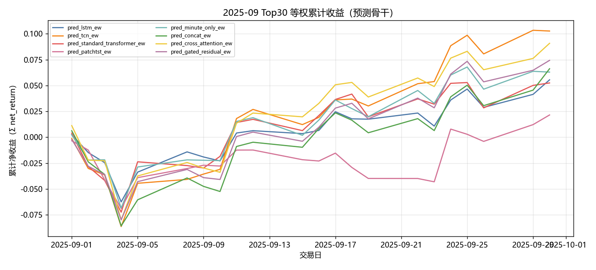

固定颜色: `pred_lstm_ew` `#4C78A8`；`pred_tcn_ew` `#F58518`；`pred_standard_transformer_ew` `#E45756`；`pred_patchtst_ew` `#D37295`；`pred_minute_only_ew` `#72B7B2`；`pred_concat_ew` `#54A24B`；`pred_cross_attention_ew` `#EECA3B`；`pred_gated_residual_ew` `#B279A2`。

### 组合基线累计收益

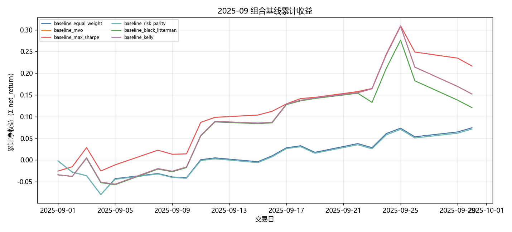

固定颜色: `baseline_equal_weight` `#4C78A8`；`baseline_mvo` `#F58518`；`baseline_max_sharpe` `#E45756`；`baseline_risk_parity` `#72B7B2`；`baseline_black_litterman` `#54A24B`；`baseline_kelly` `#B279A2`。

### 生成模型累计收益

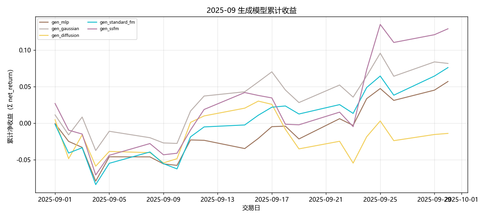

固定颜色: `gen_mlp` `#9D755D`；`gen_gaussian` `#BAB0AC`；`gen_diffusion` `#F2CF5B`；`gen_standard_fm` `#17BECF`；`gen_ssfm` `#B279A2`。

### RL 累计收益

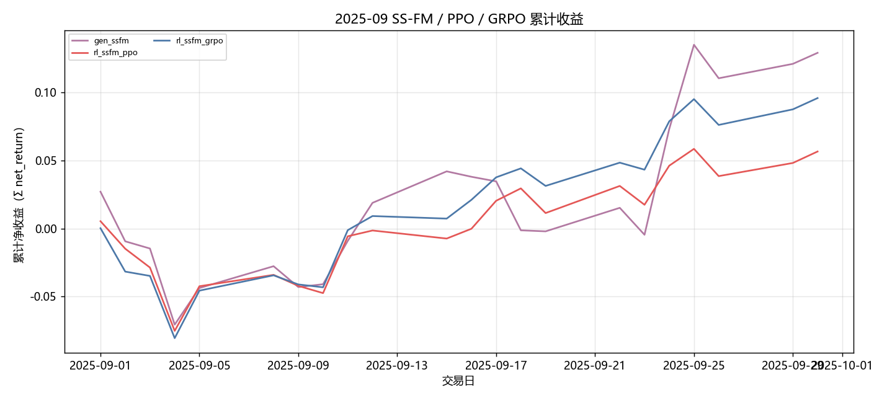

固定颜色: `gen_ssfm` `#B279A2`；`rl_ssfm_ppo` `#E45756`；`rl_ssfm_grpo` `#4C78A8`。

### G 曲线累计收益

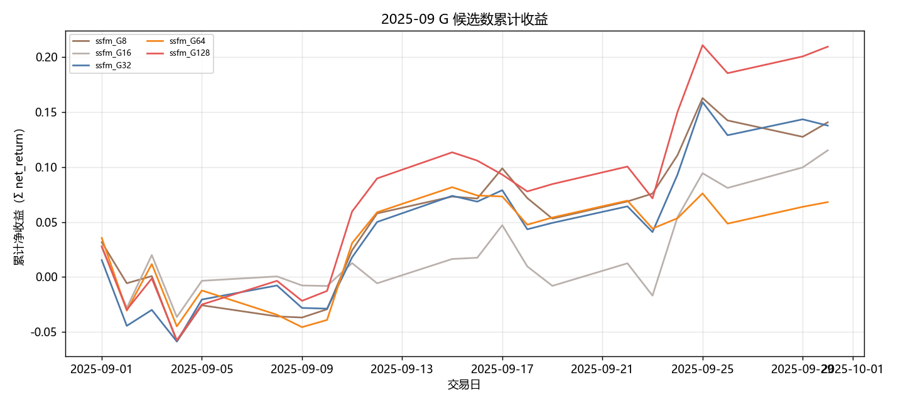

固定颜色: `ssfm_G8` `#9D755D`；`ssfm_G16` `#BAB0AC`；`ssfm_G32` `#4C78A8`；`ssfm_G64` `#F58518`；`ssfm_G128` `#E45756`。

### 日均换手

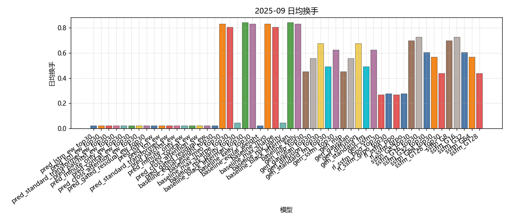

固定颜色: `pred_lstm_ew_top30` `#4C78A8`；`pred_tcn_ew_top30` `#F58518`；`pred_standard_transformer_ew_top30` `#E45756`；`pred_patchtst_ew_top30` `#D37295`；`pred_minute_only_ew_top30` `#72B7B2`；`pred_concat_ew_top30` `#54A24B`；`pred_cross_attention_ew_top30` `#EECA3B`；`pred_gated_residual_ew_top30` `#B279A2`；`pred_lstm_ew` `#4C78A8`；`pred_tcn_ew` `#F58518`；`pred_standard_transformer_ew` `#E45756`；`pred_patchtst_ew` `#D37295`；`pred_minute_only_ew` `#72B7B2`；`pred_concat_ew` `#54A24B`；`pred_cross_attention_ew` `#EECA3B`；`pred_gated_residual_ew` `#B279A2`；`baseline_equal_weight_top30` `#4C78A8`；`baseline_mvo_top30` `#F58518`；`baseline_max_sharpe_top30` `#E45756`；`baseline_risk_parity_top30` `#72B7B2`；`baseline_black_litterman_top30` `#54A24B`；`baseline_kelly_top30` `#B279A2`；`baseline_equal_weight` `#4C78A8`；`baseline_mvo` `#F58518`；`baseline_max_sharpe` `#E45756`；`baseline_risk_parity` `#72B7B2`；`baseline_black_litterman` `#54A24B`；`baseline_kelly` `#B279A2`；`gen_mlp_top30` `#9D755D`；`gen_gaussian_top30` `#BAB0AC`；`gen_diffusion_top30` `#F2CF5B`；`gen_standard_fm_top30` `#17BECF`；`gen_ssfm_top30` `#B279A2`；`gen_mlp` `#9D755D`；`gen_gaussian` `#BAB0AC`；`gen_diffusion` `#F2CF5B`；`gen_standard_fm` `#17BECF`；`gen_ssfm` `#B279A2`；`rl_ssfm_ppo_top30` `#E45756`；`rl_ssfm_grpo_top30` `#4C78A8`；`rl_ssfm_ppo` `#E45756`；`rl_ssfm_grpo` `#4C78A8`；`ssfm_G8_top30` `#9D755D`；`ssfm_G16_top30` `#BAB0AC`；`ssfm_G32_top30` `#4C78A8`；`ssfm_G64_top30` `#F58518`；`ssfm_G128_top30` `#E45756`；`ssfm_G8` `#9D755D`；`ssfm_G16` `#BAB0AC`；`ssfm_G32` `#4C78A8`；`ssfm_G64` `#F58518`；`ssfm_G128` `#E45756`。

### Val IC

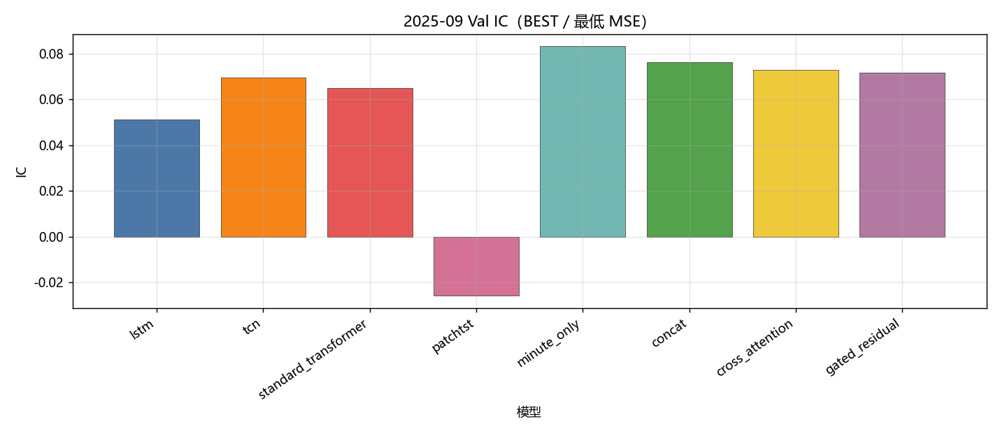

固定颜色: `lstm` `#4C78A8`；`tcn` `#F58518`；`standard_transformer` `#E45756`；`patchtst` `#D37295`；`minute_only` `#72B7B2`；`concat` `#54A24B`；`cross_attention` `#EECA3B`；`gated_residual` `#B279A2`。

### Val RankIC

固定颜色: `lstm` `#4C78A8`；`tcn` `#F58518`；`standard_transformer` `#E45756`；`patchtst` `#D37295`；`minute_only` `#72B7B2`；`concat` `#54A24B`；`cross_attention` `#EECA3B`；`gated_residual` `#B279A2`。

### Val F1@Top30

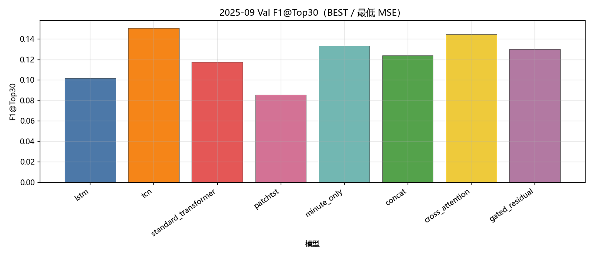

固定颜色: `lstm` `#4C78A8`；`tcn` `#F58518`；`standard_transformer` `#E45756`；`patchtst` `#D37295`；`minute_only` `#72B7B2`；`concat` `#54A24B`；`cross_attention` `#EECA3B`；`gated_residual` `#B279A2`。

### Val MSE

固定颜色: `lstm` `#4C78A8`；`tcn` `#F58518`；`standard_transformer` `#E45756`；`patchtst` `#D37295`；`minute_only` `#72B7B2`；`concat` `#54A24B`；`cross_attention` `#EECA3B`；`gated_residual` `#B279A2`。

### Val IC 各 epoch

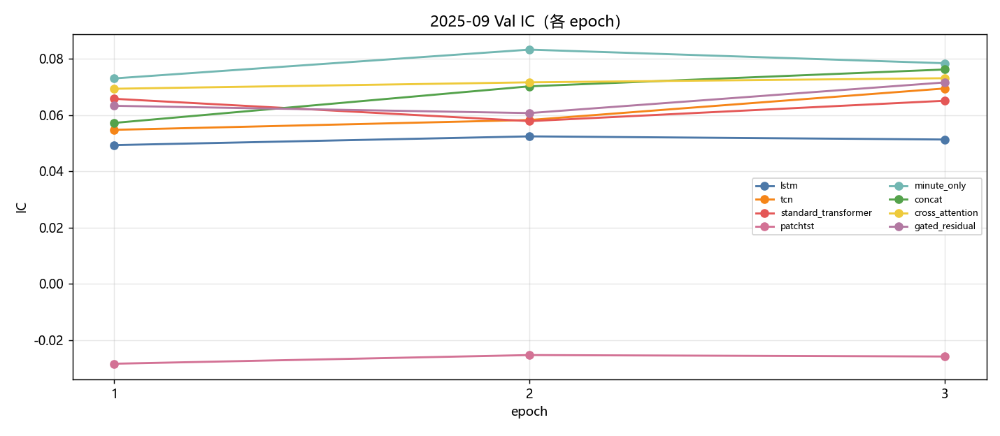

固定颜色: `lstm` `#4C78A8`；`tcn` `#F58518`；`standard_transformer` `#E45756`；`patchtst` `#D37295`；`minute_only` `#72B7B2`；`concat` `#54A24B`；`cross_attention` `#EECA3B`；`gated_residual` `#B279A2`。

### Val RankIC 各 epoch

固定颜色: `lstm` `#4C78A8`；`tcn` `#F58518`；`standard_transformer` `#E45756`；`patchtst` `#D37295`；`minute_only` `#72B7B2`；`concat` `#54A24B`；`cross_attention` `#EECA3B`；`gated_residual` `#B279A2`。

### Val F1@Top30 各 epoch

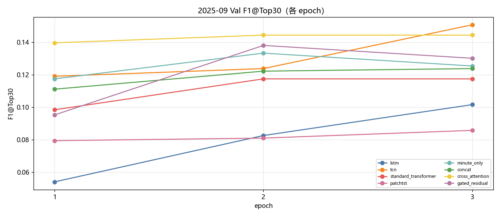

固定颜色: `lstm` `#4C78A8`；`tcn` `#F58518`；`standard_transformer` `#E45756`；`patchtst` `#D37295`；`minute_only` `#72B7B2`；`concat` `#54A24B`；`cross_attention` `#EECA3B`；`gated_residual` `#B279A2`。

### Val MSE 各 epoch

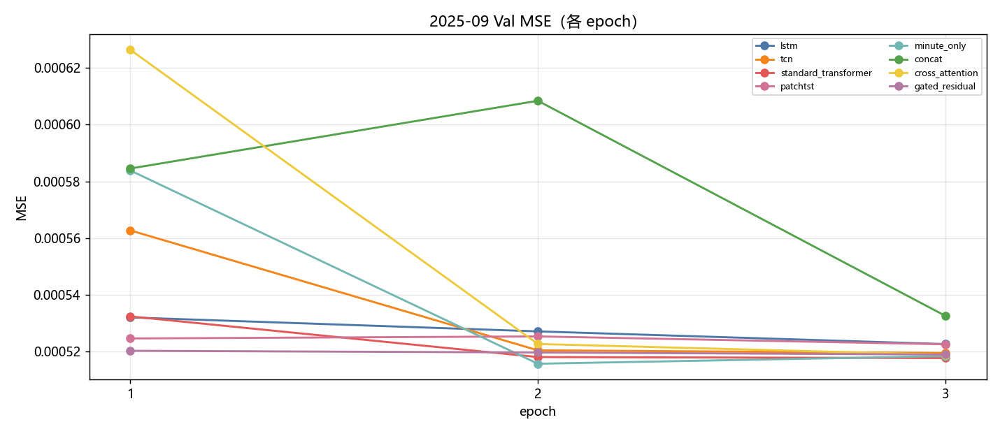

固定颜色: `lstm` `#4C78A8`；`tcn` `#F58518`；`standard_transformer` `#E45756`；`patchtst` `#D37295`；`minute_only` `#72B7B2`；`concat` `#54A24B`；`cross_attention` `#EECA3B`；`gated_residual` `#B279A2`。

### Test IC

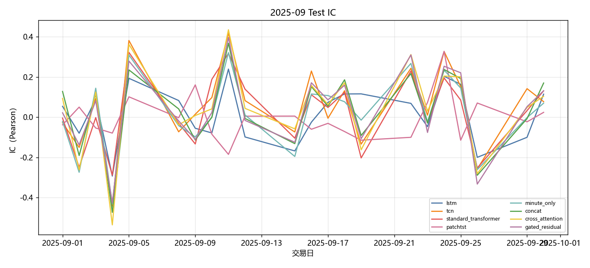

固定颜色: `lstm` `#4C78A8`；`tcn` `#F58518`；`standard_transformer` `#E45756`；`patchtst` `#D37295`；`minute_only` `#72B7B2`；`concat` `#54A24B`；`cross_attention` `#EECA3B`；`gated_residual` `#B279A2`。

### Test RankIC

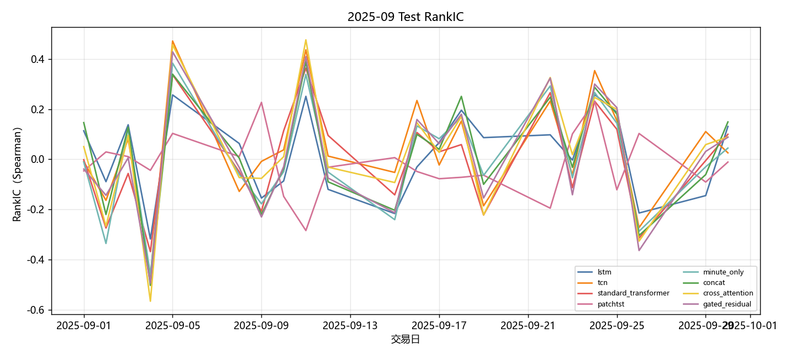

固定颜色: `lstm` `#4C78A8`；`tcn` `#F58518`；`standard_transformer` `#E45756`；`patchtst` `#D37295`；`minute_only` `#72B7B2`；`concat` `#54A24B`；`cross_attention` `#EECA3B`；`gated_residual` `#B279A2`。

### Test F1@Top30

固定颜色: `lstm` `#4C78A8`；`tcn` `#F58518`；`standard_transformer` `#E45756`；`patchtst` `#D37295`；`minute_only` `#72B7B2`；`concat` `#54A24B`；`cross_attention` `#EECA3B`；`gated_residual` `#B279A2`。

### Test Hit@Top30

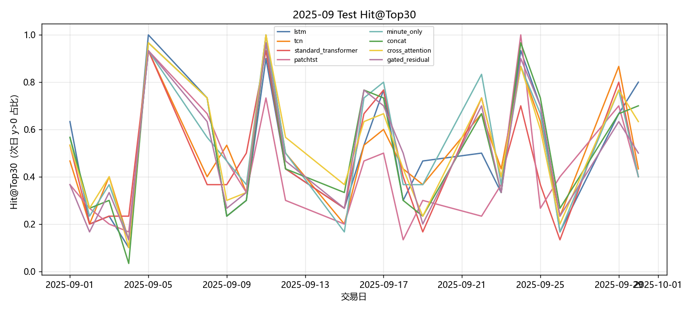

固定颜色: `lstm` `#4C78A8`；`tcn` `#F58518`；`standard_transformer` `#E45756`；`patchtst` `#D37295`；`minute_only` `#72B7B2`；`concat` `#54A24B`；`cross_attention` `#EECA3B`；`gated_residual` `#B279A2`。

## 图对应数据表

- 累计收益 ← `tables/backtest_daily.csv` 的 `net_return` 累加。
- 绩效 / 换手 ← `tables/performance_summary.csv`。
- Val ← `tables/val_best.csv`、`tables/val_epochs.csv`。
- Test 预测 ← `tables/prediction_metrics_mean.csv`。

## 分析

以下只讨论**已经写入数字**的行；单元格为 `-` 的表示该实验尚未跑完，不编造。
来源: month 2025-09。OOS=`sequential_oos_weekly_retrain`，费用=3.0bps，TopK=30。

已有数据的对象: `lstm`, `tcn`, `standard_transformer`, `patchtst`, `minute_only`, `concat`, `cross_attention`, `gated_residual`, `equal_weight`, `mvo`, `max_sharpe`, `risk_parity`, `black_litterman`, `kelly`, `mlp`, `gaussian`, `diffusion`, `standard_fm`, `ssfm`, `ssfm_ppo`, `ssfm_grpo`, `G=8`, `G=16`, `G=32`, `G=64`, `G=128`。
- Val IC 目前最高: `minute_only` = 0.0833。
- Val F1@Top30 目前最高: `tcn` = 0.1508（随机约 0.06）。
- Val MSE 目前最低（入选口径）: `minute_only` = 0.000516。
- Test 日均 IC 目前最高: `tcn` = 0.0564。
- 已回测净值目前最高: `baseline_max_sharpe` 累计净收益 0.2419，Sharpe 4.5629。
- 实验 E（G 候选数，top30）累计净收益最高: `ssfm_G128` = 0.2330（G=8 0.1510；G=16 0.1221；G=32 0.1476；G=64 0.0705；G=128 0.2330）。

## 重点对比：生成方法与强化学习

三种生成式方法都把 primary（`gated_residual`）分数映射成 Top30 组合权重，费用 3bps。差异在生成路径：**Diffusion** 逐步去噪；**Flow Matching（`standard_fm`）** 是普通连续流匹配；**SS-FM** 在流匹配上加入截面分数条件，使采样权重更贴近预测排序。下面只讨论已经写入的 Test 回测数字。

| 方法 | series | total_net_return | ann_return | sharpe | max_drawdown | mean_turnover | n_days |
| --- | --- | --- | --- | --- | --- | --- | --- |
| SS-FM | gen_ssfm | 0.1380 | 3.3943 | 3.0393 | 0.0931 | 0.6238 | 22 |
| Flow Matching | gen_standard_fm | 0.0792 | 1.3934 | 2.4465 | 0.0791 | 0.4932 | 22 |
| Diffusion | gen_diffusion | -0.0137 | -0.1463 | -0.3869 | 0.0812 | 0.6753 | 22 |

累计净收益排序：`SS-FM`(0.1380) > `Flow Matching`(0.0792) > `Diffusion`(-0.0137)。
Sharpe 排序：`SS-FM`(3.0393) > `Flow Matching`(2.4465) > `Diffusion`(-0.3869)。
最大回撤（越小越好）：`Flow Matching`(0.0791) > `Diffusion`(0.0812) > `SS-FM`(0.0931)。
日均换手（越低交易成本压力越小）：`Flow Matching`(0.4932) > `SS-FM`(0.6238) > `Diffusion`(0.6753)。
- `SS-FM / gen_ssfm`：累计净收益 0.1380，年化 3.3943，Sharpe 3.0393，最大回撤 0.0931，日均换手 0.6238，n=22。
- `Flow Matching / gen_standard_fm`：累计净收益 0.0792，年化 1.3934，Sharpe 2.4465，最大回撤 0.0791，日均换手 0.4932，n=22。
- `Diffusion / gen_diffusion`：累计净收益 -0.0137，年化 -0.1463，Sharpe -0.3869，最大回撤 0.0812，日均换手 0.6753，n=22。

本月生成方法里收益最好的是 **SS-FM**（0.1380），最差的是 **Diffusion**（-0.0137）。
SS-FM 用预测分数条件化流匹配，采样分布被拉向 primary 排序。当 primary 当月有效时，这种条件化会把生成权重钉在高分股票上，收益应接近预测骨干；若 primary 失效，条件化反而会放大错误排序。
换手最高的是 Diffusion（0.6753）。生成式每天重采样权重，换手天然高于预测骨干 Top30 等权；比较三种生成方法时，应把换手和费用一起看，不能只看毛收益。

### PPO vs GRPO（纯 SS-FM）

两组强化学习都挂在 **同一套 SS-FM** 上：先冻结/蒸馏 SS-FM 生成器，再用策略梯度改采样。**PPO** 用 clipped surrogate 优化轨迹回报；**GRPO** 对同一状态采一组候选，用组内相对优势，不显式用 critic。对照是不加 RL 的 `gen_ssfm`。

| 方法 | series | total_net_return | ann_return | sharpe | max_drawdown | mean_turnover | n_days |
| --- | --- | --- | --- | --- | --- | --- | --- |
| SS-FM（无 RL） | gen_ssfm | 0.1380 | 3.3943 | 3.0393 | 0.0931 | 0.6238 | 22 |
| PPO + SS-FM | rl_ssfm_ppo | 0.0583 | 0.9138 | 2.0541 | 0.0775 | 0.2694 | 22 |
| GRPO + SS-FM | rl_ssfm_grpo | 0.1007 | 2.0016 | 3.4121 | 0.0776 | 0.2767 | 22 |

- `SS-FM 无 RL`：累计净收益 0.1380，年化 3.3943，Sharpe 3.0393，最大回撤 0.0931，日均换手 0.6238，n=22。
- `PPO + SS-FM`：累计净收益 0.0583，年化 0.9138，Sharpe 2.0541，最大回撤 0.0775，日均换手 0.2694，n=22。
- `GRPO + SS-FM`：累计净收益 0.1007，年化 2.0016，Sharpe 3.4121，最大回撤 0.0776，日均换手 0.2767，n=22。

本月 **GRPO 优于 PPO**（净收益 0.1007 vs 0.0583）。组内相对优势在当月可能提供了更稳的基线，减轻了单条轨迹回报方差；若同时换手更低，说明 GRPO 把采样从高换手的 SS-FM 先验拉回到更稀疏的调仓。
PPO 相对纯 SS-FM 净收益下降 0.0797。可能是策略梯度在短月样本上过拟合 Val 噪声，或 clip 后仍然改动了本已有效的 SS-FM 先验。
GRPO 相对纯 SS-FM 净收益下降 0.0372。组相对优势在截面噪声大时容易把“没那么差”的候选当成正优势，更新方向不稳定。
换手：纯 SS-FM 0.6238，PPO 0.2694，GRPO 0.2767。RL 若换手明显低于生成采样，成本项会解释一部分超额；Top30 等权预测骨干的换手几乎只反映首日建仓，**不能**和生成/RL 的日均换手直接比。

### 收益表现、稳定性与风险成本

预测骨干 Test 日均 IC 最高 `tcn`=0.0564，最低 `patchtst`=-0.0061。IC 一个月大约 20 个交易日，符号翻转很常见，不能单独用 IC 给方法排座次；组合净值、Sharpe、回撤要一起看。
核心序列里净值最好 `gen_ssfm`=0.1380（Sharpe 3.0393，MDD 0.0931），最差 `gen_diffusion`=-0.0137。单月样本短，方法之间差几个百分点也可能是市场路径而不是模型能力；要和下个月对照是否同向。
稳定性：看 Val IC 与 Test IC 是否同向、生成/RL 是否跟预测骨干一起赚或一起亏。若预测 IC 为正但生成亏损，问题更可能在权重采样与换手，而不是分数本身；若预测 IC 已接近 0，生成和 RL 都很难稳定赚钱，这是市场环境而不是某一生成器独有的失败。

## 实验 E：G 候选数

只跑 top30。每个交易日加载当时周五生效的 primary / SS-FM，采 G 条权重后按 pred_utility 选 1 条。与默认 `gen_ssfm`（固定 default_g）不是同一条抽样路径。

| G | 累计净收益 | Sharpe | 最大回撤 | 日均换手 | 天数 |
| --- | --- | --- | --- | --- | --- |
| G=8 | 0.1510 | 3.6092 | 0.0863 | 0.6970 | 22 |
| G=16 | 0.1221 | 2.6037 | 0.0621 | 0.7252 | 22 |
| G=32 | 0.1476 | 3.2760 | 0.0714 | 0.6060 | 22 |
| G=64 | 0.0705 | 1.5687 | 0.0780 | 0.5676 | 22 |
| G=128 | 0.2330 | 4.3044 | 0.0819 | 0.4368 | 22 |

本月网格里累计净收益最好的是 `ssfm_G128`。更大的 G 没有单调变好。
