# 2025-12 Sequential OOS 当月实验分析

- 状态: **当月单元已全部写入**
- OOS: `sequential_oos_weekly_retrain`
- TopK=30，cost_bps=3.0，primary=`lstm`
- 缺测一律 `-`，不补 0、不编造。

## 固定颜色

| 模型 | 颜色 |
| --- | --- |
| lstm | #4C78A8 |

预测骨干日收益曲线用 `pred_<模型>_ew`，颜色与上表相同。

## 实验进度

| unit | model | status |
| --- | --- | --- |
| A 预测 | lstm | 已写入 |
| B 组合/top30 | equal_weight | 已写入 |
| B 组合/top30 | mvo | 已写入 |
| B 组合/top30 | max_sharpe | 已写入 |
| B 组合/top30 | risk_parity | 已写入 |
| B 组合/top30 | black_litterman | 已写入 |
| B 组合/top30 | kelly | 已写入 |
| C 生成/top30 | mlp | 已写入 |
| C 生成/top30 | gaussian | 已写入 |
| C 生成/top30 | diffusion | 已写入 |
| C 生成/top30 | standard_fm | 已写入 |
| C 生成/top30 | ssfm | 已写入 |
| D RL/top30 | ssfm_ppo | 已写入 |
| D RL/top30 | ssfm_grpo | 已写入 |

## 实验设定

- Walk-forward：Train=T-13..T-2，Val=T-1，Test=当月。Test 不进训练、验证、标准化、截面排序、协方差、teacher、生成/RL 更新。
- Sequential OOS：周五收盘重训 **LSTM** + SS-FM + PPO/GRPO，下周一生效，不回写本周决策。
- 主线：**LSTM Alpha Prediction → Portfolio Generation → RL Portfolio Optimization**。
- Prediction / SFT **只跑 LSTM**，不跑 TCN / Transformer / Cross-Attention / gated_residual。
- 生成消融：Gaussian+MLP、MLP、Flow Matching、Diffusion、SS-FM；RL 消融：Pure SS-FM / PPO / GRPO。均挂在同一套 LSTM 分数上。
- 不跑实验 E（G 网格）、不跑 WeakAuction、不跑 Auction / Feature Normalization 消融、不跑 All 股池。
- 标签 y = log(Close_D / Open_D)。TopK=30，cost_bps=3.0。

## Validation（回归 / 排序）

### 各模型 BEST（按该模型 Val MSE 最低的 epoch）

| model | MSE | MAE | IC | RankIC | topk_f1 | topk_precision | topk_recall | dir_acc | dir_f1 | dir_precision | dir_recall | top30_hit_rate | n |
| --- | --- | --- | --- | --- | --- | --- | --- | --- | --- | --- | --- | --- | --- |
| lstm | 0.000460 | 0.014946 | 0.002986 | -0.001213 | 0.038333 | 0.038333 | 0.038333 | 0.537764 | 0.071823 | 0.419186 | 0.035161 | 0.448333 | 20 |

列含义: `MSE`/`MAE` 是 ŷ 对 y 的误差；`IC` 是 Pearson；`RankIC` 是 Spearman；`topk_f1` 是预测 Top30 ∩ 真实收益 Top30 / 30；`dir_acc` 是涨跌符号一致率；`top30_hit_rate` 是入选 30 只里 y>0 的比例。

### 各 epoch

| model | epoch | MSE | MAE | IC | RankIC | topk_f1 | topk_precision | topk_recall | dir_acc | dir_f1 | dir_precision | dir_recall | top30_hit_rate | n |
| --- | --- | --- | --- | --- | --- | --- | --- | --- | --- | --- | --- | --- | --- | --- |
| lstm | 1 | 0.000470 | 0.015312 | 0.002008 | -0.002668 | 0.028333 | 0.028333 | 0.028333 | 0.462016 | 0.592631 | 0.448629 | 0.999818 | 0.428333 | 20 |
| lstm | 2 | 0.000460 | 0.014946 | 0.002986 | -0.001213 | 0.038333 | 0.038333 | 0.038333 | 0.537764 | 0.071823 | 0.419186 | 0.035161 | 0.448333 | 20 |
| lstm | 3 | 0.000466 | 0.014990 | 0.002250 | -0.011754 | 0.061667 | 0.061667 | 0.061667 | 0.538292 | - | - | 0.000000 | 0.448333 | 20 |

## Test 预测指标（日均）

| model | MSE | MAE | IC | RankIC | topk_f1 | topk_precision | topk_recall | dir_acc | dir_f1 | dir_precision | dir_recall | top30_hit_rate | top30_excess | n |
| --- | --- | --- | --- | --- | --- | --- | --- | --- | --- | --- | --- | --- | --- | --- |
| lstm | 0.000465 | 0.015276 | -0.044508 | -0.060563 | - | - | - | - | - | - | - | 0.478261 | -0.001481 | 23 |

## 组合绩效

| model | total_net_return | ann_return | sharpe | max_drawdown | mean_turnover | mean_cost | n_days |
| --- | --- | --- | --- | --- | --- | --- | --- |
| pred_lstm_ew_top30 | 0.0109 | 0.1264 | 0.8128 | 0.0369 | 0.0217 | 0.0000 | 23 |
| pred_lstm_ew | 0.0109 | 0.1264 | 0.8128 | 0.0369 | 0.0217 | 0.0000 | 23 |
| baseline_equal_weight_top30 | 0.0109 | 0.1264 | 0.8128 | 0.0369 | 0.0217 | 0.0000 | 23 |
| baseline_mvo_top30 | 0.0658 | 1.0098 | 2.0048 | 0.0629 | 0.9783 | 0.0003 | 23 |
| baseline_max_sharpe_top30 | 0.1113 | 2.1788 | 4.4691 | 0.0498 | 0.9191 | 0.0003 | 23 |
| baseline_risk_parity_top30 | 0.0107 | 0.1242 | 0.8033 | 0.0371 | 0.0385 | 0.0000 | 23 |
| baseline_black_litterman_top30 | 0.0706 | 1.1109 | 2.1323 | 0.0587 | 0.9783 | 0.0003 | 23 |
| baseline_kelly_top30 | 0.0658 | 1.0098 | 2.0048 | 0.0629 | 0.9783 | 0.0003 | 23 |
| baseline_equal_weight | 0.0109 | 0.1264 | 0.8128 | 0.0369 | 0.0217 | 0.0000 | 23 |
| baseline_mvo | 0.0658 | 1.0098 | 2.0048 | 0.0629 | 0.9783 | 0.0003 | 23 |
| baseline_max_sharpe | 0.1113 | 2.1788 | 4.4691 | 0.0498 | 0.9191 | 0.0003 | 23 |
| baseline_risk_parity | 0.0107 | 0.1242 | 0.8033 | 0.0371 | 0.0385 | 0.0000 | 23 |
| baseline_black_litterman | 0.0706 | 1.1109 | 2.1323 | 0.0587 | 0.9783 | 0.0003 | 23 |
| baseline_kelly | 0.0658 | 1.0098 | 2.0048 | 0.0629 | 0.9783 | 0.0003 | 23 |
| gen_mlp_top30 | 0.0485 | 0.6805 | 3.6968 | 0.0230 | 0.3506 | 0.0001 | 23 |
| gen_gaussian_top30 | 0.0655 | 1.0046 | 3.9501 | 0.0326 | 0.5806 | 0.0002 | 23 |
| gen_diffusion_top30 | -0.0074 | -0.0787 | -0.5292 | 0.0365 | 0.7853 | 0.0002 | 23 |
| gen_standard_fm_top30 | 0.0458 | 0.6335 | 3.2400 | 0.0321 | 0.5147 | 0.0002 | 23 |
| gen_ssfm_top30 | -0.0140 | -0.1432 | -1.3406 | 0.0377 | 0.7861 | 0.0002 | 23 |
| gen_mlp | 0.0485 | 0.6805 | 3.6968 | 0.0230 | 0.3506 | 0.0001 | 23 |
| gen_gaussian | 0.0655 | 1.0046 | 3.9501 | 0.0326 | 0.5806 | 0.0002 | 23 |
| gen_diffusion | -0.0074 | -0.0787 | -0.5292 | 0.0365 | 0.7853 | 0.0002 | 23 |
| gen_standard_fm | 0.0458 | 0.6335 | 3.2400 | 0.0321 | 0.5147 | 0.0002 | 23 |
| gen_ssfm | -0.0140 | -0.1432 | -1.3406 | 0.0377 | 0.7861 | 0.0002 | 23 |
| rl_ssfm_ppo_top30 | -0.0196 | -0.1948 | -1.3739 | 0.0508 | 0.2930 | 0.0001 | 23 |
| rl_ssfm_grpo_top30 | 0.0111 | 0.1284 | 0.8986 | 0.0382 | 0.2893 | 0.0001 | 23 |
| rl_ssfm_ppo | -0.0196 | -0.1948 | -1.3739 | 0.0508 | 0.2930 | 0.0001 | 23 |
| rl_ssfm_grpo | 0.0111 | 0.1284 | 0.8986 | 0.0382 | 0.2893 | 0.0001 | 23 |

## 日均换手

| model | mean_turnover |
| --- | --- |
| pred_lstm_ew_top30 | 0.0217 |
| pred_lstm_ew | 0.0217 |
| baseline_equal_weight_top30 | 0.0217 |
| baseline_mvo_top30 | 0.9783 |
| baseline_max_sharpe_top30 | 0.9191 |
| baseline_risk_parity_top30 | 0.0385 |
| baseline_black_litterman_top30 | 0.9783 |
| baseline_kelly_top30 | 0.9783 |
| baseline_equal_weight | 0.0217 |
| baseline_mvo | 0.9783 |
| baseline_max_sharpe | 0.9191 |
| baseline_risk_parity | 0.0385 |
| baseline_black_litterman | 0.9783 |
| baseline_kelly | 0.9783 |
| gen_mlp_top30 | 0.3506 |
| gen_gaussian_top30 | 0.5806 |
| gen_diffusion_top30 | 0.7853 |
| gen_standard_fm_top30 | 0.5147 |
| gen_ssfm_top30 | 0.7861 |
| gen_mlp | 0.3506 |
| gen_gaussian | 0.5806 |
| gen_diffusion | 0.7853 |
| gen_standard_fm | 0.5147 |
| gen_ssfm | 0.7861 |
| rl_ssfm_ppo_top30 | 0.2930 |
| rl_ssfm_grpo_top30 | 0.2893 |
| rl_ssfm_ppo | 0.2930 |
| rl_ssfm_grpo | 0.2893 |

## 图

曲线来自当月已写入的回测 / Val / Test；某条序列还没有数字时，该图只保留坐标轴和固定颜色。Markdown 预览有时会卡住训练中途的占位图，以 `figures/*.png` 为准。

### 预测骨干累计收益

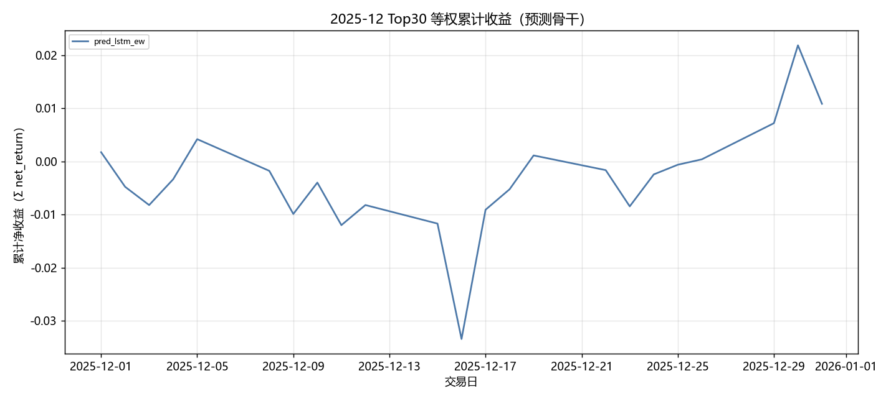

固定颜色: `pred_lstm_ew` `#4C78A8`。

### 组合基线累计收益

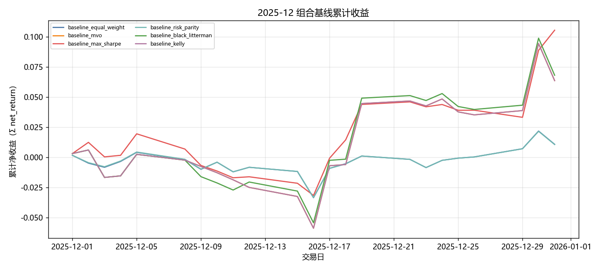

固定颜色: `baseline_equal_weight` `#4C78A8`；`baseline_mvo` `#F58518`；`baseline_max_sharpe` `#E45756`；`baseline_risk_parity` `#72B7B2`；`baseline_black_litterman` `#54A24B`；`baseline_kelly` `#B279A2`。

### 生成模型累计收益

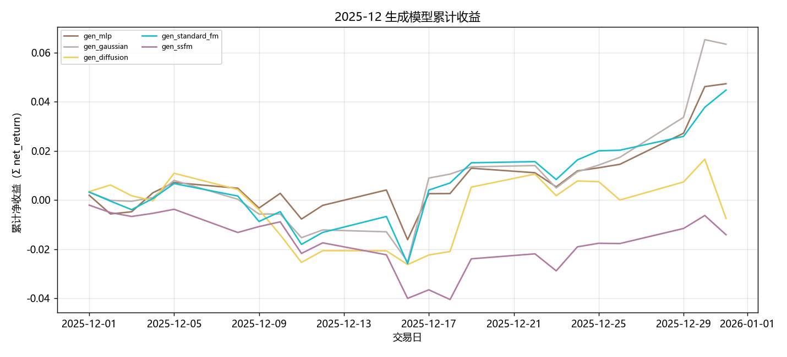

固定颜色: `gen_mlp` `#9D755D`；`gen_gaussian` `#BAB0AC`；`gen_diffusion` `#F2CF5B`；`gen_standard_fm` `#17BECF`；`gen_ssfm` `#B279A2`。

### RL 累计收益

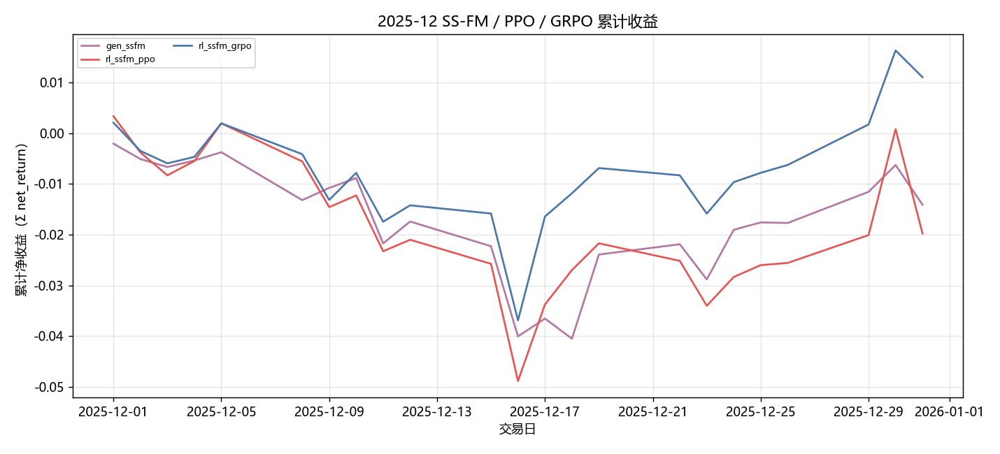

固定颜色: `gen_ssfm` `#B279A2`；`rl_ssfm_ppo` `#E45756`；`rl_ssfm_grpo` `#4C78A8`。

### 日均换手

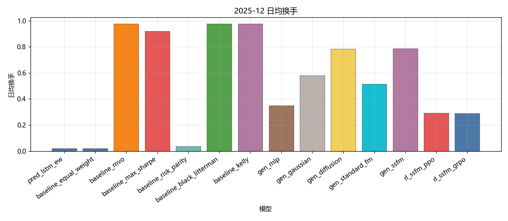

固定颜色: `pred_lstm_ew` `#4C78A8`；`baseline_equal_weight` `#4C78A8`；`baseline_mvo` `#F58518`；`baseline_max_sharpe` `#E45756`；`baseline_risk_parity` `#72B7B2`；`baseline_black_litterman` `#54A24B`；`baseline_kelly` `#B279A2`；`gen_mlp` `#9D755D`；`gen_gaussian` `#BAB0AC`；`gen_diffusion` `#F2CF5B`；`gen_standard_fm` `#17BECF`；`gen_ssfm` `#B279A2`；`rl_ssfm_ppo` `#E45756`；`rl_ssfm_grpo` `#4C78A8`。

### Val IC

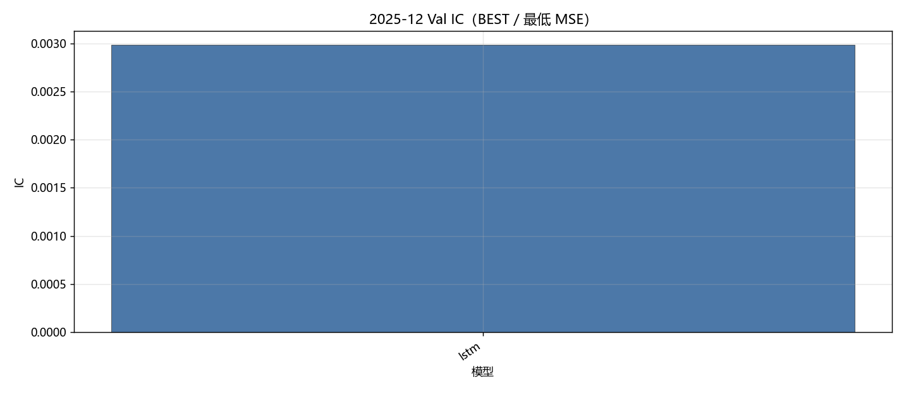

固定颜色: `lstm` `#4C78A8`。

### Val RankIC

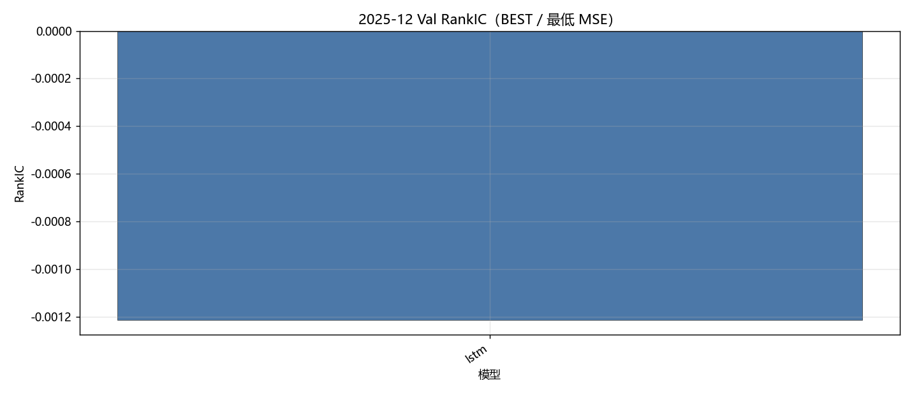

固定颜色: `lstm` `#4C78A8`。

### Val F1@Top30

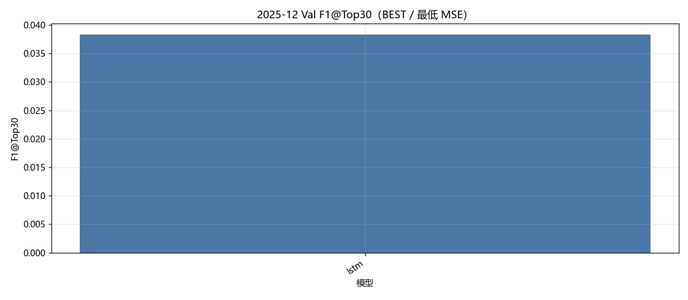

固定颜色: `lstm` `#4C78A8`。

### Val MSE

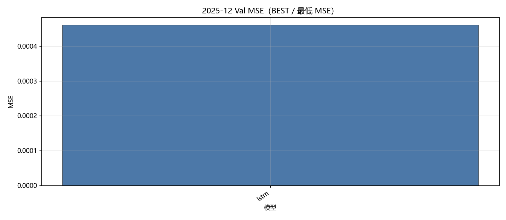

固定颜色: `lstm` `#4C78A8`。

### Val IC 各 epoch

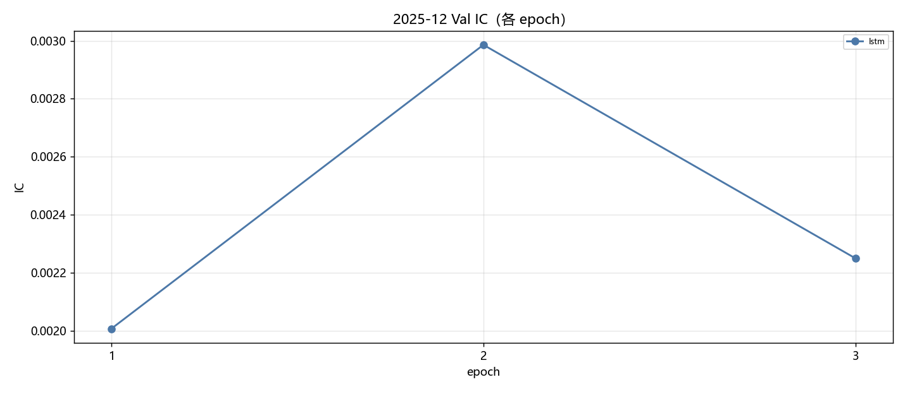

固定颜色: `lstm` `#4C78A8`。

### Val RankIC 各 epoch

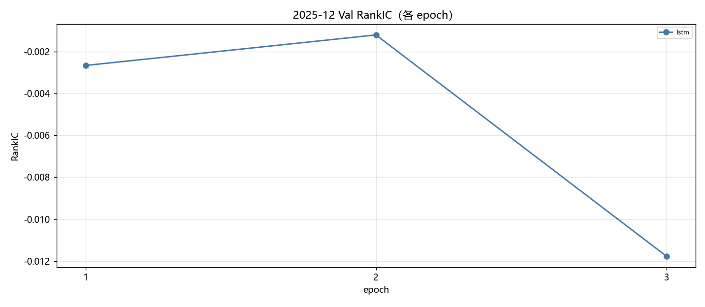

固定颜色: `lstm` `#4C78A8`。

### Val F1@Top30 各 epoch

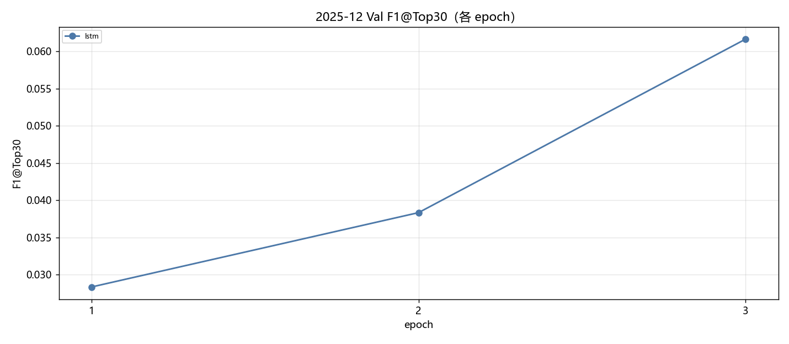

固定颜色: `lstm` `#4C78A8`。

### Val MSE 各 epoch

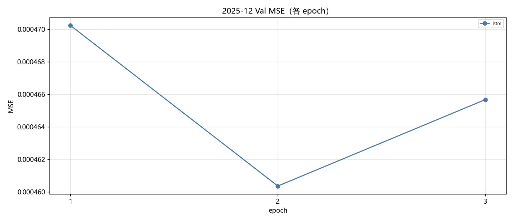

固定颜色: `lstm` `#4C78A8`。

### Test IC

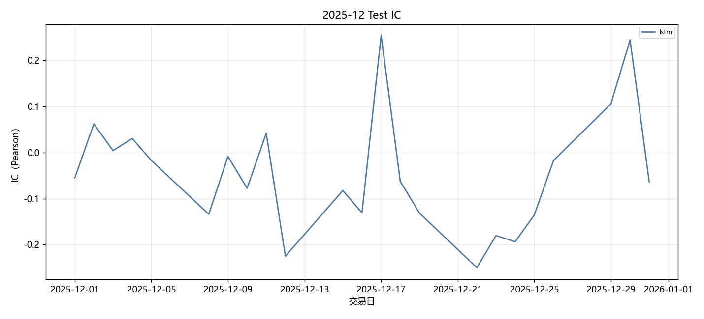

固定颜色: `lstm` `#4C78A8`。

### Test RankIC

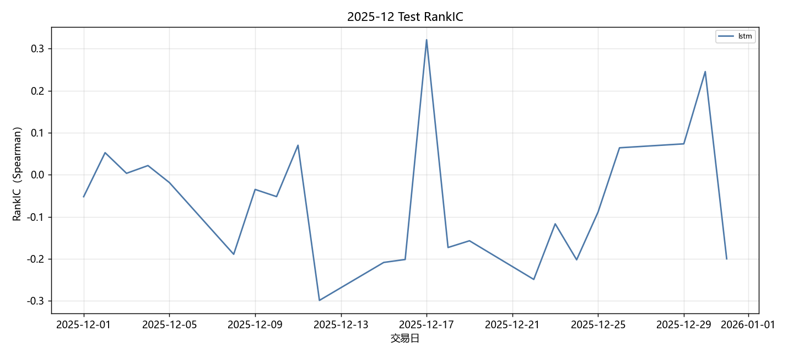

固定颜色: `lstm` `#4C78A8`。

### Test F1@Top30

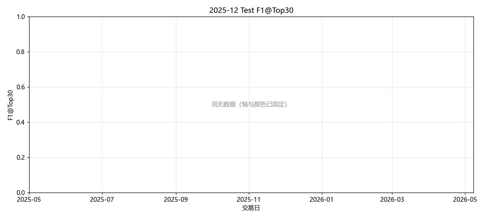

固定颜色: `lstm` `#4C78A8`。

### Test Hit@Top30

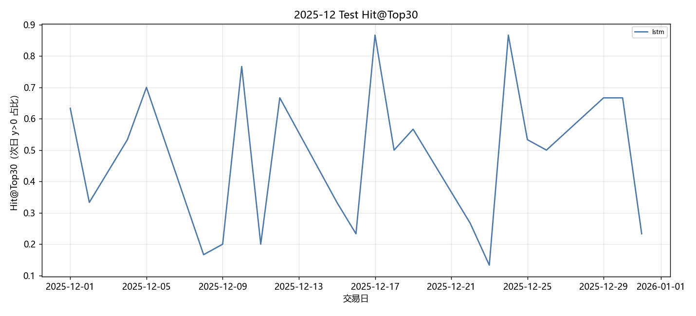

固定颜色: `lstm` `#4C78A8`。

## 图对应数据表

- 累计收益 ← `tables/backtest_daily.csv` 的 `net_return` 累加。
- 绩效 / 换手 ← `tables/performance_summary.csv`。
- Val ← `tables/val_best.csv`、`tables/val_epochs.csv`。
- Test 预测 ← `tables/prediction_metrics_mean.csv`。

## 分析

以下只讨论**已经写入数字**的行；单元格为 `-` 的表示该实验尚未跑完，不编造。
来源: month 2025-12。OOS=`sequential_oos_weekly_retrain`，费用=3.0bps，TopK=30。

已有数据的对象: `lstm`, `equal_weight`, `mvo`, `max_sharpe`, `risk_parity`, `black_litterman`, `kelly`, `mlp`, `gaussian`, `diffusion`, `standard_fm`, `ssfm`, `ssfm_ppo`, `ssfm_grpo`。
- Val IC 目前最高: `lstm` = 0.0030。
- Val F1@Top30 目前最高: `lstm` = 0.0383（随机约 0.06）。
- Val MSE 目前最低（入选口径）: `lstm` = 0.000460。
- Test 日均 IC 目前最高: `lstm` = -0.0445。
- 已回测净值目前最高: `baseline_max_sharpe` 累计净收益 0.1113，Sharpe 4.4691。

## 重点对比：生成方法与强化学习

生成式方法都把同一套 Alpha Prediction 分数映射成 Top30 组合权重，费用 3bps。**Gaussian + MLP** 是随机策略基线（MLP 输出高斯参数后采样）；**MLP** 是确定性映射；**Diffusion** 逐步去噪；**Flow Matching（`standard_fm`）** 是普通连续流匹配；**SS-FM** 在单纯形上做条件流匹配。下面只讨论已经写入的 Test 回测数字。

| 方法 | series | total_net_return | ann_return | sharpe | max_drawdown | mean_turnover | n_days |
| --- | --- | --- | --- | --- | --- | --- | --- |
| Gaussian + MLP | gen_gaussian | 0.0655 | 1.0046 | 3.9501 | 0.0326 | 0.5806 | 23 |
| MLP | gen_mlp | 0.0485 | 0.6805 | 3.6968 | 0.0230 | 0.3506 | 23 |
| SS-FM | gen_ssfm | -0.0140 | -0.1432 | -1.3406 | 0.0377 | 0.7861 | 23 |
| Flow Matching | gen_standard_fm | 0.0458 | 0.6335 | 3.2400 | 0.0321 | 0.5147 | 23 |
| Diffusion | gen_diffusion | -0.0074 | -0.0787 | -0.5292 | 0.0365 | 0.7853 | 23 |

累计净收益排序：`Gaussian + MLP`(0.0655) > `MLP`(0.0485) > `Flow Matching`(0.0458) > `Diffusion`(-0.0074) > `SS-FM`(-0.0140)。
Sharpe 排序：`Gaussian + MLP`(3.9501) > `MLP`(3.6968) > `Flow Matching`(3.2400) > `Diffusion`(-0.5292) > `SS-FM`(-1.3406)。
最大回撤（越小越好）：`MLP`(0.0230) > `Flow Matching`(0.0321) > `Gaussian + MLP`(0.0326) > `Diffusion`(0.0365) > `SS-FM`(0.0377)。
日均换手（越低交易成本压力越小）：`MLP`(0.3506) > `Flow Matching`(0.5147) > `Gaussian + MLP`(0.5806) > `Diffusion`(0.7853) > `SS-FM`(0.7861)。
- `Gaussian + MLP / gen_gaussian`：累计净收益 0.0655，年化 1.0046，Sharpe 3.9501，最大回撤 0.0326，日均换手 0.5806，n=23。
- `MLP / gen_mlp`：累计净收益 0.0485，年化 0.6805，Sharpe 3.6968，最大回撤 0.0230，日均换手 0.3506，n=23。
- `SS-FM / gen_ssfm`：累计净收益 -0.0140，年化 -0.1432，Sharpe -1.3406，最大回撤 0.0377，日均换手 0.7861，n=23。
- `Flow Matching / gen_standard_fm`：累计净收益 0.0458，年化 0.6335，Sharpe 3.2400，最大回撤 0.0321，日均换手 0.5147，n=23。
- `Diffusion / gen_diffusion`：累计净收益 -0.0074，年化 -0.0787，Sharpe -0.5292，最大回撤 0.0365，日均换手 0.7853，n=23。

本月生成方法里收益最好的是 **Gaussian + MLP**（0.0655），最差的是 **SS-FM**（-0.0140）。
纯 SS-FM 最差时，常见原因是条件化过强、换手偏高，或 G 条候选里按 pred_utility 选出的那条并不对应真实收益。
换手最高的是 SS-FM（0.7861）。生成式每天重采样权重，换手天然高于预测骨干 Top30 等权；比较三种生成方法时，应把换手和费用一起看，不能只看毛收益。

### PPO vs GRPO（纯 SS-FM）

两组强化学习都挂在 **同一套 SS-FM** 上：先冻结/蒸馏 SS-FM 生成器，再用策略梯度改采样。**PPO** 用 clipped surrogate 优化轨迹回报；**GRPO** 对同一状态采一组候选，用组内相对优势，不显式用 critic。对照是不加 RL 的 `gen_ssfm`。

| 方法 | series | total_net_return | ann_return | sharpe | max_drawdown | mean_turnover | n_days |
| --- | --- | --- | --- | --- | --- | --- | --- |
| SS-FM（无 RL） | gen_ssfm | -0.0140 | -0.1432 | -1.3406 | 0.0377 | 0.7861 | 23 |
| PPO + SS-FM | rl_ssfm_ppo | -0.0196 | -0.1948 | -1.3739 | 0.0508 | 0.2930 | 23 |
| GRPO + SS-FM | rl_ssfm_grpo | 0.0111 | 0.1284 | 0.8986 | 0.0382 | 0.2893 | 23 |

- `SS-FM 无 RL`：累计净收益 -0.0140，年化 -0.1432，Sharpe -1.3406，最大回撤 0.0377，日均换手 0.7861，n=23。
- `PPO + SS-FM`：累计净收益 -0.0196，年化 -0.1948，Sharpe -1.3739，最大回撤 0.0508，日均换手 0.2930，n=23。
- `GRPO + SS-FM`：累计净收益 0.0111，年化 0.1284，Sharpe 0.8986，最大回撤 0.0382，日均换手 0.2893，n=23。

本月 **GRPO 优于 PPO**（净收益 0.0111 vs -0.0196）。组内相对优势在当月可能提供了更稳的基线，减轻了单条轨迹回报方差；若同时换手更低，说明 GRPO 把采样从高换手的 SS-FM 先验拉回到更稀疏的调仓。
PPO 相对纯 SS-FM 净收益下降 0.0056。可能是策略梯度在短月样本上过拟合 Val 噪声，或 clip 后仍然改动了本已有效的 SS-FM 先验。
GRPO 相对纯 SS-FM 净收益提升 0.0251。
换手：纯 SS-FM 0.7861，PPO 0.2930，GRPO 0.2893。RL 若换手明显低于生成采样，成本项会解释一部分超额；Top30 等权预测骨干的换手几乎只反映首日建仓，**不能**和生成/RL 的日均换手直接比。

### 收益表现、稳定性与风险成本

预测骨干 Test 日均 IC 最高 `lstm`=-0.0445，最低 `lstm`=-0.0445。IC 一个月大约 20 个交易日，符号翻转很常见，不能单独用 IC 给方法排座次；组合净值、Sharpe、回撤要一起看。
核心序列里净值最好 `gen_standard_fm`=0.0458（Sharpe 3.2400，MDD 0.0321），最差 `rl_ssfm_ppo`=-0.0196。单月样本短，方法之间差几个百分点也可能是市场路径而不是模型能力；要和下个月对照是否同向。
稳定性：看 Val IC 与 Test IC 是否同向、生成/RL 是否跟预测骨干一起赚或一起亏。若预测 IC 为正但生成亏损，问题更可能在权重采样与换手，而不是分数本身；若预测 IC 已接近 0，生成和 RL 都很难稳定赚钱，这是市场环境而不是某一生成器独有的失败。

