# 2025-12 Sequential OOS 当月实验分析

- 状态: **占位（轴和表头已铺齐）**
- OOS: `sequential_oos_weekly_retrain`
- TopK=30，cost_bps=3.0，primary=`gated_residual`
- 缺测一律 `-`，不补 0、不编造。

## 固定颜色

| 模型 | 颜色 |
| --- | --- |
| lstm | #4C78A8 |
| tcn | #F58518 |
| standard_transformer | #E45756 |
| patchtst | #D37295 |
| minute_only | #72B7B2 |
| concat | #54A24B |
| cross_attention | #EECA3B |
| gated_residual | #B279A2 |

预测骨干日收益曲线用 `pred_<模型>_ew`，颜色与上表相同。

## 实验进度

| unit | model | status |
| --- | --- | --- |
| A 预测 | lstm | - |
| A 预测 | tcn | - |
| A 预测 | standard_transformer | - |
| A 预测 | patchtst | - |
| A 预测 | minute_only | - |
| A 预测 | concat | - |
| A 预测 | cross_attention | - |
| A 预测 | gated_residual | - |
| B 组合/top30 | equal_weight | - |
| B 组合/top30 | mvo | - |
| B 组合/top30 | max_sharpe | - |
| B 组合/top30 | risk_parity | - |
| B 组合/top30 | black_litterman | - |
| B 组合/top30 | kelly | - |
| C 生成/top30 | mlp | - |
| C 生成/top30 | gaussian | - |
| C 生成/top30 | diffusion | - |
| C 生成/top30 | standard_fm | - |
| C 生成/top30 | ssfm | - |
| D RL/top30 | ssfm_ppo | - |
| D RL/top30 | ssfm_grpo | - |
| E G/top30 | G=8 | - |
| E G/top30 | G=16 | - |
| E G/top30 | G=32 | - |
| E G/top30 | G=64 | - |
| E G/top30 | G=128 | - |
| B 组合/all | equal_weight | - |
| B 组合/all | mvo | - |
| B 组合/all | max_sharpe | - |
| B 组合/all | risk_parity | - |
| B 组合/all | black_litterman | - |
| B 组合/all | kelly | - |
| C 生成/all | mlp | - |
| C 生成/all | gaussian | - |
| C 生成/all | diffusion | - |
| C 生成/all | standard_fm | - |
| C 生成/all | ssfm | - |
| D RL/all | ssfm_ppo | - |
| D RL/all | ssfm_grpo | - |
| E G/all | G=8 | - |
| E G/all | G=16 | - |
| E G/all | G=32 | - |
| E G/all | G=64 | - |
| E G/all | G=128 | - |

## 实验设定

- Walk-forward：Train=T-13..T-2，Val=T-1，Test=当月。
- Sequential OOS：周五收盘重训 primary + SS-FM + PPO/GRPO，下周一生效，不回写本周决策。
- 标签 y = log(Close_D / Open_D)。高严重泄漏 FAIL 的月份不进 final_summary。

## Validation（回归 / 排序）

### 各模型 BEST（按该模型 Val MSE 最低的 epoch）

| model | MSE | MAE | IC | RankIC | topk_f1 | topk_precision | topk_recall | dir_acc | dir_f1 | dir_precision | dir_recall | top30_hit_rate | n |
| --- | --- | --- | --- | --- | --- | --- | --- | --- | --- | --- | --- | --- | --- |
| lstm | - | - | - | - | - | - | - | - | - | - | - | - | - |
| tcn | - | - | - | - | - | - | - | - | - | - | - | - | - |
| standard_transformer | - | - | - | - | - | - | - | - | - | - | - | - | - |
| patchtst | - | - | - | - | - | - | - | - | - | - | - | - | - |
| minute_only | - | - | - | - | - | - | - | - | - | - | - | - | - |
| concat | - | - | - | - | - | - | - | - | - | - | - | - | - |
| cross_attention | - | - | - | - | - | - | - | - | - | - | - | - | - |
| gated_residual | - | - | - | - | - | - | - | - | - | - | - | - | - |

列含义: `MSE`/`MAE` 是 ŷ 对 y 的误差；`IC` 是 Pearson；`RankIC` 是 Spearman；`topk_f1` 是预测 Top30 ∩ 真实收益 Top30 / 30；`dir_acc` 是涨跌符号一致率；`top30_hit_rate` 是入选 30 只里 y>0 的比例。

### 各 epoch

| model | epoch | MSE | MAE | IC | RankIC | topk_f1 | topk_precision | topk_recall | dir_acc | dir_f1 | dir_precision | dir_recall | top30_hit_rate | n |
| --- | --- | --- | --- | --- | --- | --- | --- | --- | --- | --- | --- | --- | --- | --- |
| lstm | 1 | - | - | - | - | - | - | - | - | - | - | - | - | - |
| lstm | 2 | - | - | - | - | - | - | - | - | - | - | - | - | - |
| lstm | 3 | - | - | - | - | - | - | - | - | - | - | - | - | - |
| tcn | 1 | - | - | - | - | - | - | - | - | - | - | - | - | - |
| tcn | 2 | - | - | - | - | - | - | - | - | - | - | - | - | - |
| tcn | 3 | - | - | - | - | - | - | - | - | - | - | - | - | - |
| standard_transformer | 1 | - | - | - | - | - | - | - | - | - | - | - | - | - |
| standard_transformer | 2 | - | - | - | - | - | - | - | - | - | - | - | - | - |
| standard_transformer | 3 | - | - | - | - | - | - | - | - | - | - | - | - | - |
| patchtst | 1 | - | - | - | - | - | - | - | - | - | - | - | - | - |
| patchtst | 2 | - | - | - | - | - | - | - | - | - | - | - | - | - |
| patchtst | 3 | - | - | - | - | - | - | - | - | - | - | - | - | - |
| minute_only | 1 | - | - | - | - | - | - | - | - | - | - | - | - | - |
| minute_only | 2 | - | - | - | - | - | - | - | - | - | - | - | - | - |
| minute_only | 3 | - | - | - | - | - | - | - | - | - | - | - | - | - |
| concat | 1 | - | - | - | - | - | - | - | - | - | - | - | - | - |
| concat | 2 | - | - | - | - | - | - | - | - | - | - | - | - | - |
| concat | 3 | - | - | - | - | - | - | - | - | - | - | - | - | - |
| cross_attention | 1 | - | - | - | - | - | - | - | - | - | - | - | - | - |
| cross_attention | 2 | - | - | - | - | - | - | - | - | - | - | - | - | - |
| cross_attention | 3 | - | - | - | - | - | - | - | - | - | - | - | - | - |
| gated_residual | 1 | - | - | - | - | - | - | - | - | - | - | - | - | - |
| gated_residual | 2 | - | - | - | - | - | - | - | - | - | - | - | - | - |
| gated_residual | 3 | - | - | - | - | - | - | - | - | - | - | - | - | - |

## Test 预测指标（日均）

| model | MSE | MAE | IC | RankIC | topk_f1 | topk_precision | topk_recall | dir_acc | dir_f1 | dir_precision | dir_recall | top30_hit_rate | top30_excess | n |
| --- | --- | --- | --- | --- | --- | --- | --- | --- | --- | --- | --- | --- | --- | --- |
| lstm | - | - | - | - | - | - | - | - | - | - | - | - | - | - |
| tcn | - | - | - | - | - | - | - | - | - | - | - | - | - | - |
| standard_transformer | - | - | - | - | - | - | - | - | - | - | - | - | - | - |
| patchtst | - | - | - | - | - | - | - | - | - | - | - | - | - | - |
| minute_only | - | - | - | - | - | - | - | - | - | - | - | - | - | - |
| concat | - | - | - | - | - | - | - | - | - | - | - | - | - | - |
| cross_attention | - | - | - | - | - | - | - | - | - | - | - | - | - | - |
| gated_residual | - | - | - | - | - | - | - | - | - | - | - | - | - | - |

## 组合绩效

| model | total_net_return | ann_return | sharpe | max_drawdown | mean_turnover | mean_cost | n_days |
| --- | --- | --- | --- | --- | --- | --- | --- |
| pred_lstm_ew_top30 | - | - | - | - | - | - | - |
| pred_tcn_ew_top30 | - | - | - | - | - | - | - |
| pred_standard_transformer_ew_top30 | - | - | - | - | - | - | - |
| pred_patchtst_ew_top30 | - | - | - | - | - | - | - |
| pred_minute_only_ew_top30 | - | - | - | - | - | - | - |
| pred_concat_ew_top30 | - | - | - | - | - | - | - |
| pred_cross_attention_ew_top30 | - | - | - | - | - | - | - |
| pred_gated_residual_ew_top30 | - | - | - | - | - | - | - |
| pred_lstm_ew | - | - | - | - | - | - | - |
| pred_tcn_ew | - | - | - | - | - | - | - |
| pred_standard_transformer_ew | - | - | - | - | - | - | - |
| pred_patchtst_ew | - | - | - | - | - | - | - |
| pred_minute_only_ew | - | - | - | - | - | - | - |
| pred_concat_ew | - | - | - | - | - | - | - |
| pred_cross_attention_ew | - | - | - | - | - | - | - |
| pred_gated_residual_ew | - | - | - | - | - | - | - |
| pred_lstm_softmax_all | - | - | - | - | - | - | - |
| pred_tcn_softmax_all | - | - | - | - | - | - | - |
| pred_standard_transformer_softmax_all | - | - | - | - | - | - | - |
| pred_patchtst_softmax_all | - | - | - | - | - | - | - |
| pred_minute_only_softmax_all | - | - | - | - | - | - | - |
| pred_concat_softmax_all | - | - | - | - | - | - | - |
| pred_cross_attention_softmax_all | - | - | - | - | - | - | - |
| pred_gated_residual_softmax_all | - | - | - | - | - | - | - |
| universe_ew_all | - | - | - | - | - | - | - |
| baseline_equal_weight_top30 | - | - | - | - | - | - | - |
| baseline_mvo_top30 | - | - | - | - | - | - | - |
| baseline_max_sharpe_top30 | - | - | - | - | - | - | - |
| baseline_risk_parity_top30 | - | - | - | - | - | - | - |
| baseline_black_litterman_top30 | - | - | - | - | - | - | - |
| baseline_kelly_top30 | - | - | - | - | - | - | - |
| baseline_equal_weight_all | - | - | - | - | - | - | - |
| baseline_mvo_all | - | - | - | - | - | - | - |
| baseline_max_sharpe_all | - | - | - | - | - | - | - |
| baseline_risk_parity_all | - | - | - | - | - | - | - |
| baseline_black_litterman_all | - | - | - | - | - | - | - |
| baseline_kelly_all | - | - | - | - | - | - | - |
| baseline_equal_weight | - | - | - | - | - | - | - |
| baseline_mvo | - | - | - | - | - | - | - |
| baseline_max_sharpe | - | - | - | - | - | - | - |
| baseline_risk_parity | - | - | - | - | - | - | - |
| baseline_black_litterman | - | - | - | - | - | - | - |
| baseline_kelly | - | - | - | - | - | - | - |
| baseline_score_softmax_all | - | - | - | - | - | - | - |
| gen_mlp_top30 | - | - | - | - | - | - | - |
| gen_gaussian_top30 | - | - | - | - | - | - | - |
| gen_diffusion_top30 | - | - | - | - | - | - | - |
| gen_standard_fm_top30 | - | - | - | - | - | - | - |
| gen_ssfm_top30 | - | - | - | - | - | - | - |
| gen_mlp_all | - | - | - | - | - | - | - |
| gen_gaussian_all | - | - | - | - | - | - | - |
| gen_diffusion_all | - | - | - | - | - | - | - |
| gen_standard_fm_all | - | - | - | - | - | - | - |
| gen_ssfm_all | - | - | - | - | - | - | - |
| gen_mlp | - | - | - | - | - | - | - |
| gen_gaussian | - | - | - | - | - | - | - |
| gen_diffusion | - | - | - | - | - | - | - |
| gen_standard_fm | - | - | - | - | - | - | - |
| gen_ssfm | - | - | - | - | - | - | - |
| rl_ssfm_ppo_top30 | - | - | - | - | - | - | - |
| rl_ssfm_grpo_top30 | - | - | - | - | - | - | - |
| rl_ssfm_ppo_all | - | - | - | - | - | - | - |
| rl_ssfm_grpo_all | - | - | - | - | - | - | - |
| rl_ssfm_ppo | - | - | - | - | - | - | - |
| rl_ssfm_grpo | - | - | - | - | - | - | - |
| ssfm_G8_top30 | - | - | - | - | - | - | - |
| ssfm_G16_top30 | - | - | - | - | - | - | - |
| ssfm_G32_top30 | - | - | - | - | - | - | - |
| ssfm_G64_top30 | - | - | - | - | - | - | - |
| ssfm_G128_top30 | - | - | - | - | - | - | - |
| ssfm_G8_all | - | - | - | - | - | - | - |
| ssfm_G16_all | - | - | - | - | - | - | - |
| ssfm_G32_all | - | - | - | - | - | - | - |
| ssfm_G64_all | - | - | - | - | - | - | - |
| ssfm_G128_all | - | - | - | - | - | - | - |
| ssfm_G8 | - | - | - | - | - | - | - |
| ssfm_G16 | - | - | - | - | - | - | - |
| ssfm_G32 | - | - | - | - | - | - | - |
| ssfm_G64 | - | - | - | - | - | - | - |
| ssfm_G128 | - | - | - | - | - | - | - |

## 日均换手

| model | mean_turnover |
| --- | --- |
| pred_lstm_ew_top30 | - |
| pred_tcn_ew_top30 | - |
| pred_standard_transformer_ew_top30 | - |
| pred_patchtst_ew_top30 | - |
| pred_minute_only_ew_top30 | - |
| pred_concat_ew_top30 | - |
| pred_cross_attention_ew_top30 | - |
| pred_gated_residual_ew_top30 | - |
| pred_lstm_ew | - |
| pred_tcn_ew | - |
| pred_standard_transformer_ew | - |
| pred_patchtst_ew | - |
| pred_minute_only_ew | - |
| pred_concat_ew | - |
| pred_cross_attention_ew | - |
| pred_gated_residual_ew | - |
| pred_lstm_softmax_all | - |
| pred_tcn_softmax_all | - |
| pred_standard_transformer_softmax_all | - |
| pred_patchtst_softmax_all | - |
| pred_minute_only_softmax_all | - |
| pred_concat_softmax_all | - |
| pred_cross_attention_softmax_all | - |
| pred_gated_residual_softmax_all | - |
| universe_ew_all | - |
| baseline_equal_weight_top30 | - |
| baseline_mvo_top30 | - |
| baseline_max_sharpe_top30 | - |
| baseline_risk_parity_top30 | - |
| baseline_black_litterman_top30 | - |
| baseline_kelly_top30 | - |
| baseline_equal_weight_all | - |
| baseline_mvo_all | - |
| baseline_max_sharpe_all | - |
| baseline_risk_parity_all | - |
| baseline_black_litterman_all | - |
| baseline_kelly_all | - |
| baseline_equal_weight | - |
| baseline_mvo | - |
| baseline_max_sharpe | - |
| baseline_risk_parity | - |
| baseline_black_litterman | - |
| baseline_kelly | - |
| baseline_score_softmax_all | - |
| gen_mlp_top30 | - |
| gen_gaussian_top30 | - |
| gen_diffusion_top30 | - |
| gen_standard_fm_top30 | - |
| gen_ssfm_top30 | - |
| gen_mlp_all | - |
| gen_gaussian_all | - |
| gen_diffusion_all | - |
| gen_standard_fm_all | - |
| gen_ssfm_all | - |
| gen_mlp | - |
| gen_gaussian | - |
| gen_diffusion | - |
| gen_standard_fm | - |
| gen_ssfm | - |
| rl_ssfm_ppo_top30 | - |
| rl_ssfm_grpo_top30 | - |
| rl_ssfm_ppo_all | - |
| rl_ssfm_grpo_all | - |
| rl_ssfm_ppo | - |
| rl_ssfm_grpo | - |
| ssfm_G8_top30 | - |
| ssfm_G16_top30 | - |
| ssfm_G32_top30 | - |
| ssfm_G64_top30 | - |
| ssfm_G128_top30 | - |
| ssfm_G8_all | - |
| ssfm_G16_all | - |
| ssfm_G32_all | - |
| ssfm_G64_all | - |
| ssfm_G128_all | - |
| ssfm_G8 | - |
| ssfm_G16 | - |
| ssfm_G32 | - |
| ssfm_G64 | - |
| ssfm_G128 | - |

## 图（颜色已固定，无数据时只画轴）

### 预测骨干累计收益

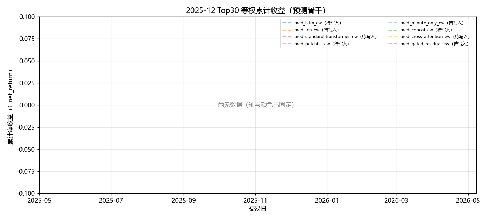

固定颜色: `pred_lstm_ew` `#4C78A8`；`pred_tcn_ew` `#F58518`；`pred_standard_transformer_ew` `#E45756`；`pred_patchtst_ew` `#D37295`；`pred_minute_only_ew` `#72B7B2`；`pred_concat_ew` `#54A24B`；`pred_cross_attention_ew` `#EECA3B`；`pred_gated_residual_ew` `#B279A2`。

### 组合基线累计收益

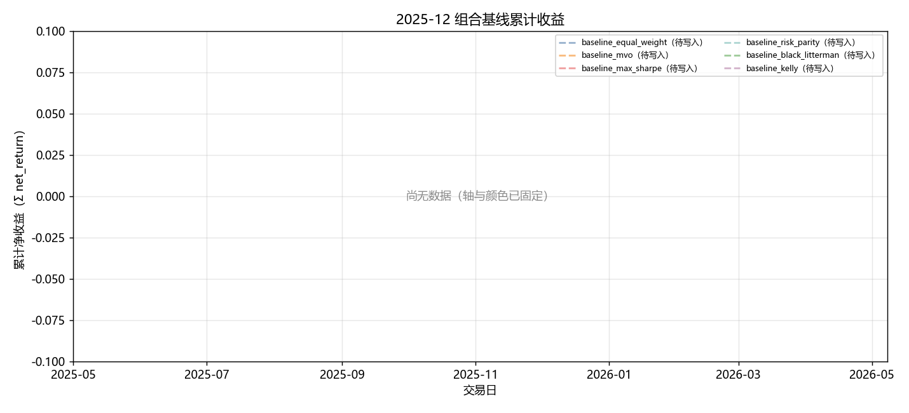

固定颜色: `baseline_equal_weight` `#4C78A8`；`baseline_mvo` `#F58518`；`baseline_max_sharpe` `#E45756`；`baseline_risk_parity` `#72B7B2`；`baseline_black_litterman` `#54A24B`；`baseline_kelly` `#B279A2`。

### 生成模型累计收益

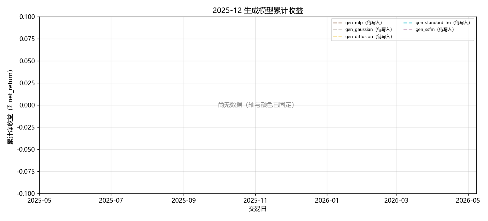

固定颜色: `gen_mlp` `#9D755D`；`gen_gaussian` `#BAB0AC`；`gen_diffusion` `#F2CF5B`；`gen_standard_fm` `#17BECF`；`gen_ssfm` `#B279A2`。

### RL 累计收益

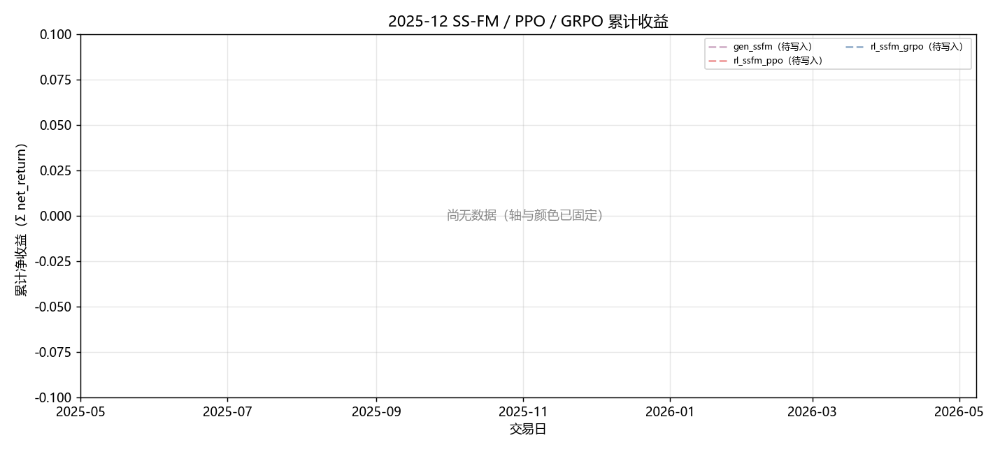

固定颜色: `gen_ssfm` `#B279A2`；`rl_ssfm_ppo` `#E45756`；`rl_ssfm_grpo` `#4C78A8`。

### G 曲线累计收益

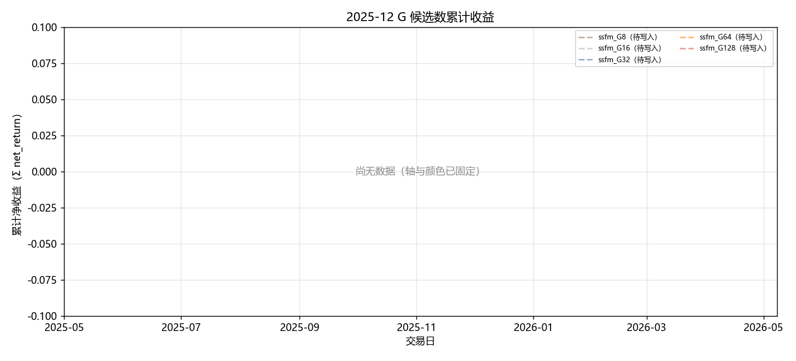

固定颜色: `ssfm_G8` `#9D755D`；`ssfm_G16` `#BAB0AC`；`ssfm_G32` `#4C78A8`；`ssfm_G64` `#F58518`；`ssfm_G128` `#E45756`。

### 日均换手

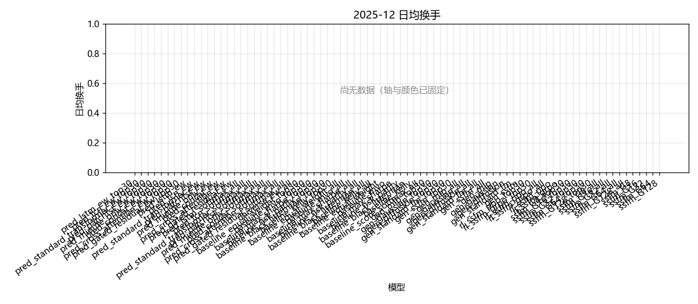

固定颜色: `pred_lstm_ew_top30` `#4C78A8`；`pred_tcn_ew_top30` `#F58518`；`pred_standard_transformer_ew_top30` `#E45756`；`pred_patchtst_ew_top30` `#D37295`；`pred_minute_only_ew_top30` `#72B7B2`；`pred_concat_ew_top30` `#54A24B`；`pred_cross_attention_ew_top30` `#EECA3B`；`pred_gated_residual_ew_top30` `#B279A2`；`pred_lstm_ew` `#4C78A8`；`pred_tcn_ew` `#F58518`；`pred_standard_transformer_ew` `#E45756`；`pred_patchtst_ew` `#D37295`；`pred_minute_only_ew` `#72B7B2`；`pred_concat_ew` `#54A24B`；`pred_cross_attention_ew` `#EECA3B`；`pred_gated_residual_ew` `#B279A2`；`pred_lstm_softmax_all` `#7F7F7F`；`pred_tcn_softmax_all` `#7F7F7F`；`pred_standard_transformer_softmax_all` `#7F7F7F`；`pred_patchtst_softmax_all` `#7F7F7F`；`pred_minute_only_softmax_all` `#7F7F7F`；`pred_concat_softmax_all` `#7F7F7F`；`pred_cross_attention_softmax_all` `#7F7F7F`；`pred_gated_residual_softmax_all` `#7F7F7F`；`universe_ew_all` `#7F7F7F`；`baseline_equal_weight_top30` `#4C78A8`；`baseline_mvo_top30` `#F58518`；`baseline_max_sharpe_top30` `#E45756`；`baseline_risk_parity_top30` `#72B7B2`；`baseline_black_litterman_top30` `#54A24B`；`baseline_kelly_top30` `#B279A2`；`baseline_equal_weight_all` `#4C78A8`；`baseline_mvo_all` `#F58518`；`baseline_max_sharpe_all` `#E45756`；`baseline_risk_parity_all` `#72B7B2`；`baseline_black_litterman_all` `#54A24B`；`baseline_kelly_all` `#B279A2`；`baseline_equal_weight` `#4C78A8`；`baseline_mvo` `#F58518`；`baseline_max_sharpe` `#E45756`；`baseline_risk_parity` `#72B7B2`；`baseline_black_litterman` `#54A24B`；`baseline_kelly` `#B279A2`；`baseline_score_softmax_all` `#7F7F7F`；`gen_mlp_top30` `#9D755D`；`gen_gaussian_top30` `#BAB0AC`；`gen_diffusion_top30` `#F2CF5B`；`gen_standard_fm_top30` `#17BECF`；`gen_ssfm_top30` `#B279A2`；`gen_mlp_all` `#9D755D`；`gen_gaussian_all` `#BAB0AC`；`gen_diffusion_all` `#F2CF5B`；`gen_standard_fm_all` `#17BECF`；`gen_ssfm_all` `#B279A2`；`gen_mlp` `#9D755D`；`gen_gaussian` `#BAB0AC`；`gen_diffusion` `#F2CF5B`；`gen_standard_fm` `#17BECF`；`gen_ssfm` `#B279A2`；`rl_ssfm_ppo_top30` `#E45756`；`rl_ssfm_grpo_top30` `#4C78A8`；`rl_ssfm_ppo_all` `#E45756`；`rl_ssfm_grpo_all` `#4C78A8`；`rl_ssfm_ppo` `#E45756`；`rl_ssfm_grpo` `#4C78A8`；`ssfm_G8_top30` `#9D755D`；`ssfm_G16_top30` `#BAB0AC`；`ssfm_G32_top30` `#4C78A8`；`ssfm_G64_top30` `#F58518`；`ssfm_G128_top30` `#E45756`；`ssfm_G8_all` `#9D755D`；`ssfm_G16_all` `#BAB0AC`；`ssfm_G32_all` `#4C78A8`；`ssfm_G64_all` `#F58518`；`ssfm_G128_all` `#E45756`；`ssfm_G8` `#9D755D`；`ssfm_G16` `#BAB0AC`；`ssfm_G32` `#4C78A8`；`ssfm_G64` `#F58518`；`ssfm_G128` `#E45756`。

### Val IC

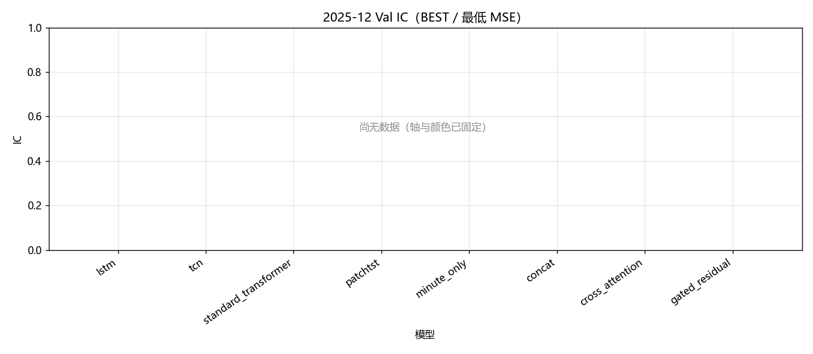

固定颜色: `lstm` `#4C78A8`；`tcn` `#F58518`；`standard_transformer` `#E45756`；`patchtst` `#D37295`；`minute_only` `#72B7B2`；`concat` `#54A24B`；`cross_attention` `#EECA3B`；`gated_residual` `#B279A2`。

### Val RankIC

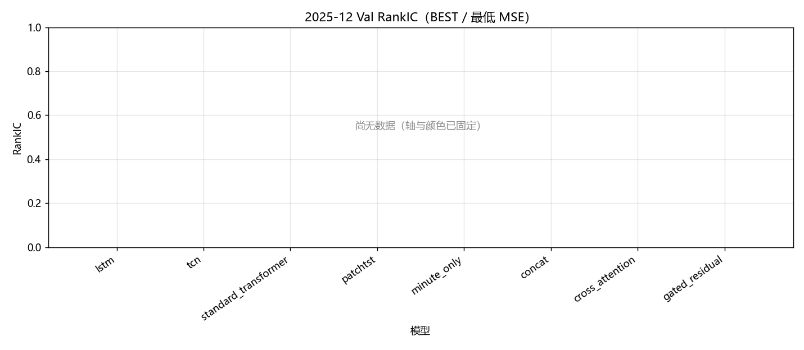

固定颜色: `lstm` `#4C78A8`；`tcn` `#F58518`；`standard_transformer` `#E45756`；`patchtst` `#D37295`；`minute_only` `#72B7B2`；`concat` `#54A24B`；`cross_attention` `#EECA3B`；`gated_residual` `#B279A2`。

### Val F1@Top30

固定颜色: `lstm` `#4C78A8`；`tcn` `#F58518`；`standard_transformer` `#E45756`；`patchtst` `#D37295`；`minute_only` `#72B7B2`；`concat` `#54A24B`；`cross_attention` `#EECA3B`；`gated_residual` `#B279A2`。

### Val MSE

固定颜色: `lstm` `#4C78A8`；`tcn` `#F58518`；`standard_transformer` `#E45756`；`patchtst` `#D37295`；`minute_only` `#72B7B2`；`concat` `#54A24B`；`cross_attention` `#EECA3B`；`gated_residual` `#B279A2`。

### Val IC 各 epoch

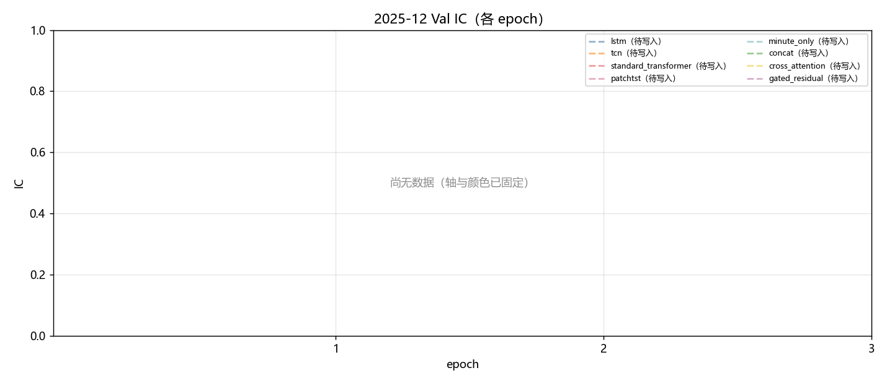

固定颜色: `lstm` `#4C78A8`；`tcn` `#F58518`；`standard_transformer` `#E45756`；`patchtst` `#D37295`；`minute_only` `#72B7B2`；`concat` `#54A24B`；`cross_attention` `#EECA3B`；`gated_residual` `#B279A2`。

### Val RankIC 各 epoch

固定颜色: `lstm` `#4C78A8`；`tcn` `#F58518`；`standard_transformer` `#E45756`；`patchtst` `#D37295`；`minute_only` `#72B7B2`；`concat` `#54A24B`；`cross_attention` `#EECA3B`；`gated_residual` `#B279A2`。

### Val F1@Top30 各 epoch

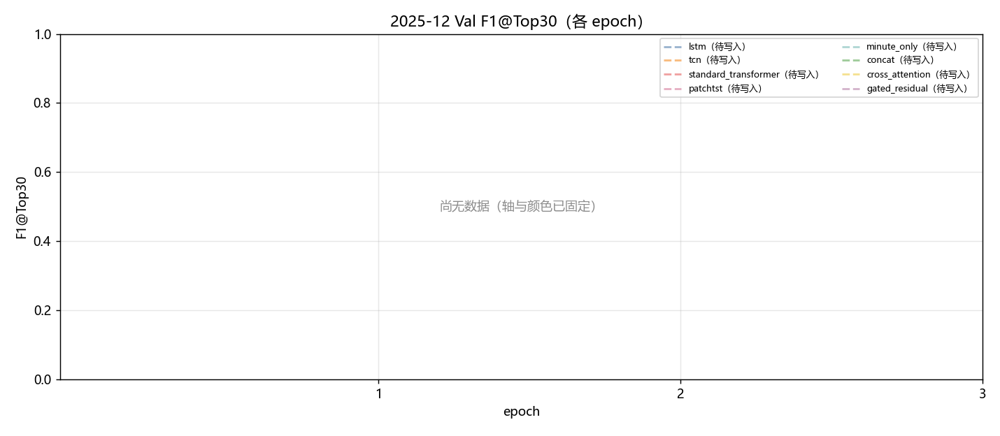

固定颜色: `lstm` `#4C78A8`；`tcn` `#F58518`；`standard_transformer` `#E45756`；`patchtst` `#D37295`；`minute_only` `#72B7B2`；`concat` `#54A24B`；`cross_attention` `#EECA3B`；`gated_residual` `#B279A2`。

### Val MSE 各 epoch

固定颜色: `lstm` `#4C78A8`；`tcn` `#F58518`；`standard_transformer` `#E45756`；`patchtst` `#D37295`；`minute_only` `#72B7B2`；`concat` `#54A24B`；`cross_attention` `#EECA3B`；`gated_residual` `#B279A2`。

### Test IC

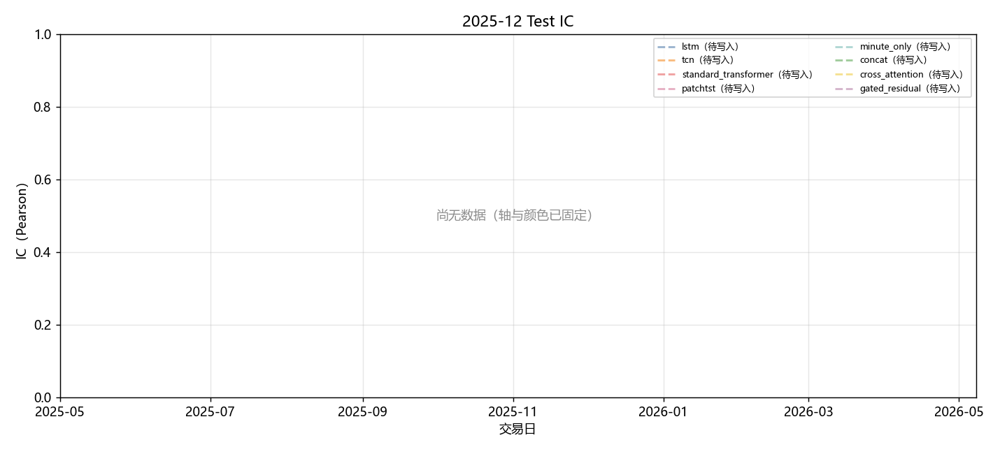

固定颜色: `lstm` `#4C78A8`；`tcn` `#F58518`；`standard_transformer` `#E45756`；`patchtst` `#D37295`；`minute_only` `#72B7B2`；`concat` `#54A24B`；`cross_attention` `#EECA3B`；`gated_residual` `#B279A2`。

### Test RankIC

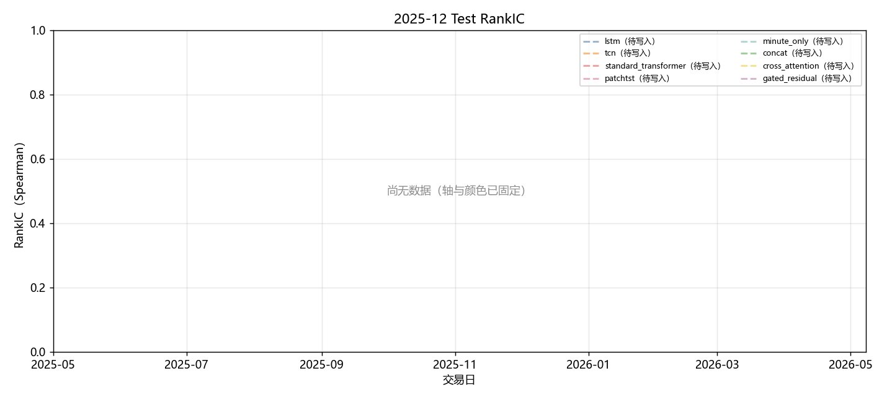

固定颜色: `lstm` `#4C78A8`；`tcn` `#F58518`；`standard_transformer` `#E45756`；`patchtst` `#D37295`；`minute_only` `#72B7B2`；`concat` `#54A24B`；`cross_attention` `#EECA3B`；`gated_residual` `#B279A2`。

### Test F1@Top30

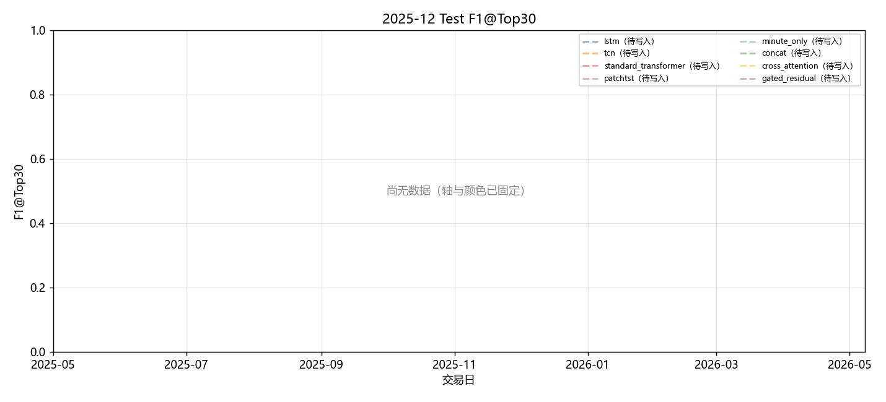

固定颜色: `lstm` `#4C78A8`；`tcn` `#F58518`；`standard_transformer` `#E45756`；`patchtst` `#D37295`；`minute_only` `#72B7B2`；`concat` `#54A24B`；`cross_attention` `#EECA3B`；`gated_residual` `#B279A2`。

### Test Hit@Top30

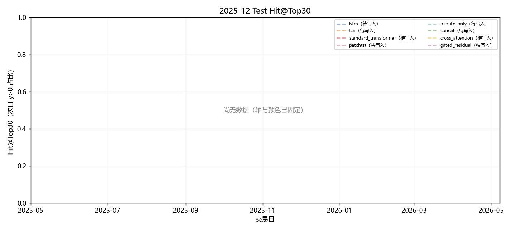

固定颜色: `lstm` `#4C78A8`；`tcn` `#F58518`；`standard_transformer` `#E45756`；`patchtst` `#D37295`；`minute_only` `#72B7B2`；`concat` `#54A24B`；`cross_attention` `#EECA3B`；`gated_residual` `#B279A2`。

## 图对应数据表

- 累计收益 ← `tables/backtest_daily.csv` 的 `net_return` 累加。
- 绩效 / 换手 ← `tables/performance_summary.csv`。
- Val ← `tables/val_best.csv`、`tables/val_epochs.csv`。
- Test 预测 ← `tables/prediction_metrics_mean.csv`。

## 分析

以下只讨论**已经写入数字**的行；单元格为 `-` 的表示该实验尚未跑完，不编造。
来源: month 2025-12。OOS=`sequential_oos_weekly_retrain`，费用=3.0bps，TopK=30。

最近完成单元: `D-backtest-grpo-top30`。
目前还没有任何实测单元格。图只画了坐标轴和固定颜色图例。
