# 2026-03 Sequential OOS 当月实验分析

- 状态: **当月单元已全部写入**
- OOS: `sequential_oos_weekly_retrain`
- TopK=30，cost_bps=3.0，primary=`lstm`
- 缺测一律 `-`，不补 0、不编造。

## 固定颜色

| 模型 | 颜色 |
| --- | --- |
| lstm | #4C78A8 |

预测骨干日收益曲线用 `pred_<模型>_ew`，颜色与上表相同。

## 实验进度

| unit | model | status |
| --- | --- | --- |
| A 预测 | lstm | 已写入 |
| B 组合/top30 | equal_weight | 已写入 |
| B 组合/top30 | mvo | 已写入 |
| B 组合/top30 | max_sharpe | 已写入 |
| B 组合/top30 | risk_parity | 已写入 |
| B 组合/top30 | black_litterman | 已写入 |
| B 组合/top30 | kelly | 已写入 |
| C 生成/top30 | mlp | 已写入 |
| C 生成/top30 | gaussian | 已写入 |
| C 生成/top30 | diffusion | 已写入 |
| C 生成/top30 | standard_fm | 已写入 |
| C 生成/top30 | ssfm | 已写入 |
| D RL/top30 | ssfm_ppo | 已写入 |
| D RL/top30 | ssfm_grpo | 已写入 |

## 实验设定

- Walk-forward：Train=T-13..T-2，Val=T-1，Test=当月。Test 不进训练、验证、标准化、截面排序、协方差、teacher、生成/RL 更新。
- Sequential OOS：周五收盘重训 **LSTM** + SS-FM + PPO/GRPO，下周一生效，不回写本周决策。
- 主线：**LSTM Alpha Prediction → Portfolio Generation → RL Portfolio Optimization**。
- Prediction / SFT **只跑 LSTM**，不跑 TCN / Transformer / Cross-Attention / gated_residual。
- 生成消融：Gaussian+MLP、MLP、Flow Matching、Diffusion、SS-FM；RL 消融：Pure SS-FM / PPO / GRPO。均挂在同一套 LSTM 分数上。
- 不跑实验 E（G 网格）、不跑 WeakAuction、不跑 Auction / Feature Normalization 消融、不跑 All 股池。
- 标签 y = log(Close_D / Open_D)。TopK=30，cost_bps=3.0。

## Validation（回归 / 排序）

### 各模型 BEST（按该模型 Val MSE 最低的 epoch）

| model | MSE | MAE | IC | RankIC | topk_f1 | topk_precision | topk_recall | dir_acc | dir_f1 | dir_precision | dir_recall | top30_hit_rate | n |
| --- | --- | --- | --- | --- | --- | --- | --- | --- | --- | --- | --- | --- | --- |
| lstm | 0.000636 | 0.017532 | 0.002718 | -0.017704 | 0.097619 | 0.097619 | 0.097619 | 0.499915 | 0.610558 | 0.503720 | 0.911782 | 0.507143 | 14 |

列含义: `MSE`/`MAE` 是 ŷ 对 y 的误差；`IC` 是 Pearson；`RankIC` 是 Spearman；`topk_f1` 是预测 Top30 ∩ 真实收益 Top30 / 30；`dir_acc` 是涨跌符号一致率；`top30_hit_rate` 是入选 30 只里 y>0 的比例。

### 各 epoch

| model | epoch | MSE | MAE | IC | RankIC | topk_f1 | topk_precision | topk_recall | dir_acc | dir_f1 | dir_precision | dir_recall | top30_hit_rate | n |
| --- | --- | --- | --- | --- | --- | --- | --- | --- | --- | --- | --- | --- | --- | --- |
| lstm | 1 | 0.000636 | 0.017532 | 0.002718 | -0.017704 | 0.097619 | 0.097619 | 0.097619 | 0.499915 | 0.610558 | 0.503720 | 0.911782 | 0.507143 | 14 |
| lstm | 2 | 0.000641 | 0.017525 | 0.006519 | -0.016462 | 0.107143 | 0.107143 | 0.107143 | 0.486809 | 0.247683 | 0.490763 | 0.189659 | 0.485714 | 14 |
| lstm | 3 | 0.000650 | 0.017643 | 0.015676 | -0.011940 | 0.119048 | 0.119048 | 0.119048 | 0.491650 | - | - | 0.000000 | 0.500000 | 14 |

## Test 预测指标（日均）

| model | MSE | MAE | IC | RankIC | topk_f1 | topk_precision | topk_recall | dir_acc | dir_f1 | dir_precision | dir_recall | top30_hit_rate | top30_excess | n |
| --- | --- | --- | --- | --- | --- | --- | --- | --- | --- | --- | --- | --- | --- | --- |
| lstm | 0.000815 | 0.021211 | -0.045737 | -0.058651 | - | - | - | - | - | - | - | 0.392424 | -0.003659 | 22 |

## 组合绩效

| model | total_net_return | ann_return | sharpe | max_drawdown | mean_turnover | mean_cost | n_days |
| --- | --- | --- | --- | --- | --- | --- | --- |
| pred_lstm_ew_top30 | -0.1383 | -0.8181 | -5.7584 | 0.1732 | 0.0227 | 0.0000 | 22 |
| pred_lstm_ew | -0.1383 | -0.8181 | -5.7584 | 0.1732 | 0.0227 | 0.0000 | 22 |
| baseline_equal_weight_top30 | -0.1383 | -0.8181 | -5.7584 | 0.1732 | 0.0227 | 0.0000 | 22 |
| baseline_mvo_top30 | -0.2018 | -0.9244 | -6.5972 | 0.2281 | 0.9318 | 0.0003 | 22 |
| baseline_max_sharpe_top30 | -0.1859 | -0.9052 | -5.7659 | 0.2176 | 0.8782 | 0.0003 | 22 |
| baseline_risk_parity_top30 | -0.1450 | -0.8338 | -6.1741 | 0.1793 | 0.1309 | 0.0000 | 22 |
| baseline_black_litterman_top30 | -0.1736 | -0.8874 | -5.7368 | 0.2124 | 0.9318 | 0.0003 | 22 |
| baseline_kelly_top30 | -0.2018 | -0.9244 | -6.5972 | 0.2281 | 0.9318 | 0.0003 | 22 |
| baseline_equal_weight | -0.1383 | -0.8181 | -5.7584 | 0.1732 | 0.0227 | 0.0000 | 22 |
| baseline_mvo | -0.2018 | -0.9244 | -6.5972 | 0.2281 | 0.9318 | 0.0003 | 22 |
| baseline_max_sharpe | -0.1859 | -0.9052 | -5.7659 | 0.2176 | 0.8782 | 0.0003 | 22 |
| baseline_risk_parity | -0.1450 | -0.8338 | -6.1741 | 0.1793 | 0.1309 | 0.0000 | 22 |
| baseline_black_litterman | -0.1736 | -0.8874 | -5.7368 | 0.2124 | 0.9318 | 0.0003 | 22 |
| baseline_kelly | -0.2018 | -0.9244 | -6.5972 | 0.2281 | 0.9318 | 0.0003 | 22 |
| gen_mlp_top30 | -0.1195 | -0.7673 | -5.2113 | 0.1515 | 0.3790 | 0.0001 | 22 |
| gen_gaussian_top30 | -0.1497 | -0.8438 | -6.0014 | 0.1653 | 0.5735 | 0.0002 | 22 |
| gen_diffusion_top30 | -0.1796 | -0.8964 | -6.1738 | 0.2061 | 0.8025 | 0.0002 | 22 |
| gen_standard_fm_top30 | -0.1459 | -0.8357 | -5.5246 | 0.1652 | 0.5132 | 0.0002 | 22 |
| gen_ssfm_top30 | -0.1414 | -0.8257 | -5.6985 | 0.1830 | 0.6563 | 0.0002 | 22 |
| gen_mlp | -0.1195 | -0.7673 | -5.2113 | 0.1515 | 0.3790 | 0.0001 | 22 |
| gen_gaussian | -0.1497 | -0.8438 | -6.0014 | 0.1653 | 0.5735 | 0.0002 | 22 |
| gen_diffusion | -0.1796 | -0.8964 | -6.1738 | 0.2061 | 0.8025 | 0.0002 | 22 |
| gen_standard_fm | -0.1459 | -0.8357 | -5.5246 | 0.1652 | 0.5132 | 0.0002 | 22 |
| gen_ssfm | -0.1414 | -0.8257 | -5.6985 | 0.1830 | 0.6563 | 0.0002 | 22 |
| rl_ssfm_ppo_top30 | -0.1087 | -0.7322 | -4.4375 | 0.1524 | 0.3480 | 0.0001 | 22 |
| rl_ssfm_grpo_top30 | -0.1280 | -0.7918 | -5.4082 | 0.1651 | 0.2856 | 0.0001 | 22 |
| rl_ssfm_ppo | -0.1087 | -0.7322 | -4.4375 | 0.1524 | 0.3480 | 0.0001 | 22 |
| rl_ssfm_grpo | -0.1280 | -0.7918 | -5.4082 | 0.1651 | 0.2856 | 0.0001 | 22 |

## 日均换手

| model | mean_turnover |
| --- | --- |
| pred_lstm_ew_top30 | 0.0227 |
| pred_lstm_ew | 0.0227 |
| baseline_equal_weight_top30 | 0.0227 |
| baseline_mvo_top30 | 0.9318 |
| baseline_max_sharpe_top30 | 0.8782 |
| baseline_risk_parity_top30 | 0.1309 |
| baseline_black_litterman_top30 | 0.9318 |
| baseline_kelly_top30 | 0.9318 |
| baseline_equal_weight | 0.0227 |
| baseline_mvo | 0.9318 |
| baseline_max_sharpe | 0.8782 |
| baseline_risk_parity | 0.1309 |
| baseline_black_litterman | 0.9318 |
| baseline_kelly | 0.9318 |
| gen_mlp_top30 | 0.3790 |
| gen_gaussian_top30 | 0.5735 |
| gen_diffusion_top30 | 0.8025 |
| gen_standard_fm_top30 | 0.5132 |
| gen_ssfm_top30 | 0.6563 |
| gen_mlp | 0.3790 |
| gen_gaussian | 0.5735 |
| gen_diffusion | 0.8025 |
| gen_standard_fm | 0.5132 |
| gen_ssfm | 0.6563 |
| rl_ssfm_ppo_top30 | 0.3480 |
| rl_ssfm_grpo_top30 | 0.2856 |
| rl_ssfm_ppo | 0.3480 |
| rl_ssfm_grpo | 0.2856 |

## 图

曲线来自当月已写入的回测 / Val / Test；某条序列还没有数字时，该图只保留坐标轴和固定颜色。Markdown 预览有时会卡住训练中途的占位图，以 `figures/*.png` 为准。

### 预测骨干累计收益

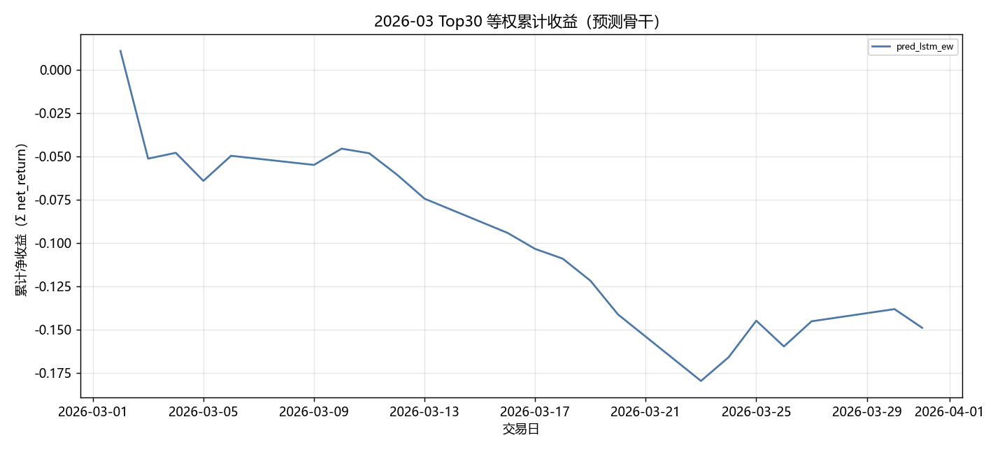

固定颜色: `pred_lstm_ew` `#4C78A8`。

### 组合基线累计收益

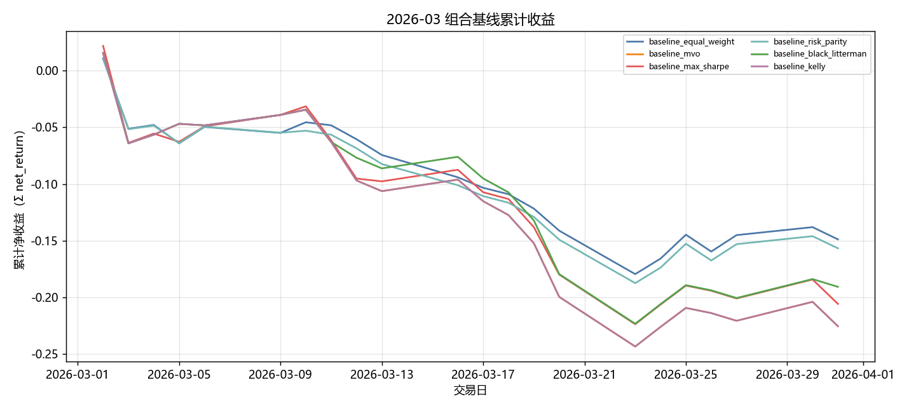

固定颜色: `baseline_equal_weight` `#4C78A8`；`baseline_mvo` `#F58518`；`baseline_max_sharpe` `#E45756`；`baseline_risk_parity` `#72B7B2`；`baseline_black_litterman` `#54A24B`；`baseline_kelly` `#B279A2`。

### 生成模型累计收益

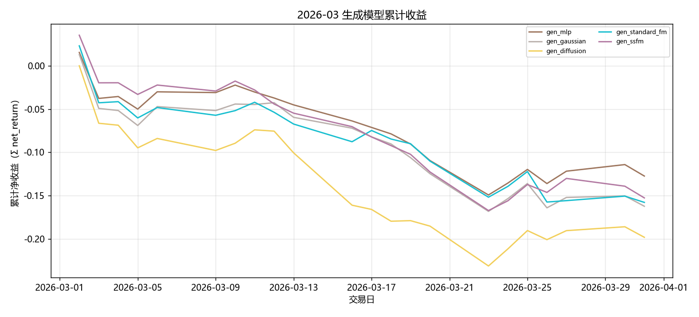

固定颜色: `gen_mlp` `#9D755D`；`gen_gaussian` `#BAB0AC`；`gen_diffusion` `#F2CF5B`；`gen_standard_fm` `#17BECF`；`gen_ssfm` `#B279A2`。

### RL 累计收益

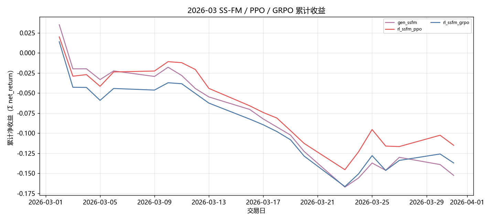

固定颜色: `gen_ssfm` `#B279A2`；`rl_ssfm_ppo` `#E45756`；`rl_ssfm_grpo` `#4C78A8`。

### 日均换手

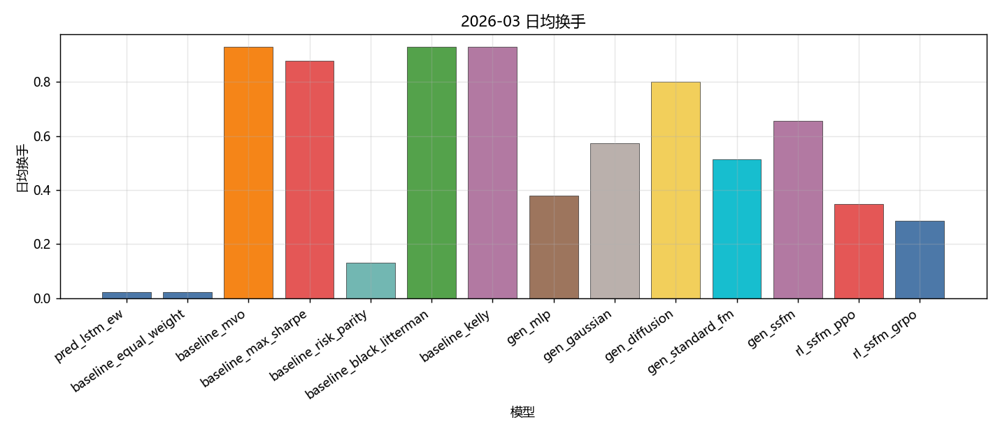

固定颜色: `pred_lstm_ew` `#4C78A8`；`baseline_equal_weight` `#4C78A8`；`baseline_mvo` `#F58518`；`baseline_max_sharpe` `#E45756`；`baseline_risk_parity` `#72B7B2`；`baseline_black_litterman` `#54A24B`；`baseline_kelly` `#B279A2`；`gen_mlp` `#9D755D`；`gen_gaussian` `#BAB0AC`；`gen_diffusion` `#F2CF5B`；`gen_standard_fm` `#17BECF`；`gen_ssfm` `#B279A2`；`rl_ssfm_ppo` `#E45756`；`rl_ssfm_grpo` `#4C78A8`。

### Val IC

固定颜色: `lstm` `#4C78A8`。

### Val RankIC

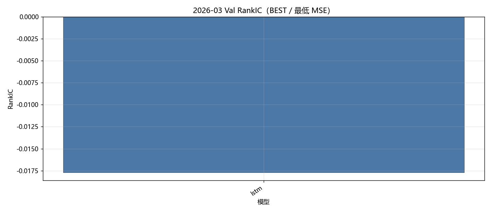

固定颜色: `lstm` `#4C78A8`。

### Val F1@Top30

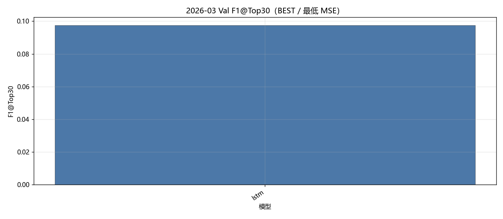

固定颜色: `lstm` `#4C78A8`。

### Val MSE

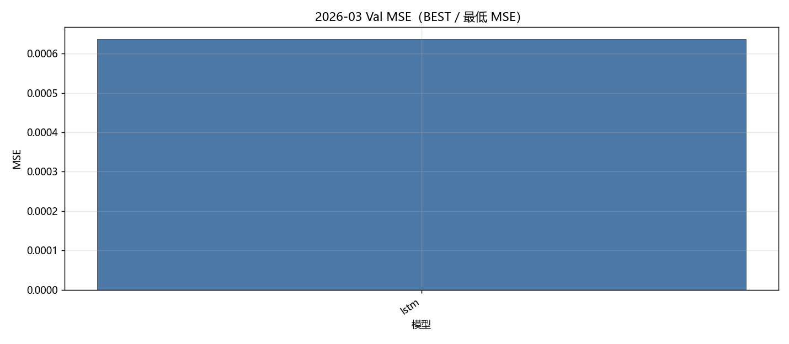

固定颜色: `lstm` `#4C78A8`。

### Val IC 各 epoch

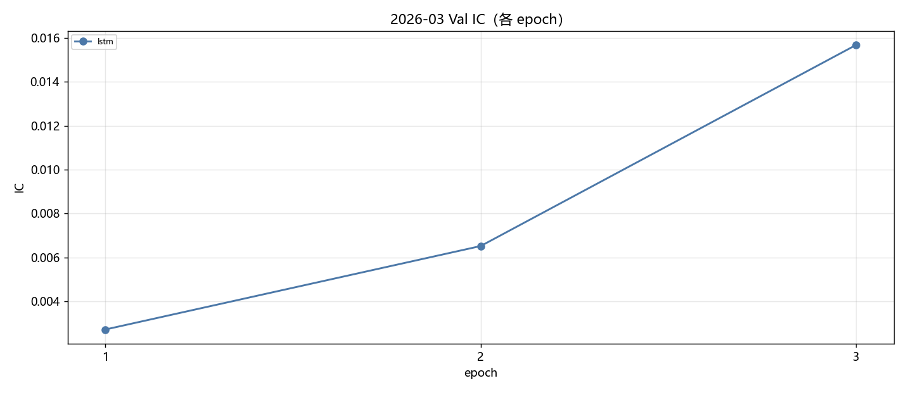

固定颜色: `lstm` `#4C78A8`。

### Val RankIC 各 epoch

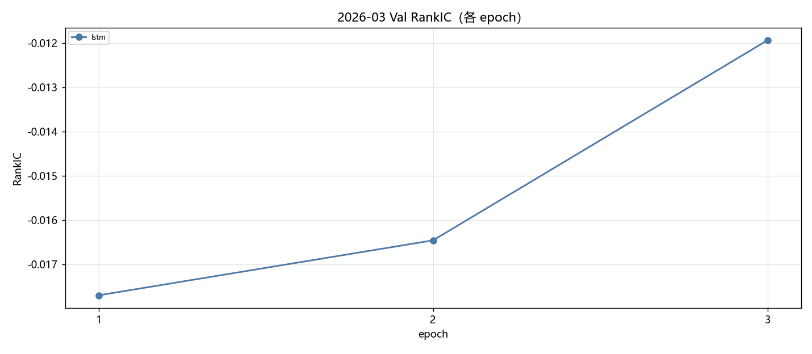

固定颜色: `lstm` `#4C78A8`。

### Val F1@Top30 各 epoch

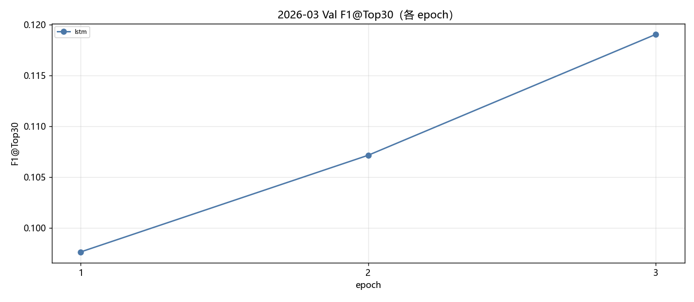

固定颜色: `lstm` `#4C78A8`。

### Val MSE 各 epoch

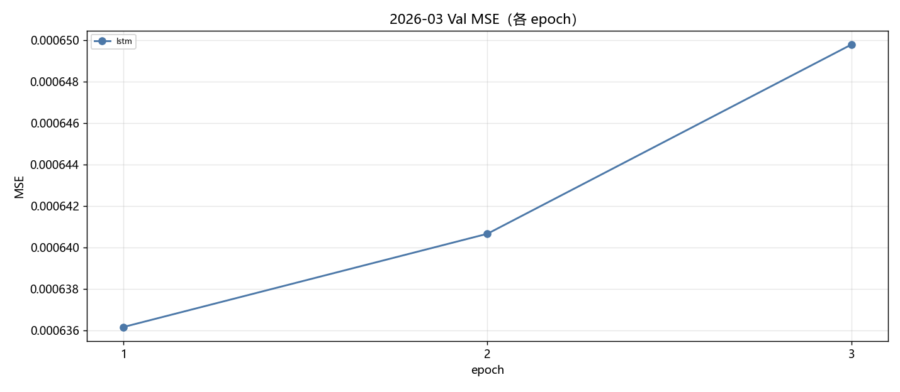

固定颜色: `lstm` `#4C78A8`。

### Test IC

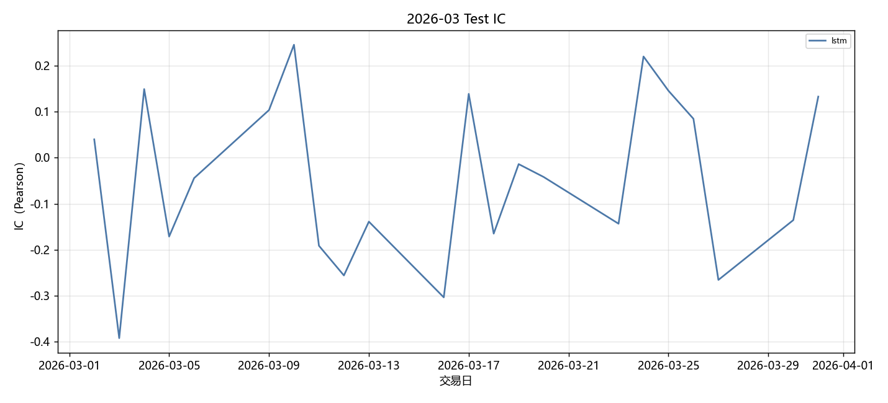

固定颜色: `lstm` `#4C78A8`。

### Test RankIC

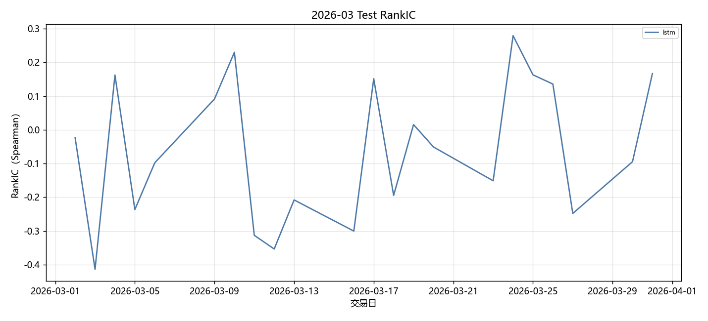

固定颜色: `lstm` `#4C78A8`。

### Test F1@Top30

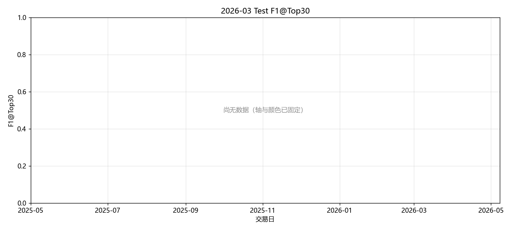

固定颜色: `lstm` `#4C78A8`。

### Test Hit@Top30

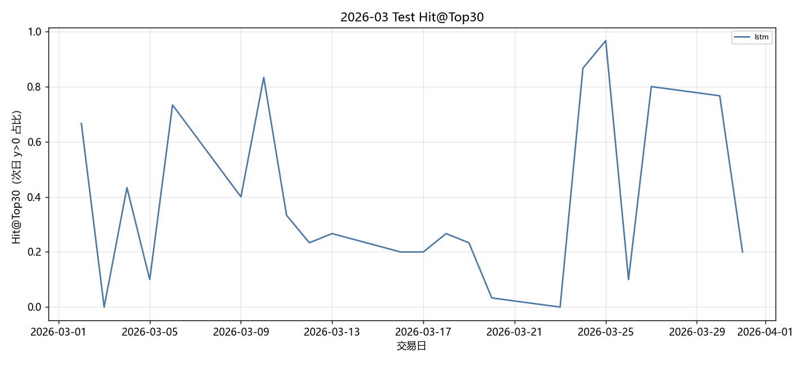

固定颜色: `lstm` `#4C78A8`。

## 图对应数据表

- 累计收益 ← `tables/backtest_daily.csv` 的 `net_return` 累加。
- 绩效 / 换手 ← `tables/performance_summary.csv`。
- Val ← `tables/val_best.csv`、`tables/val_epochs.csv`。
- Test 预测 ← `tables/prediction_metrics_mean.csv`。

## 分析

以下只讨论**已经写入数字**的行；单元格为 `-` 的表示该实验尚未跑完，不编造。
来源: month 2026-03。OOS=`sequential_oos_weekly_retrain`，费用=3.0bps，TopK=30。

已有数据的对象: `lstm`, `equal_weight`, `mvo`, `max_sharpe`, `risk_parity`, `black_litterman`, `kelly`, `mlp`, `gaussian`, `diffusion`, `standard_fm`, `ssfm`, `ssfm_ppo`, `ssfm_grpo`。
- Val IC 目前最高: `lstm` = 0.0027。
- Val F1@Top30 目前最高: `lstm` = 0.0976（随机约 0.06）。
- Val MSE 目前最低（入选口径）: `lstm` = 0.000636。
- Test 日均 IC 目前最高: `lstm` = -0.0457。
- 已回测净值目前最高: `rl_ssfm_ppo` 累计净收益 -0.1087，Sharpe -4.4375。

## 重点对比：生成方法与强化学习

生成式方法都把同一套 Alpha Prediction 分数映射成 Top30 组合权重，费用 3bps。**Gaussian + MLP** 是随机策略基线（MLP 输出高斯参数后采样）；**MLP** 是确定性映射；**Diffusion** 逐步去噪；**Flow Matching（`standard_fm`）** 是普通连续流匹配；**SS-FM** 在单纯形上做条件流匹配。下面只讨论已经写入的 Test 回测数字。

| 方法 | series | total_net_return | ann_return | sharpe | max_drawdown | mean_turnover | n_days |
| --- | --- | --- | --- | --- | --- | --- | --- |
| Gaussian + MLP | gen_gaussian | -0.1497 | -0.8438 | -6.0014 | 0.1653 | 0.5735 | 22 |
| MLP | gen_mlp | -0.1195 | -0.7673 | -5.2113 | 0.1515 | 0.3790 | 22 |
| SS-FM | gen_ssfm | -0.1414 | -0.8257 | -5.6985 | 0.1830 | 0.6563 | 22 |
| Flow Matching | gen_standard_fm | -0.1459 | -0.8357 | -5.5246 | 0.1652 | 0.5132 | 22 |
| Diffusion | gen_diffusion | -0.1796 | -0.8964 | -6.1738 | 0.2061 | 0.8025 | 22 |

累计净收益排序：`MLP`(-0.1195) > `SS-FM`(-0.1414) > `Flow Matching`(-0.1459) > `Gaussian + MLP`(-0.1497) > `Diffusion`(-0.1796)。
Sharpe 排序：`MLP`(-5.2113) > `Flow Matching`(-5.5246) > `SS-FM`(-5.6985) > `Gaussian + MLP`(-6.0014) > `Diffusion`(-6.1738)。
最大回撤（越小越好）：`MLP`(0.1515) > `Flow Matching`(0.1652) > `Gaussian + MLP`(0.1653) > `SS-FM`(0.1830) > `Diffusion`(0.2061)。
日均换手（越低交易成本压力越小）：`MLP`(0.3790) > `Flow Matching`(0.5132) > `Gaussian + MLP`(0.5735) > `SS-FM`(0.6563) > `Diffusion`(0.8025)。
- `Gaussian + MLP / gen_gaussian`：累计净收益 -0.1497，年化 -0.8438，Sharpe -6.0014，最大回撤 0.1653，日均换手 0.5735，n=22。
- `MLP / gen_mlp`：累计净收益 -0.1195，年化 -0.7673，Sharpe -5.2113，最大回撤 0.1515，日均换手 0.3790，n=22。
- `SS-FM / gen_ssfm`：累计净收益 -0.1414，年化 -0.8257，Sharpe -5.6985，最大回撤 0.1830，日均换手 0.6563，n=22。
- `Flow Matching / gen_standard_fm`：累计净收益 -0.1459，年化 -0.8357，Sharpe -5.5246，最大回撤 0.1652，日均换手 0.5132，n=22。
- `Diffusion / gen_diffusion`：累计净收益 -0.1796，年化 -0.8964，Sharpe -6.1738，最大回撤 0.2061，日均换手 0.8025，n=22。

本月生成方法里收益最好的是 **MLP**（-0.1195），最差的是 **Diffusion**（-0.1796）。
换手最高的是 Diffusion（0.8025）。生成式每天重采样权重，换手天然高于预测骨干 Top30 等权；比较三种生成方法时，应把换手和费用一起看，不能只看毛收益。

### PPO vs GRPO（纯 SS-FM）

两组强化学习都挂在 **同一套 SS-FM** 上：先冻结/蒸馏 SS-FM 生成器，再用策略梯度改采样。**PPO** 用 clipped surrogate 优化轨迹回报；**GRPO** 对同一状态采一组候选，用组内相对优势，不显式用 critic。对照是不加 RL 的 `gen_ssfm`。

| 方法 | series | total_net_return | ann_return | sharpe | max_drawdown | mean_turnover | n_days |
| --- | --- | --- | --- | --- | --- | --- | --- |
| SS-FM（无 RL） | gen_ssfm | -0.1414 | -0.8257 | -5.6985 | 0.1830 | 0.6563 | 22 |
| PPO + SS-FM | rl_ssfm_ppo | -0.1087 | -0.7322 | -4.4375 | 0.1524 | 0.3480 | 22 |
| GRPO + SS-FM | rl_ssfm_grpo | -0.1280 | -0.7918 | -5.4082 | 0.1651 | 0.2856 | 22 |

- `SS-FM 无 RL`：累计净收益 -0.1414，年化 -0.8257，Sharpe -5.6985，最大回撤 0.1830，日均换手 0.6563，n=22。
- `PPO + SS-FM`：累计净收益 -0.1087，年化 -0.7322，Sharpe -4.4375，最大回撤 0.1524，日均换手 0.3480，n=22。
- `GRPO + SS-FM`：累计净收益 -0.1280，年化 -0.7918，Sharpe -5.4082，最大回撤 0.1651，日均换手 0.2856，n=22。

本月 **PPO 明显优于 GRPO**（净收益 -0.1087 vs -0.1280，Sharpe -4.4375 vs -5.4082）。PPO 直接优化绝对回报，在月频、高噪声的 CSI500 Top30 上更容易学到“少动、抓住少数有效信号”的策略；GRPO 依赖组内相对排序，组内候选若都差或方差被截面噪声淹没，相对优势接近随机，策略更新会抖。
PPO 相对纯 SS-FM 净收益提升 0.0328。RL 若同时把换手压下去（0.6563 → 0.3480），说明它主要是在惩罚无意义的每日重采样，而不是另学一套完全不同的选股。
GRPO 相对纯 SS-FM 净收益提升 0.0134。
换手：纯 SS-FM 0.6563，PPO 0.3480，GRPO 0.2856。RL 若换手明显低于生成采样，成本项会解释一部分超额；Top30 等权预测骨干的换手几乎只反映首日建仓，**不能**和生成/RL 的日均换手直接比。

### 收益表现、稳定性与风险成本

预测骨干 Test 日均 IC 最高 `lstm`=-0.0457，最低 `lstm`=-0.0457。IC 一个月大约 20 个交易日，符号翻转很常见，不能单独用 IC 给方法排座次；组合净值、Sharpe、回撤要一起看。
核心序列里净值最好 `rl_ssfm_ppo`=-0.1087（Sharpe -4.4375，MDD 0.1524），最差 `gen_diffusion`=-0.1796。单月样本短，方法之间差几个百分点也可能是市场路径而不是模型能力；要和下个月对照是否同向。
稳定性：看 Val IC 与 Test IC 是否同向、生成/RL 是否跟预测骨干一起赚或一起亏。若预测 IC 为正但生成亏损，问题更可能在权重采样与换手，而不是分数本身；若预测 IC 已接近 0，生成和 RL 都很难稳定赚钱，这是市场环境而不是某一生成器独有的失败。

