# 2026-04 Sequential OOS 当月实验分析

- 状态: **当月单元已全部写入**
- OOS: `sequential_oos_weekly_retrain`
- TopK=30，cost_bps=3.0，primary=`lstm`
- 缺测一律 `-`，不补 0、不编造。

## 固定颜色

| 模型 | 颜色 |
| --- | --- |
| lstm | #4C78A8 |

预测骨干日收益曲线用 `pred_<模型>_ew`，颜色与上表相同。

## 实验进度

| unit | model | status |
| --- | --- | --- |
| A 预测 | lstm | 已写入 |
| B 组合/top30 | equal_weight | 已写入 |
| B 组合/top30 | mvo | 已写入 |
| B 组合/top30 | max_sharpe | 已写入 |
| B 组合/top30 | risk_parity | 已写入 |
| B 组合/top30 | black_litterman | 已写入 |
| B 组合/top30 | kelly | 已写入 |
| C 生成/top30 | mlp | 已写入 |
| C 生成/top30 | gaussian | 已写入 |
| C 生成/top30 | diffusion | 已写入 |
| C 生成/top30 | standard_fm | 已写入 |
| C 生成/top30 | ssfm | 已写入 |
| D RL/top30 | ssfm_ppo | 已写入 |
| D RL/top30 | ssfm_grpo | 已写入 |

## 实验设定

- Walk-forward：Train=T-13..T-2，Val=T-1，Test=当月。Test 不进训练、验证、标准化、截面排序、协方差、teacher、生成/RL 更新。
- Sequential OOS：周五收盘重训 **LSTM** + SS-FM + PPO/GRPO，下周一生效，不回写本周决策。
- 主线：**LSTM Alpha Prediction → Portfolio Generation → RL Portfolio Optimization**。
- Prediction / SFT **只跑 LSTM**，不跑 TCN / Transformer / Cross-Attention / gated_residual。
- 生成消融：Gaussian+MLP、MLP、Flow Matching、Diffusion、SS-FM；RL 消融：Pure SS-FM / PPO / GRPO。均挂在同一套 LSTM 分数上。
- 不跑实验 E（G 网格）、不跑 WeakAuction、不跑 Auction / Feature Normalization 消融、不跑 All 股池。
- 标签 y = log(Close_D / Open_D)。TopK=30，cost_bps=3.0。

## Validation（回归 / 排序）

### 各模型 BEST（按该模型 Val MSE 最低的 epoch）

| model | MSE | MAE | IC | RankIC | topk_f1 | topk_precision | topk_recall | dir_acc | dir_f1 | dir_precision | dir_recall | top30_hit_rate | n |
| --- | --- | --- | --- | --- | --- | --- | --- | --- | --- | --- | --- | --- | --- |
| lstm | 0.000803 | 0.020864 | -0.047929 | -0.087800 | 0.134848 | 0.134848 | 0.134848 | 0.445177 | 0.568298 | 0.437567 | 1 | 0.400000 | 22 |

列含义: `MSE`/`MAE` 是 ŷ 对 y 的误差；`IC` 是 Pearson；`RankIC` 是 Spearman；`topk_f1` 是预测 Top30 ∩ 真实收益 Top30 / 30；`dir_acc` 是涨跌符号一致率；`top30_hit_rate` 是入选 30 只里 y>0 的比例。

### 各 epoch

| model | epoch | MSE | MAE | IC | RankIC | topk_f1 | topk_precision | topk_recall | dir_acc | dir_f1 | dir_precision | dir_recall | top30_hit_rate | n |
| --- | --- | --- | --- | --- | --- | --- | --- | --- | --- | --- | --- | --- | --- | --- |
| lstm | 1 | 0.000831 | 0.021391 | -0.042042 | -0.073205 | 0.109091 | 0.109091 | 0.109091 | 0.445177 | 0.568298 | 0.437567 | 1 | 0.431818 | 22 |
| lstm | 2 | 0.000810 | 0.020998 | -0.049252 | -0.090626 | 0.109091 | 0.109091 | 0.109091 | 0.445177 | 0.568298 | 0.437567 | 1 | 0.410606 | 22 |
| lstm | 3 | 0.000803 | 0.020864 | -0.047929 | -0.087800 | 0.134848 | 0.134848 | 0.134848 | 0.445177 | 0.568298 | 0.437567 | 1 | 0.400000 | 22 |

## Test 预测指标（日均）

| model | MSE | MAE | IC | RankIC | topk_f1 | topk_precision | topk_recall | dir_acc | dir_f1 | dir_precision | dir_recall | top30_hit_rate | top30_excess | n |
| --- | --- | --- | --- | --- | --- | --- | --- | --- | --- | --- | --- | --- | --- | --- |
| lstm | 0.000591 | 0.017369 | 0.016322 | -0.004845 | - | - | - | - | - | - | - | 0.468254 | 0.000604 | 21 |

## 组合绩效

| model | total_net_return | ann_return | sharpe | max_drawdown | mean_turnover | mean_cost | n_days |
| --- | --- | --- | --- | --- | --- | --- | --- |
| pred_lstm_ew_top30 | 0.0504 | 0.8032 | 2.6471 | 0.0376 | 0.0238 | 0.0000 | 21 |
| pred_lstm_ew | 0.0504 | 0.8032 | 2.6471 | 0.0376 | 0.0238 | 0.0000 | 21 |
| baseline_equal_weight_top30 | 0.0504 | 0.8032 | 2.6471 | 0.0376 | 0.0238 | 0.0000 | 21 |
| baseline_mvo_top30 | 0.0033 | 0.0405 | 0.1295 | 0.0737 | 0.9762 | 0.0003 | 21 |
| baseline_max_sharpe_top30 | -0.0242 | -0.2546 | -1.0720 | 0.0475 | 0.9559 | 0.0003 | 21 |
| baseline_risk_parity_top30 | 0.0489 | 0.7735 | 2.6316 | 0.0365 | 0.0511 | 0.0000 | 21 |
| baseline_black_litterman_top30 | -0.0023 | -0.0270 | -0.0916 | 0.0688 | 0.9762 | 0.0003 | 21 |
| baseline_kelly_top30 | 0.0033 | 0.0405 | 0.1295 | 0.0737 | 0.9762 | 0.0003 | 21 |
| baseline_equal_weight | 0.0504 | 0.8032 | 2.6471 | 0.0376 | 0.0238 | 0.0000 | 21 |
| baseline_mvo | 0.0033 | 0.0405 | 0.1295 | 0.0737 | 0.9762 | 0.0003 | 21 |
| baseline_max_sharpe | -0.0242 | -0.2546 | -1.0720 | 0.0475 | 0.9559 | 0.0003 | 21 |
| baseline_risk_parity | 0.0489 | 0.7735 | 2.6316 | 0.0365 | 0.0511 | 0.0000 | 21 |
| baseline_black_litterman | -0.0023 | -0.0270 | -0.0916 | 0.0688 | 0.9762 | 0.0003 | 21 |
| baseline_kelly | 0.0033 | 0.0405 | 0.1295 | 0.0737 | 0.9762 | 0.0003 | 21 |
| gen_mlp_top30 | 0.0603 | 1.0190 | 3.4557 | 0.0415 | 0.3874 | 0.0001 | 21 |
| gen_gaussian_top30 | 0.0025 | 0.0300 | 0.1343 | 0.0468 | 0.6314 | 0.0002 | 21 |
| gen_diffusion_top30 | -0.0064 | -0.0742 | -0.3805 | 0.0410 | 0.8510 | 0.0003 | 21 |
| gen_standard_fm_top30 | -0.0094 | -0.1070 | -0.6360 | 0.0330 | 0.5297 | 0.0002 | 21 |
| gen_ssfm_top30 | -0.0082 | -0.0945 | -0.4771 | 0.0679 | 0.8484 | 0.0003 | 21 |
| gen_mlp | 0.0603 | 1.0190 | 3.4557 | 0.0415 | 0.3874 | 0.0001 | 21 |
| gen_gaussian | 0.0025 | 0.0300 | 0.1343 | 0.0468 | 0.6314 | 0.0002 | 21 |
| gen_diffusion | -0.0064 | -0.0742 | -0.3805 | 0.0410 | 0.8510 | 0.0003 | 21 |
| gen_standard_fm | -0.0094 | -0.1070 | -0.6360 | 0.0330 | 0.5297 | 0.0002 | 21 |
| gen_ssfm | -0.0082 | -0.0945 | -0.4771 | 0.0679 | 0.8484 | 0.0003 | 21 |
| rl_ssfm_ppo_top30 | 0.0203 | 0.2730 | 1.1116 | 0.0457 | 0.3274 | 0.0001 | 21 |
| rl_ssfm_grpo_top30 | 0.0373 | 0.5522 | 2.1136 | 0.0336 | 0.3022 | 0.0001 | 21 |
| rl_ssfm_ppo | 0.0203 | 0.2730 | 1.1116 | 0.0457 | 0.3274 | 0.0001 | 21 |
| rl_ssfm_grpo | 0.0373 | 0.5522 | 2.1136 | 0.0336 | 0.3022 | 0.0001 | 21 |

## 日均换手

| model | mean_turnover |
| --- | --- |
| pred_lstm_ew_top30 | 0.0238 |
| pred_lstm_ew | 0.0238 |
| baseline_equal_weight_top30 | 0.0238 |
| baseline_mvo_top30 | 0.9762 |
| baseline_max_sharpe_top30 | 0.9559 |
| baseline_risk_parity_top30 | 0.0511 |
| baseline_black_litterman_top30 | 0.9762 |
| baseline_kelly_top30 | 0.9762 |
| baseline_equal_weight | 0.0238 |
| baseline_mvo | 0.9762 |
| baseline_max_sharpe | 0.9559 |
| baseline_risk_parity | 0.0511 |
| baseline_black_litterman | 0.9762 |
| baseline_kelly | 0.9762 |
| gen_mlp_top30 | 0.3874 |
| gen_gaussian_top30 | 0.6314 |
| gen_diffusion_top30 | 0.8510 |
| gen_standard_fm_top30 | 0.5297 |
| gen_ssfm_top30 | 0.8484 |
| gen_mlp | 0.3874 |
| gen_gaussian | 0.6314 |
| gen_diffusion | 0.8510 |
| gen_standard_fm | 0.5297 |
| gen_ssfm | 0.8484 |
| rl_ssfm_ppo_top30 | 0.3274 |
| rl_ssfm_grpo_top30 | 0.3022 |
| rl_ssfm_ppo | 0.3274 |
| rl_ssfm_grpo | 0.3022 |

## 图

曲线来自当月已写入的回测 / Val / Test；某条序列还没有数字时，该图只保留坐标轴和固定颜色。Markdown 预览有时会卡住训练中途的占位图，以 `figures/*.png` 为准。

### 预测骨干累计收益

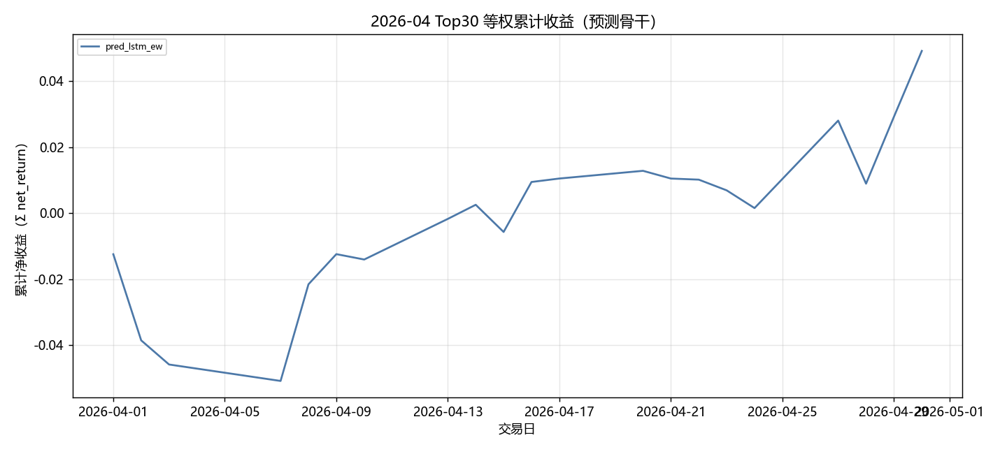

固定颜色: `pred_lstm_ew` `#4C78A8`。

### 组合基线累计收益

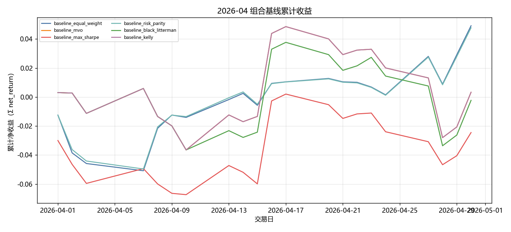

固定颜色: `baseline_equal_weight` `#4C78A8`；`baseline_mvo` `#F58518`；`baseline_max_sharpe` `#E45756`；`baseline_risk_parity` `#72B7B2`；`baseline_black_litterman` `#54A24B`；`baseline_kelly` `#B279A2`。

### 生成模型累计收益

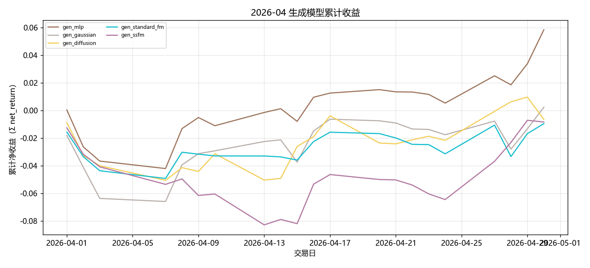

固定颜色: `gen_mlp` `#9D755D`；`gen_gaussian` `#BAB0AC`；`gen_diffusion` `#F2CF5B`；`gen_standard_fm` `#17BECF`；`gen_ssfm` `#B279A2`。

### RL 累计收益

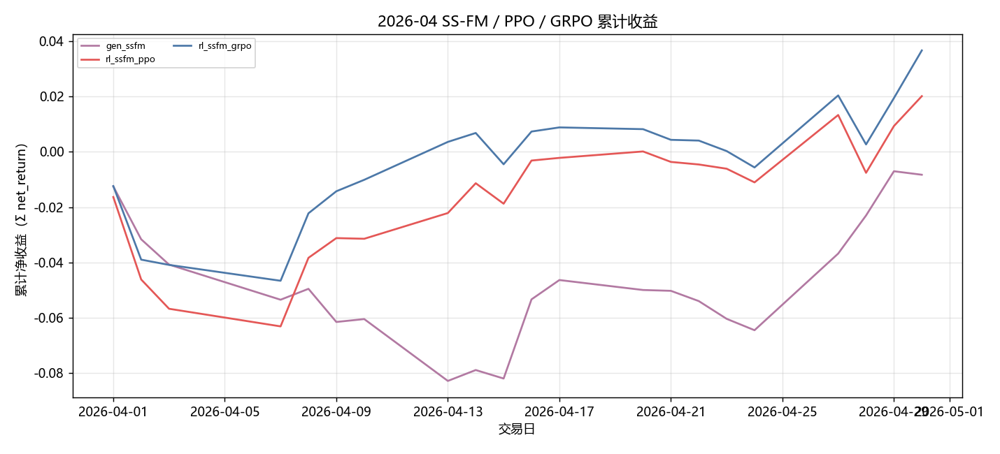

固定颜色: `gen_ssfm` `#B279A2`；`rl_ssfm_ppo` `#E45756`；`rl_ssfm_grpo` `#4C78A8`。

### 日均换手

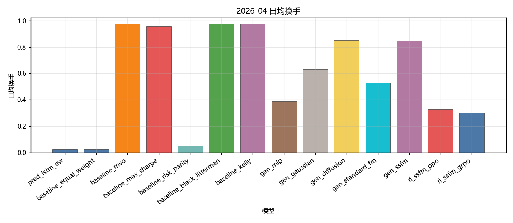

固定颜色: `pred_lstm_ew` `#4C78A8`；`baseline_equal_weight` `#4C78A8`；`baseline_mvo` `#F58518`；`baseline_max_sharpe` `#E45756`；`baseline_risk_parity` `#72B7B2`；`baseline_black_litterman` `#54A24B`；`baseline_kelly` `#B279A2`；`gen_mlp` `#9D755D`；`gen_gaussian` `#BAB0AC`；`gen_diffusion` `#F2CF5B`；`gen_standard_fm` `#17BECF`；`gen_ssfm` `#B279A2`；`rl_ssfm_ppo` `#E45756`；`rl_ssfm_grpo` `#4C78A8`。

### Val IC

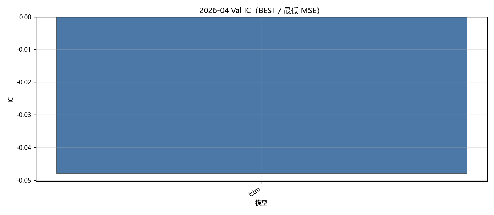

固定颜色: `lstm` `#4C78A8`。

### Val RankIC

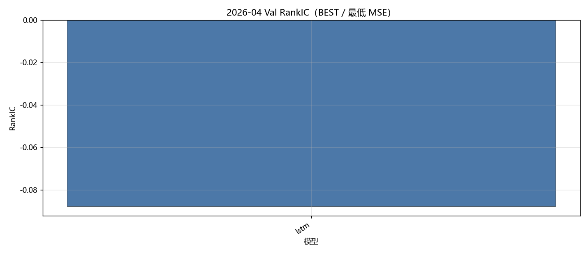

固定颜色: `lstm` `#4C78A8`。

### Val F1@Top30

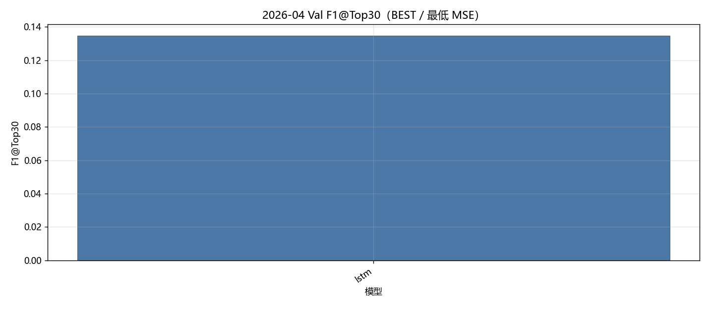

固定颜色: `lstm` `#4C78A8`。

### Val MSE

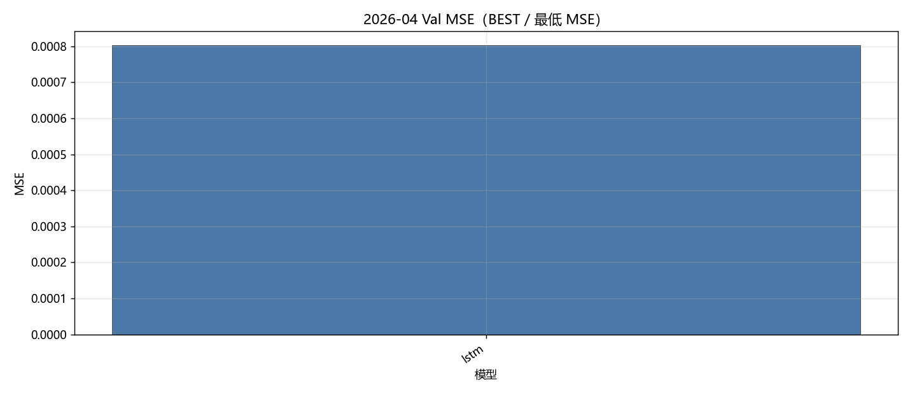

固定颜色: `lstm` `#4C78A8`。

### Val IC 各 epoch

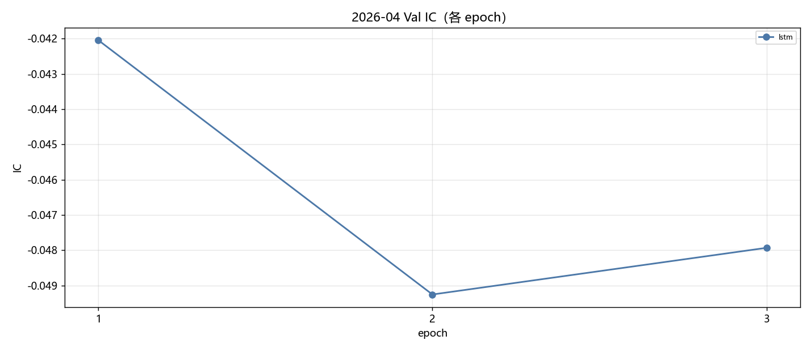

固定颜色: `lstm` `#4C78A8`。

### Val RankIC 各 epoch

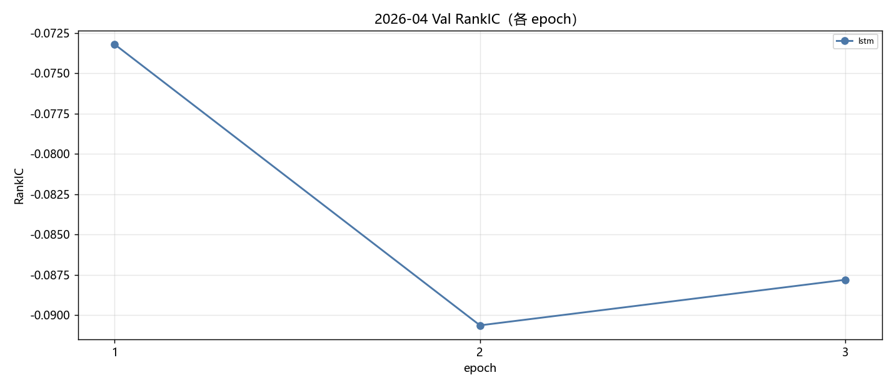

固定颜色: `lstm` `#4C78A8`。

### Val F1@Top30 各 epoch

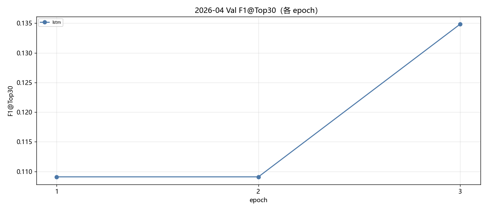

固定颜色: `lstm` `#4C78A8`。

### Val MSE 各 epoch

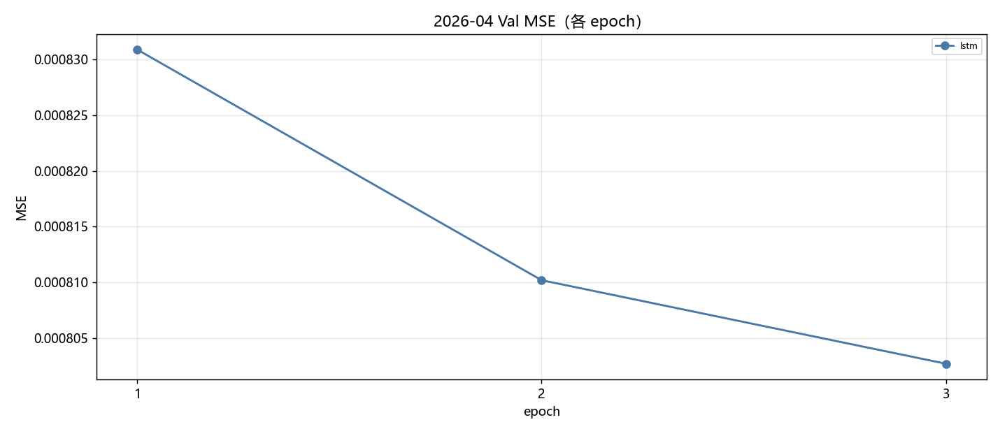

固定颜色: `lstm` `#4C78A8`。

### Test IC

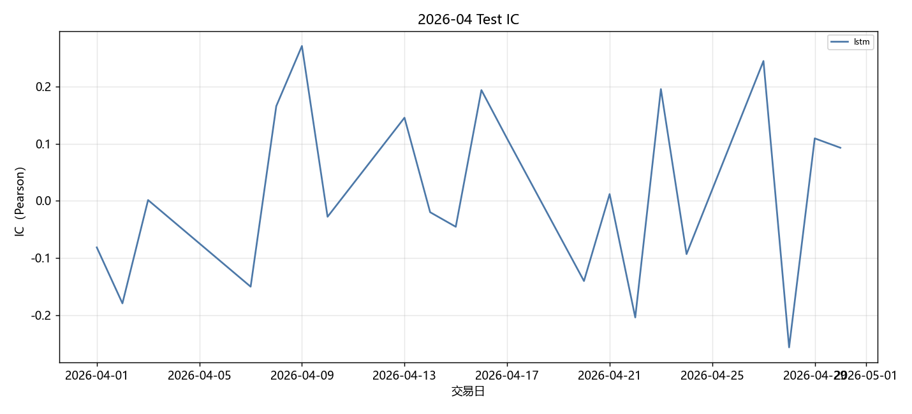

固定颜色: `lstm` `#4C78A8`。

### Test RankIC

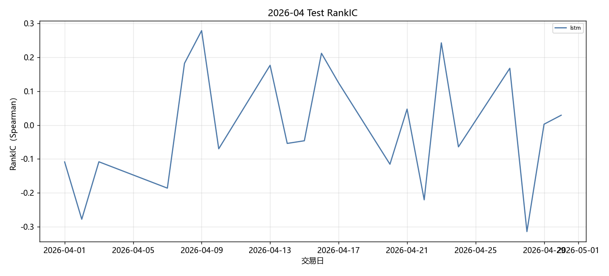

固定颜色: `lstm` `#4C78A8`。

### Test F1@Top30

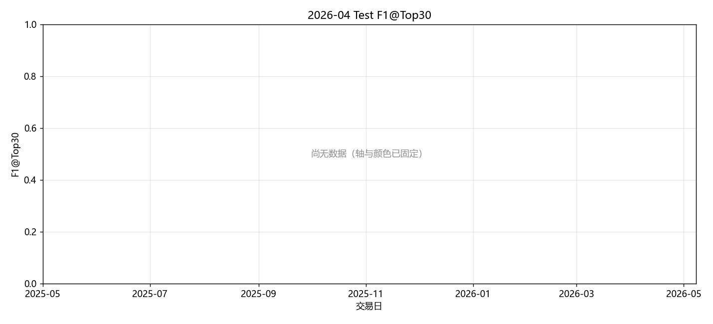

固定颜色: `lstm` `#4C78A8`。

### Test Hit@Top30

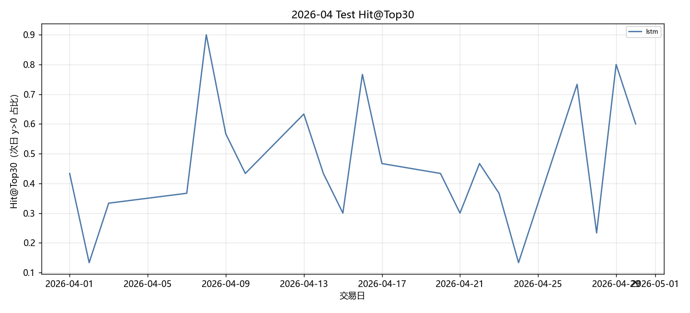

固定颜色: `lstm` `#4C78A8`。

## 图对应数据表

- 累计收益 ← `tables/backtest_daily.csv` 的 `net_return` 累加。
- 绩效 / 换手 ← `tables/performance_summary.csv`。
- Val ← `tables/val_best.csv`、`tables/val_epochs.csv`。
- Test 预测 ← `tables/prediction_metrics_mean.csv`。

## 分析

以下只讨论**已经写入数字**的行；单元格为 `-` 的表示该实验尚未跑完，不编造。
来源: month 2026-04。OOS=`sequential_oos_weekly_retrain`，费用=3.0bps，TopK=30。

已有数据的对象: `lstm`, `equal_weight`, `mvo`, `max_sharpe`, `risk_parity`, `black_litterman`, `kelly`, `mlp`, `gaussian`, `diffusion`, `standard_fm`, `ssfm`, `ssfm_ppo`, `ssfm_grpo`。
- Val IC 目前最高: `lstm` = -0.0479。
- Val F1@Top30 目前最高: `lstm` = 0.1348（随机约 0.06）。
- Val MSE 目前最低（入选口径）: `lstm` = 0.000803。
- Test 日均 IC 目前最高: `lstm` = 0.0163。
- 已回测净值目前最高: `gen_mlp` 累计净收益 0.0603，Sharpe 3.4557。

## 重点对比：生成方法与强化学习

生成式方法都把同一套 Alpha Prediction 分数映射成 Top30 组合权重，费用 3bps。**Gaussian + MLP** 是随机策略基线（MLP 输出高斯参数后采样）；**MLP** 是确定性映射；**Diffusion** 逐步去噪；**Flow Matching（`standard_fm`）** 是普通连续流匹配；**SS-FM** 在单纯形上做条件流匹配。下面只讨论已经写入的 Test 回测数字。

| 方法 | series | total_net_return | ann_return | sharpe | max_drawdown | mean_turnover | n_days |
| --- | --- | --- | --- | --- | --- | --- | --- |
| Gaussian + MLP | gen_gaussian | 0.0025 | 0.0300 | 0.1343 | 0.0468 | 0.6314 | 21 |
| MLP | gen_mlp | 0.0603 | 1.0190 | 3.4557 | 0.0415 | 0.3874 | 21 |
| SS-FM | gen_ssfm | -0.0082 | -0.0945 | -0.4771 | 0.0679 | 0.8484 | 21 |
| Flow Matching | gen_standard_fm | -0.0094 | -0.1070 | -0.6360 | 0.0330 | 0.5297 | 21 |
| Diffusion | gen_diffusion | -0.0064 | -0.0742 | -0.3805 | 0.0410 | 0.8510 | 21 |

累计净收益排序：`MLP`(0.0603) > `Gaussian + MLP`(0.0025) > `Diffusion`(-0.0064) > `SS-FM`(-0.0082) > `Flow Matching`(-0.0094)。
Sharpe 排序：`MLP`(3.4557) > `Gaussian + MLP`(0.1343) > `Diffusion`(-0.3805) > `SS-FM`(-0.4771) > `Flow Matching`(-0.6360)。
最大回撤（越小越好）：`Flow Matching`(0.0330) > `Diffusion`(0.0410) > `MLP`(0.0415) > `Gaussian + MLP`(0.0468) > `SS-FM`(0.0679)。
日均换手（越低交易成本压力越小）：`MLP`(0.3874) > `Flow Matching`(0.5297) > `Gaussian + MLP`(0.6314) > `SS-FM`(0.8484) > `Diffusion`(0.8510)。
- `Gaussian + MLP / gen_gaussian`：累计净收益 0.0025，年化 0.0300，Sharpe 0.1343，最大回撤 0.0468，日均换手 0.6314，n=21。
- `MLP / gen_mlp`：累计净收益 0.0603，年化 1.0190，Sharpe 3.4557，最大回撤 0.0415，日均换手 0.3874，n=21。
- `SS-FM / gen_ssfm`：累计净收益 -0.0082，年化 -0.0945，Sharpe -0.4771，最大回撤 0.0679，日均换手 0.8484，n=21。
- `Flow Matching / gen_standard_fm`：累计净收益 -0.0094，年化 -0.1070，Sharpe -0.6360，最大回撤 0.0330，日均换手 0.5297，n=21。
- `Diffusion / gen_diffusion`：累计净收益 -0.0064，年化 -0.0742，Sharpe -0.3805，最大回撤 0.0410，日均换手 0.8510，n=21。

本月生成方法里收益最好的是 **MLP**（0.0603），最差的是 **Flow Matching**（-0.0094）。
普通 FM 最差，和 SS-FM 的差距主要来自缺少分数条件：无条件流匹配更容易给出与次日收益无关的权重，换手若同时不低，成本会进一步拖累净值。
换手最高的是 Diffusion（0.8510）。生成式每天重采样权重，换手天然高于预测骨干 Top30 等权；比较三种生成方法时，应把换手和费用一起看，不能只看毛收益。

### PPO vs GRPO（纯 SS-FM）

两组强化学习都挂在 **同一套 SS-FM** 上：先冻结/蒸馏 SS-FM 生成器，再用策略梯度改采样。**PPO** 用 clipped surrogate 优化轨迹回报；**GRPO** 对同一状态采一组候选，用组内相对优势，不显式用 critic。对照是不加 RL 的 `gen_ssfm`。

| 方法 | series | total_net_return | ann_return | sharpe | max_drawdown | mean_turnover | n_days |
| --- | --- | --- | --- | --- | --- | --- | --- |
| SS-FM（无 RL） | gen_ssfm | -0.0082 | -0.0945 | -0.4771 | 0.0679 | 0.8484 | 21 |
| PPO + SS-FM | rl_ssfm_ppo | 0.0203 | 0.2730 | 1.1116 | 0.0457 | 0.3274 | 21 |
| GRPO + SS-FM | rl_ssfm_grpo | 0.0373 | 0.5522 | 2.1136 | 0.0336 | 0.3022 | 21 |

- `SS-FM 无 RL`：累计净收益 -0.0082，年化 -0.0945，Sharpe -0.4771，最大回撤 0.0679，日均换手 0.8484，n=21。
- `PPO + SS-FM`：累计净收益 0.0203，年化 0.2730，Sharpe 1.1116，最大回撤 0.0457，日均换手 0.3274，n=21。
- `GRPO + SS-FM`：累计净收益 0.0373，年化 0.5522，Sharpe 2.1136，最大回撤 0.0336，日均换手 0.3022，n=21。

本月 **GRPO 优于 PPO**（净收益 0.0373 vs 0.0203）。组内相对优势在当月可能提供了更稳的基线，减轻了单条轨迹回报方差；若同时换手更低，说明 GRPO 把采样从高换手的 SS-FM 先验拉回到更稀疏的调仓。
PPO 相对纯 SS-FM 净收益提升 0.0286。RL 若同时把换手压下去（0.8484 → 0.3274），说明它主要是在惩罚无意义的每日重采样，而不是另学一套完全不同的选股。
GRPO 相对纯 SS-FM 净收益提升 0.0456。
换手：纯 SS-FM 0.8484，PPO 0.3274，GRPO 0.3022。RL 若换手明显低于生成采样，成本项会解释一部分超额；Top30 等权预测骨干的换手几乎只反映首日建仓，**不能**和生成/RL 的日均换手直接比。

### 收益表现、稳定性与风险成本

预测骨干 Test 日均 IC 最高 `lstm`=0.0163，最低 `lstm`=0.0163。IC 一个月大约 20 个交易日，符号翻转很常见，不能单独用 IC 给方法排座次；组合净值、Sharpe、回撤要一起看。
核心序列里净值最好 `pred_lstm_ew`=0.0504（Sharpe 2.6471，MDD 0.0376），最差 `gen_standard_fm`=-0.0094。单月样本短，方法之间差几个百分点也可能是市场路径而不是模型能力；要和下个月对照是否同向。
稳定性：看 Val IC 与 Test IC 是否同向、生成/RL 是否跟预测骨干一起赚或一起亏。若预测 IC 为正但生成亏损，问题更可能在权重采样与换手，而不是分数本身；若预测 IC 已接近 0，生成和 RL 都很难稳定赚钱，这是市场环境而不是某一生成器独有的失败。

