# 2026-05 Sequential OOS 当月实验分析

- 状态: **当月单元已全部写入**
- OOS: `sequential_oos_weekly_retrain`
- TopK=30，cost_bps=3.0，primary=`lstm`
- 缺测一律 `-`，不补 0、不编造。

## 固定颜色

| 模型 | 颜色 |
| --- | --- |
| lstm | #4C78A8 |

预测骨干日收益曲线用 `pred_<模型>_ew`，颜色与上表相同。

## 实验进度

| unit | model | status |
| --- | --- | --- |
| A 预测 | lstm | 已写入 |
| B 组合/top30 | equal_weight | 已写入 |
| B 组合/top30 | mvo | 已写入 |
| B 组合/top30 | max_sharpe | 已写入 |
| B 组合/top30 | risk_parity | 已写入 |
| B 组合/top30 | black_litterman | 已写入 |
| B 组合/top30 | kelly | 已写入 |
| C 生成/top30 | mlp | 已写入 |
| C 生成/top30 | gaussian | 已写入 |
| C 生成/top30 | diffusion | 已写入 |
| C 生成/top30 | standard_fm | 已写入 |
| C 生成/top30 | ssfm | 已写入 |
| D RL/top30 | ssfm_ppo | 已写入 |
| D RL/top30 | ssfm_grpo | 已写入 |

## 实验设定

- Walk-forward：Train=T-13..T-2，Val=T-1，Test=当月。Test 不进训练、验证、标准化、截面排序、协方差、teacher、生成/RL 更新。
- Sequential OOS：周五收盘重训 **LSTM** + SS-FM + PPO/GRPO，下周一生效，不回写本周决策。
- 主线：**LSTM Alpha Prediction → Portfolio Generation → RL Portfolio Optimization**。
- Prediction / SFT **只跑 LSTM**，不跑 TCN / Transformer / Cross-Attention / gated_residual。
- 生成消融：Gaussian+MLP、MLP、Flow Matching、Diffusion、SS-FM；RL 消融：Pure SS-FM / PPO / GRPO。均挂在同一套 LSTM 分数上。
- 不跑实验 E（G 网格）、不跑 WeakAuction、不跑 Auction / Feature Normalization 消融、不跑 All 股池。
- 标签 y = log(Close_D / Open_D)。TopK=30，cost_bps=3.0。

## Validation（回归 / 排序）

### 各模型 BEST（按该模型 Val MSE 最低的 epoch）

| model | MSE | MAE | IC | RankIC | topk_f1 | topk_precision | topk_recall | dir_acc | dir_f1 | dir_precision | dir_recall | top30_hit_rate | n |
| --- | --- | --- | --- | --- | --- | --- | --- | --- | --- | --- | --- | --- | --- |
| lstm | 0.000620 | 0.017464 | -0.045059 | -0.012450 | 0.020635 | 0.020635 | 0.020635 | 0.496586 | - | - | 0.000000 | 0.433333 | 21 |

列含义: `MSE`/`MAE` 是 ŷ 对 y 的误差；`IC` 是 Pearson；`RankIC` 是 Spearman；`topk_f1` 是预测 Top30 ∩ 真实收益 Top30 / 30；`dir_acc` 是涨跌符号一致率；`top30_hit_rate` 是入选 30 只里 y>0 的比例。

### 各 epoch

| model | epoch | MSE | MAE | IC | RankIC | topk_f1 | topk_precision | topk_recall | dir_acc | dir_f1 | dir_precision | dir_recall | top30_hit_rate | n |
| --- | --- | --- | --- | --- | --- | --- | --- | --- | --- | --- | --- | --- | --- | --- |
| lstm | 1 | 0.000620 | 0.017464 | -0.045059 | -0.012450 | 0.020635 | 0.020635 | 0.020635 | 0.496586 | - | - | 0.000000 | 0.433333 | 21 |
| lstm | 2 | 0.000635 | 0.017721 | -0.049179 | -0.016021 | 0.022222 | 0.022222 | 0.022222 | 0.496586 | - | - | 0.000000 | 0.406349 | 21 |
| lstm | 3 | 0.000661 | 0.018185 | -0.033036 | -0.015645 | 0.042857 | 0.042857 | 0.042857 | 0.496586 | - | - | 0.000000 | 0.425397 | 21 |

## Test 预测指标（日均）

| model | MSE | MAE | IC | RankIC | topk_f1 | topk_precision | topk_recall | dir_acc | dir_f1 | dir_precision | dir_recall | top30_hit_rate | top30_excess | n |
| --- | --- | --- | --- | --- | --- | --- | --- | --- | --- | --- | --- | --- | --- | --- |
| lstm | 0.000708 | 0.018770 | -0.097320 | -0.090715 | - | - | - | - | - | - | - | 0.555556 | -0.003647 | 3 |

## 组合绩效

| model | total_net_return | ann_return | sharpe | max_drawdown | mean_turnover | mean_cost | n_days |
| --- | --- | --- | --- | --- | --- | --- | --- |
| pred_lstm_ew_top30 | 0.0102 | - | 27.0039 | 0.0000 | 0.1667 | 0.0000 | 3 |
| pred_lstm_ew | 0.0102 | - | 27.0039 | 0.0000 | 0.1667 | 0.0000 | 3 |
| baseline_equal_weight_top30 | 0.0102 | - | 27.0039 | 0.0000 | 0.1667 | 0.0000 | 3 |
| baseline_mvo_top30 | -0.0015 | - | -0.9918 | 0.0119 | 0.8333 | 0.0003 | 3 |
| baseline_max_sharpe_top30 | -0.0066 | - | -3.8510 | 0.0170 | 0.8333 | 0.0003 | 3 |
| baseline_risk_parity_top30 | 0.0098 | - | 24.5143 | 0.0000 | 0.1883 | 0.0001 | 3 |
| baseline_black_litterman_top30 | -0.0015 | - | -0.9918 | 0.0119 | 0.8333 | 0.0003 | 3 |
| baseline_kelly_top30 | -0.0015 | - | -0.9918 | 0.0119 | 0.8333 | 0.0003 | 3 |
| baseline_equal_weight | 0.0102 | - | 27.0039 | 0.0000 | 0.1667 | 0.0000 | 3 |
| baseline_mvo | -0.0015 | - | -0.9918 | 0.0119 | 0.8333 | 0.0003 | 3 |
| baseline_max_sharpe | -0.0066 | - | -3.8510 | 0.0170 | 0.8333 | 0.0003 | 3 |
| baseline_risk_parity | 0.0098 | - | 24.5143 | 0.0000 | 0.1883 | 0.0001 | 3 |
| baseline_black_litterman | -0.0015 | - | -0.9918 | 0.0119 | 0.8333 | 0.0003 | 3 |
| baseline_kelly | -0.0015 | - | -0.9918 | 0.0119 | 0.8333 | 0.0003 | 3 |
| gen_mlp_top30 | 0.0091 | - | 15.4113 | 0.0013 | 0.5427 | 0.0002 | 3 |
| gen_gaussian_top30 | -0.0027 | - | -1.7496 | 0.0123 | 0.7035 | 0.0002 | 3 |
| gen_diffusion_top30 | 0.0026 | - | 4.6447 | 0.0028 | 0.5122 | 0.0002 | 3 |
| gen_standard_fm_top30 | -0.0043 | - | -10.0021 | 0.0040 | 0.5472 | 0.0002 | 3 |
| gen_ssfm_top30 | 0.0125 | - | 25.5954 | 0.0000 | 0.6714 | 0.0002 | 3 |
| gen_mlp | 0.0091 | - | 15.4113 | 0.0013 | 0.5427 | 0.0002 | 3 |
| gen_gaussian | -0.0027 | - | -1.7496 | 0.0123 | 0.7035 | 0.0002 | 3 |
| gen_diffusion | 0.0026 | - | 4.6447 | 0.0028 | 0.5122 | 0.0002 | 3 |
| gen_standard_fm | -0.0043 | - | -10.0021 | 0.0040 | 0.5472 | 0.0002 | 3 |
| gen_ssfm | 0.0125 | - | 25.5954 | 0.0000 | 0.6714 | 0.0002 | 3 |
| rl_ssfm_ppo_top30 | 0.0055 | - | 12.3634 | 0.0014 | 0.4053 | 0.0001 | 3 |
| rl_ssfm_grpo_top30 | 0.0110 | - | 42.4611 | 0.0000 | 0.4264 | 0.0001 | 3 |
| rl_ssfm_ppo | 0.0055 | - | 12.3634 | 0.0014 | 0.4053 | 0.0001 | 3 |
| rl_ssfm_grpo | 0.0110 | - | 42.4611 | 0.0000 | 0.4264 | 0.0001 | 3 |

## 日均换手

| model | mean_turnover |
| --- | --- |
| pred_lstm_ew_top30 | 0.1667 |
| pred_lstm_ew | 0.1667 |
| baseline_equal_weight_top30 | 0.1667 |
| baseline_mvo_top30 | 0.8333 |
| baseline_max_sharpe_top30 | 0.8333 |
| baseline_risk_parity_top30 | 0.1883 |
| baseline_black_litterman_top30 | 0.8333 |
| baseline_kelly_top30 | 0.8333 |
| baseline_equal_weight | 0.1667 |
| baseline_mvo | 0.8333 |
| baseline_max_sharpe | 0.8333 |
| baseline_risk_parity | 0.1883 |
| baseline_black_litterman | 0.8333 |
| baseline_kelly | 0.8333 |
| gen_mlp_top30 | 0.5427 |
| gen_gaussian_top30 | 0.7035 |
| gen_diffusion_top30 | 0.5122 |
| gen_standard_fm_top30 | 0.5472 |
| gen_ssfm_top30 | 0.6714 |
| gen_mlp | 0.5427 |
| gen_gaussian | 0.7035 |
| gen_diffusion | 0.5122 |
| gen_standard_fm | 0.5472 |
| gen_ssfm | 0.6714 |
| rl_ssfm_ppo_top30 | 0.4053 |
| rl_ssfm_grpo_top30 | 0.4264 |
| rl_ssfm_ppo | 0.4053 |
| rl_ssfm_grpo | 0.4264 |

## 图

曲线来自当月已写入的回测 / Val / Test；某条序列还没有数字时，该图只保留坐标轴和固定颜色。Markdown 预览有时会卡住训练中途的占位图，以 `figures/*.png` 为准。

### 预测骨干累计收益

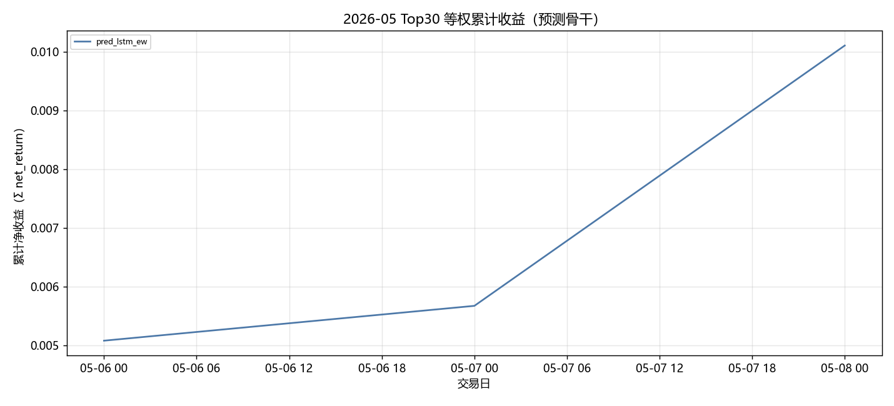

固定颜色: `pred_lstm_ew` `#4C78A8`。

### 组合基线累计收益

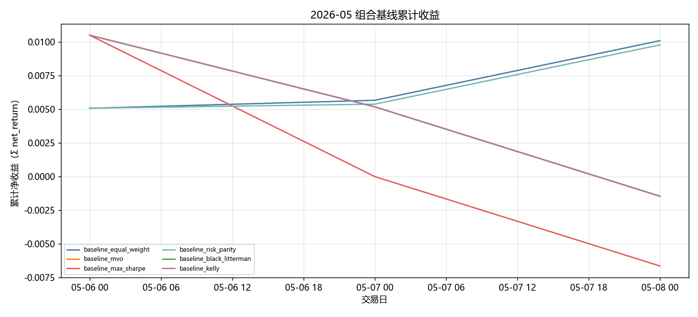

固定颜色: `baseline_equal_weight` `#4C78A8`；`baseline_mvo` `#F58518`；`baseline_max_sharpe` `#E45756`；`baseline_risk_parity` `#72B7B2`；`baseline_black_litterman` `#54A24B`；`baseline_kelly` `#B279A2`。

### 生成模型累计收益

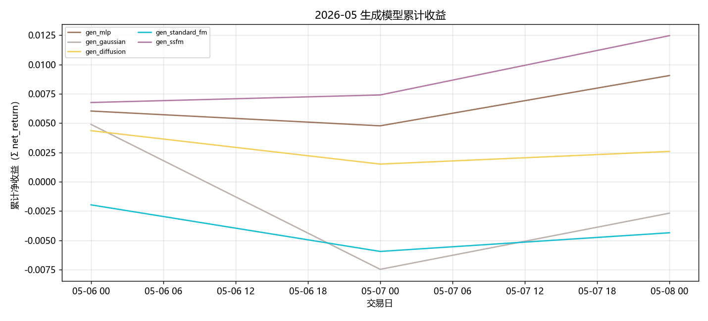

固定颜色: `gen_mlp` `#9D755D`；`gen_gaussian` `#BAB0AC`；`gen_diffusion` `#F2CF5B`；`gen_standard_fm` `#17BECF`；`gen_ssfm` `#B279A2`。

### RL 累计收益

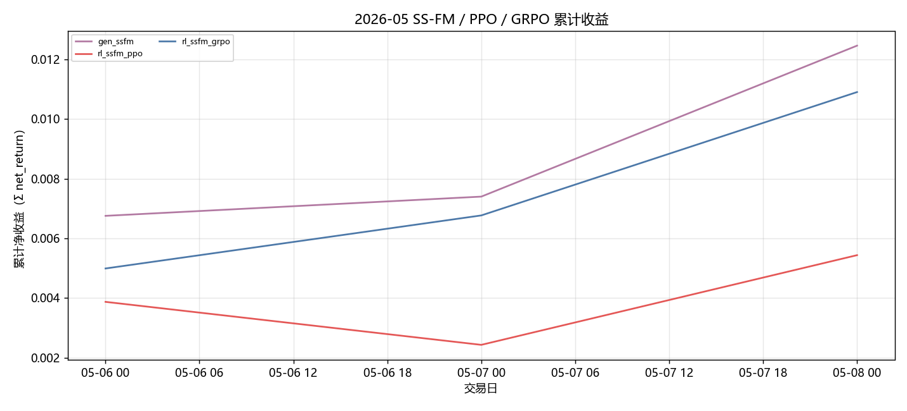

固定颜色: `gen_ssfm` `#B279A2`；`rl_ssfm_ppo` `#E45756`；`rl_ssfm_grpo` `#4C78A8`。

### 日均换手

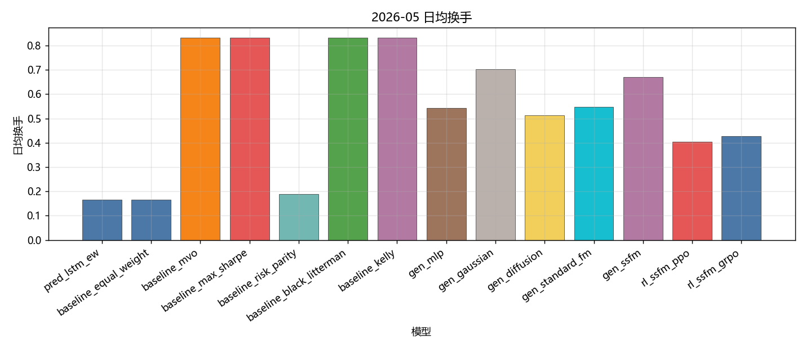

固定颜色: `pred_lstm_ew` `#4C78A8`；`baseline_equal_weight` `#4C78A8`；`baseline_mvo` `#F58518`；`baseline_max_sharpe` `#E45756`；`baseline_risk_parity` `#72B7B2`；`baseline_black_litterman` `#54A24B`；`baseline_kelly` `#B279A2`；`gen_mlp` `#9D755D`；`gen_gaussian` `#BAB0AC`；`gen_diffusion` `#F2CF5B`；`gen_standard_fm` `#17BECF`；`gen_ssfm` `#B279A2`；`rl_ssfm_ppo` `#E45756`；`rl_ssfm_grpo` `#4C78A8`。

### Val IC

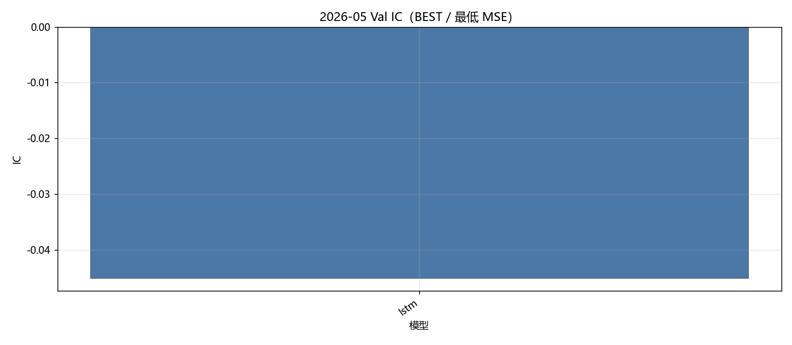

固定颜色: `lstm` `#4C78A8`。

### Val RankIC

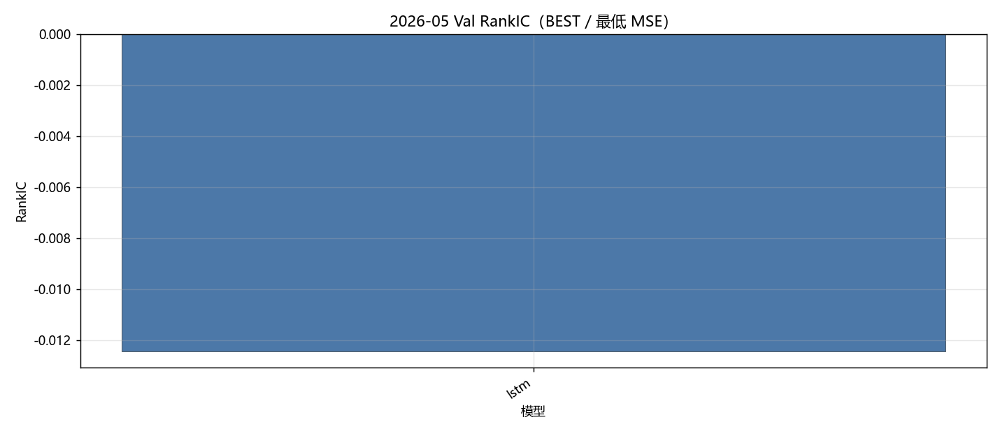

固定颜色: `lstm` `#4C78A8`。

### Val F1@Top30

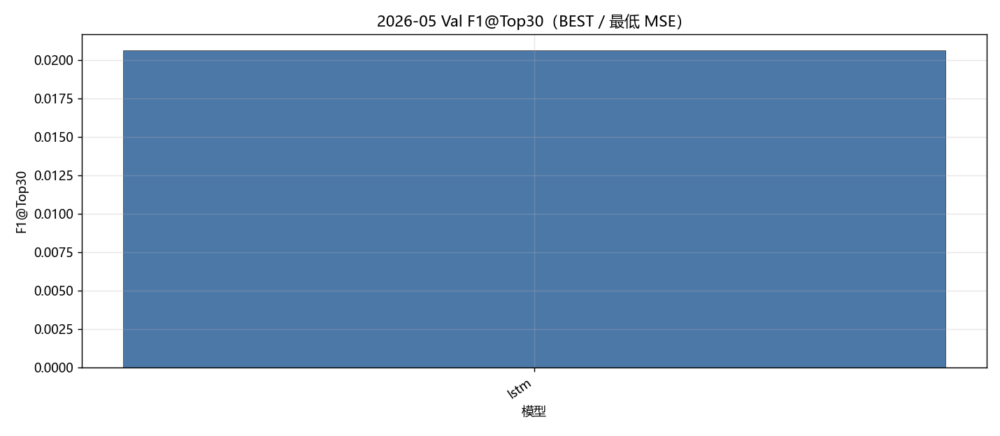

固定颜色: `lstm` `#4C78A8`。

### Val MSE

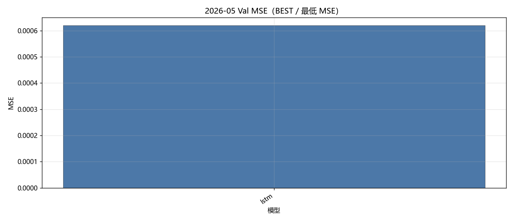

固定颜色: `lstm` `#4C78A8`。

### Val IC 各 epoch

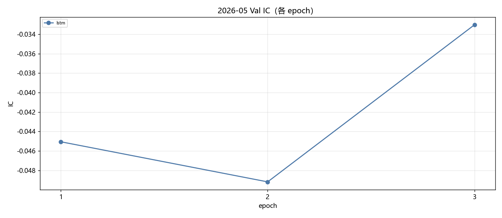

固定颜色: `lstm` `#4C78A8`。

### Val RankIC 各 epoch

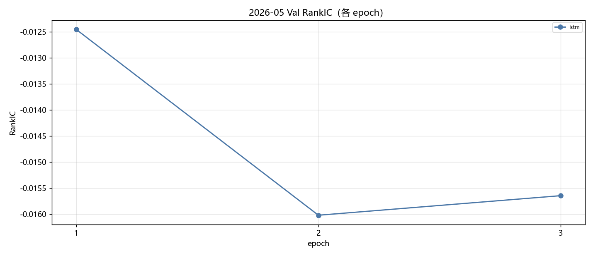

固定颜色: `lstm` `#4C78A8`。

### Val F1@Top30 各 epoch

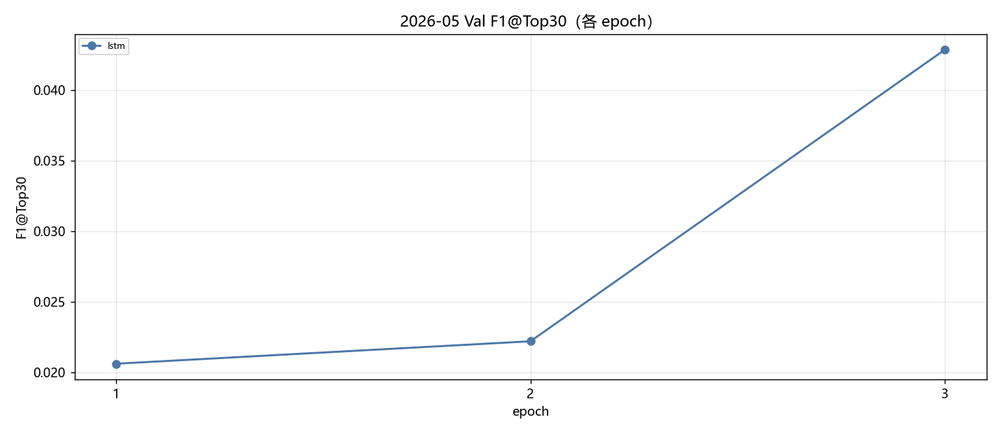

固定颜色: `lstm` `#4C78A8`。

### Val MSE 各 epoch

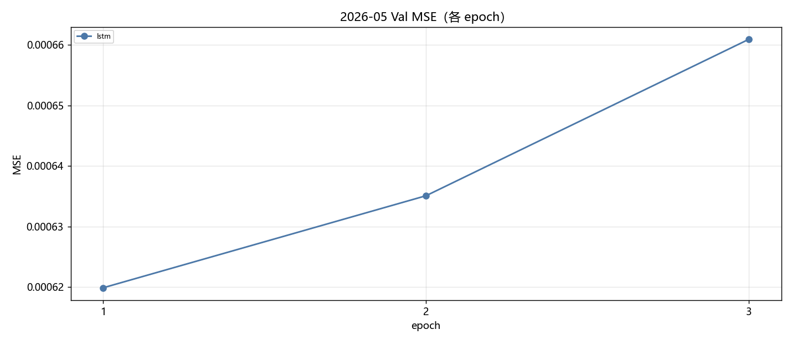

固定颜色: `lstm` `#4C78A8`。

### Test IC

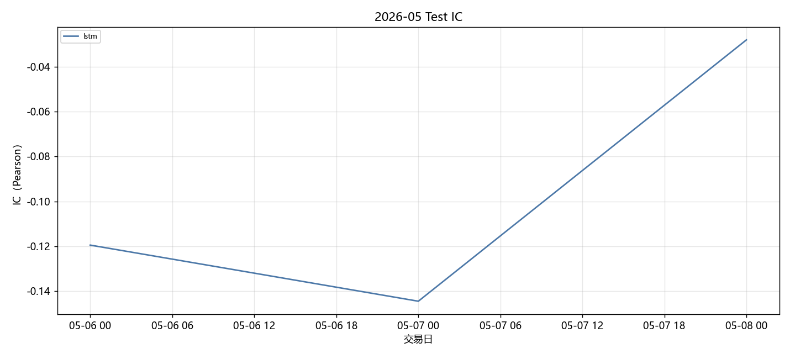

固定颜色: `lstm` `#4C78A8`。

### Test RankIC

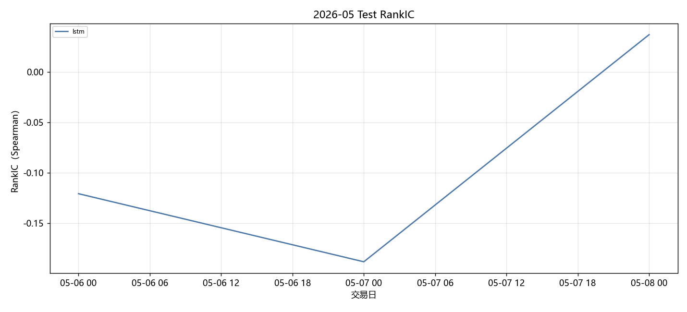

固定颜色: `lstm` `#4C78A8`。

### Test F1@Top30

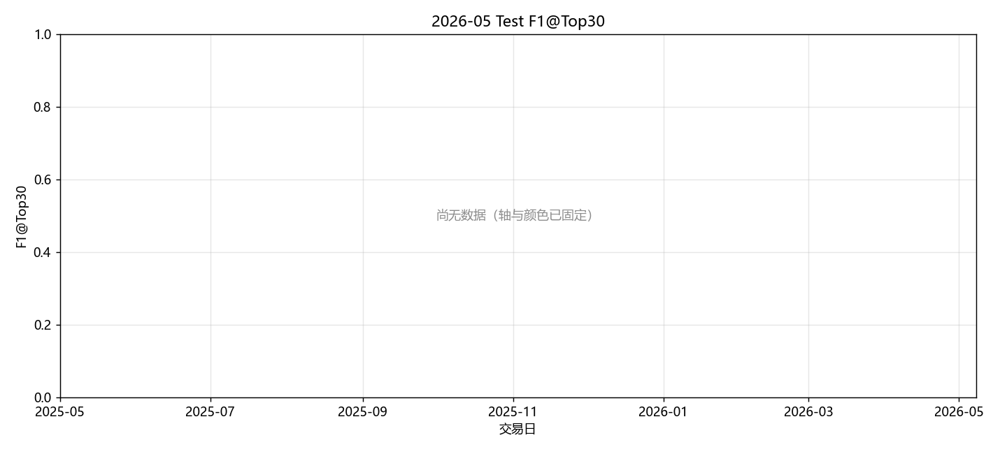

固定颜色: `lstm` `#4C78A8`。

### Test Hit@Top30

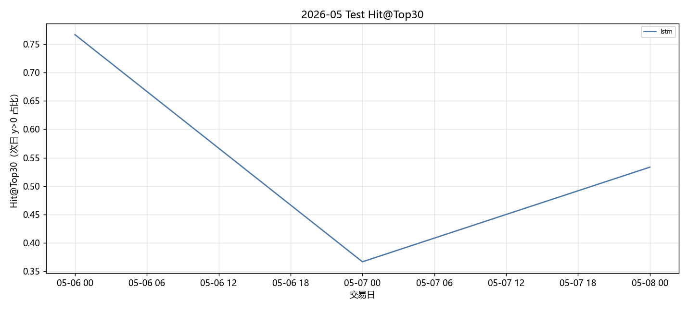

固定颜色: `lstm` `#4C78A8`。

## 图对应数据表

- 累计收益 ← `tables/backtest_daily.csv` 的 `net_return` 累加。
- 绩效 / 换手 ← `tables/performance_summary.csv`。
- Val ← `tables/val_best.csv`、`tables/val_epochs.csv`。
- Test 预测 ← `tables/prediction_metrics_mean.csv`。

## 分析

以下只讨论**已经写入数字**的行；单元格为 `-` 的表示该实验尚未跑完，不编造。
来源: month 2026-05。OOS=`sequential_oos_weekly_retrain`，费用=3.0bps，TopK=30。

已有数据的对象: `lstm`, `equal_weight`, `mvo`, `max_sharpe`, `risk_parity`, `black_litterman`, `kelly`, `mlp`, `gaussian`, `diffusion`, `standard_fm`, `ssfm`, `ssfm_ppo`, `ssfm_grpo`。
- Val IC 目前最高: `lstm` = -0.0451。
- Val F1@Top30 目前最高: `lstm` = 0.0206（随机约 0.06）。
- Val MSE 目前最低（入选口径）: `lstm` = 0.000620。
- Test 日均 IC 目前最高: `lstm` = -0.0973。
- 已回测净值目前最高: `gen_ssfm_top30` 累计净收益 0.0125，Sharpe 25.5954。

## 重点对比：生成方法与强化学习

生成式方法都把同一套 Alpha Prediction 分数映射成 Top30 组合权重，费用 3bps。**Gaussian + MLP** 是随机策略基线（MLP 输出高斯参数后采样）；**MLP** 是确定性映射；**Diffusion** 逐步去噪；**Flow Matching（`standard_fm`）** 是普通连续流匹配；**SS-FM** 在单纯形上做条件流匹配。下面只讨论已经写入的 Test 回测数字。

| 方法 | series | total_net_return | ann_return | sharpe | max_drawdown | mean_turnover | n_days |
| --- | --- | --- | --- | --- | --- | --- | --- |
| Gaussian + MLP | gen_gaussian | -0.0027 | - | -1.7496 | 0.0123 | 0.7035 | 3 |
| MLP | gen_mlp | 0.0091 | - | 15.4113 | 0.0013 | 0.5427 | 3 |
| SS-FM | gen_ssfm | 0.0125 | - | 25.5954 | 0.0000 | 0.6714 | 3 |
| Flow Matching | gen_standard_fm | -0.0043 | - | -10.0021 | 0.0040 | 0.5472 | 3 |
| Diffusion | gen_diffusion | 0.0026 | - | 4.6447 | 0.0028 | 0.5122 | 3 |

累计净收益排序：`SS-FM`(0.0125) > `MLP`(0.0091) > `Diffusion`(0.0026) > `Gaussian + MLP`(-0.0027) > `Flow Matching`(-0.0043)。
Sharpe 排序：`SS-FM`(25.5954) > `MLP`(15.4113) > `Diffusion`(4.6447) > `Gaussian + MLP`(-1.7496) > `Flow Matching`(-10.0021)。
最大回撤（越小越好）：`SS-FM`(0.0000) > `MLP`(0.0013) > `Diffusion`(0.0028) > `Flow Matching`(0.0040) > `Gaussian + MLP`(0.0123)。
日均换手（越低交易成本压力越小）：`Diffusion`(0.5122) > `MLP`(0.5427) > `Flow Matching`(0.5472) > `SS-FM`(0.6714) > `Gaussian + MLP`(0.7035)。
- `Gaussian + MLP / gen_gaussian`：累计净收益 -0.0027，年化 -，Sharpe -1.7496，最大回撤 0.0123，日均换手 0.7035，n=3。
- `MLP / gen_mlp`：累计净收益 0.0091，年化 -，Sharpe 15.4113，最大回撤 0.0013，日均换手 0.5427，n=3。
- `SS-FM / gen_ssfm`：累计净收益 0.0125，年化 -，Sharpe 25.5954，最大回撤 0.0000，日均换手 0.6714，n=3。
- `Flow Matching / gen_standard_fm`：累计净收益 -0.0043，年化 -，Sharpe -10.0021，最大回撤 0.0040，日均换手 0.5472，n=3。
- `Diffusion / gen_diffusion`：累计净收益 0.0026，年化 -，Sharpe 4.6447，最大回撤 0.0028，日均换手 0.5122，n=3。

本月生成方法里收益最好的是 **SS-FM**（0.0125），最差的是 **Flow Matching**（-0.0043）。
SS-FM 用预测分数条件化流匹配，采样分布被拉向 primary 排序。当 primary 当月有效时，这种条件化会把生成权重钉在高分股票上，收益应接近预测骨干；若 primary 失效，条件化反而会放大错误排序。
普通 FM 最差，和 SS-FM 的差距主要来自缺少分数条件：无条件流匹配更容易给出与次日收益无关的权重，换手若同时不低，成本会进一步拖累净值。
换手最高的是 Gaussian + MLP（0.7035）。生成式每天重采样权重，换手天然高于预测骨干 Top30 等权；比较三种生成方法时，应把换手和费用一起看，不能只看毛收益。

### PPO vs GRPO（纯 SS-FM）

两组强化学习都挂在 **同一套 SS-FM** 上：先冻结/蒸馏 SS-FM 生成器，再用策略梯度改采样。**PPO** 用 clipped surrogate 优化轨迹回报；**GRPO** 对同一状态采一组候选，用组内相对优势，不显式用 critic。对照是不加 RL 的 `gen_ssfm`。

| 方法 | series | total_net_return | ann_return | sharpe | max_drawdown | mean_turnover | n_days |
| --- | --- | --- | --- | --- | --- | --- | --- |
| SS-FM（无 RL） | gen_ssfm | 0.0125 | - | 25.5954 | 0.0000 | 0.6714 | 3 |
| PPO + SS-FM | rl_ssfm_ppo | 0.0055 | - | 12.3634 | 0.0014 | 0.4053 | 3 |
| GRPO + SS-FM | rl_ssfm_grpo | 0.0110 | - | 42.4611 | 0.0000 | 0.4264 | 3 |

- `SS-FM 无 RL`：累计净收益 0.0125，年化 -，Sharpe 25.5954，最大回撤 0.0000，日均换手 0.6714，n=3。
- `PPO + SS-FM`：累计净收益 0.0055，年化 -，Sharpe 12.3634，最大回撤 0.0014，日均换手 0.4053，n=3。
- `GRPO + SS-FM`：累计净收益 0.0110，年化 -，Sharpe 42.4611，最大回撤 0.0000，日均换手 0.4264，n=3。

本月 **GRPO 优于 PPO**（净收益 0.0110 vs 0.0055）。组内相对优势在当月可能提供了更稳的基线，减轻了单条轨迹回报方差；若同时换手更低，说明 GRPO 把采样从高换手的 SS-FM 先验拉回到更稀疏的调仓。
PPO 相对纯 SS-FM 净收益下降 0.0071。可能是策略梯度在短月样本上过拟合 Val 噪声，或 clip 后仍然改动了本已有效的 SS-FM 先验。
换手：纯 SS-FM 0.6714，PPO 0.4053，GRPO 0.4264。RL 若换手明显低于生成采样，成本项会解释一部分超额；Top30 等权预测骨干的换手几乎只反映首日建仓，**不能**和生成/RL 的日均换手直接比。

### 收益表现、稳定性与风险成本

预测骨干 Test 日均 IC 最高 `lstm`=-0.0973，最低 `lstm`=-0.0973。IC 一个月大约 20 个交易日，符号翻转很常见，不能单独用 IC 给方法排座次；组合净值、Sharpe、回撤要一起看。
核心序列里净值最好 `gen_ssfm`=0.0125（Sharpe 25.5954，MDD 0.0000），最差 `gen_standard_fm`=-0.0043。单月样本短，方法之间差几个百分点也可能是市场路径而不是模型能力；要和下个月对照是否同向。
稳定性：看 Val IC 与 Test IC 是否同向、生成/RL 是否跟预测骨干一起赚或一起亏。若预测 IC 为正但生成亏损，问题更可能在权重采样与换手，而不是分数本身；若预测 IC 已接近 0，生成和 RL 都很难稳定赚钱，这是市场环境而不是某一生成器独有的失败。

