# 2025-05～2026-05 全年 Sequential OOS 实验分析

全年数字由 **各 Test Month 严格 OOS 日收益拼接** 得到，没有用全年数据重训一个模型。
Walk-forward：Train=T-13..T-2，Val=T-1，Test=当月；Sequential OOS 周五重训，下周一生效。
Top30、3bps、y=log(C/O)。缺测为 `-`，不编造。

- 已写入月份：2025-05, 2025-06, 2025-07, 2025-08, 2025-09, 2025-10, 2025-11, 2025-12, 2026-01, 2026-02, 2026-03, 2026-04, 2026-05。
- 尚未写入：无。
- 2025-05～2025-09 primary 为当时主实验的 `gated_residual`；**2025-10～2026-05 primary 统一为 LSTM**（不再跑其它 Prediction 模型）。
- 2025-10 起不跑 G 网格、WeakAuction、Auction / 特征标准化消融。

## Generation Model Ablation（全年拼接）

| Model | Return | Sharpe | Max Drawdown | Turnover | Transaction Cost |
| --- | --- | --- | --- | --- | --- |
| Gaussian + MLP | 0.2897 | 1.0221 | 0.2139 | 0.5978 | 0.0002 |
| MLP | 0.4362 | 1.5638 | 0.1685 | 0.4030 | 0.0001 |
| FM | 0.5007 | 1.6059 | 0.2052 | 0.5052 | 0.0002 |
| Diffusion | 0.4428 | 1.1989 | 0.2464 | 0.7636 | 0.0002 |
| SS-FM | 0.4415 | 1.1069 | 0.2369 | 0.7392 | 0.0002 |

Gaussian + MLP 对应 `gen_gaussian`（MLP 参数化的高斯随机策略）；`MLP` 是确定性 `gen_mlp`，一并保留便于对照。

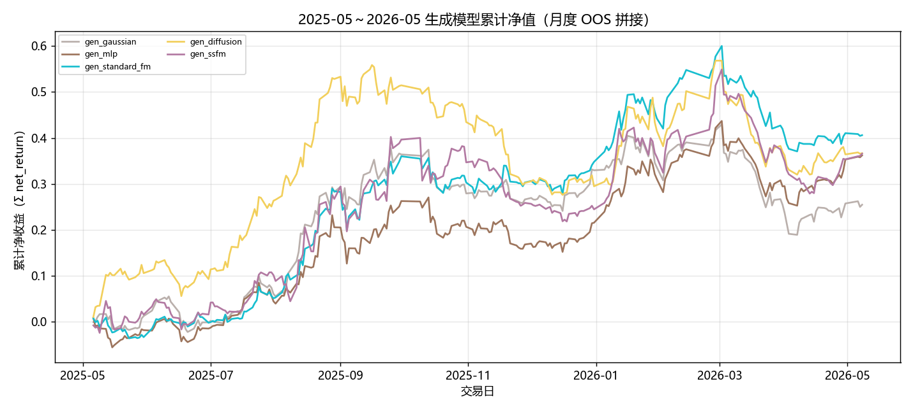

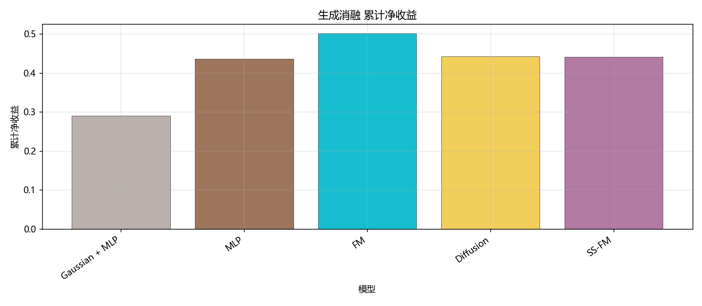

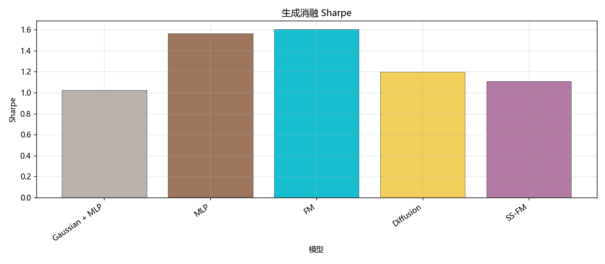

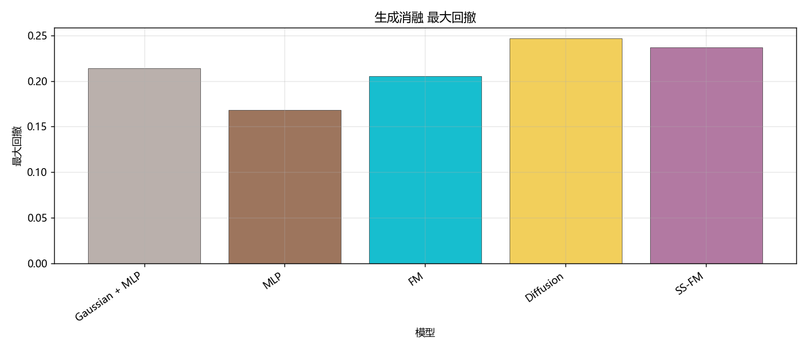

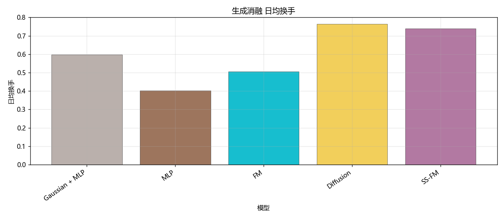

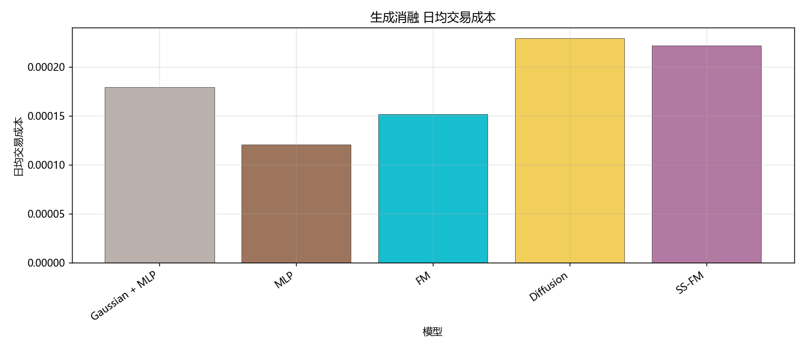

## RL Ablation（全年拼接）

| Model | Return | Sharpe | Max Drawdown | Turnover | Transaction Cost |
| --- | --- | --- | --- | --- | --- |
| Pure SS-FM | 0.4415 | 1.1069 | 0.2369 | 0.7392 | 0.0002 |
| SS-FM + PPO | 0.5594 | 1.7482 | 0.1797 | 0.2977 | 0.0001 |
| SS-FM + GRPO | 0.5542 | 1.9149 | 0.1793 | 0.2836 | 0.0001 |

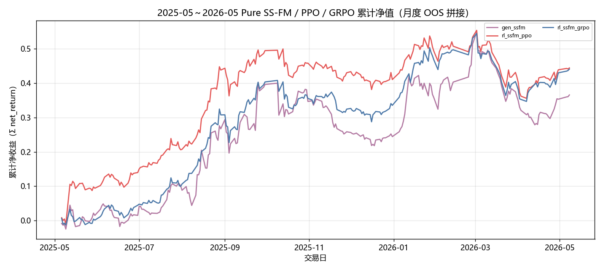

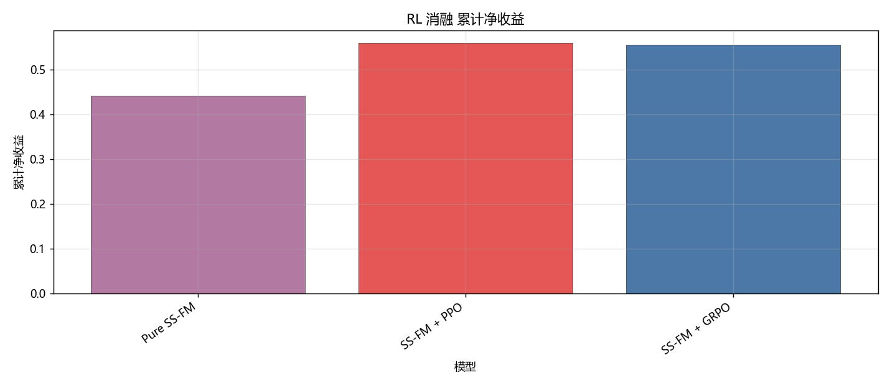

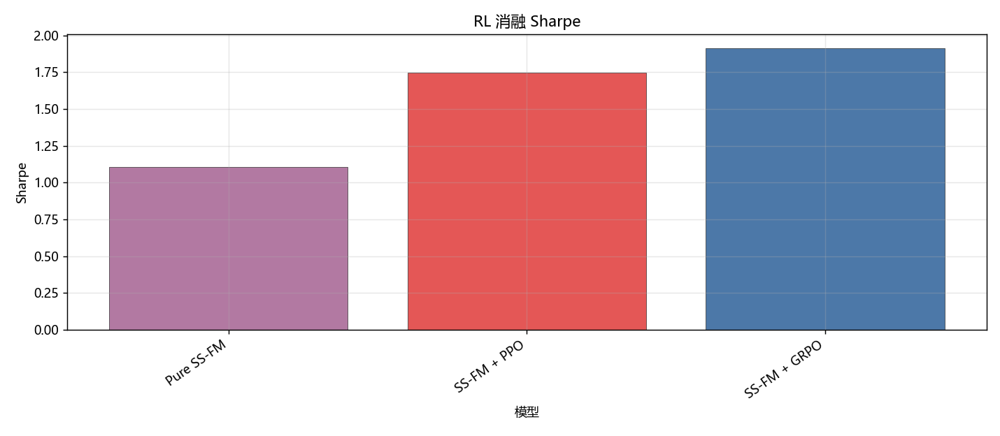

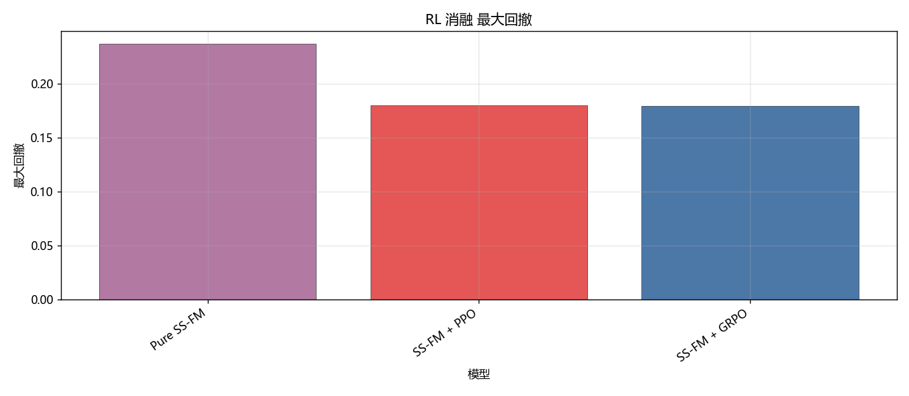

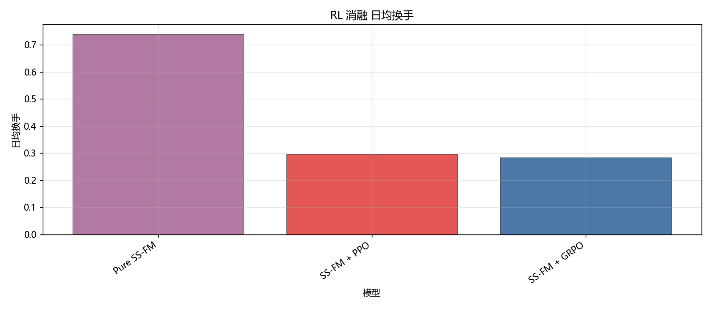

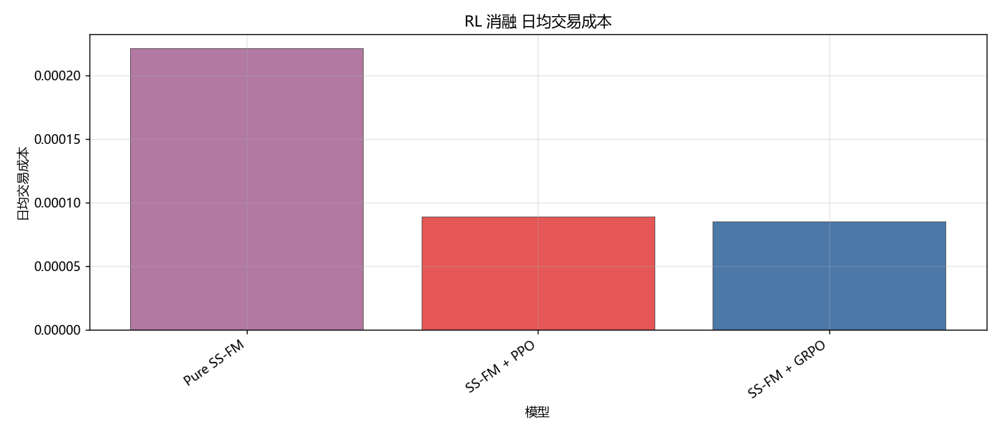

## 月度表现

### Return

| Model | 2025-05 | 2025-06 | 2025-07 | 2025-08 | 2025-09 | 2025-10 | 2025-11 | 2025-12 | 2026-01 | 2026-02 | 2026-03 | 2026-04 | 2026-05 |
| --- | --- | --- | --- | --- | --- | --- | --- | --- | --- | --- | --- | --- | --- |
| Gaussian + MLP | 0.0119 | -0.0136 | 0.0637 | 0.2488 | 0.0853 | -0.0815 | -0.0129 | 0.0655 | 0.0065 | 0.0842 | -0.1497 | 0.0025 | -0.0027 |
| MLP | -0.0186 | 0.0034 | 0.0610 | 0.1752 | 0.0588 | -0.0546 | -0.0377 | 0.0485 | 0.1000 | 0.1177 | -0.1195 | 0.0603 | 0.0091 |
| FM | -0.0335 | 0.0317 | 0.0547 | 0.2628 | 0.0792 | -0.0556 | 0.0002 | 0.0458 | 0.0995 | 0.1444 | -0.1459 | -0.0094 | -0.0043 |
| Diffusion | 0.1110 | -0.0129 | 0.1863 | 0.3037 | -0.0137 | -0.0770 | -0.1240 | -0.0074 | 0.1282 | 0.1655 | -0.1796 | -0.0064 | 0.0026 |
| SS-FM | 0.0152 | 0.0001 | 0.0896 | 0.1806 | 0.1380 | -0.0484 | -0.0844 | -0.0140 | 0.1203 | 0.1689 | -0.1414 | -0.0082 | 0.0125 |

### Sharpe

| Model | 2025-05 | 2025-06 | 2025-07 | 2025-08 | 2025-09 | 2025-10 | 2025-11 | 2025-12 | 2026-01 | 2026-02 | 2026-03 | 2026-04 | 2026-05 |
| --- | --- | --- | --- | --- | --- | --- | --- | --- | --- | --- | --- | --- | --- |
| Gaussian + MLP | 1.0005 | -0.9684 | 3.9307 | 9.6711 | 2.5492 | -4.1251 | -1.1085 | 3.9501 | 0.2799 | 5.8880 | -6.0014 | 0.1343 | -1.7496 |
| MLP | -1.7442 | 0.2838 | 3.9253 | 6.7570 | 2.0478 | -2.9832 | -2.8249 | 3.6968 | 4.1078 | 8.1479 | -5.2113 | 3.4557 | 15.4113 |
| FM | -3.3033 | 2.9478 | 4.0075 | 10.6821 | 2.4465 | -3.2797 | 0.0124 | 3.2400 | 3.0534 | 9.0056 | -5.5246 | -0.6360 | -10.0021 |
| Diffusion | 4.9904 | -0.8707 | 7.1826 | 10.8659 | -0.3869 | -5.4333 | -6.5473 | -0.5292 | 3.2727 | 8.0578 | -6.1738 | -0.3805 | 4.6447 |
| SS-FM | 0.6353 | 0.0092 | 5.7286 | 4.2606 | 3.0393 | -1.6150 | -7.0970 | -1.3406 | 2.9772 | 7.2814 | -5.6985 | -0.4771 | 25.5954 |

### Maximum Drawdown

| Model | 2025-05 | 2025-06 | 2025-07 | 2025-08 | 2025-09 | 2025-10 | 2025-11 | 2025-12 | 2026-01 | 2026-02 | 2026-03 | 2026-04 | 2026-05 |
| --- | --- | --- | --- | --- | --- | --- | --- | --- | --- | --- | --- | --- | --- |
| Gaussian + MLP | 0.0354 | 0.0746 | 0.0378 | 0.0283 | 0.0475 | 0.0911 | 0.0494 | 0.0326 | 0.0664 | 0.0143 | 0.1653 | 0.0468 | 0.0123 |
| MLP | 0.0617 | 0.0499 | 0.0398 | 0.0261 | 0.0757 | 0.0840 | 0.0610 | 0.0230 | 0.0415 | 0.0144 | 0.1515 | 0.0415 | 0.0013 |
| FM | 0.0442 | 0.0217 | 0.0249 | 0.0140 | 0.0791 | 0.0736 | 0.0440 | 0.0321 | 0.0513 | 0.0177 | 0.1652 | 0.0330 | 0.0040 |
| Diffusion | 0.0236 | 0.0754 | 0.0238 | 0.0212 | 0.0812 | 0.0726 | 0.1405 | 0.0365 | 0.0699 | 0.0163 | 0.2061 | 0.0410 | 0.0028 |
| SS-FM | 0.0605 | 0.0637 | 0.0237 | 0.0534 | 0.0931 | 0.0928 | 0.0967 | 0.0377 | 0.0624 | 0.0385 | 0.1830 | 0.0679 | 0.0000 |

### Turnover

| Model | 2025-05 | 2025-06 | 2025-07 | 2025-08 | 2025-09 | 2025-10 | 2025-11 | 2025-12 | 2026-01 | 2026-02 | 2026-03 | 2026-04 | 2026-05 |
| --- | --- | --- | --- | --- | --- | --- | --- | --- | --- | --- | --- | --- | --- |
| Gaussian + MLP | 0.6692 | 0.6633 | 0.5915 | 0.5787 | 0.5561 | 0.5615 | 0.5798 | 0.5806 | 0.6022 | 0.5694 | 0.5735 | 0.6314 | 0.7035 |
| MLP | 0.4815 | 0.4761 | 0.4794 | 0.3310 | 0.4523 | 0.4289 | 0.3725 | 0.3506 | 0.3611 | 0.2862 | 0.3790 | 0.3874 | 0.5427 |
| FM | 0.5321 | 0.4613 | 0.5022 | 0.4767 | 0.4932 | 0.4715 | 0.5222 | 0.5147 | 0.5405 | 0.4901 | 0.5132 | 0.5297 | 0.5472 |
| Diffusion | 0.6221 | 0.6882 | 0.8082 | 0.7540 | 0.6753 | 0.8365 | 0.7363 | 0.7853 | 0.8525 | 0.7930 | 0.8025 | 0.8510 | 0.5122 |
| SS-FM | 0.8388 | 0.7948 | 0.6898 | 0.6698 | 0.6238 | 0.7492 | 0.6959 | 0.7861 | 0.7614 | 0.8138 | 0.6563 | 0.8484 | 0.6714 |

### RL 月度 Return

| Model | 2025-05 | 2025-06 | 2025-07 | 2025-08 | 2025-09 | 2025-10 | 2025-11 | 2025-12 | 2026-01 | 2026-02 | 2026-03 | 2026-04 | 2026-05 |
| --- | --- | --- | --- | --- | --- | --- | --- | --- | --- | --- | --- | --- | --- |
| Pure SS-FM | 0.0152 | 0.0001 | 0.0896 | 0.1806 | 0.1380 | -0.0484 | -0.0844 | -0.0140 | 0.1203 | 0.1689 | -0.1414 | -0.0082 | 0.0125 |
| SS-FM + PPO | 0.0986 | 0.0468 | 0.0685 | 0.2611 | 0.0583 | -0.0359 | -0.0276 | -0.0196 | 0.0865 | 0.0412 | -0.1087 | 0.0203 | 0.0055 |
| SS-FM + GRPO | 0.0013 | 0.0442 | 0.0563 | 0.2314 | 0.1007 | -0.0469 | -0.0306 | 0.0111 | 0.1416 | 0.0646 | -0.1280 | 0.0373 | 0.0110 |

### RL 月度 Sharpe

| Model | 2025-05 | 2025-06 | 2025-07 | 2025-08 | 2025-09 | 2025-10 | 2025-11 | 2025-12 | 2026-01 | 2026-02 | 2026-03 | 2026-04 | 2026-05 |
| --- | --- | --- | --- | --- | --- | --- | --- | --- | --- | --- | --- | --- | --- |
| Pure SS-FM | 0.6353 | 0.0092 | 5.7286 | 4.2606 | 3.0393 | -1.6150 | -7.0970 | -1.3406 | 2.9772 | 7.2814 | -5.6985 | -0.4771 | 25.5954 |
| SS-FM + PPO | 2.8531 | 4.0817 | 4.3710 | 11.0891 | 2.0541 | -1.8568 | -2.4395 | -1.3739 | 4.0090 | 2.9601 | -4.4375 | 1.1116 | 12.3634 |
| SS-FM + GRPO | 0.0818 | 4.0882 | 4.0242 | 10.8861 | 3.4121 | -2.3846 | -2.6171 | 0.8986 | 5.6326 | 5.2371 | -5.4082 | 2.1136 | 42.4611 |

### RL 月度 Maximum Drawdown

| Model | 2025-05 | 2025-06 | 2025-07 | 2025-08 | 2025-09 | 2025-10 | 2025-11 | 2025-12 | 2026-01 | 2026-02 | 2026-03 | 2026-04 | 2026-05 |
| --- | --- | --- | --- | --- | --- | --- | --- | --- | --- | --- | --- | --- | --- |
| Pure SS-FM | 0.0605 | 0.0637 | 0.0237 | 0.0534 | 0.0931 | 0.0928 | 0.0967 | 0.0377 | 0.0624 | 0.0385 | 0.1830 | 0.0679 | 0.0000 |
| SS-FM + PPO | 0.0267 | 0.0375 | 0.0323 | 0.0097 | 0.0775 | 0.0800 | 0.0537 | 0.0508 | 0.0431 | 0.0287 | 0.1524 | 0.0457 | 0.0014 |
| SS-FM + GRPO | 0.0439 | 0.0368 | 0.0247 | 0.0170 | 0.0776 | 0.0797 | 0.0579 | 0.0382 | 0.0349 | 0.0146 | 0.1651 | 0.0336 | 0.0000 |

### RL 月度 Turnover

| Model | 2025-05 | 2025-06 | 2025-07 | 2025-08 | 2025-09 | 2025-10 | 2025-11 | 2025-12 | 2026-01 | 2026-02 | 2026-03 | 2026-04 | 2026-05 |
| --- | --- | --- | --- | --- | --- | --- | --- | --- | --- | --- | --- | --- | --- |
| Pure SS-FM | 0.8388 | 0.7948 | 0.6898 | 0.6698 | 0.6238 | 0.7492 | 0.6959 | 0.7861 | 0.7614 | 0.8138 | 0.6563 | 0.8484 | 0.6714 |
| SS-FM + PPO | 0.3173 | 0.2848 | 0.2655 | 0.2914 | 0.2694 | 0.2893 | 0.2858 | 0.2930 | 0.2841 | 0.3038 | 0.3480 | 0.3274 | 0.4053 |
| SS-FM + GRPO | 0.2880 | 0.2805 | 0.2595 | 0.2792 | 0.2767 | 0.2590 | 0.2858 | 0.2893 | 0.2831 | 0.2954 | 0.2856 | 0.3022 | 0.4264 |

## Question 1：Portfolio Generation

拼接后累计净收益最好的是 **FM**（0.5007，Sharpe 1.6059，MDD 0.2052，换手 0.5052），最差的是 **Gaussian + MLP**（0.2897）。
SS-FM 的单纯形可行性、连续生成和条件化是否兑现，要看它是否在收益-回撤-换手三维上同时优于 Gaussian/FM/Diffusion，而不是只看单月符号。若 SS-FM 收益高但换手显著更高，费用可能吃掉条件化带来的排序优势。

## Question 2：RL Optimization

PPO 相对 Pure SS-FM 的全年净收益差 0.1180。
GRPO 相对 Pure SS-FM 的全年净收益差 0.1127。
PPO 与 GRPO 全年净收益接近，差异可能被月份路径淹没。
RL 是否改善 SS-FM，要同时看收益、Sharpe、回撤和换手。只提高毛收益但换手/回撤恶化，不能算组合层 reward 改善。

各 Test Month 详细表见当月 `实验分析.md`。原始日收益与权重在各月 `tables/backtest_daily.csv`、`portfolio_weights`（若已保存）。
