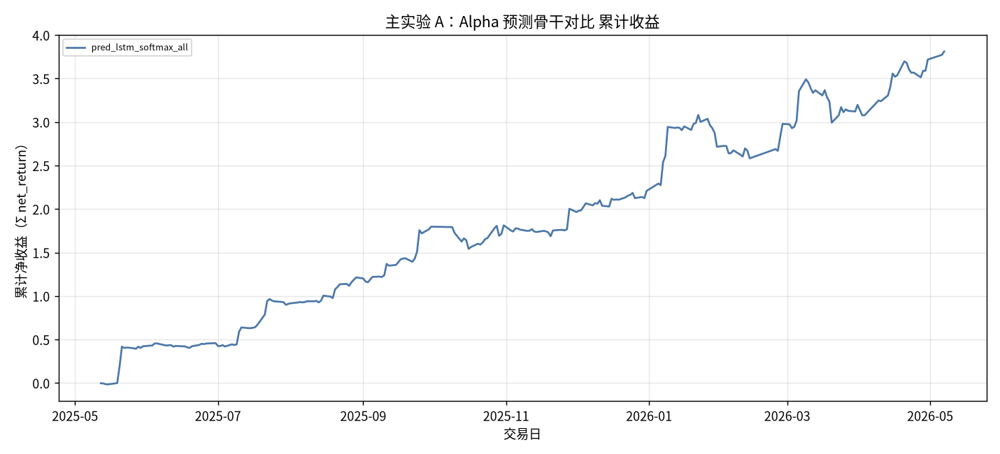
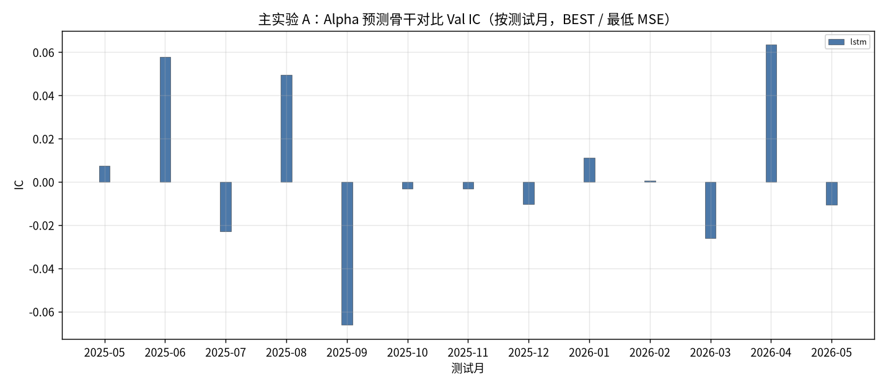
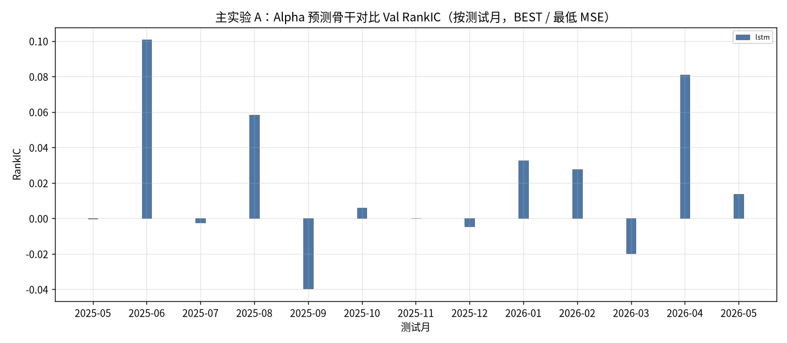
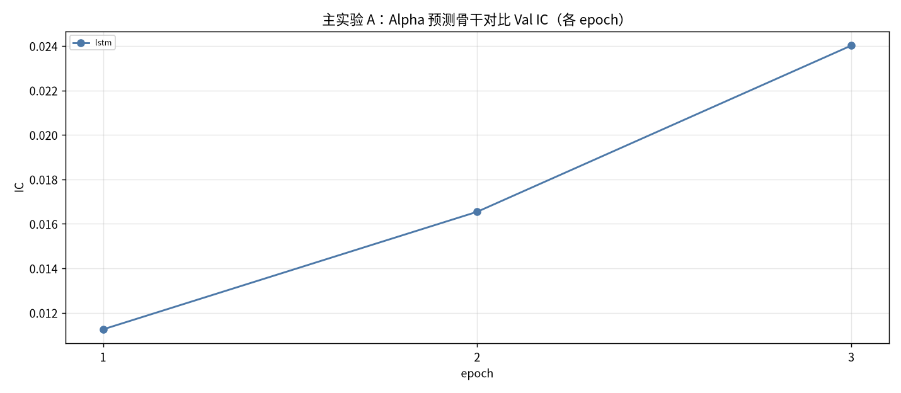
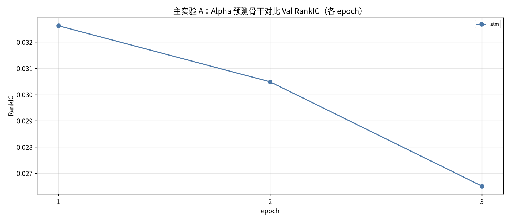
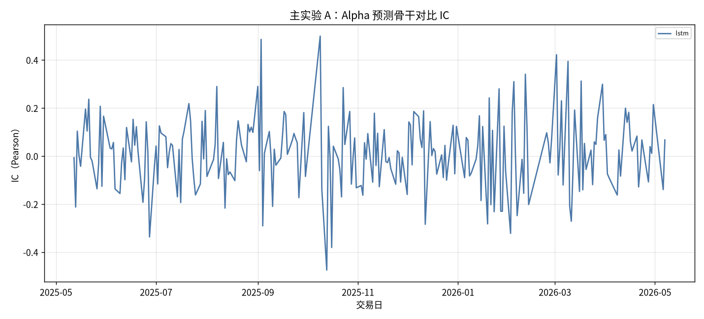
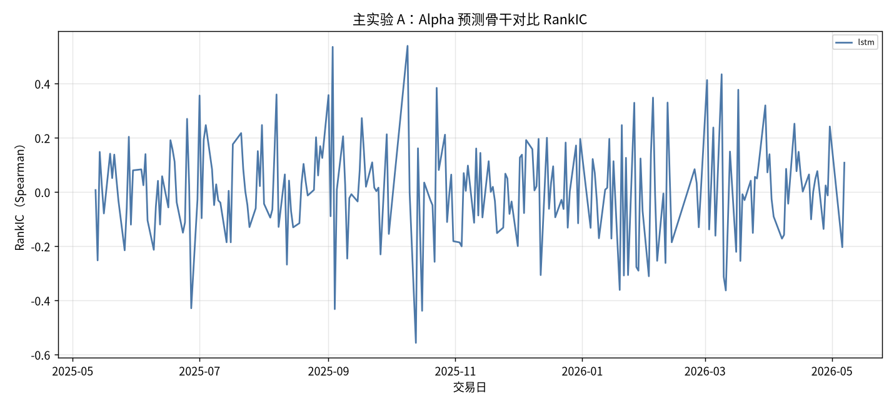
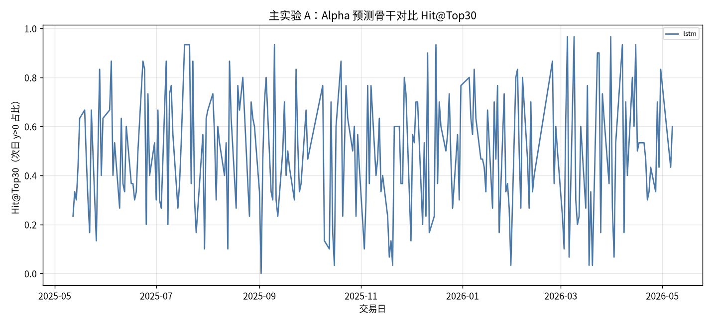

# 主实验 A：Alpha 预测骨干对比

- 状态: **13 个测试月均已写入**
- 编号: `M01_prediction`
- 类型: 主实验
- 说明: LSTM minute-only 预测下一日 close-to-close，作为全股池配权的 Alpha baseline（取代 gated_residual）。
- 缺测一律 `-`。曲线颜色见下表，中途不改色。

## 固定颜色

| 模型 | 颜色 |
| --- | --- |
| lstm | #4C78A8 |

## 实验设定

- Walk-forward 测试月 2025-05 … 2026-05（2026-05 分钟数据只到 05-08）。
- 配权=全股池，cost_bps=3.0，primary=`lstm`。
- Sequential OOS：周五收盘重训，下周一生效。

## 13 个月进度

| month | status | n_pred_models_val | n_nav_models | leakage_audit |
| --- | --- | --- | --- | --- |
| 2025-05 | 已写入 | 1 | 2 | - |
| 2025-06 | 已写入 | 1 | 2 | - |
| 2025-07 | 已写入 | 1 | 2 | - |
| 2025-08 | 已写入 | 1 | 2 | - |
| 2025-09 | 已写入 | 1 | 2 | - |
| 2025-10 | 已写入 | 1 | 2 | - |
| 2025-11 | 已写入 | 1 | 2 | - |
| 2025-12 | 已写入 | 1 | 2 | - |
| 2026-01 | 已写入 | 1 | 2 | - |
| 2026-02 | 已写入 | 1 | 2 | - |
| 2026-03 | 已写入 | 1 | 2 | - |
| 2026-04 | 已写入 | 1 | 2 | - |
| 2026-05 | 已写入 | 1 | 2 | - |

## Validation BEST（按模型 Val MSE）

| model | MSE | MAE | IC | RankIC | topk_f1 | topk_precision | topk_recall | dir_acc | dir_f1 | dir_precision | dir_recall | top30_hit_rate | n |
| --- | --- | --- | --- | --- | --- | --- | --- | --- | --- | --- | --- | --- | --- |
| lstm | 0.000470 | 0.013832 | 0.057787 | 0.100662 | 0.072222 | 0.072222 | 0.072222 | 0.457164 | 0.584456 | 0.438179 | 1 | 0.466667 | 18 |

## Validation BEST（分月，只列已有实验）

| month | model | MSE | MAE | IC | RankIC | topk_f1 | topk_precision | topk_recall | dir_acc | dir_f1 | dir_precision | dir_recall | top30_hit_rate | n |
| --- | --- | --- | --- | --- | --- | --- | --- | --- | --- | --- | --- | --- | --- | --- |
| 2025-05 | lstm | 0.001141 | 0.020724 | 0.007530 | -0.000268 | 0.061667 | 0.061667 | 0.061667 | 0.490392 | - | 0.000000 | 0.000000 | 0.486667 | 20 |
| 2025-06 | lstm | 0.000470 | 0.013832 | 0.057787 | 0.100662 | 0.072222 | 0.072222 | 0.072222 | 0.457164 | 0.584456 | 0.438179 | 1 | 0.466667 | 18 |
| 2025-07 | lstm | 0.000518 | 0.014396 | -0.023000 | -0.002351 | 0.077193 | 0.077193 | 0.077193 | 0.484031 | - | - | 0.000000 | 0.477193 | 19 |
| 2025-08 | lstm | 0.000518 | 0.014713 | 0.049487 | 0.058242 | 0.068182 | 0.068182 | 0.068182 | 0.515086 | 0.646766 | 0.497817 | 1 | 0.569697 | 22 |
| 2025-09 | lstm | 0.000638 | 0.016326 | -0.066234 | -0.039750 | 0.005000 | 0.005000 | 0.005000 | 0.578758 | 0.692744 | 0.559189 | 1 | 0.511667 | 20 |
| 2025-10 | lstm | 0.000900 | 0.021144 | -0.003298 | 0.005979 | 0.063492 | 0.063492 | 0.063492 | 0.479293 | 0.608371 | 0.467327 | 1 | 0.476190 | 21 |
| 2025-11 | lstm | 0.000810 | 0.019561 | -0.003316 | -0.000093 | 0.062500 | 0.062500 | 0.062500 | 0.532070 | 0.475204 | 0.474697 | 0.556112 | 0.462500 | 16 |
| 2025-12 | lstm | 0.000556 | 0.016107 | -0.010389 | -0.004512 | 0.045614 | 0.045614 | 0.045614 | 0.504216 | 0.410027 | 0.427148 | 0.479926 | 0.429825 | 19 |
| 2026-01 | lstm | 0.000536 | 0.015214 | 0.011253 | 0.032622 | 0.066667 | 0.066667 | 0.066667 | 0.507030 | 0.016749 | 0.492593 | 0.002703 | 0.504545 | 22 |
| 2026-02 | lstm | 0.001064 | 0.021978 | 0.000541 | 0.027487 | 0.059649 | 0.059649 | 0.059649 | 0.524942 | 0.661236 | 0.513413 | 1 | 0.540351 | 19 |
| 2026-03 | lstm | 0.000865 | 0.020320 | -0.025982 | -0.019831 | 0.051282 | 0.051282 | 0.051282 | 0.444586 | - | - | 0.000000 | 0.510256 | 13 |
| 2026-04 | lstm | 0.001060 | 0.024292 | 0.063362 | 0.080934 | 0.041270 | 0.041270 | 0.041270 | 0.423327 | 0.541085 | 0.415206 | 1 | 0.466667 | 21 |
| 2026-05 | lstm | 0.000845 | 0.020278 | -0.010613 | 0.013542 | 0.041667 | 0.041667 | 0.041667 | 0.493874 | 0.626812 | 0.483225 | 1 | 0.481667 | 20 |

## Test 预测指标（已完成月份的日均）

| model | MSE | MAE | IC | RankIC | topk_f1 | topk_precision | topk_recall | dir_acc | dir_f1 | dir_precision | dir_recall | top30_hit_rate | top30_excess | n |
| --- | --- | --- | --- | --- | --- | --- | --- | --- | --- | --- | --- | --- | --- | --- |
| lstm | 0.000751 | 0.018589 | 0.012385 | 0.009934 | - | - | - | - | - | - | - | 0.494444 | 0.000971 | 240 |

## 组合绩效（已完成月份拼接）

| model | total_net_return | ann_return | sharpe | max_drawdown | mean_turnover | mean_cost | n_days |
| --- | --- | --- | --- | --- | --- | --- | --- |
| pred_lstm_softmax_all | 3.8115 | 4.2047 | 4.0183 | 0.1221 | 0.5984 | 0.0002 | 240 |
| universe_ew_all | - | - | - | - | - | - | - |

## 图（颜色已固定，无数据时只画轴）

### 累计收益

固定颜色: `pred_lstm_softmax_all` `#4C78A8`；`universe_ew_all` `#7F7F7F`。

### Val IC

固定颜色: `lstm` `#4C78A8`。

### Val RankIC

固定颜色: `lstm` `#4C78A8`。

### Val IC 各 epoch

固定颜色: `lstm` `#4C78A8`。

### Val RankIC 各 epoch

固定颜色: `lstm` `#4C78A8`。

### Test IC

固定颜色: `lstm` `#4C78A8`。

### Test RankIC

固定颜色: `lstm` `#4C78A8`。

### Test F1@Top30

固定颜色: `lstm` `#4C78A8`。

### Test Hit@Top30

固定颜色: `lstm` `#4C78A8`。

## 分析

以下只讨论**已经写入数字**的行；单元格为 `-` 的表示该实验尚未跑完，不编造。
来源: aggregated disk。OOS=`sequential_oos_weekly_retrain`，费用=3.0bps，配权池=全股池（无 Top30）。

已有数据的对象: `2025-05`, `2025-06`, `2025-07`, `2025-08`, `2025-09`, `2025-10`, `2025-11`, `2025-12`, `2026-01`, `2026-02`, `2026-03`, `2026-04`, `2026-05`。
- Val IC 目前最高: `lstm` = 0.0578。
- Val F1@Top30 目前最高: `lstm` = 0.0722（随机约 0.06）。
- Val MSE 目前最低（入选口径）: `lstm` = 0.000470。
- Test 日均 IC 目前最高: `lstm` = 0.0124。
- 已回测净值目前最高: `pred_lstm_softmax` 累计净收益 3.8115，Sharpe 4.0183。
