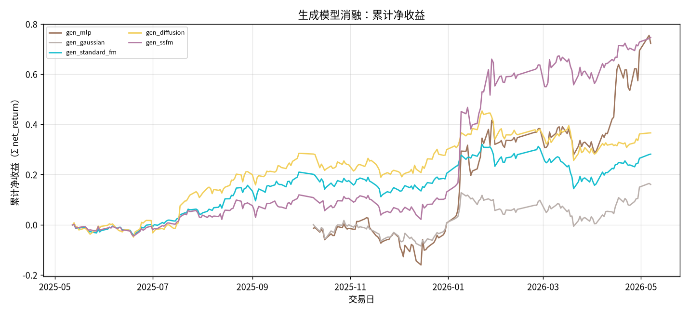
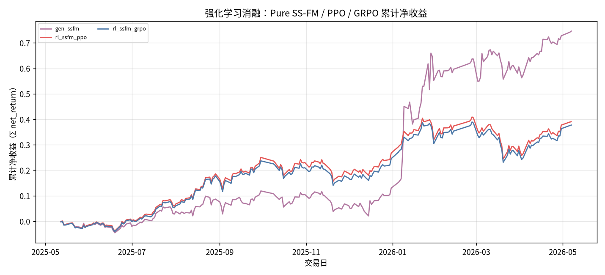
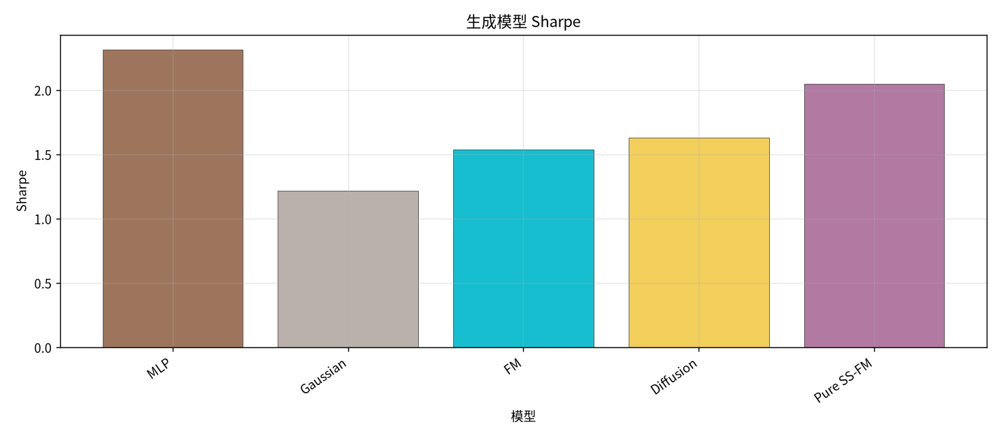
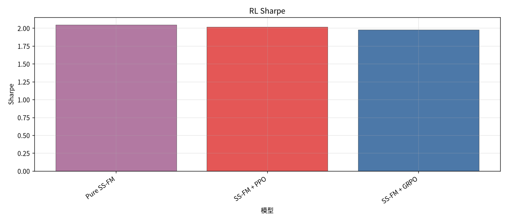
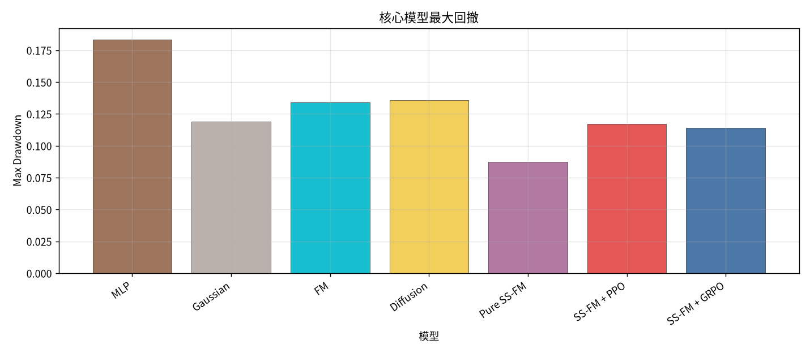
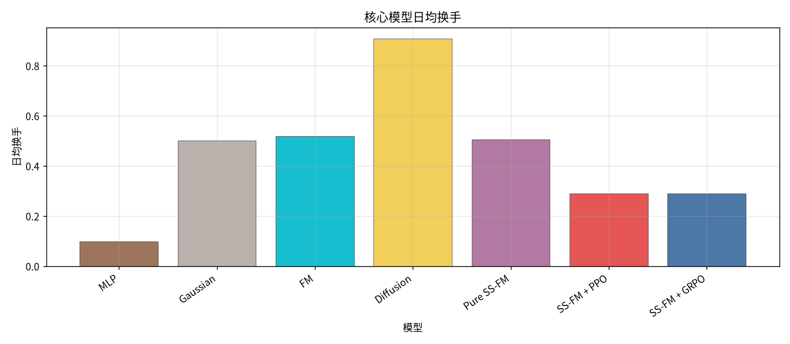
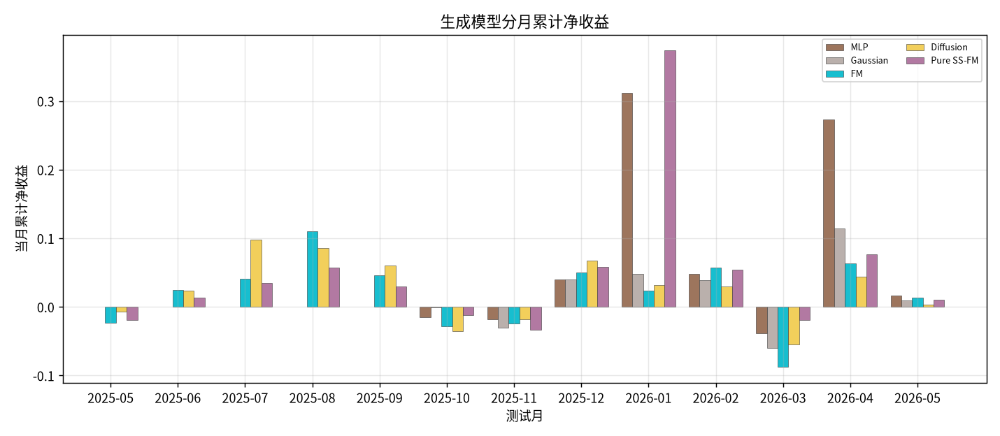
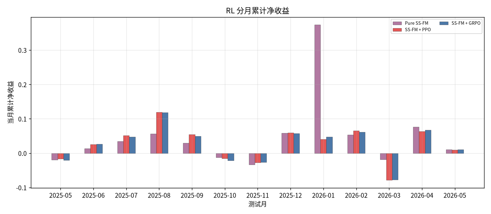
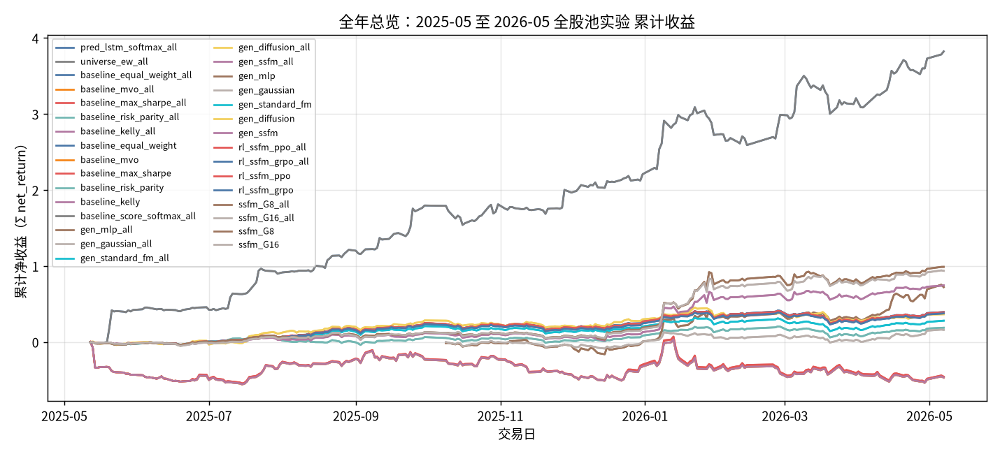

# 全年总览：2025-05 至 2026-05 全股池实验

- 状态: **13 个测试月均已写入**
- 编号: `全年总览`
- 类型: 全年总览
- 说明: 13 个测试月拼接：LSTM minute-only Alpha → 生成模型（MLP / Gaussian / FM / Diffusion / SS-FM）→ SS-FM+PPO/GRPO。全股池配权、下一日 close-to-close。
- 缺测一律 `-`。曲线颜色见下表，中途不改色。

## 固定颜色

| 模型 | 颜色 |
| --- | --- |
| gen_mlp | #9D755D |
| gen_gaussian | #BAB0AC |
| gen_standard_fm | #17BECF |
| gen_diffusion | #F2CF5B |
| gen_ssfm | #B279A2 |
| rl_ssfm_ppo | #E45756 |
| rl_ssfm_grpo | #4C78A8 |

## 实验设定

- Walk-forward 测试月 2025-05 … 2026-05（2026-05 分钟数据只到 05-08）。
- 配权=全股池，cost_bps=3.0，primary=`lstm`。
- Sequential OOS：周五收盘重训，下周一生效。
- **拼接**：`2026-01` 来自复跑 `full_universe_2026-01_rerun`（SS-FM 采样有随机性，数字会与旧正本不同）；其余测试月仍用 `full_universe`。本页不覆盖原来的 `全年总览/`。
## 单月全股池报告

2026-01 用复跑目录，其余月沿用 `results/full_universe/`。

| 月份 | 正本 | 镜像 |
| --- | --- | --- |
| 2025-05 | [实验分析_全股池配权.md](../../sequential_oos_weekly_retrain/test_month=2025-05/实验分析_全股池配权.md) | [镜像](../../../full/sequential_oos_weekly_retrain/test_month=2025-05/实验分析_全股池配权.md) |
| 2025-06 | [实验分析_全股池配权.md](../../sequential_oos_weekly_retrain/test_month=2025-06/实验分析_全股池配权.md) | [镜像](../../../full/sequential_oos_weekly_retrain/test_month=2025-06/实验分析_全股池配权.md) |
| 2025-07 | [实验分析_全股池配权.md](../../sequential_oos_weekly_retrain/test_month=2025-07/实验分析_全股池配权.md) | [镜像](../../../full/sequential_oos_weekly_retrain/test_month=2025-07/实验分析_全股池配权.md) |
| 2025-08 | [实验分析_全股池配权.md](../../sequential_oos_weekly_retrain/test_month=2025-08/实验分析_全股池配权.md) | [镜像](../../../full/sequential_oos_weekly_retrain/test_month=2025-08/实验分析_全股池配权.md) |
| 2025-09 | [实验分析_全股池配权.md](../../sequential_oos_weekly_retrain/test_month=2025-09/实验分析_全股池配权.md) | [镜像](../../../full/sequential_oos_weekly_retrain/test_month=2025-09/实验分析_全股池配权.md) |
| 2025-10 | [实验分析_全股池配权.md](../../sequential_oos_weekly_retrain/test_month=2025-10/实验分析_全股池配权.md) | [镜像](../../../full/sequential_oos_weekly_retrain/test_month=2025-10/实验分析_全股池配权.md) |
| 2025-11 | [实验分析_全股池配权.md](../../sequential_oos_weekly_retrain/test_month=2025-11/实验分析_全股池配权.md) | [镜像](../../../full/sequential_oos_weekly_retrain/test_month=2025-11/实验分析_全股池配权.md) |
| 2025-12 | [实验分析_全股池配权.md](../../sequential_oos_weekly_retrain/test_month=2025-12/实验分析_全股池配权.md) | [镜像](../../../full/sequential_oos_weekly_retrain/test_month=2025-12/实验分析_全股池配权.md) |
| 2026-01 | [实验分析_全股池配权.md](../../../full_universe_2026-01_rerun/sequential_oos_weekly_retrain/test_month=2026-01/实验分析_全股池配权.md) | [镜像](../../sequential_oos_weekly_retrain/test_month=2026-01/实验分析_全股池配权_复跑.md) |
| 2026-02 | [实验分析_全股池配权.md](../../sequential_oos_weekly_retrain/test_month=2026-02/实验分析_全股池配权.md) | [镜像](../../../full/sequential_oos_weekly_retrain/test_month=2026-02/实验分析_全股池配权.md) |
| 2026-03 | [实验分析_全股池配权.md](../../sequential_oos_weekly_retrain/test_month=2026-03/实验分析_全股池配权.md) | [镜像](../../../full/sequential_oos_weekly_retrain/test_month=2026-03/实验分析_全股池配权.md) |
| 2026-04 | [实验分析_全股池配权.md](../../sequential_oos_weekly_retrain/test_month=2026-04/实验分析_全股池配权.md) | [镜像](../../../full/sequential_oos_weekly_retrain/test_month=2026-04/实验分析_全股池配权.md) |
| 2026-05 | [实验分析_全股池配权.md](../../sequential_oos_weekly_retrain/test_month=2026-05/实验分析_全股池配权.md) | [镜像](../../../full/sequential_oos_weekly_retrain/test_month=2026-05/实验分析_全股池配权.md) |

相关全年切片：[`M03 生成`](../M03_generative/实验分析.md) · [`M04 RL`](../M04_rl/实验分析.md) · [`X05 FM vs Diffusion`](../X05_fm_vs_diffusion/实验分析.md) · [`X06 PPO vs GRPO`](../X06_ppo_vs_grpo/实验分析.md) · [实验目录](../实验目录.md)

## 论文主线

LSTM minute-only 预测下一日 close-to-close，全股池 long-only simplex 配权。比较组合生成（MLP / Gaussian / FM / Diffusion / SS-FM）以及在 SS-FM 上叠加 PPO / GRPO。

## 生成模型消融总表

| model | total_net_return | ann_return | sharpe | max_drawdown | mean_turnover | mean_cost | n_days |
| --- | --- | --- | --- | --- | --- | --- | --- |
| MLP | 0.7220 | 1.6786 | 2.3152 | 0.1832 | 0.0997 | 0.0000 | 139 |
| Gaussian | 0.1602 | 0.3092 | 1.2187 | 0.1189 | 0.5014 | 0.0002 | 139 |
| FM | 0.2810 | 0.2970 | 1.5392 | 0.1338 | 0.5198 | 0.0002 | 240 |
| Diffusion | 0.3657 | 0.3872 | 1.6327 | 0.1358 | 0.9078 | 0.0003 | 240 |
| Pure SS-FM | 0.7461 | 0.7954 | 2.0467 | 0.0876 | 0.5064 | 0.0002 | 240 |

## 生成模型分月净收益

| month | MLP | Gaussian | FM | Diffusion | Pure SS-FM |
| --- | --- | --- | --- | --- | --- |
| 2025-05 | - | - | -0.0232 | -0.0067 | -0.0194 |
| 2025-06 | - | - | 0.0247 | 0.0233 | 0.0133 |
| 2025-07 | - | - | 0.0406 | 0.0981 | 0.0349 |
| 2025-08 | - | - | 0.1105 | 0.0853 | 0.0569 |
| 2025-09 | - | - | 0.0457 | 0.0602 | 0.0294 |
| 2025-10 | -0.0146 | -0.0004 | -0.0280 | -0.0354 | -0.0123 |
| 2025-11 | -0.0176 | -0.0305 | -0.0238 | -0.0180 | -0.0335 |
| 2025-12 | 0.0398 | 0.0403 | 0.0498 | 0.0679 | 0.0584 |
| 2026-01 | 0.3114 | 0.0481 | 0.0231 | 0.0317 | 0.3736 |
| 2026-02 | 0.0478 | 0.0386 | 0.0577 | 0.0296 | 0.0537 |
| 2026-03 | -0.0381 | -0.0601 | -0.0877 | -0.0548 | -0.0188 |
| 2026-04 | 0.2731 | 0.1147 | 0.0632 | 0.0439 | 0.0762 |
| 2026-05 | 0.0167 | 0.0092 | 0.0130 | 0.0030 | 0.0105 |

## 强化学习消融总表

| model | total_net_return | ann_return | sharpe | max_drawdown | mean_turnover | mean_cost | n_days |
| --- | --- | --- | --- | --- | --- | --- | --- |
| Pure SS-FM | 0.7461 | 0.7954 | 2.0467 | 0.0876 | 0.5064 | 0.0002 | 240 |
| SS-FM + PPO | 0.3904 | 0.4135 | 2.0187 | 0.1171 | 0.2904 | 0.0001 | 240 |
| SS-FM + GRPO | 0.3773 | 0.3995 | 1.9752 | 0.1141 | 0.2899 | 0.0001 | 240 |

## RL 分月净收益

| month | Pure SS-FM | SS-FM + PPO | SS-FM + GRPO |
| --- | --- | --- | --- |
| 2025-05 | -0.0194 | -0.0169 | -0.0203 |
| 2025-06 | 0.0133 | 0.0256 | 0.0263 |
| 2025-07 | 0.0349 | 0.0510 | 0.0473 |
| 2025-08 | 0.0569 | 0.1193 | 0.1188 |
| 2025-09 | 0.0294 | 0.0542 | 0.0499 |
| 2025-10 | -0.0123 | -0.0159 | -0.0217 |
| 2025-11 | -0.0335 | -0.0273 | -0.0263 |
| 2025-12 | 0.0584 | 0.0593 | 0.0573 |
| 2026-01 | 0.3736 | 0.0404 | 0.0470 |
| 2026-02 | 0.0537 | 0.0654 | 0.0618 |
| 2026-03 | -0.0188 | -0.0787 | -0.0776 |
| 2026-04 | 0.0762 | 0.0637 | 0.0671 |
| 2026-05 | 0.0105 | 0.0095 | 0.0103 |

## 全年综合结果总表

| model | total_net_return | ann_return | sharpe | max_drawdown | mean_turnover | mean_cost | n_days |
| --- | --- | --- | --- | --- | --- | --- | --- |
| MLP | 0.7220 | 1.6786 | 2.3152 | 0.1832 | 0.0997 | 0.0000 | 139 |
| Gaussian | 0.1602 | 0.3092 | 1.2187 | 0.1189 | 0.5014 | 0.0002 | 139 |
| FM | 0.2810 | 0.2970 | 1.5392 | 0.1338 | 0.5198 | 0.0002 | 240 |
| Diffusion | 0.3657 | 0.3872 | 1.6327 | 0.1358 | 0.9078 | 0.0003 | 240 |
| Pure SS-FM | 0.7461 | 0.7954 | 2.0467 | 0.0876 | 0.5064 | 0.0002 | 240 |
| SS-FM + PPO | 0.3904 | 0.4135 | 2.0187 | 0.1171 | 0.2904 | 0.0001 | 240 |
| SS-FM + GRPO | 0.3773 | 0.3995 | 1.9752 | 0.1141 | 0.2899 | 0.0001 | 240 |

## 13 个月进度

| month | status | n_pred_models_val | n_nav_models | leakage_audit |
| --- | --- | --- | --- | --- |
| 2025-05 | 已写入 | 1 | 15 | - |
| 2025-06 | 已写入 | 1 | 15 | - |
| 2025-07 | 已写入 | 1 | 15 | - |
| 2025-08 | 已写入 | 1 | 15 | - |
| 2025-09 | 已写入 | 1 | 15 | - |
| 2025-10 | 已写入 | 1 | 17 | - |
| 2025-11 | 已写入 | 1 | 17 | - |
| 2025-12 | 已写入 | 1 | 17 | - |
| 2026-01 | 已写入 | 1 | 17 | - |
| 2026-02 | 已写入 | 1 | 17 | - |
| 2026-03 | 已写入 | 1 | 17 | - |
| 2026-04 | 已写入 | 1 | 17 | - |
| 2026-05 | 已写入 | 1 | 17 | - |

## 图（颜色已固定，无数据时只画轴）

### 生成模型累计净值

固定颜色: `gen_mlp` `#9D755D`；`gen_gaussian` `#BAB0AC`；`gen_standard_fm` `#17BECF`；`gen_diffusion` `#F2CF5B`；`gen_ssfm` `#B279A2`。

### RL 累计净值

固定颜色: `gen_ssfm` `#B279A2`；`rl_ssfm_ppo` `#E45756`；`rl_ssfm_grpo` `#4C78A8`。

### 生成模型 Sharpe

固定颜色: `gen_mlp` `#9D755D`；`gen_gaussian` `#BAB0AC`；`gen_standard_fm` `#17BECF`；`gen_diffusion` `#F2CF5B`；`gen_ssfm` `#B279A2`。

### RL Sharpe

固定颜色: `gen_ssfm` `#B279A2`；`rl_ssfm_ppo` `#E45756`；`rl_ssfm_grpo` `#4C78A8`。

### 最大回撤

固定颜色: `gen_mlp` `#9D755D`；`gen_gaussian` `#BAB0AC`；`gen_standard_fm` `#17BECF`；`gen_diffusion` `#F2CF5B`；`gen_ssfm` `#B279A2`；`rl_ssfm_ppo` `#E45756`；`rl_ssfm_grpo` `#4C78A8`。

### 日均换手

固定颜色: `gen_mlp` `#9D755D`；`gen_gaussian` `#BAB0AC`；`gen_standard_fm` `#17BECF`；`gen_diffusion` `#F2CF5B`；`gen_ssfm` `#B279A2`；`rl_ssfm_ppo` `#E45756`；`rl_ssfm_grpo` `#4C78A8`。

### 生成模型分月收益

固定颜色: `gen_mlp` `#9D755D`；`gen_gaussian` `#BAB0AC`；`gen_standard_fm` `#17BECF`；`gen_diffusion` `#F2CF5B`；`gen_ssfm` `#B279A2`。

### RL 分月收益

固定颜色: `gen_ssfm` `#B279A2`；`rl_ssfm_ppo` `#E45756`；`rl_ssfm_grpo` `#4C78A8`。

### 累计收益

固定颜色: `pred_lstm_softmax_all` `#4C78A8`；`universe_ew_all` `#7F7F7F`；`baseline_equal_weight_all` `#4C78A8`；`baseline_mvo_all` `#F58518`；`baseline_max_sharpe_all` `#E45756`；`baseline_risk_parity_all` `#72B7B2`；`baseline_kelly_all` `#B279A2`；`baseline_equal_weight` `#4C78A8`；`baseline_mvo` `#F58518`；`baseline_max_sharpe` `#E45756`；`baseline_risk_parity` `#72B7B2`；`baseline_kelly` `#B279A2`；`baseline_score_softmax_all` `#7F7F7F`；`gen_mlp_all` `#9D755D`；`gen_gaussian_all` `#BAB0AC`；`gen_standard_fm_all` `#17BECF`；`gen_diffusion_all` `#F2CF5B`；`gen_ssfm_all` `#B279A2`；`gen_mlp` `#9D755D`；`gen_gaussian` `#BAB0AC`；`gen_standard_fm` `#17BECF`；`gen_diffusion` `#F2CF5B`；`gen_ssfm` `#B279A2`；`rl_ssfm_ppo_all` `#E45756`；`rl_ssfm_grpo_all` `#4C78A8`；`rl_ssfm_ppo` `#E45756`；`rl_ssfm_grpo` `#4C78A8`；`ssfm_G8_all` `#9D755D`；`ssfm_G16_all` `#BAB0AC`；`ssfm_G8` `#9D755D`；`ssfm_G16` `#BAB0AC`。

## 分析

分析主线是 **LSTM Alpha → 组合生成 → RL 配权优化**，不再比较其它预测骨干。
缺测单元格为 `-`（例如 2025-05～09 全股池未跑 MLP/Gaussian 时），不补 0。

### SS-FM 相对 FM / Diffusion / MLP / Gaussian
- 全年累计净收益最高: `Pure SS-FM` = 0.7461。
- Sharpe 最高: `MLP` = 2.3152。
- 最大回撤最小: `Pure SS-FM` = 0.0876。
- 日均换手最低: `MLP` = 0.0997。
- 点估计对照（拼接 OOS）：Pure SS-FM 收益 `0.7461` / Sharpe `2.0467` / 换手 `0.5064`；FM `0.2810` / `1.5392`；Diffusion `0.3657` / `1.6327`。

### PPO / GRPO 相对 Pure SS-FM
- Pure SS-FM 收益 `0.7461` Sharpe `2.0467` 换手 `0.5064`。
- SS-FM + PPO 收益 `0.3904` Sharpe `2.0187` 换手 `0.2904`。
- SS-FM + GRPO 收益 `0.3773` Sharpe `1.9752` 换手 `0.2899`。
- 若 RL 换手明显低于纯 SS-FM 而收益更高，优先解释为摩擦下降，而不是新的截面 alpha。
